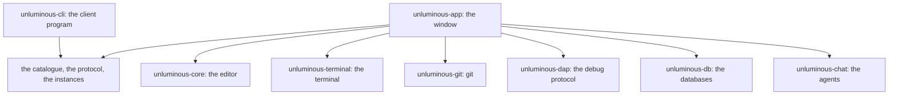

# Architecture

## The shape of it

Eight crates. The editor, the terminal, git, the debug protocol, the database clients and the chat
transport each know nothing about a window; the window knows nothing about a rope, an escape sequence
or `--porcelain=v2`; and the command line client knows nothing about any of them but the names of the
commands.



An arrow is "depends on". Everything points towards the things with no user interface in them, and
nothing points back: none of the six may mention the interface library, and `unluminous-cli` may not
mention `unluminous-app`. That is what makes the tests of most of Unluminous run with no window, no
graphics card and no fonts, and it is what keeps the client a small program you can run on a machine
that has never drawn anything.

The one shared piece is the box the client and the window both point at: the catalogue of command line
commands, the wire format, and the file a running Unluminous writes to say how to reach it. Both
halves read the same list, so the client cannot accept a command the window has never heard of.

## The eight crates

| Crate | What is in it | What must never be in it | Dependencies |
|---|---|---|---|
| `crates/unluminous-core` | the rope, the character and paragraph formatting, the caret, layout, undo, the Markdown parser, the syntax tokeniser, folding, completion, imports, the highlight ranges, and the Mermaid reader and diagram layout | any user interface dependency | two |
| `crates/unluminous-terminal` | the session over a pseudoterminal, the screen the painter reads, the colour palette, the key encoding, the mouse reports, and which shell to start and where | any user interface dependency | three |
| `crates/unluminous-git` | status, blame, log, diffs, branches, every operation on the Git menu, and the thread they run on | any user interface dependency, and any decision about what a dialog looks like | **none**, because it runs the `git` program |
| `crates/unluminous-dap` | the `Content-Length` framing, the typed messages, the session state machine, and the thread an adapter is spoken to on | any user interface dependency, and any knowledge of *which* adapter to start — where a debugger lives on this machine is knowledge about the machine | one |
| `crates/unluminous-db` | the PostgreSQL v3 wire protocol, SCRAM-SHA-256, SQLite, Inillucent, the vector a search index stores, the values a grid draws, and the thread a query runs on | any user interface dependency | eight |
| `crates/unluminous-chat` | the endpoints, the five provider shapes, the server-sent-event framing, the conversation, the turn state machine and the thread a turn runs on | any user interface dependency | two |
| `crates/unluminous-app` | drawing, input, real fonts, the settings on disk, the menus, the plugin registry, and the socket the command line drives it down | editor behaviour, terminal emulation or git plumbing | the six above, plus the window |
| `unluminous-cli` | the catalogue of commands, the wire format, and the client program. It lives beside its own documentation rather than under `crates/`, because the two are read together | anything that depends on `unluminous-app` | one |

`unluminous-git` having **no dependencies at all** is the clearest statement of the rule: reading a
repository is running `git` and reading what it said, in the formats git provides for being read.

## Inside the editor

A `Document` is four things and a history: a rope of text, a span list of character formatting covering
it with no gaps, one paragraph setting per line, and a sparse set of marked passages. Everything that
changes it goes through one function, which takes a command. That is what makes undo and the stale
layout flag reliable: there is one place a change is recorded and one place the revision moves.

**The rope is a B-tree.** Leaves hold a short run of UTF-8 bytes and every parent holds a summary of
each child — bytes, characters and line breaks — which is what makes an editor's operations cheap:
finding where line 4,000 starts walks down the tree adding counts without reading any text, and
inserting in the middle of a large file rewrites one leaf and the path above it instead of moving the
rest of the file.

**Undo restores a state rather than applying an inverse.** A snapshot holds the text, both kinds of
formatting, the selection and the marks, and undoing swaps one in. An inverse operation for every
command would be a second implementation of the editor, and the first one that is subtly wrong leaves
a document nobody can explain.

**A document counts three revisions.** One moves for any change at all and is what "does the window
need painting again" reads. One moves only for what alters the text or its formatting, and is what
layout, the preview and the syntax colouring are keyed on — moving the caret is not a change to the
text, and keeping those two apart is worth 800 milliseconds a frame while a selection is being
dragged. The third moves only for folding, which changes the layout and nothing else: keyed on the
second, a fold would re-colour the file and rebuild the Markdown preview.

**Measurement is a trait.** The editor asks for the advance width of a grapheme cluster and the
vertical metrics of a style, and never asks how a glyph is drawn, so the window backs it with real
font files and the tests back it with a fixed width stub. Every layout test is then arithmetic a
reader can check by hand, and it gives the same answer on macOS and on Windows.

**The Markdown preview is not a second renderer.** It reads the source and produces the same three
things a document holds, plus a fourth saying which line of the source each line of the preview came
from. The ordinary layout and the ordinary painter draw it, so nothing in the window knows how to
render Markdown. [Editing](editing.md#the-markdown-preview) is the rest.

**Mermaid is the same idea one step further out.** It reads a diagram and hands back a scene:
rectangles, circles, polygons, lines and text at absolute positions, and nothing else.

## Inside the window

Four folders, and a new file belongs in one of them.

- `app/` — the window's own state, and `app/actions.rs`, which is what the menus and the keyboard ask
  for. `app/files.rs` is the open tabs and the panes, `app/git.rs` the repository, `app/cli.rs` what a
  command line command means, `app/dock.rs` where the panels are.
- `components/` — drawing. One file for each piece of the window.
- `services/` — everything that is not drawing: the file tree, the fonts and the glyph atlas, the
  settings and recent projects on disk, what one project remembers about itself, decoding a picture,
  starting a second window, the macOS menu bar, the plugins, the socket, and what Windows needs before
  the desktop will show through.
- `theme/` — the palette, the measurements and the drawn icons.

Three rules hold that together.

**A component takes a rectangle and returns what happened.** It draws itself into the interface it is
given and changes nothing: not the document, not the window's state. The state changes in `app`, so
two components cannot disagree about what the user did, and a component can be drawn by a test with no
document behind it. Everything is painted at an absolute position rather than through the interface
library's layout, because the measurements come from the design image.

**One action, one place.** Everything a menu or a keyboard shortcut can ask for is an action, and
`run_action` is the only place an action turns into a change. There are two menu bars and both are
built from one list, so they cannot drift apart. `run_cli` is the same rule for the command line.

**Every control has a plain name** — `Save`, `Bold`, `Terminal tab: claude` — because the screenshot
tests find controls by name rather than by position, and a control with no name cannot be tested at
all. Two controls must not share a name: the Settings window's button says `Done` rather than `Close`
because the window already has a `Close` button.

### A colour is a question, and the list of names is closed

The palette was forty constants read at 689 places in 56 files, and a constant cannot be themed — so
each name became a function over the active theme. Everything the style guide says about the palette
is still true: **a theme says what a name means; it cannot add a name.**

The list lives once, in one macro invocation, and the struct, the default theme, the names a manifest
may set, the reader, the writer and the forty accessors are generated from it. Writing them out would
be five places to forget a name.

**The active theme is thread-local, and that is about the tests rather than the product.** A window is
one thread and a second window is a second process, so a process-global would have been right for the
shipped binary. It would have been wrong for the screenshot tests: 483 of them run in parallel in one
process, and a test that switched a global theme would recolour whatever else was mid-frame.

## What one frame does, in order

`UnluminousApp::ui` is the frame, and the order in it is deliberate.

1. Apply the theme and remember the context, on the first frame only.
2. **Answer the command line.** The channel's queue is drained before anything is drawn, so a
   screenshot taken straight after a command shows what the command did.
3. Ask git what it thinks of the file showing in each pane, and colour that file if its text revision
   has moved.
4. Reveal the file that is showing in the explorer — before the explorer is drawn, so the folders it
   needs are already open on this frame.
5. Paint the window: one rounded rectangle at the opacity setting's alpha, then the title bar, the
   rail, the explorer, the panes, the tiles and the status bar.
6. For each pane in turn, borrow the focus, draw the tab strip and the editing area exactly as a
   single pane is drawn, and put the focus back at the end. Everything in a pane is drawn with the
   pane's number as its id salt, because the interface library identifies a widget by its id and two
   gutters would otherwise be one widget.
7. Settle what only the window can settle: which pane took the frame's zoom gesture, where a dragged
   tab landed, where a dragged panel landed, and which half of a side by side view drove the other.
8. Add the dividers and the window's own resize grips **last**, because the library gives a pointer to
   the last widget that asked for the point and the editing area asks for all of it.

**Painting touches what is on the screen rather than what is in the file.** The visible line range is
a pair of binary searches over the clip rectangle, and the painter, the selection rectangles and the
decorations all take a line range: the library culls a mesh against its bounding box, and the bounding
box of a whole document plainly overlaps the window, so collecting every glyph in the file meant
tessellating and uploading every glyph in the file, sixty times a second.

### The window lets the desktop through

Transparency is two paints rather than one. The compositor is handed an alpha taken from the opacity
setting, and every glyph is painted at full alpha. That is the whole of it on macOS.

On Windows the same code drew a solid window, and three separate faults each had to be fixed, any one
of which alone is enough to leave it opaque:

- **The graphics backend picked Vulkan**, whose surface offers no transparent composite mode, so DX12
  is named.
- **A swapchain built from a window handle can only be opaque**, so it is built from a
  DirectComposition visual instead.
- **The window's redirection surface is never cleared** by the windowing library, so it holds
  undefined bytes that composite as opaque white. It is filled with black — which is how GDI writes a
  zero alpha — once a frame. Filling it once does not work, because the window is kept hidden until it
  has painted its first frame, so the fill lands before Windows has allocated the surface.

Without the last of those the window really does fade, but towards white rather than towards the
desktop. Section 9.2 of `tasks/unluminous-technical-design-document.md` records how each was measured
and what was rejected.

## The seams

Each of these is a narrow interface with something large behind it, and each is where a replacement
would go.

| Seam | Between | What crosses it |
|---|---|---|
| font metrics | the editor and real fonts | the advance width of a cluster, and a style's vertical metrics |
| a scene | Mermaid and the painter | rectangles, circles, polygons, lines and text at absolute positions |
| a preview | the Markdown parser and the editor | text, character spans, paragraph styles, and the source line each preview line came from |
| a screen | the terminal emulator and the painter | a snapshot of the grid with no locks in it and nothing borrowed |
| an outcome | git and the window | git's own standard output and standard error, whether it worked or not |
| a grammar and a token | a plugin and the tokeniser | the words of a language, and what a stretch of source *is* — never a colour |
| a catalogue command | the client and the window | the name of a command, its arguments and its flags |
| a decoration | a plugin's pane and the CPU rasteriser | five kinds of shape and a clip, in points, a plain value a test asserts on with no window |
| a reply | a chat provider and the pane | words, thinking, a tool call, usage and a session id, whichever of five wire shapes they came down |

## The threads, and what crosses them

The window is one thread with a frame loop, and everything that could stop it drawing is somewhere
else. They are arranged the same way: a request goes out, a reply comes back, and the thread holds a
**waker** that asks the window to draw again — because a reply arriving while the window is idle has
to draw itself rather than wait for the next mouse move.

- **git.** One command at a time on purpose: two commands at once in one repository fight over
  `index.lock`, and a person cannot press two menu entries at once.
- **The terminal.** The emulator's event loop reads the pseudoterminal and updates the grid behind a
  lock. A frame takes a screen while holding that lock and then draws from it with the lock released,
  because drawing touches the font atlas and the graphics device.
- **Find in Files, and the symbol index.** Only the newest question is answered: each request carries
  a number, the newest is shared with the thread as an atomic, and a search whose number has been
  passed stops where it is. That is what makes typing quick with no debounce timer, which would be
  wrong at both ends — too long on a small project and too short on a large one.
- **The debug adapter, the database worker and a chat turn**, each on its own.
- **The control channel.** A listener reads one JSON object a line and queues it. The thread touches
  nothing the window owns: the window drains the queue at the top of a frame.

## Where state lives

Five places, and which one a thing belongs in is settled by asking who it belongs to.

| It belongs to | Where it lives | What is in it |
|---|---|---|
| the tab | `OpenFile` | the document, the scroll position, the view mode, what git said, where it lives — a pane or a node — and everything laid out for it |
| the window | `UnluminousApp` | the explorer, the terminals, the plugins, the repository, the modals, the canvas, and the caches that are not keyed on a document |
| the project | `.unluminous/` beside the project | what was open, what was expanded, the marks, the breakpoints, the run configurations and the canvas |
| the person | the settings folder | the settings, the panel layout, the recent projects, the session, and the plugins installed by hand |
| this run | `<settings folder>/instances/<pid>.conf` | the port this window is listening on, and the token a request has to carry |

**What was laid out belongs to the tab, not to the window**, and that was not always true. With the
editing area split, one cache for the whole window is not slow so much as wrong in the way a cache is
wrong: the first pane lays its file out, the second lays its own over the top, and the next frame does
it again for ever.

**A project's own state is written by the released binary and by nothing else.** A test must not read
or write the settings of the person running it, and a `.unluminous` folder written into a screenshot
test's sample project would change what the explorer draws in the middle of a test.

## What it costs

Three measurements, each with the example that takes it again.

### A frame

One frame of dragging a selection through a large file cost **818 ms** and costs **20.8 ms** now,
which is one frame at sixty a second plus the loopback round trip. Four rules came out of it, and a
change to the editing area has to keep all four:

- **A caret move is not a change to the text.** Keyed on the wrong revision, every frame of a drag
  re-tokenised the file, rebuilt every style span and laid the whole document out again.
- **The painter touches the lines it can see.**
- **An edit costs the paragraph it changed.** Incremental layout keeps every paragraph whose text,
  formatting and paragraph style fingerprint the same. The fingerprint is **derived from the state
  rather than reported by the editor**, because a list of the places that have to say "I changed this"
  is a list whose next entry is the one that forgets — and a stale line on the screen is a fault that
  looks like a drawing bug and lives in the model.
- **Nothing that runs once a letter may allocate.**

Colouring reads the part that changed: a keystroke at 2 MB cost **73.8 ms** and costs **34.9 ms**. Two
changes rather than one — tokenising from the start of the line the edit was on and stopping once the
tokens agree with what was there before, 17 tokens read a keystroke instead of about 700,000; and
writing the changed spans in place, which was the **larger** half, because a 2 MB file coloured into
234,000 spans cost 234,000 string allocations to describe a change of one letter.

`cargo run --release -p unluminous-app --example frame_cost -- <file> [width]`

### An idle window

**43 ms of processor time a second** at idle, for a picture that was not changing, and 24 ms of it was
one frame. Nothing inside the window could say why, and that is the part worth keeping: there are five
cost examples, each measured one component with no window behind it, and every one of them was right
about its own piece and silent about the whole.

`UNLUMINOUS_FRAME_TRACE=<file> unluminous` is the missing instrument: one line per frame, every phase
of the frame plus what the library and the graphics card cost, and marks during startup saying when
the program got to each step. **It costs one relaxed atomic load when it is off**, which is the only
way an instrument may live in a hot path.

Four things came out of it, and each is a rule:

- **A number drawn on the screen is not a reason to ask the disk.** The explorer's footer says how
  many files can be opened, and working that out did a `metadata` per file — and opened and read any
  file whose extension it had not heard of. Drawn every frame, that is 917 syscalls twice a second at
  idle: **13.5 to 19.8 ms of a 15 to 21 ms frame**.
- **A question about a process is asked of the process.** Dialling every listed instance's port with a
  400 ms timeout cost **414 ms of the next window's startup** when one file was stale, because a dead
  loopback port on this machine answers with nothing rather than with a refusal.
- **Anything derived from the plugins is worked out when the plugins change, not when it is asked.**
  Building the extension-to-grammar set on every call, deep-cloning each grammar once per extension,
  was **0.43 ms of a 1.4 ms frame**.
- **Nothing the first frame does not need happens before the first frame.** The window is kept hidden
  until it has painted once, so every millisecond before that is blank desktop — and starting a shell
  is a pseudoconsole and a process, **179 ms of a 724 ms startup**. They start on the *second* frame.

| | before | after |
|---|---|---|
| window on the screen | 1162 ms | **584 ms** |
| processor time while idle | 43.4 ms/s | **5.6 ms/s** |
| one idle frame | ~24 ms | **0.65 ms** |
| the client with a stale instance file | 431 ms | **75 ms** |

**The memory is the graphics driver's**, and that is a finding rather than an omission. The fonts, the
plugins and a walk of 917 files are **12.3 MB** of working set, and adding a graphics device and the
library's shader takes it to **135.7**. A whole window is 223 MB, so the driver is 55% of it and there
is no amount of care inside Unluminous that gets that back.

`cargo run --release -p unluminous-app --example startup_cost`

### What a window is holding

Opening one 538 KB file added **58.7 MB** of working set, and ten ordinary code tabs added **112.7
MB**. The reason was in the layout: every placed cluster owned a copy of its own grapheme, so a file
with 527,000 clusters held 527,000 copies of text the rope already had.

**So a cluster is now a byte range, and the painter reads the letters out of the rope.** 20 bytes
where it was 48, and one seam is what makes it possible: without it, document slicing leaks into the
painter, the gutter, the preview and every test.

| on the same corpus | before | after |
|---|---:|---:|
| one 538 KB file, working set | 58.7 MB | **29.5 MB** |
| ten code tabs, working set | 112.7 MB | **51.6 MB** |
| the public layout containers | 40.82 MB | **12.06 MB** |
| laying the whole file out | 67.48 ms | **43.66 ms** |
| typing a letter | 6.40 ms | **5.78 ms** |

Two rules came with it. **The flags are computed while the text is in hand and never recovered
afterwards** — a painter that asked the rope "is this whitespace" would be reading text to answer a
question layout had already answered. And **compaction happens at exactly two points**, both off the
input path: the first full layout of a file, and the moment a tab is displaced by another, which is
the one instant a layout is both complete and cold.

`cargo run --release -p unluminous-app --example layout_memory -- <file>` and
`tools/measure-release-resources.ps1`.

## Building it

```sh
cargo build --release
```

The version lives in `Cargo.toml` and **nowhere else**. It reaches the Windows resource block, the
installer's file name, the Add or Remove Programs entry and `Info.plist` from there. The build date is
stamped while the binary is compiled, so it is never edited by hand and cannot be forgotten — and both
are read in one place, which is what `Unluminous -> About Unluminous` shows.

A missing Windows SDK makes the resource step a warning rather than an error, so a build with no
`rc.exe` still produces a working, if unlabelled, `unluminous.exe`.

`installer/` turns the built binary into something a person can install, and it does not reach into
the application: it packages what `cargo build --release` already produces. The one place it does
reach in is `crates/unluminous-app/build.rs`, which puts the icon and a version block inside the
executable — that has to be inside it, because Windows reads the taskbar icon, the Alt-Tab entry and
the Add or Remove Programs version from there.

## Where a change goes

| To add | Change | And you get |
|---|---|---|
| a menu entry or a shortcut | a variant on the action enum, an entry in the menu list, an arm in `run_action` | both menu bars, the keyboard, and a command line command, with no further work |
| a command with no menu entry | a row in the catalogue, an arm in `app/cli.rs`, a section in `docs/commands.md` | the client parses it, `--help` prints it, an MCP tool offers it, and the documentation test passes |
| a piece of the window | a file in `components/`, taking a rectangle and returning what happened | something a screenshot test can drive, and a name it can be found by |
| a modal | `components::modal`'s frame, header, body, footer and rows | dragging, eight resize grips, Enter on the last button and a double click that puts it back |
| a panel | `components::splitter` for its divider, and a size in the settings | one grab width, one highlight, one pointer shape, four `Move to` rows and a panel that is where it was left |
| a language | a folder with a `plugin.conf` and an `icon.png` | colours and an icon, with nothing compiled and nothing registered |
| a diagram type | a module under `crates/unluminous-core/src/mermaid` producing a scene, and a file in `sample-diagrams/` | the four properties every type is held to, and no change to the painter at all |
| a setting | a field on the settings, a name in the file, a control on a Settings page | it is written, read back, and reachable as `unluminous-cli settings set` |
| a theme | a `plugin.kind = theme` folder | every colour in the window, and the nine token colours in every language at once |
