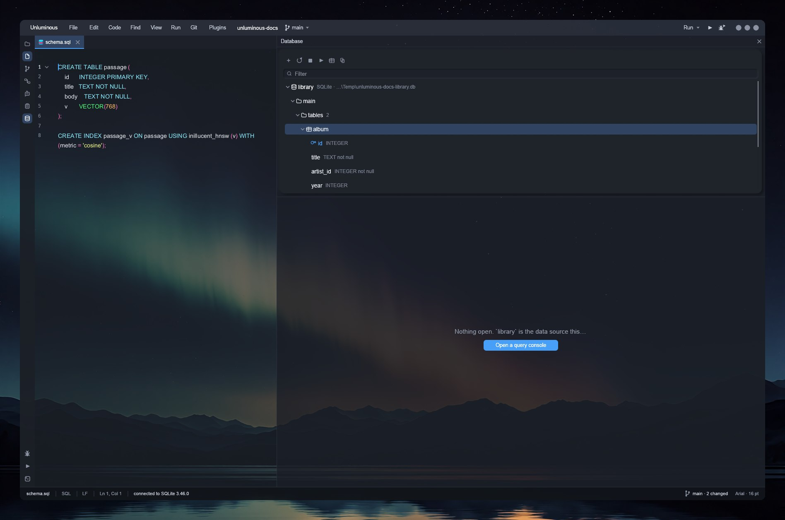
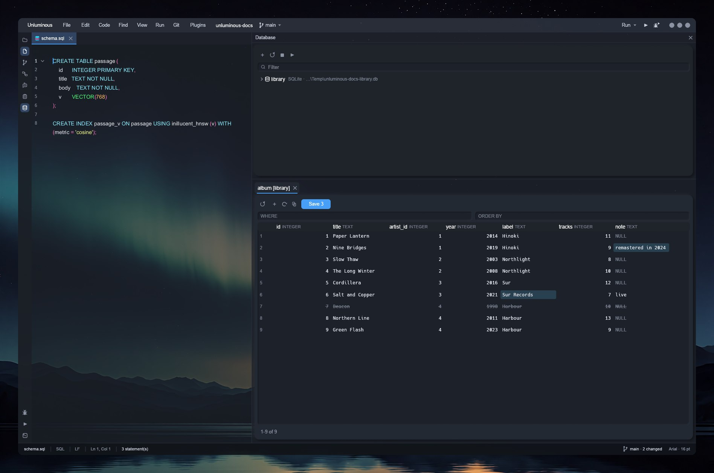
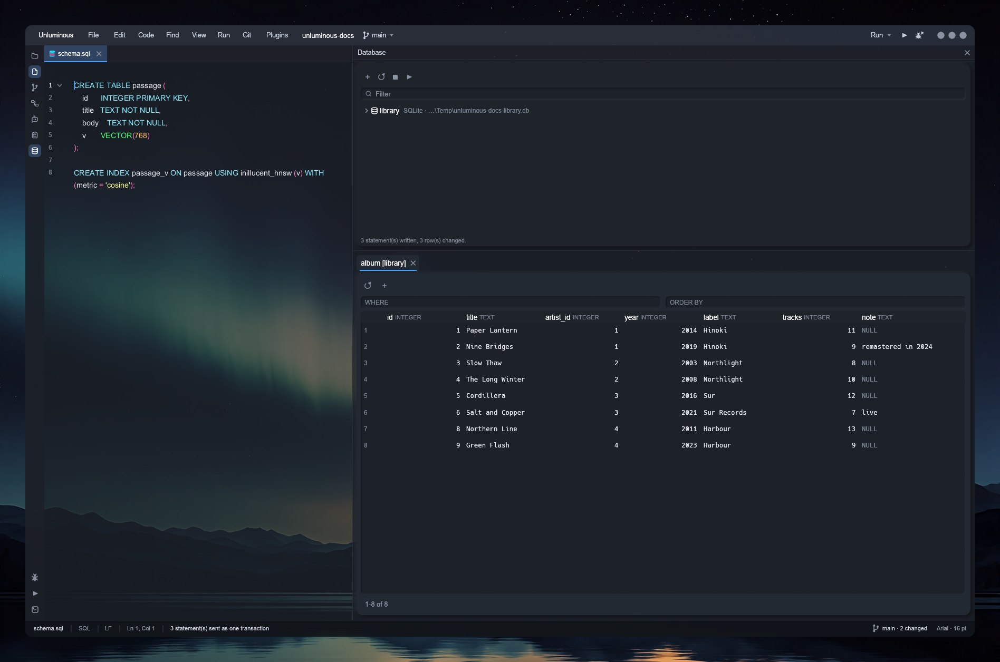
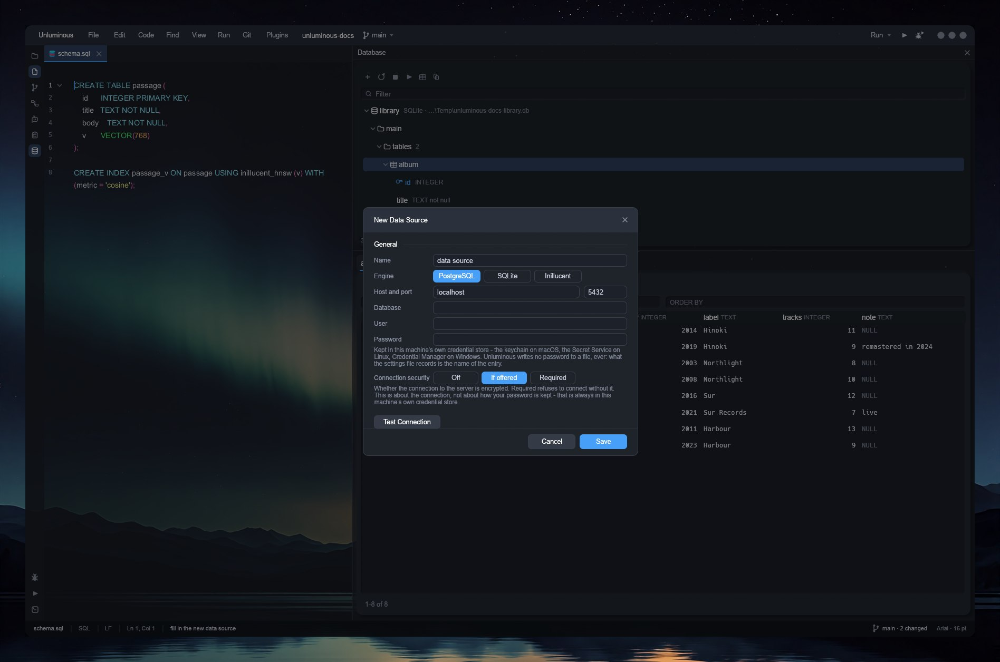
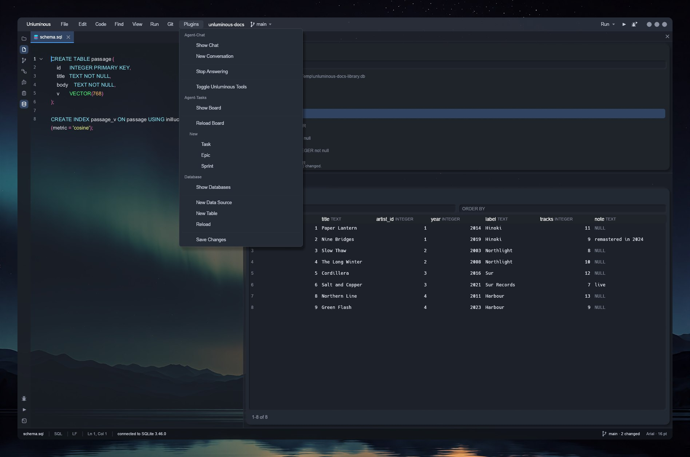

# The Database plugin

Nine captures of the Database plugin, taken from the real window the same way
[what it looks like](overview.md) was, by the same command —
[Taking the pictures](taking-the-pictures.md) is how.

It is a data source tree down one side and a workspace of query consoles and row editors under it:
showing what a schema holds, running a query, editing rows, and writing the edits back. PostgreSQL,
SQLite and Inillucent.

`tasks/task-1777-database-plugin-tdd.md` is the design, and it answers three questions this page
assumes: which third of a commercial database tool was copied, why the client for PostgreSQL is
written inside Unluminous rather than shelled out to `psql`, and the one rule that decides whether a
grid can be edited at all — **a row can only be changed if it can be addressed**, by a primary key or a SQLite
`rowid`, and otherwise the grid is read only and says why.

The fixture behind every picture is a small SQLite library: two tables, `artist` and `album`, a
foreign key between them, and a view over the join. `tools/documentation/library-db.mjs` builds it,
and nothing in it is real.

---

## The tree, and what is in a table

`Database` on the rail opens the pane. A data source is a row; opened, it asks the server for its
schemas, and a schema opens into `tables`, `views`, `routines` and `sequences` — and a folder with
nothing in it is left out rather than drawn empty. A table opens into its columns, each with its
type, whether it is `not null`, and a key icon on the one that names the row.

Nothing here is a second reading of the schema: the tree, the grid and the console all ask the same
connection the same questions, so a column typed `not null` in the tree is the column an `UPDATE`
will refuse to leave blank.



## Opening a grid

A double click on a table — or the grid button in the pane's toolbar — opens it as a tab in the
workspace, with a `WHERE` and an `ORDER BY` field above the rows: two fragments of SQL rather than a
query builder, which is what a person who already knows SQL wants to type into. The footer says how
many rows are showing and pages through more, one more than the row limit asked for, so
`1-200 of 200+` is honest about nobody having counted the rest.


## A console runs what you type

The console button in the pane opens a query console: a plain text field with SQL colouring —
selection, undo, the clipboard, no folding, no gutter, because it is a place to type a statement
rather than a second copy of the editor. `Execute` runs whatever the caret is in, and what comes back
is a result panel below it, one result a run.


## Editing rows is a pending change until you say so

Typing into a cell sends nothing. It is recorded as a pending change — the cell is highlighted, a
deleted row is struck through — and the toolbar's `Save` button carries the count. Nothing is sent
until it is pressed, and that is the right arrangement: a grid is somewhere people type continuously,
and a statement per keystroke would be both slow and impossible to back out of.

Below, `note` has been typed over on the second row, `label` on the sixth, and the seventh has been
marked for deletion — struck through rather than removed from the grid, so what is about to happen
stays visible until it happens.



`pending` reads back the **actual statements** a submit will send rather than a summary of them — the
same call `Save` itself makes, so the preview can never drift from what happens:

```
UPDATE "album" SET "note" = ?1 WHERE "id" = ?2      -- "remastered in 2024", "2"
UPDATE "album" SET "label" = ?1 WHERE "id" = ?2     -- "Sur Records", "6"
DELETE FROM "album" WHERE "id" = ?1                 -- "7"
```

**Every value is a bound parameter** rather than text pasted into the statement, so a title with a
quote, a newline or a backslash in it is a non-event rather than a broken query. Submit sends every
pending change as **one transaction**: all of it happens or none of it does. An `UPDATE` reporting
zero rows rolls the whole thing back, because it means the row moved underneath, and reporting that
as a success is how an edit is silently lost.



## The `CREATE` statement, on demand

`Show DDL` on a table's right click menu asks the server for the statement that made it and shows it
in a modal — not a dialog with fields for a name and a type, because changing a table's shape is a
statement you write, the same as everywhere else in this plugin. `Copy` puts it on the clipboard.

A modal that exists to show a piece of text has a second reader. None of the lines inside a
monospaced block reach the tree the window hands to a screen reader, and neither does a widget
carrying the whole text — so a dialog like this one reports it through `plugins view database` as
well, which is how an agent reads it.


## Adding a data source, and what Unluminous will not do with a password

`+` in the pane, or `New Data Source` on the menu, opens the dialog a source is added from: the
engine, the address, and where the password is.

**No password is ever written down.** A source names an environment variable read at the moment a
connection opens, or an entry in this machine's own credential store — the keychain on macOS, the
Secret Service on Linux, Credential Manager on Windows — and what is written into the settings file
is the *name* of the entry. A password typed into this dialog goes to the credential store; one given
any other way is gone when the window closes.

**There is deliberately no way to give Unluminous a password on the command line**: it would be in a
shell history, a process list and an agent's transcript, which is three copies of a secret. A URL with
a password in it is **refused** with a sentence saying where one goes instead, because that is the one
door through which a secret could reach a settings file unnoticed.

`Connection security` is `Off`, `If offered` or `Required`, and it says in a line that it is about the
connection to the server rather than about how the password is kept. It used to be called
`Encryption`, which is what the underlying setting is called and which a person cannot be expected to
know.

**A new source is writable**, and the read-only tick box that used to be here is gone: `task-1795`
asked for full access and took the whole safety section with it. The **guarantee** stays, because it
was never a parser in Unluminous —
`SET SESSION CHARACTERISTICS AS TRANSACTION READ ONLY` and SQLite's read-only open flag are the
server's own, and `plugins run database read-only` is the one way to ask for them. Nothing in the
window offers it.



## Settings — the data sources you already have, in one place

`Settings -> Plugins -> Database` lists every data source, where it points, whether it is connected,
and where its password is — never the password. `Edit` reopens the dialog above and `Remove` takes one
away. The row limit is on the same page, and its note says what the extra row is for: one more than
the limit is asked for and thrown away, which is what makes `1-200 of 200+` honest.


## The menu

The plugin's entries are in the `Plugins` menu under its own heading, beside Agent-Chat's and
Agent-Tasks': showing the pane, adding a source, making a table, reloading the tree, and saving
whatever is pending. The same five things the rail button, the toolbar and
`unluminous-cli plugins run database …` all reach, because a menu entry in Unluminous needs nothing
else to be run from the command line.



---

## Reading a vector

Inillucent is the third engine, reached through `inillucent-driver` rather than through the engine's
own crates. Four things about it are different from the other two, and each is a rule rather than an
accident:

- **A connection is made on the thread that will hold it.** One file is one buffer pool and the engine
  is single threaded; a handle that could move between threads would be a second page cache over one
  set of bytes waiting to happen.
- **There is no Stop button on an Inillucent source**, because the driver's own capability table
  reports that it cannot cancel — and a cancel that returned success and did nothing is worse than no
  button. It is read from the driver at run time rather than written down here, so the day the engine
  grows a cancel the button appears with nothing edited.
- **A row count is exact.** The engine materialises, so a grid can say `1-200 of 4,317` and mean it,
  where the other two are asked for one more than the limit and answer `200+`. The cost is that a
  query over a large table costs the whole result.
- **A vector is drawn as a vector**, and the schema is what decides that. A search index's own
  configuration says which columns hold one; every other blob stays a blob until a person opens it and
  asks.

**And a vector is not in `select *`.** It arrives through a hidden column, so `select * from docs`
answers `["title", "body"]` and a grid asking for `*` would show the title and the body of a row whose
whole point is the embedding beside them. It is asked for by name, which is the one line that decides
whether a grid can show a vector at all.

**The cell says the norm before the components**, and that order was decided by looking at a picture.
It read `8d · [0.0000, 0.1762, 0.3285, …] · |v| 1.000`, and a grid column fits about eighteen
characters, so what survived was three digits of one component with the norm cut off the end. Any
three of several hundred components are a sample; the norm is a fact about the row, and on a cosine
index a value that is not 1.000 says the corpus was stored unnormalised.

## The agent's half

Everything on this page has a command behind it:

```sh
unluminous-cli plugins run database add-source library C:\path\to\library.db
unluminous-cli plugins run database connect library
unluminous-cli plugins run database open album
unluminous-cli plugins run database set 2 note "remastered in 2024"
unluminous-cli plugins run database pending --json
unluminous-cli plugins run database submit
```

`sources`, `add-source`, `remove-source`, `password`, `connect`, `disconnect`, `use`, `schemas`,
`tables`, `columns`, `ddl`, `open`, `console`, `query`, `state`, `result`, `stop`, `reload`, `page`,
`filter`, `sort`, `set`, `add-row`, `delete-row`, `pending`, `revert`, `submit`, `read-only`,
`new-table`, `drop-table`, `vector`, `search`, `capabilities` and `import` — and
`unluminous-cli plugins view database` answers the whole pane as data.

**`query` does not wait**, for the reason nothing that runs inside a frame does; `state` says when it
has finished and `result` has the rows. **`search` composes the statement into a console rather than
running it**, because the depth a retrieval went to decides the answer where a `LIMIT` only trims what
came back, and a search whose depth nobody could see would be a number chosen on somebody's behalf.

Two faults that only driving the released build found, and both are the same fault in different
clothes — a person and an agent looking at one row were shown different things:

- **`result` answered `32 bytes: 00 00 00 00 bf 69 34 3e…` while the cell drew the summary.** The
  drawing had been taught to read a vector and the data had not, so the half of this repository's own
  rule that says an agent reaches the same thing by the same path was quietly false for the one column
  the feature exists for.
- **The read-only sentence depended on the tree having been read.** Opening a grid on a window nobody
  has clicked in left the grid's kind at its default, and the banner then fell back to "has no primary
  key" — true, and the weaker of the two answers, while the same page's own data said "is a search
  index".

Neither had a failing test, and neither would have got one: both were only visible by starting the
installed binary and reading what came back. That is what the release step is for.

`cargo run -p unluminous-db --example connect -- <url> <PASSWORD_VARIABLE>` is how a real PostgreSQL
server is checked by hand, because a scripted server is evidence about the protocol rather than about
a server.
