# What Unluminous looks like

Thirty-seven captures of **Unluminous 0.50.0** running on Windows, taken on 2026-09-18 from the real
window rather than rendered offscreen, and cropped with a margin of desktop left round the edge.

The margin is there on purpose. Unluminous's background is translucent, and a picture cropped tight to
the window cannot show that the colour in the editing area is the thing behind it rather than a shade
somebody chose. Nothing here is a mock up; every picture is the program working, driven into each
state by `unluminous-cli` and photographed through it.
[Taking the pictures](taking-the-pictures.md) is how they are taken again, in one command.

The project in them is a fixture built for the purpose: a small retrieval library called Aurora, with
three commits by three authors, a branch, an uncommitted change and an untracked file, and a file in
each of several languages.

`README.md` says what Unluminous is. This page is the same ground covered in pictures.

---

## The window

A title bar Unluminous draws itself, holding the menus at the left, the project's name and its branch
after them, and the text options, the three Markdown view modes, the run widget and the window buttons
at the right. Down the far left a thin rail with a button for each pane. Then the file explorer with
its filter box, a tab for each open file, the line numbers, the editing area, and a status bar naming
the file, its kind, its line endings, the caret's position, the branch and the font.

The desktop is visible through the rail, the explorer, the editing area and the status bar, and every
piece of text on top of it is solid. That is the whole character of the product, and it is the first
thing to look at in any of these pictures.

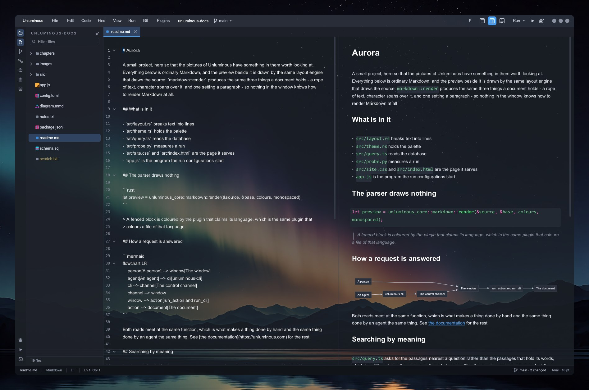

## The desktop shows through, and how far is a setting

`Settings -> Appearance -> Background` is one slider from 5 per cent to 100. At the bottom of its
range the window is nearly all desktop and the text still reads; at the top it is a solid dark editor
and only the margin round the window gives the wallpaper away. Text is painted at full opacity at
every setting, so turning the background down never makes the document harder to read.

It works on both platforms, but Windows takes three separate things to get there that macOS does not
need, all of them in `services/windows_transparency.rs`.
[Architecture](architecture.md#the-window-lets-the-desktop-through) says what each one is.

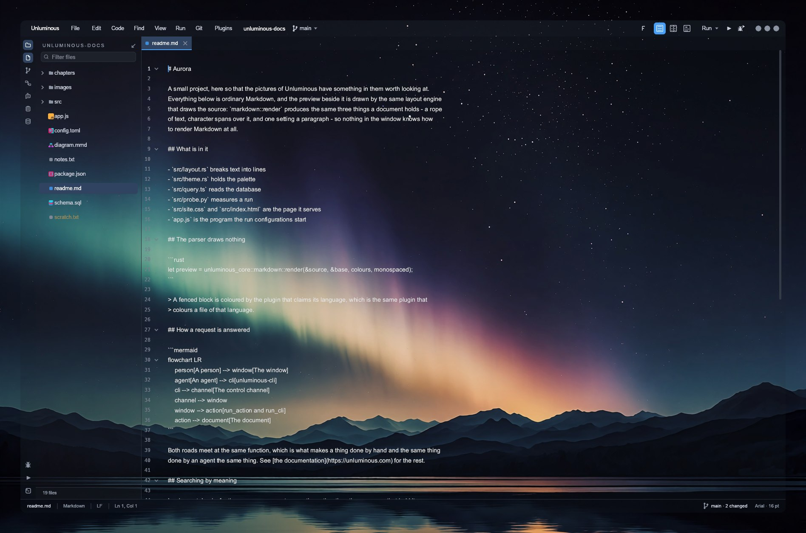

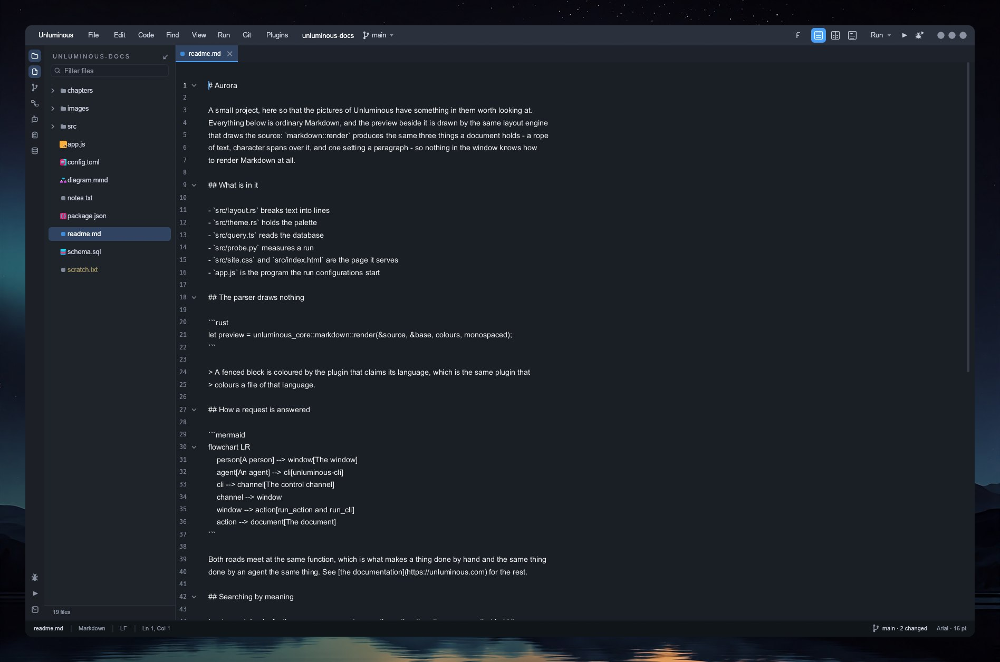

## The rail, and the window's own edges

Down the far left is a button for each pane: the explorer and git at the top, and at the bottom the
things with a character grid in them. A button whose pane is showing is drawn as the same filled pill
every list in Unluminous uses for its chosen row, so the rail says at a glance what is open. Resting on
one names it.

The rail is the only way a pane is put away and brought back, because it is in the same place whether
a pane is showing or not, so it is always where you left it. Below, the explorer has been put away and
the terminal brought up, both from the rail.

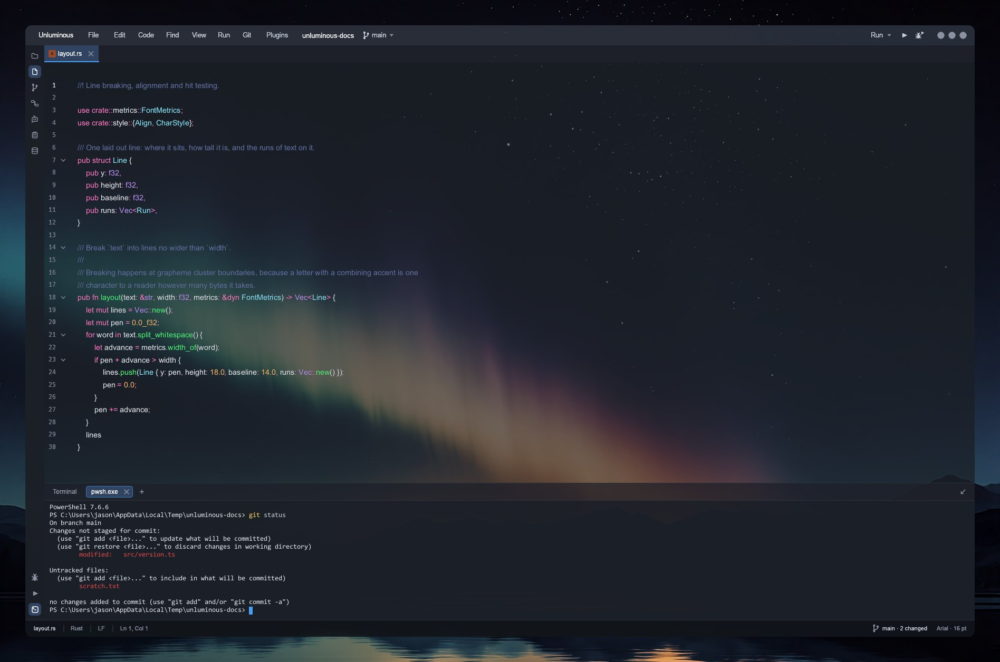

The window is dragged by its title bar and resized by any of its four edges or four corners. Unluminous
draws those grips itself, invisibly, because the window is created with no operating system frame —
rounded corners and a translucent background need the decorations turned off — and a window with no
frame has no resize grip of its own.

## The file explorer

Folders expand in place rather than into a second list. The filter box at the top narrows the tree as
it is typed into. Each row carries the icon of the plugin that claims the file, and is tinted by what
git thinks of it: the untracked `scratch.txt` is one colour and the modified `version.ts` another.
The row of the file that is showing is filled; the row the keyboard is on carries a quieter fill and,
while the explorer holds the keyboard, an accent ring.

The divider at its right edge is dragged to make it wider, and a double click puts it back.

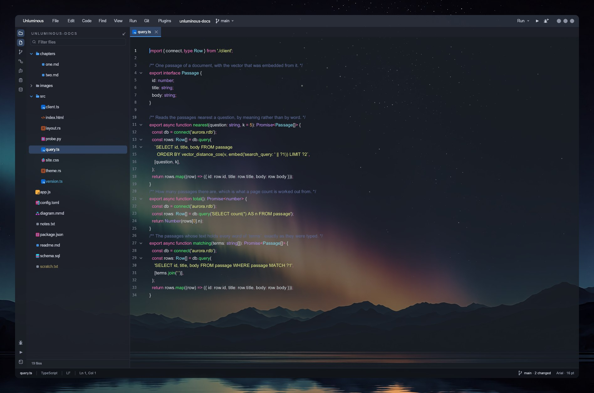

Right clicking a row opens the menu for that row: `New`, cut, copy, copy path, paste, rename, delete,
show in Explorer, reload from disk, and a `Git` submenu aimed at that file. Right clicking the empty
space below the rows, or the project's name at the top, opens the same menu for the project folder
with the entries about a particular file dimmed.

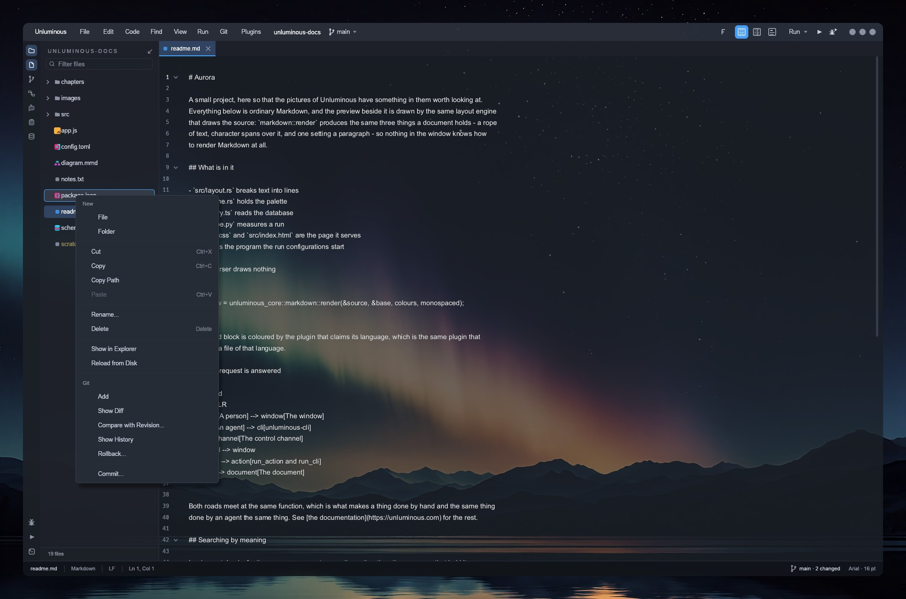

## Markdown, three ways

The source, the source and its preview side by side, or the preview filling the pane —
`Ctrl+1`, `Ctrl+2` and `Ctrl+3`, and the three buttons at the right of the title bar.

The preview is not a second renderer. `markdown::render` reads the source and produces the same three
things a document holds, so the ordinary layout and the ordinary painter draw it. Which is why the
text in it can be selected and copied, and why scrolling either half of the side by side view scrolls
the other — through the text rather than through the height, since a heading is one line of source and
half again as tall on the page.

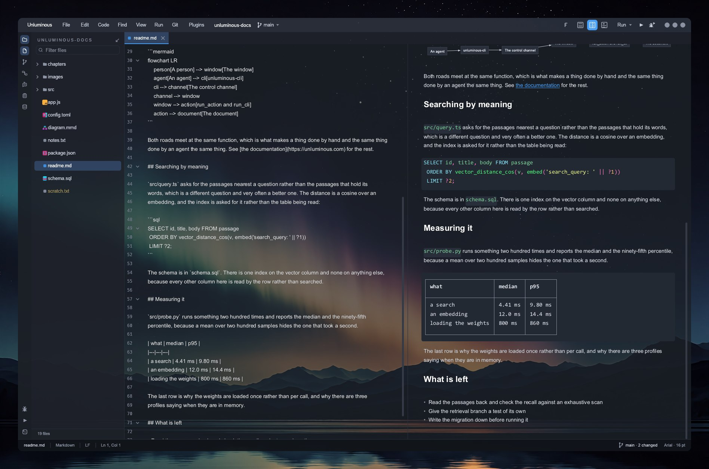

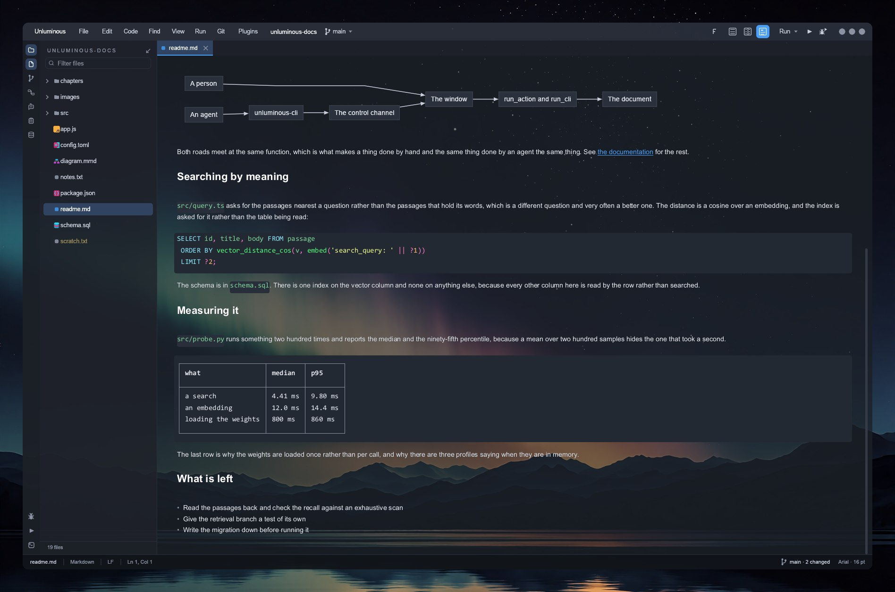

A table is set in the code font and drawn in a box of rules, because the columns are made to line up
by padding the cells rather than by measuring them — so the whole table is ordinary text, and what
lands on the clipboard is a table a person can paste anywhere.

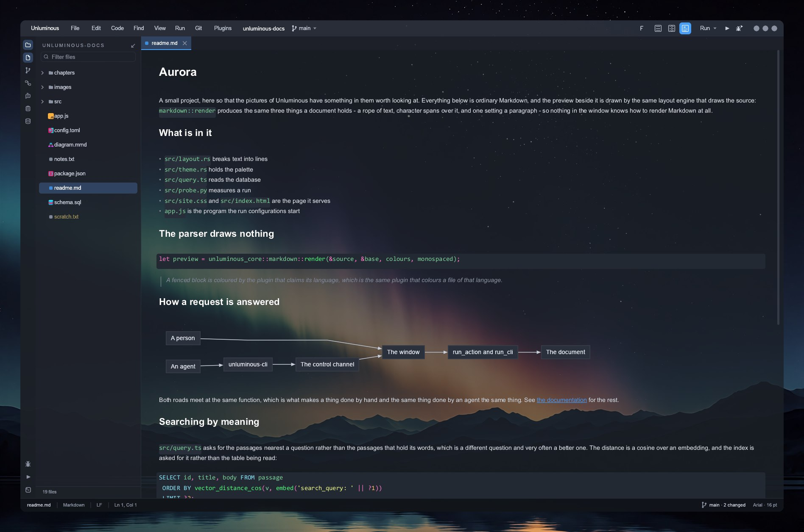

## Mermaid diagrams are drawn, not shown as code

A `.mmd` file gets the same three view modes a Markdown file has, and a ` ```mermaid ` block inside a
Markdown document is drawn in its preview rather than shown as code. Twenty of Mermaid's thirty
diagram types are drawn; the other ten are named rather than mis-drawn.

None of it runs `mermaid.js`. `unluminous_core::mermaid` reads the diagram and hands back rectangles,
circles, polygons, lines and text at absolute positions, and the window draws those — so the pictures
are not pixel identical to `mermaid.js` output, and the bar they are held to is correct and readable.
Nothing is fetched and nothing in a diagram is run.

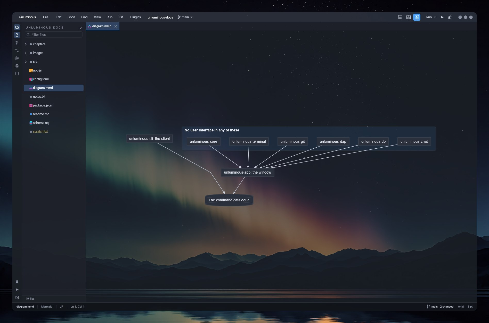

## The text options are behind one button, in the title bar

Bold, italic, underline and strikethrough, five colours, four alignments and three line spacings, all
behind the `F` at the right of the title bar. The panel is four named rows with a rule between what
applies to the selected text and what applies to the paragraph it is in. It stays open until the
pointer goes elsewhere, so a colour and an alignment are two clicks rather than two visits.

They used to sit in a strip of their own between the title bar and the tabs. The strip was drawn for a
`.md` file and not for a `.rs` one, which is the right rule in the wrong place: every time the tab
changed, the tabs, the explorer and the whole editing area moved up or down by forty-four points. In
the title bar the room is there whether the tools are in it or not.

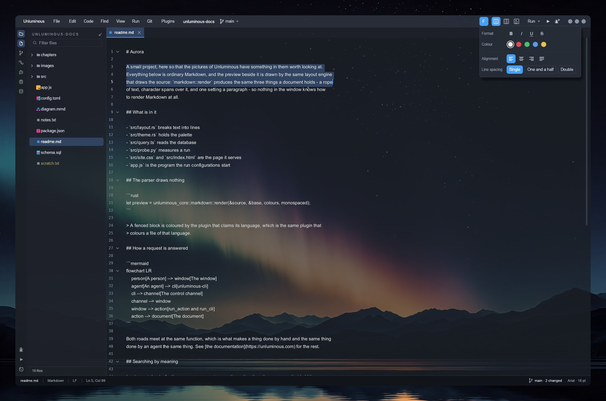

Below, the heading has been centred and coloured and the paragraph under it made bold, all from that
panel. The dot on the tab, against the file in the explorer and in the status bar is how Unluminous says
there are changes that have not been saved.

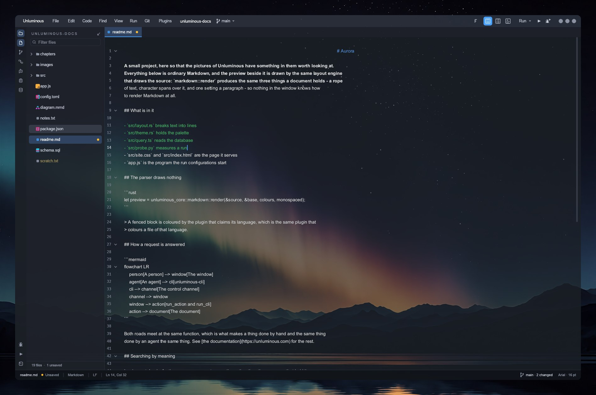

## Nothing is drawn that cannot apply to the file

The `F` button is drawn for prose — a `.md` file, a `.txt` file, a document that has not been saved
anywhere yet. Unluminous saves plain text and carries no formatting to disk, so for a `.rs` or a `.json`
file every one of those controls is a decoration that lasts until the file is reopened, and the three
view modes would offer the Markdown parser's reading of a file that was never Markdown. So a source
file gets neither, and the right hand end of the title bar is simply empty.

Absent rather than dimmed, and the two mean different things. Dimmed is a control that could be used
in a moment — undo with nothing yet to undo, the Git menu outside a repository. Absent is a control
that can never apply to this file.

## Writing code in it

Line numbers down the left, a tab for each open file with the icon of the plugin that claims it, and
syntax colouring from that plugin. Sixteen plugins ship: twelve languages, three panes and a bundle of
five themes. Each language plugin is a folder holding a `plugin.conf` and an icon, and **nothing in
one is executed**, so installing one is copying a folder.

A single click in the explorer opens a file in the tab a single click reuses, drawn faintly to say so;
a double click opens it in a tab of its own, and so does typing into a tab you were only glancing at.

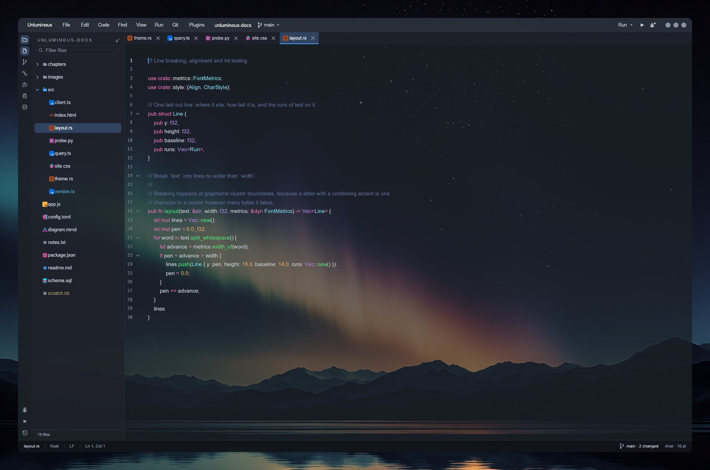

Type two letters of a word and a list of the names it could become appears under the caret, with
`Ctrl+Space` asking for it by hand. Everything it offers was already in memory: this file's
definitions and its distinct words, the other open tabs' definitions, the project's symbol index, and
the language's own keywords, builtins and types. No new thread, no new index, no watcher.

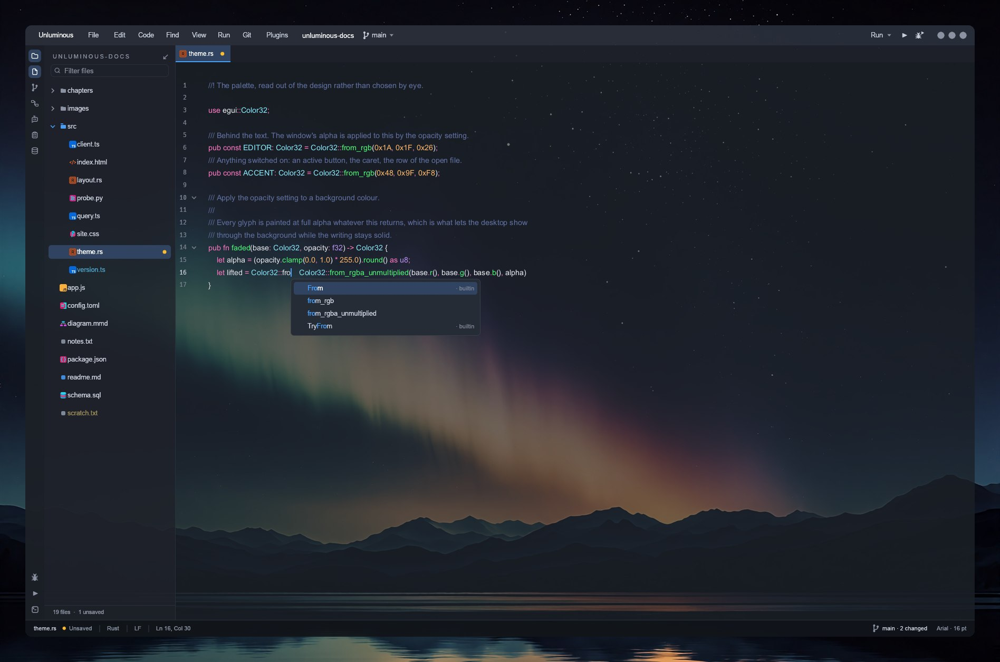

A block that spans lines can be collapsed from the arrow beside its line number, and the line numbers
stay correct because what is hidden is the paragraph rather than a second document being laid out.

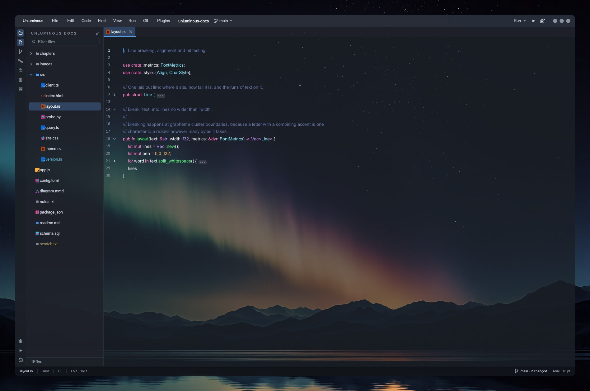

Right click a tab and choose `Split Right`, or use `View -> Split`, and the editing area is cut into
panes side by side, each with its own tabs, its own scroll position, its own view mode and its own
gutter. A tab is dragged along its own strip to reorder it and into another pane to move it there.

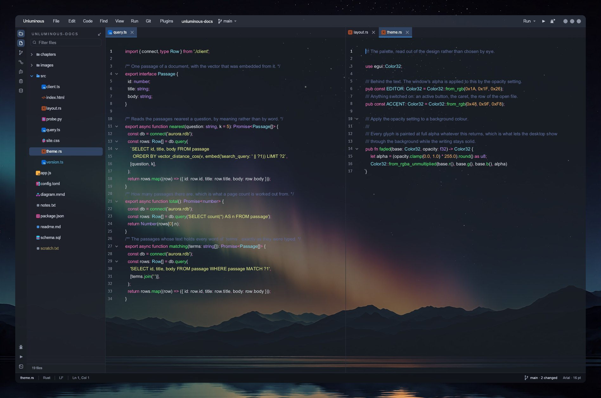

## Themes

A theme says what every colour in Unluminous's own palette means, and one that names the nine token
colours also colours code, in every language at once. `Themes Bundle 1` ships five, every number in
them read out of the plugin jars of the reference editor they come from: Islands Dracula Colorful, Material
Palenight, Material Deep Ocean, Monokai Pro and One Dark. Below is Islands Dracula Colorful.

A colour scheme colours the tokens and not the editing area, so a themed file still lets the desktop
through.

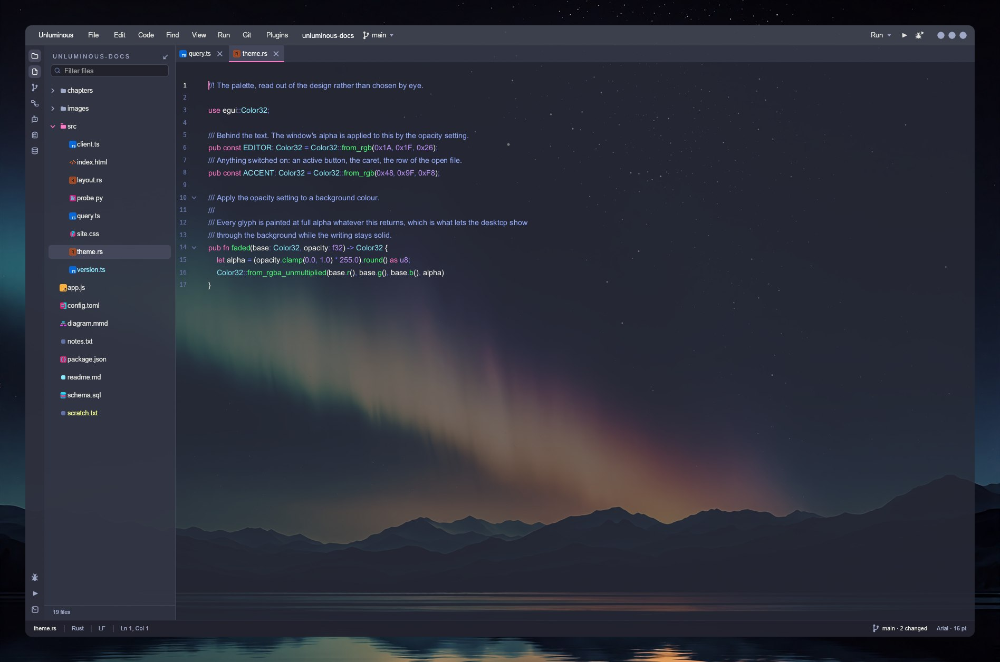

## A picture opens in a tab

`.png`, `.jpg`, `.gif`, `.bmp`, `.ico`, `.webp` and `.tiff`. It is scaled to fit the editing area to
begin with, zoomed with the keyboard, the wheel or a pinch, dragged about with the mouse, and put back
to filling the area with a double click. The status bar says how large it is and at what percentage it
is being shown.

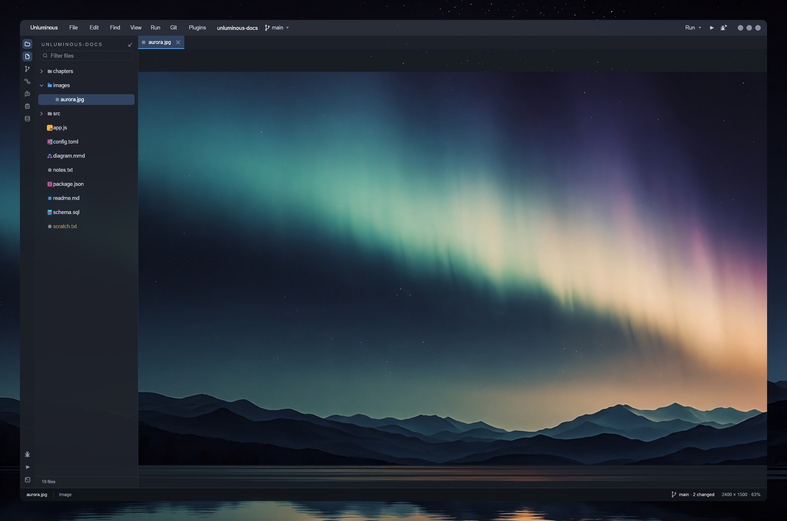

## The menus

`Unluminous`, `File`, `Edit`, `Code`, `Find`, `View`, `Run`, `Git` and `Plugins`. On macOS they are in
the bar along the top of the screen; on Windows they are drawn at the left of Unluminous's own title
bar, and the three window buttons move to the right hand end. Both bars are built from one list, so
they hold the same entries with the same shortcuts.

`Code` and `Plugins` appear when they have something to offer: `Code` for a file whose language can
answer a question about a definition, and `Plugins` when a plugin has contributed a menu.

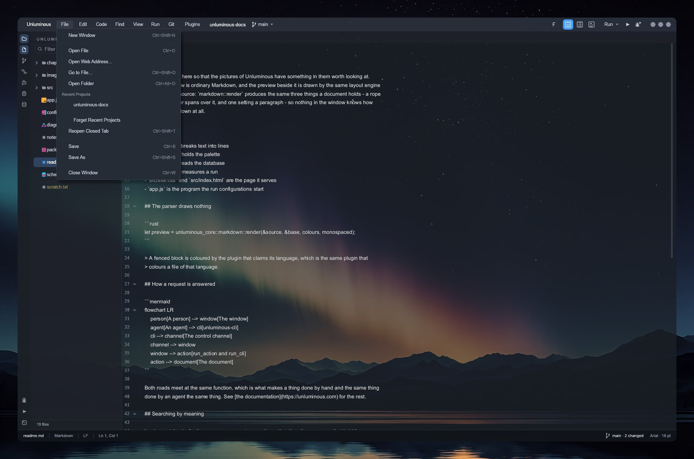

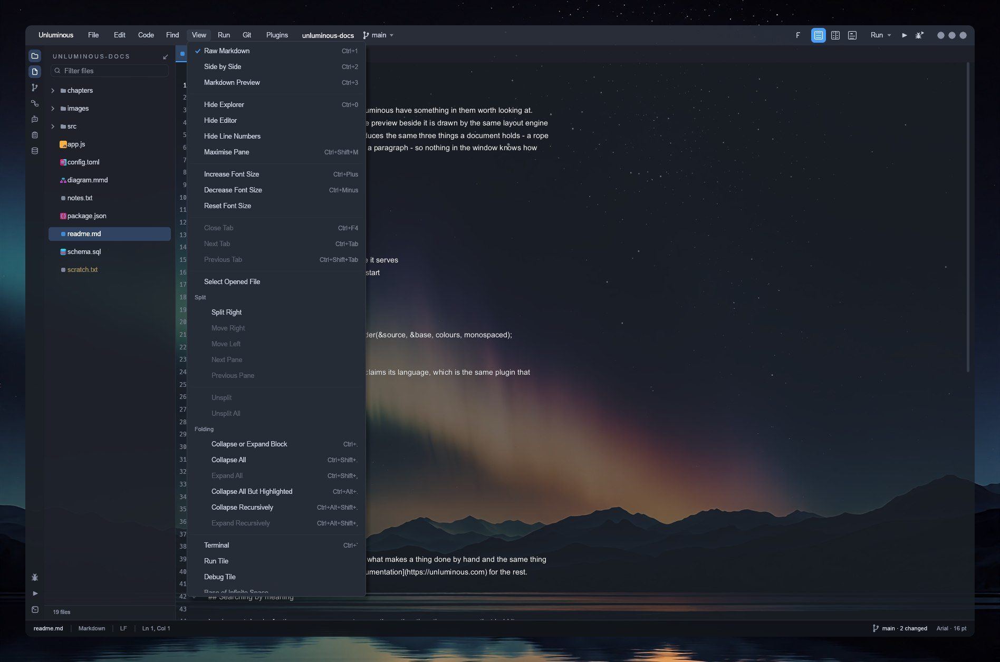

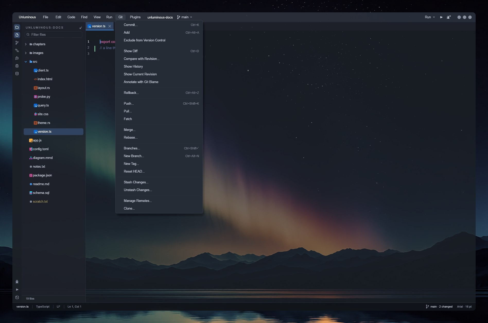

## Finding things

`Ctrl+Shift+A` opens `Find Action`, which searches every menu entry by name and runs the one that is
chosen. A dimmed row is shown dimmed and refused with the reason, because somebody looking for `Redo`
wants to be told there is nothing to redo rather than told there is no such command.

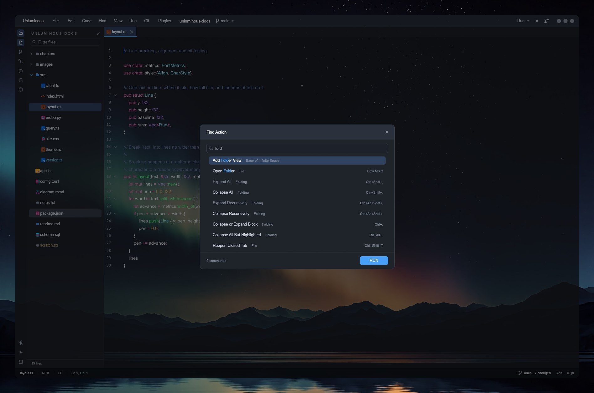

`Ctrl+Shift+O` opens `Go to File`, which narrows the project's files as a name is typed. The letters
are matched in order rather than as a substring, so `mdrs` finds `markdown.rs`, and a match in the
name outranks one in the folders above it.

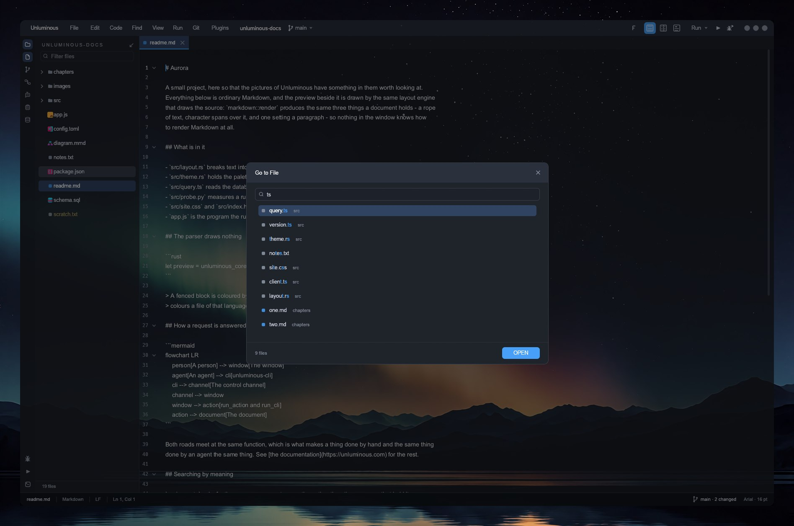

`Ctrl+Shift+F` opens `Find in Files`, which searches every file's text as you type, on a thread so
the window never stops drawing. Choosing a result shows the whole of the file it is in underneath the
results with the matching line picked out. `Replace` beside the box replaces across everything it
found — through the same modal, because a replacement across a project is a change somebody should see
the size of first.

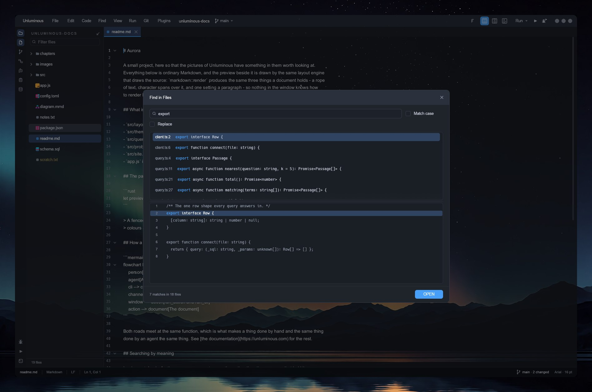

## The terminal

A tile along the bottom of the window with tabs, opened with `Ctrl` and backtick or from the `View`
menu. Each tab runs a shell in the folder the explorer is showing — `$SHELL` on macOS, and on Windows
`pwsh.exe` when it is installed and `powershell.exe` otherwise, because `COMSPEC` names the interpreter
that runs a batch file rather than the shell a person actually uses.

It handles colour including 24 bit colour, bold, italic, underline, strikethrough, inverse and dim,
wide characters, the alternate screen a full screen program draws on, ten thousand lines of scrollback,
selecting with the mouse, and mouse reporting for a program that asked for it. A tab is named after the
title the program set, so a tab running `claude` says so, and a tab can be renamed to something else.

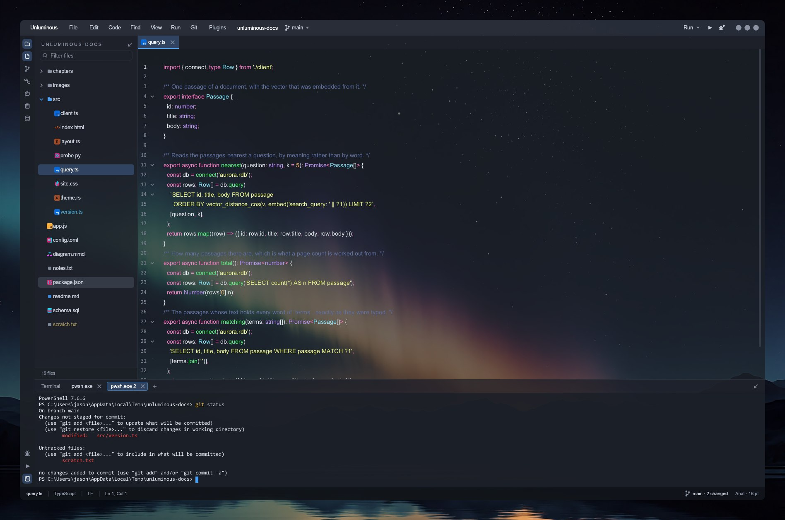

## Git

Unluminous runs the `git` program rather than a library, so a push from Unluminous is the same push you
get in your terminal — the same credential helper, the same ssh agent, the same hooks, the same
signing. When something goes wrong it shows **git's own message**, because a rejected push and a merge
conflict explain themselves better than anything Unluminous could say about them.

`Commit...` opens a panel with a changes tree, a tick box per file, an `Unversioned Files` group,
`Amend`, the counts, and the message box with the last twenty messages behind a button. Ticking a file
stages it at once, so Unluminous's idea of what is staged and git's cannot disagree while the panel is
open.

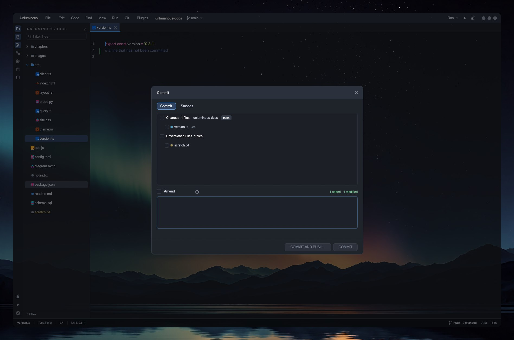

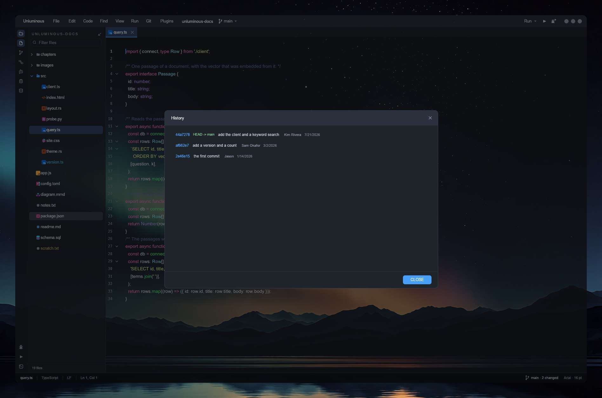

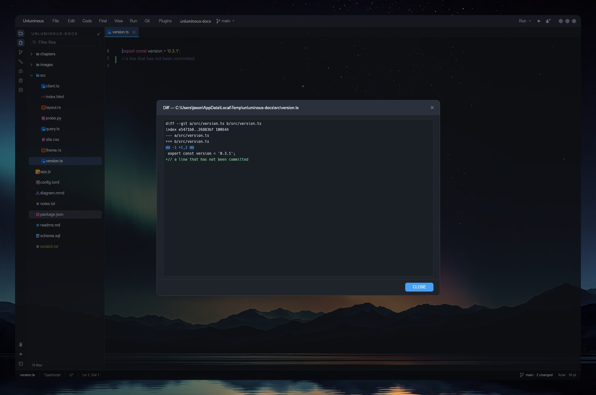

Annotating a file with blame puts a column down the left holding the date and the author of the commit
each line last changed in, coloured by age so the old parts of a file and the new ones are told apart
at a glance.

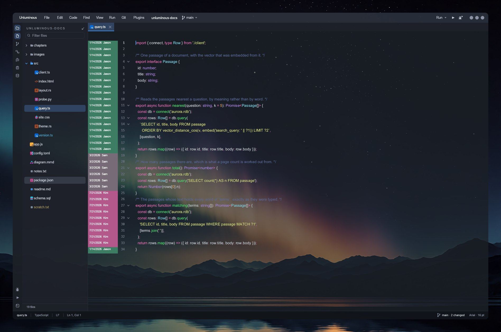

## Running and debugging

A run configuration is a named command line, a folder and some environment variables — one kind, not a
template per language. Pressing the play button at the right of the title bar starts it in a tile along
the bottom, which is a real terminal with the program in it, so its colours and its interactivity are
its own and stopping it is killing a process Unluminous owns.

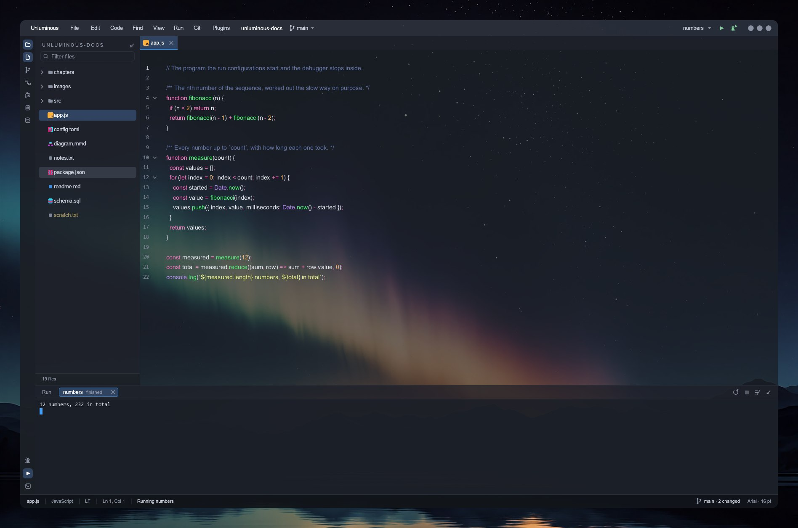

Pressing the bug beside it starts the same configuration **under a debugger**. Unluminous speaks the
Debug Adapter Protocol, so one client drives every language's debugger: Rust and native code through
`lldb-dap` or CodeLLDB, JavaScript and TypeScript through Microsoft's js-debug. Which debugger a
language uses is one line in its plugin, and **nothing is fetched** — pressing Debug with no adapter
installed is one sentence saying what was looked for and the command that installs it.

Below, a `node` program is stopped on a breakpoint. The line is marked, the call stack and the
variables are in the debug tile, and each local's value is painted at the end of the line that names
it — which is the client's own work, because the protocol has no request for it.

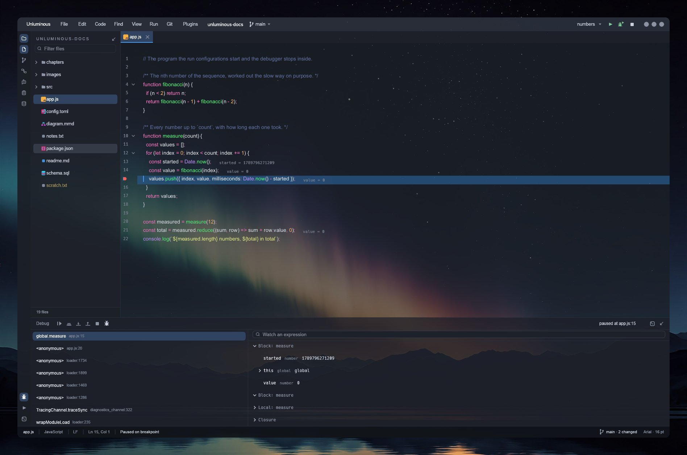

## The Base of Infinite Space

A fifth panel holding an infinite canvas, and six kinds of node that can live on it: a terminal, a web
page, a folder tree, a file editor, an agent chat and the task board. Nodes are wired to each other,
and a connection is what lets an agent running in a terminal node act on the node it is wired to.

The zoom costs a matrix rather than a relayout — each node draws into a layer of its own carrying the
camera — so a terminal keeps its cell count and an editor keeps its line breaks while the canvas is
scaled.

Below, four nodes: an agent's terminal wired to a file editor, a folder tree and the task board. What
the terminal has printed is `unluminous-cli space list`, which is the canvas reading itself back —
four nodes, their sizes, and which three the first one is connected to.

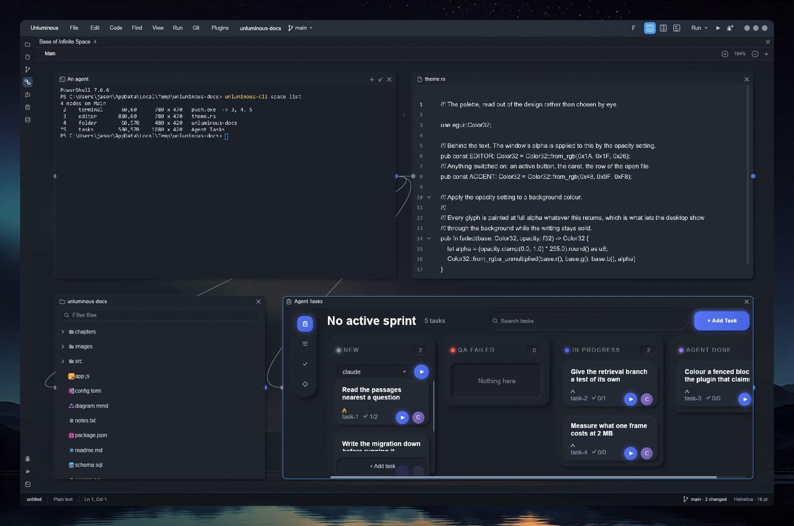

## The agent panes

**Agent-Chat** is a chat pane beside your work that runs the `claude` or `codex` command line already
installed on this machine. Unluminous holds no key at all: the agent holds its own credentials, brings
its own tools and its own permission model, and is started in the folder this window has open, so it
finds that project's `CLAUDE.md` or `AGENTS.md` and the answer is about the code in front of you
without a word of it being uploaded by Unluminous. A row can be pointed at an address instead, and five
wire shapes are read into the same values.

The answer below came from a real `claude`. The counts under it are the tokens the server really
reported; there is no context meter, because a URL and a model name say nothing about a context length
and a bar there would be a fraction of a number nobody measured.

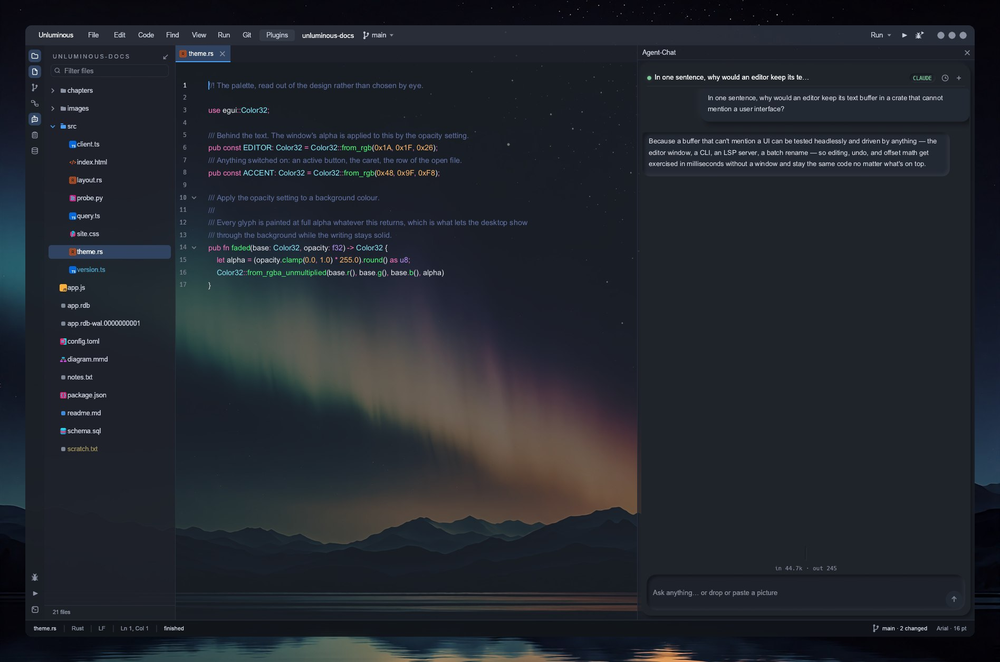

**Agent-Tasks** is a board whose tickets are worked by an agent in a terminal Unluminous owns: four
lanes, cards with todos and comments, a terminal for each ticket, and a session resumed by the agent's
own conversation id rather than by a process that outlives the editor.

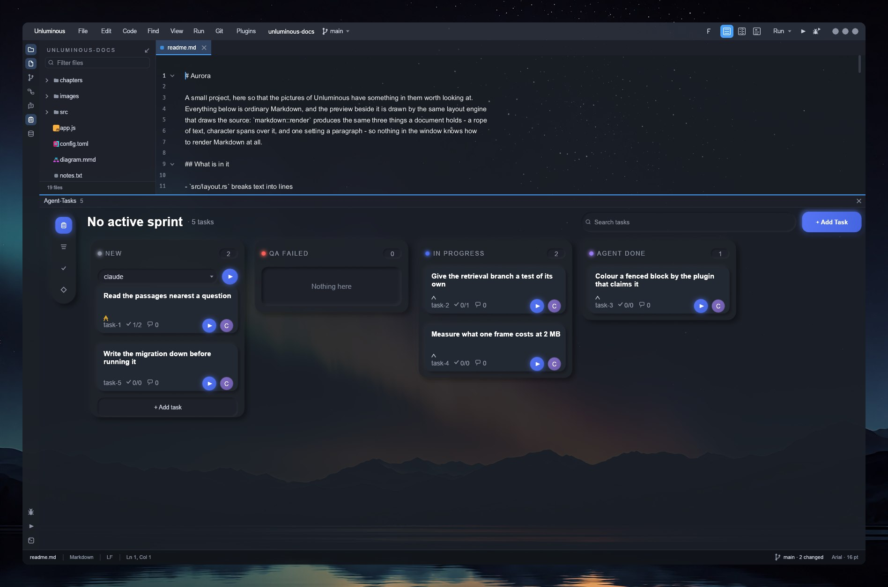

There is a third pane, the **Database** explorer, and it has a page of its own:
[the Database plugin in pictures](database.md).

## Settings

`Edit -> Settings`, `Unluminous -> Settings`, or command and comma. The pages are down the left under
their headings and the chosen page is on the right, and the window is one size for every page with the
page scrolling inside it.

`Appearance` holds the font the editor draws a document in, the font the window's own text is drawn in,
the background opacity, and whether a plugin's pane is drawn with depth.

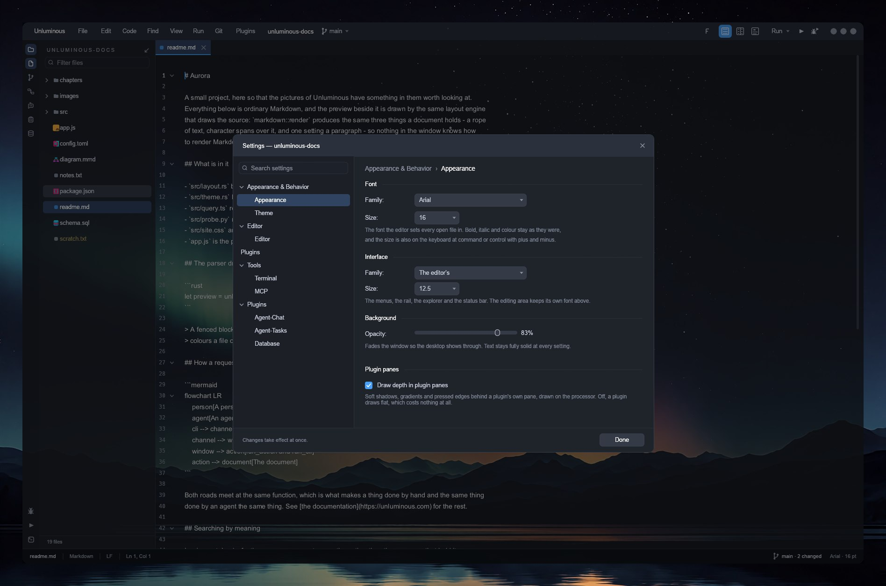

`Plugins` is the marketplace and the list of what is installed. Switching one off takes effect at once:
the files it claims lose their colours and their icon on the next frame. `Install` writes a bundled
plugin's folder out where it can be edited by hand, and then reads it back from disk — which is what
proves the loader works on real files rather than only on what was baked into the binary.

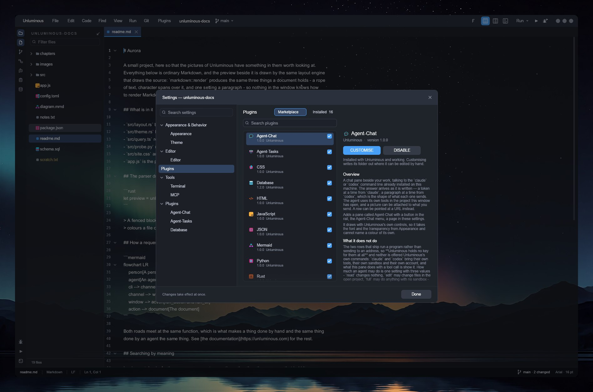

`Tools -> MCP` is how Unluminous is given to an AI agent: a button that writes it into Claude Code's or
Codex's own configuration, the block to paste into anything else, and a tick box for serving the same
thing over HTTP on a port. The button needs no port and is what should be preferred; the port is off
until it is turned on.

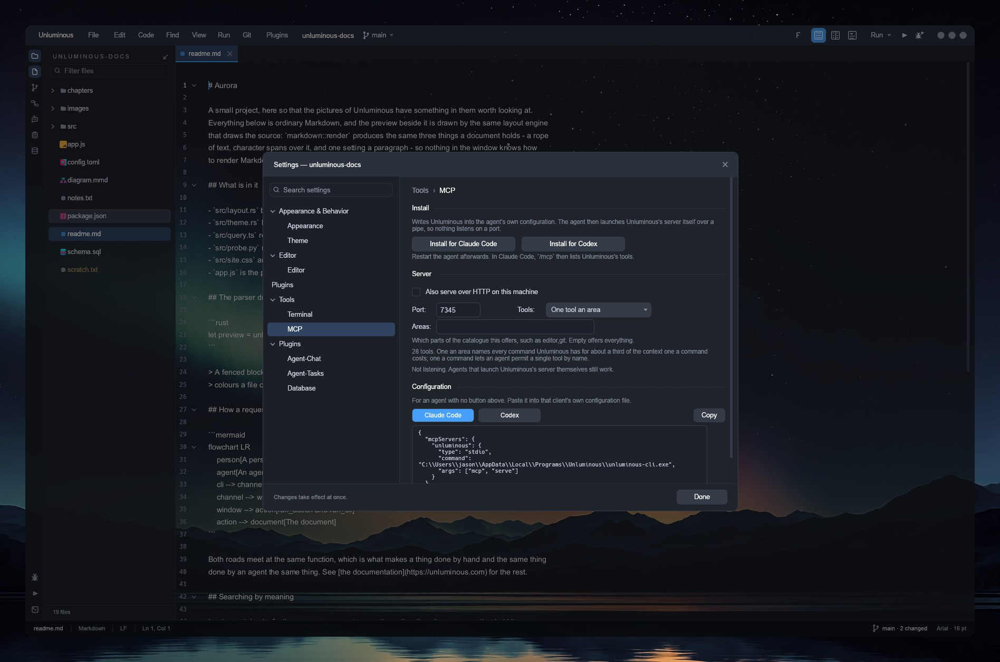
