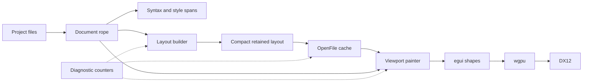
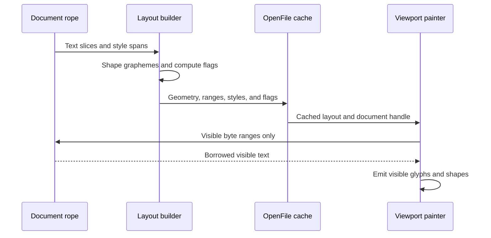

# Unluminous performance review

## Introduction

Unluminous 0.37.1 is already responsive in ordinary editing, but we've found a large verified opportunity in the memory retained by cached layouts for open files. A single 538 KB Rust file adds about 58 MB of working set and 64 MB of private bytes, while ten representative code tabs add 111 MB of working set and 118 MB of private bytes.

This design reduces that retained layout cost without weakening editor behavior or making tab switches slower, and it adds repeatable diagnostics so we can base future performance work on measured costs instead of allocator swaps or small frame-loop cleanups that don't move the user-visible result.

## Measured baseline

All release measurements below use an exact build of tag `v0.37.1`. The first launch in each set was retained so cold and warm behavior stayed visible. Experimental binaries and raw results are under `_agent_output/task-1813-performance-review/` and are not product files.

### Launch and idle behavior

| Metric | Result |
| --- | ---: |
| Warm window visible, median of 7 | 539 ms |
| Warm control interface ready, median of 7 | 770 ms |
| First cold window visible | 1,587 ms |
| First cold control interface ready | 1,841 ms |
| Working set at idle | 215.7 MB |
| Private bytes at idle | 431.3 MB |
| Idle CPU | 4.17 ms per second |
| Idle frame rate | 2.05 frames per second |
| Idle frame time, median | 0.64 ms |

The 500 ms heartbeat explains the roughly two idle frames per second, which is the intended reactive behavior and doesn't indicate a render loop running wild.

Graphics startup selected the NVIDIA RTX 5090 through DX12 on every measured run. Adapter acquisition had a 301.7 ms median across five launches, with one 825.5 ms outlier. Device creation took 54.5 to 70.2 ms, while shader creation took 9.8 to 14.8 ms. An isolated `HighPerformance` power preference experiment produced a 303.8 ms median adapter acquisition across seven launches, so it did not improve startup.

The project walk took 13 ms for 923 files in Unluminous and 42.5 ms for 1,329 files in AI Service, so it isn't a launch bottleneck at current project sizes.

### Editor behavior

| Operation | Result |
| --- | ---: |
| Open a large code tab | 19 ms command completion |
| Open frame time, median | 1.02 ms |
| Open frame time, worst observed | 11.44 ms |
| Typing frame time, median | 2.50 ms |
| Typing frame time, worst observed | 5.89 ms |
| Caret jump frame time, median | 0.76 ms |
| Scroll frame time | 0.65 ms |
| Whole 538 KB file layout in the diagnostic harness | 64.49 ms |
| One screen glyph collection | 0.04 ms for 1,843 glyphs |
| Whole file glyph collection | 13.43 ms for 376,660 glyphs |

These results show that viewport painting is inexpensive, while building and retaining a complete layout for a large document carries the expensive part of the current path.

### Retained memory by feature

The clean-project sequence started at 208.2 MB working set and 418.9 MB private bytes.

| Added state | Main process working set | Main process private bytes | Full process tree working set | Full process tree private bytes |
| --- | ---: | ---: | ---: | ---: |
| Clean project | 208.2 MB | 418.9 MB | 208.2 MB | 418.9 MB |
| Ten code tabs | 319.3 MB | 536.7 MB | 319.3 MB | 536.7 MB |
| Markdown preview | 325.3 MB | 542.8 MB | 325.3 MB | 542.8 MB |
| Terminal | 334.5 MB | 558.1 MB | 517.6 MB | 616.4 MB |
| Browser | 340.2 MB | 559.2 MB | 818.1 MB | 772.8 MB |
| Browser after 60 seconds | 340.3 MB | 559.1 MB | 822.2 MB | 767.1 MB |

The browser adds six WebView2 child processes and about 300 MB of working set to the process tree, but remains stable over the observation window. Unluminous already uses one native browser view, releases it when the last browser tab closes, and lowers its memory priority while hidden, so we shouldn't disturb that design.

Opening `crates/unluminous-app/src/app/mod.rs` alone increased the main process from 219.1 MB to 277.1 MB working set and from 435.5 MB to 499.2 MB private bytes. Fifteen open-close cycles warmed to a higher allocator and cache watermark, then plateaued with the closed-state working set around 231 to 234 MB, so the test didn't show an unbounded leak.

### Layout representation

The large file produced:

| Structure | Length | Capacity | Element size |
| --- | ---: | ---: | ---: |
| `PlacedLine` | 10,509 | 21,016 | 112 bytes |
| `PlacedRun` | 63,003 | 94,756 | 64 bytes |
| `PlacedCluster` | 527,118 | 716,409 | 48 bytes |

The public layout containers account for an estimated 40.82 MB of heap capacity before the rope, syntax state, fingerprints, symbol data, fold state, allocator bookkeeping, etc. Every measured cluster used inline `ClusterText`, so the layout duplicates source text metadata across more than half a million clusters without needing the long-text heap case, and unused cluster capacity alone accounts for about 9 MB at the current element size.

Each hidden `OpenFile::Cached` retains its full `Layout`, preview layout state, syntax tokens, symbols, and fold data. Hidden tabs don't pay recurring layout work, but they keep the complete layout so switching back stays fast.

## Goals

- Reduce the working-set increase from opening the 538 KB reference file from 58 MB to 35 MB or less
- Reduce the private-byte increase for that file from 64 MB to 40 MB or less
- Reduce the ten-code-tab working-set increase from 111 MB to 65 MB or less
- Preserve cached tab switching so switching to a previously laid-out tab doesn't trigger a full-document relayout
- Keep typing at or below the 5.89 ms observed worst frame in the reference editing sequence
- Keep scrolling at or below 1 ms for the reference sequence
- Preserve rendering, selection, hit testing, folding, preview, split panes, syntax highlighting, Unicode graphemes, and emoji
- Add repeatable allocation and retained-layout diagnostics that are absent from release builds

## Non-goals

- Replacing egui, eframe, wgpu, DX12, the text engine, or the document rope
- Replacing the system allocator
- Changing browser process flags or creating a browser view per tab
- Adding a splash screen or a second startup UI
- Evicting hidden tab layouts in the first implementation
- Optimizing the project walk, shader creation, menu construction, or pane construction before diagnostics show a meaningful user-facing cost
- Sending performance telemetry or document content anywhere

## Problem statement

The current layout model is optimized for direct painting, with every `PlacedCluster` owning display text plus a source byte range, position, and advance. `PlacedLine` owns runs, every run owns clusters, and the nested vectors retain growth capacity. This gives the painter convenient data, but multiplies metadata and duplicated text across every grapheme in every cached tab.

The frame loop isn't the current problem because a ten-tab idle trace had a 1.0 ms median frame, with explorer rendering at 0.34 ms, menus at 0.18 ms, and panes at 0.06 ms. Those paths contain avoidable temporary vectors and strings, but their measured total is already small.

Startup is also split between a fast application path and an external graphics cost, with adapter and device acquisition dominating warm launch. Forcing high-performance adapter selection didn't reduce that cost, while project scanning and shader setup remain too small to justify architectural complexity.

## Architectural overview

The document rope remains the source of text. The retained layout keeps geometry, style identity, and source byte ranges. The painter reads visible cluster text from the document by byte range instead of reading a duplicate owned by every cluster.

## Detailed design

### 1. Add diagnostic baselines

Move the research harnesses into maintainable, opt-in examples or test tools before changing representation:

- A layout-memory example reports element sizes, lengths, capacities, and estimated heap capacity for a supplied file
- A frame-cost example reports whole-file layout, glyph collection, selection, and incremental edit timing
- A Windows release measurement script opens a clean project, opens the fixed ten-file corpus, exercises browser and terminal states, closes tabs repeatedly, and records main-process plus process-tree memory
- A diagnostic-only counting allocator records allocation count and bytes by existing frame-trace phase, using preallocated counters in the hot path without becoming the release allocator

All diagnostic output belongs under `_agent_output/`, and reports contain aggregate sizes, timings, counts, etc. They don't contain source text, command contents, URLs, or file contents.

### 2. Remove duplicated cluster text

Replace retained `PlacedCluster::text` with compact paint metadata. The retained cluster needs:

- The source byte range
- Horizontal position and advance
- A compact flag set for properties needed after layout, such as blank or tab behavior
- Any compact glyph identity that measurement proves cheaper than recovering from the rope

The layout builder can inspect grapheme text while it is already shaping. It should compute blank and tab flags at that point. The painter receives read access to the document and resolves only visible cluster byte ranges. This keeps the document rope as the single text owner.

Byte ranges must remain authoritative through incremental relayout, and every consumer of `cluster.text`, including whitespace decisions, glyph collection, tests, selection, and hit testing, must move to either the compact flags or document-backed access. No consumer may allocate a `String` for each visible cluster during painting or any other input-sensitive path.

This change should be implemented behind one coherent layout API so we don't leak document slicing throughout the UI. A helper such as `LayoutTextView` can pair a layout with the matching rope and expose grapheme iteration for a visible run.

### 3. Control retained capacity

After removing cluster text, measure capacity again. Then apply the smallest capacity change that reaches the memory goals:

1. Reserve from known paragraph and shaping counts where those counts are reliable
2. Compact completed cold layouts at cache boundaries when the one-time cost is below the tab-open budget
3. If nested vector overhead remains material, flatten retained layout storage into contiguous line, run, and cluster arrays with ranges between them

Flattening is deliberately the third step because it changes more indexing code and should only proceed if the textless representation plus capacity discipline misses the targets.

Compaction can't run on every keystroke, so mutable working vectors can keep editing headroom. The cache layer should compact when a document becomes cold, after a debounce, or after a full layout that substantially over-allocated, while a visible file must never pause for a whole-layout shrink during input.

### 4. Preserve hot tab behavior

Keep full cached layouts for visible panes and recently used tabs, without introducing layout eviction in the first pass. The reference file takes 64.49 ms to lay out from scratch in the diagnostic harness, so blind eviction would trade a verified memory cost for a perceptible tab-switch stall.

If the primary design misses the ten-tab target, a later experiment may add a byte-budgeted least-recently-used policy. It must retain every visible split-pane layout and enough recent layouts for instant switching. Evicted layouts must rebuild off the input path, and the experiment must prove that p95 tab switching stays within one 16.7 ms frame before it can ship.

### 5. Profile frame allocations before cleanup

Use the diagnostic counting allocator to rank allocations in explorer, menus, pane tabs, browser placement, editor layout, and painting, then optimize only phases that exceed either 0.25 ms median or 10 percent of per-frame allocated bytes in a representative trace.

Likely candidates include reusing menu and tab vectors, avoiding cloned browser tab maps, caching unchanged explorer headings, etc. These are still hypotheses, and the current phase timings make them lower priority than retained layout memory.

### 6. Keep startup architecture unchanged

Retain the current wgpu request and DX12 backend selection, then collect 30 cold and 30 warm launches with adapter name, driver version, and phase timing after the memory work to catch regressions. Investigate adapter outliers only if p95 control readiness exceeds 1,000 ms on the reference machine.

The direct DX12 path remains appropriate. wgpu exposes adapter power preference as a request hint, and the local experiment showed that `HighPerformance` chose the same adapter without reducing request time. A splash screen would add another window lifecycle while hiding, rather than removing, the measured cost.

## Data flow and interfaces

The layout and document must share the same revision, with existing revision checks guarding against stale byte ranges. A document edit invalidates or incrementally updates affected layout ranges before painting, while background diagnostics observe counters only and never hold document text.

## Security and privacy

This work adds no network calls, permissions, subprocesses, identity changes, or new persistent user data. Diagnostic tools are opt-in and local. They record numeric timings, capacities, process counters, adapter identity, driver version, and paths only when a local developer explicitly supplies them. They do not record source contents, browser contents, terminal contents, prompts, or credentials.

Bounds checks on document-backed byte ranges are mandatory because invalid UTF-8 boundaries or stale revisions must fail safely in diagnostics and be prevented in release code through the same layout revision contract used for hit testing and incremental relayout.

## Alternatives considered

### Replace the allocator

We rejected this after a mimalloc 0.1.52 release experiment increased median working set from 215.7 MB to 227.1 MB and private bytes from 431.3 MB to 474.3 MB, while control readiness stayed effectively unchanged at 775 ms versus 770 ms. Allocator projects also recommend workload-specific measurement because an allocator can't win every workload.

### Force a high-performance adapter

We rejected this because it selected the same RTX 5090 and produced a 303.8 ms median adapter request versus 301.7 ms with the default preference.

### Evict every hidden layout

We rejected this for the first pass because it would save memory but make large-file tab switches pay a full layout rebuild. A measured, budgeted cache remains a fallback only if compact layouts miss the target.

### Optimize menus, explorer, and pane vectors first

We deferred this because those phases total less than 0.6 ms in the ten-tab idle trace, and allocation counters should rank them after the dominant retained-memory work.

### Add a splash screen or parallel project walk

We rejected this because the project walk is 13 to 43 ms in measured projects, while a splash screen masks graphics initialization and adds lifecycle complexity without shortening readiness.

### Change browser process flags

We rejected this because WebView2 is stable in the measured workload and its cost is feature-specific, while the existing single-view lifecycle already limits browser growth without weakening compatibility or site isolation.

## Testing strategy

### Layout correctness

- Compare compact layout geometry against the current representation for the existing layout corpus
- Cover ASCII, tabs, combining marks, bidirectional text, emoji, graphemes longer than the old inline storage, and mixed font fallback
- Verify selection rectangles, caret placement, mouse hit testing, folds, syntax spans, previews, search results, and incremental edits
- Assert that every retained byte range is in bounds, lies on UTF-8 boundaries, and belongs to the current document revision
- Run the full existing test suite, including all 483 current tests, before handoff

### Functional performance checks

- Build release binaries and run the fixed 30-launch cold and warm sequence
- Run the fixed ten-code-tab sequence from a clean project
- Open and close the ten tabs for 50 cycles, then verify that closed-state memory reaches a plateau rather than growing monotonically
- Repeat typing, scrolling, caret movement, selection, split-pane, preview, terminal, and browser workflows through the control interface
- Confirm that returning to a cached large tab does not invoke full layout construction
- Compare production screenshots for editor, split panes, selection, syntax highlighting, preview, and browser placement, with visual verification happening only after deployment to production

### Acceptance thresholds

| Metric | Baseline | Required result |
| --- | ---: | ---: |
| Large-file working-set increase | 58.0 MB | 35 MB or less |
| Large-file private-byte increase | 63.7 MB | 40 MB or less |
| Ten-tab working-set increase | 111.1 MB | 65 MB or less |
| Typing worst observed frame | 5.89 ms | No regression over 10 percent |
| Scroll frame | 0.65 ms | 1 ms or less |
| Cached tab switch | No full relayout | No full relayout |
| Warm control readiness | 770 ms median | No regression over 10 percent |
| Correctness | 483 tests passing | All tests passing plus new coverage |

If the memory thresholds are missed, capture the new structure sizes and allocation breakdown before choosing the next change. Do not ship an allocator swap, aggressive cache eviction, or unrelated frame-loop rewrite as a substitute.

## Delivery plan

1. Land the diagnostic examples and fixed benchmark corpus without changing release behavior
2. Remove retained cluster text and update all consumers through the document-backed layout API
3. Run correctness, memory, editing, and launch benchmarks
4. Add cache-boundary capacity control if the textless representation does not meet the targets
5. Consider flat layout arrays only if capacity remains the measured blocker
6. Use allocation counters to choose any frame-loop cleanup after retained memory meets its goals
7. Deploy, verify production visuals, and publish the normal Unluminous release

## Research references

- [egui README](https://github.com/emilk/egui) documents immediate-mode layout behavior, reactive idle rendering, and viewport strategies for large content
- [wgpu `RequestAdapterOptions`](https://docs.rs/wgpu/latest/wgpu/type.RequestAdapterOptions.html) documents power preference and fallback adapter hints
- [wgpu repository](https://github.com/gfx-rs/wgpu) documents its native graphics backends, including DX12
- [Zed Rope and SumTree](https://zed.dev/blog/zed-decoded-rope-sumtree) describes cheap rope snapshots and background parsing around a shared text source
- [Zed 120 FPS rendering](https://zed.dev/blog/videogame) describes viewport-oriented text shaping and glyph caching
- [Zed Weekly 29](https://zed.dev/blog/zed-weekly-29) describes frame allocation measurement, cached unchanged views, and a thread-local bump arena used only after profiling
- [Lapce](https://github.com/lapce/lapce) documents its Rope Science, Floem, and wgpu architecture
- [Floem](https://github.com/lapce/floem) documents fine-grained reactivity and virtual list support
- [Helix architecture](https://github.com/helix-editor/helix/blob/master/docs/architecture.md) describes documents owning rope and syntax state while views refer to documents
- [mimalloc](https://github.com/microsoft/mimalloc) documents allocator behavior and cautions that benchmarks must match the real workload
