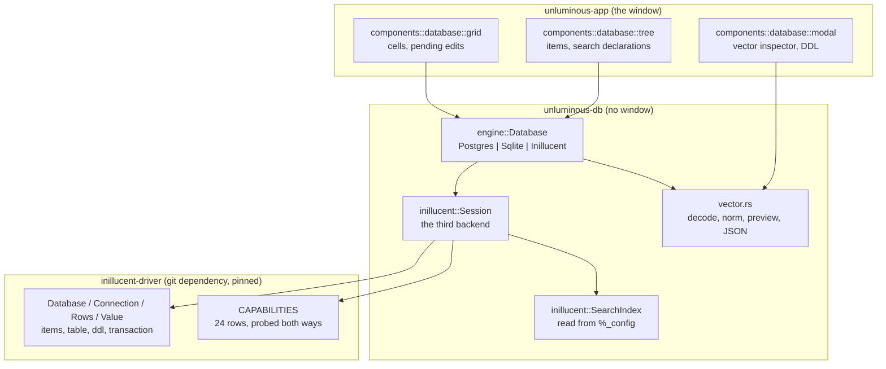
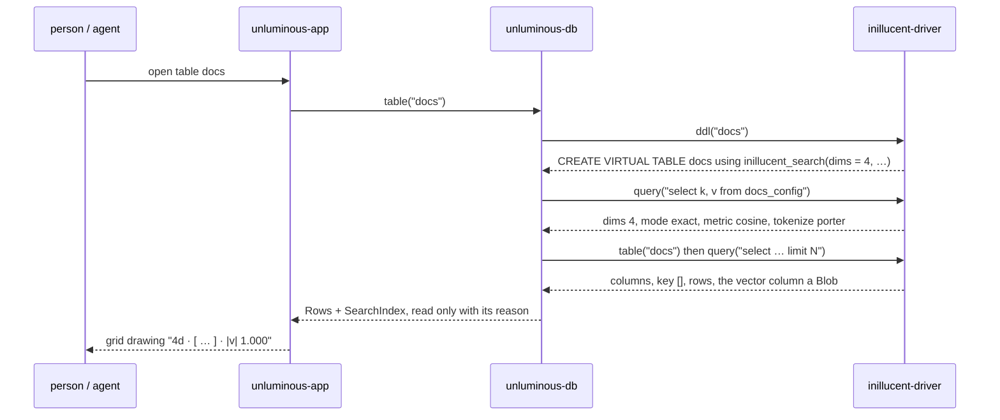

# task-1814 — Inillucent as a data source in the Database plugin, and a way to see a vector

## Introduction

`task-1777` gave Unluminous a database explorer with two engines behind one value: PostgreSQL, spoken by
hand over the v3 wire protocol, and SQLite, spoken through `rusqlite`. This ticket adds the third:
**Inillucent**, the first-party engine in `C:\jason\dev\inillucent` — which is both a SQL database and a
retrieval engine, and whose whole point is that it stores **vectors**.

The ticket is two sentences and both are load bearing. *"Add support for our Inillucent db in our ide db
explorer plugin"* is a third `Engine`. *"Ensure we have ways to see our vectors"* is the part that is not
a driver: an embedding is a blob of 3,072 bytes, and a grid that draws `<binary, 3072 bytes>` has
technically displayed it and shown nobody anything. So this ticket also adds a vector reading — in the
cell, in the tree, and in an inspector — and it is the half a person will actually notice.

Every engine claim below was **run** against `inillucent-driver` at `4b9efb1` on this machine. Where a
message or a number appears, it is the one that came back.

## Goals and Non-Goals

**Goals**

1. `Engine::Inillucent` — a data source spoken through `inillucent-driver`, with the surface the other
   two have: connect, introspect, DDL, a query console, a row editor, one transaction per save.
2. **The engine's capability table reaches the window.** What this build cannot do is drawn, not
   discovered: no Stop button, because `cancel` reports `no`.
3. **A search table is a first-class object** — `CREATE VIRTUAL TABLE … USING inillucent_search(…)` shows
   in the tree as its own kind, carrying what it declared: dimensions, exact or approximate, the
   distance, the tokenizer.
4. **A vector is readable by a person**: a summary in the cell, a full inspector behind it, and a
   `plugins run database vector` for an agent.
5. Every one of the above is reachable from `unluminous-cli`, documented, and tested.

**Non-Goals**

- Reaching past the driver. `inillucent-driver` depends on `inillucent-engine` and nothing else, and
  that one edge is the point: the rearchitecture is still moving crates underneath it. Unluminous binds to
  the driver and to nothing else in that workspace.
- Embedding anything. Unluminous never fetches and never runs a model; a vector arrives because a row holds
  one. Searching by *text* through a search table's own `MATCH` is in, because the engine does it.
- Opening a SQLite file as an Inillucent source. The driver refuses one by design; §5 is what Unluminous
  says instead of letting the refusal be a puzzle.
- Changing anything in the `inillucent` repository. Defects found here are filed as high-priority
  tickets. `task-1846` is live in a worktree of that repo and is not touched.

## Problem statement

**Unluminous cannot open an Inillucent database at all, and the way it fails is worse than an absence.**

A `.rdb` added as a SQLite source gets SQLite's own `file is not a database`, which is true and useless:
it names neither what the file is nor what would read it. And a database in the *old* engine's
SQLite-format — which is what everything written before `task-1834` is — opens as SQLite and then lies.
Measured, with `rusqlite`, which is the engine Unluminous already ships:

```
rusqlite sees:               [docs, docs_config, docs_content, docs_delta, docs_gen, docs_state,
                              member, member_name, members]
rusqlite select from docs:   Error: no such module: inillucent_search
```

The tree fills in, the shadow tables are all there, `select count(*) from docs_content` even answers —
and the one table the database exists for cannot be read, with a message naming a module nothing in
Unluminous has heard of.

And the vectors are invisible twice over. `docs_content.v` is a blob, `docs.vector` is a blob, and 768
little-endian floats drawn as `<binary, 3072 bytes>` tell you the row has *something*, which you knew.

## Architectural Overview



`engine::Database` gains one variant and nothing above it changes: `components::database::tree` draws
`catalog::Item`s and the grid draws `Rows`, and neither has heard of an `inillucent_driver::Value`.

## Detailed technical sections

### 1. The dependency

```toml
inillucent-driver = { git = "https://github.com/jasonmcaffee/inillucent.git", rev = "4b9efb1…" }
```

**A `git` dependency rather than a path**, because Unluminous ships: `tools/release.ps1` builds an
installer that goes on a desktop, and a release whose contents depend on the state of a folder on one
machine is not a release. A pinned `rev` is reproducible, lives in `~/.cargo/git`, builds on a machine
with no `inillucent` checkout, and is unaffected by the worktree `task-1846` is using right now.

**And the driver rather than the engine**, which is the driver's own argument and is now Unluminous's:
`inillucent-driver` binds to `inillucent-engine` and nothing else, so the remaining deletions in that
rearchitecture move crates underneath the driver rather than underneath this window.

**The cost, counted rather than guessed.** The engine crates carry **no** third-party dependencies at
all. What arrives comes through the search engine's scoring: `anyhow`, `thiserror`, `serde`,
`serde_json` (already here), `rayon`, `rust-stemmers`, `bytemuck`, `rand`. Seven new.
`ort`/`tokenizers` sit behind an `onnx` feature that is **off** and stays off — Unluminous embeds nothing.
`rayon` is a data-parallel `for` with no executor, no tasks and no reactor, so the workspace rule about
not adding a second concurrency model holds.

### 2. `unluminous-db::inillucent` — the session

The driver is shaped so closely to what this crate already wants that the session is mostly a
translation of names:

| what `engine.rs` asks | what the driver answers |
|---|---|
| `connect` | `Database::open_with(path, OpenOptions { create: false, read_only, .. })` |
| `schemas` | `Connection::schemas()` |
| `items` | `Connection::items() -> Vec<Item>` |
| `table` | `Connection::table(name) -> Table` — columns, `not_null`, `key`, `without_rowid` |
| `ddl` | `Connection::ddl(name)` — the `CREATE` text the file stores |
| `query` / `run` | `Connection::query(sql, params, limit) -> Rows` |
| `write` | `Connection::transaction(work, check)` — **the check runs before the commit**, which is the signature `engine.rs::write` already wanted |
| `stopper` | nothing: `cancel` is `no`, so §4 |

Three conversions, each three lines:

- **A value.** The driver's `Null | Integer | Real | Text | Blob` becomes this crate's
  `Null | Text | Bytes`, numbers rendered as text — which is `value.rs`'s standing rule, and exactly
  what `sqlite/mod.rs` already does with a `ValueRef`.
- **An error.** `Error { status, message, feature, offset }` becomes `Failure { message, code, detail,
  position }`, `code` being the status's own name so `UNSUPPORTED` is visible in the console, and
  `detail` carrying the `feature` when there is one.
- **An item.** The driver's `Kind::{Table, View, Index, Trigger}` becomes this crate's `Kind`, with the
  two additions §3 describes.

**A file that is not there is refused, and by the driver**: `create: false` gives
`there is no database at …`. `task-1777` paid for this once already, when `rusqlite`'s default flags
quietly made an empty database out of a mistyped path.

### 3. Search tables, shadow tables, and the two new kinds

A search table is `sqlite_schema`'s `type = 'table'`, so the driver reports `Kind::Table` and nothing
downstream would know. It is read from the DDL the file itself stores — `USING inillucent_search` — so
there is no second list of what a search table is:

- **`Kind::Search`** — drawn with its declaration read from its own `%_config`:
  `768d · exact · cosine · porter`. Its rows are readable and **not editable**: measured,
  `table("docs")` answers `key []`, which is `Table::can_be_changed`'s existing answer for "no key".
- **`Kind::Shadow`** — `docs_config`, `docs_content`, `docs_delta`, `docs_gen`, `docs_state`. They are
  **listed rather than hidden**, because they are where the vectors live and hiding them would hide the
  thing this ticket exists to show; and they are attributed to their owner, so nobody edits
  `docs_delta` by hand thinking it is a table of their own.

### 4. The capability table is drawn, not discovered

The driver ships 24 rows, each probed against the running engine in both directions. Two reach the
window and the rest are a page:

- **`cancel` is `no`, so there is no Stop button on an Inillucent source.** Not dimmed — absent, which is
  Unluminous's own rule for a control that can never apply, the same rule that leaves the `F` button off a
  `.rs` file. The driver's note says why in a sentence worth keeping: *"a cancel that set one would
  return success and do nothing. Do not draw a Stop button."*
- **`readonly_open` is `partial`**, and the source says so. On SQLite the guarantee is
  `SQLITE_OPEN_READONLY` and on PostgreSQL it is a read-only transaction; here it is **the driver's
  classification above the engine**, so the file is still open for writing. Unluminous states that rather
  than implying the stronger thing.

Everything else — the 22 `yes` rows — is shown on the source's own page, so *"can this build do a
recursive CTE"* is answered by looking rather than by trying. It is read from `CAPABILITIES` at run time
rather than copied into Unluminous, so it cannot go stale.

### 5. What Unluminous says instead of letting a refusal be a puzzle

Three refusals that route, which is the shape `debug adapters` already has:

- A **SQLite file** added as an Inillucent source: the driver answers that neither meta page is
  readable. Unluminous says *"that is a SQLite database, and Inillucent does not read one. Add it as a
  SQLite data source, or import it with `plugins run database import`"* — `Database::import_sqlite`
  builds a `.rdb` beside the original and never writes to it.
- A **`.rdb`** added as a SQLite source: SQLite's `file is not a database` is replaced by
  *"this is an Inillucent database; add it as an Inillucent data source."* The first eight bytes are
  `RDB2\0\0\0\0`, which is a cheap and certain answer.
- A **SQLite-format Inillucent database** — anything the old engine wrote — whose statement fails with
  `no such module: inillucent_search`: the failure names the module's own engine and the import.

And a statement the engine has not built yet keeps its own words. Measured:

```
VACUUM              -> status Unsupported, feature "VACUUM"
select * from nope  -> status NotFound,   "no such table: nope"
```

`unluminous-git`'s rule is that nothing invents an error message; `Unsupported` is carried through as its
own code so the console can say *"this engine cannot do that yet"* rather than *"check your spelling"*,
which is the distinction the driver was built to make.

### 6. Vectors — three readings of the same bytes

`inillucent-search` stores a vector as **little-endian `f32`, four bytes each**, and hands it back from
`docs.vector` and from `docs_content.v`. `unluminous-db::vector` is the whole of the reading, pure and
tested with no window:

```rust
pub struct Vector { pub values: Vec<f32> }
impl Vector {
    pub fn decode(bytes: &[u8]) -> Option<Vector>;   // len % 4 == 0, len >= 8, every value finite
    pub fn norm(&self) -> f32;
    pub fn summary(&self) -> String;                 // "768d · [0.0231, -0.0114, 0.0518, …] · |v| 1.000"
    pub fn as_json(&self) -> String;                 // what Copy puts on the clipboard
}
```

| surface | what it shows |
|---|---|
| the grid cell | `4d · [0.5000, -0.5000, 0.5000, 0.5000] · \|v\| 1.000` in place of `16 bytes: 00 00 00 3f…` |
| the tree | under a search table: `4d · exact · cosine · porter`, from its own `%_config` |
| the inspector | dimensions, norm, min, max, mean, every component as a bar, and the numbers |
| `unluminous-cli` | `plugins run database vector --row N --column vector` → the same figures as data |

**A blob is not guessed into a vector.** A PNG is also a run of bytes whose length divides by four. The
rule: a column of a table Unluminous knows is a search index — because it read `%_config` — is drawn as a
vector, and **any other blob offers "read as a vector" in the inspector**, which decodes on request and
says what the dimensions would be. The person asks; the grid does not assume.

**Searching is the engine's own `MATCH`.** Measured: `select title, rank from docs where docs match
'release' order by rank limit 3` returns `["release process", -0.75]`. So a search table's context menu
offers `Search…`, which composes exactly that into a console page where it can be read and edited.
Nothing is embedded and no vector is invented; a query *by vector* is available to anyone holding one,
through ordinary parameter binding.

### 7. Agent reach

`plugins run database` gains `vector`, `search`, `capabilities` and `import`; `sources`/`add-source`
accept `inillucent`; `plugins view database` reports a search table's declaration. The catalogue rows,
`app/cli.rs` arms and `unluminous-cli/docs/commands.md` sections come with them, because
`documentation.rs` is a test and will fail otherwise. The manifest's `plugin.limitations` stops saying
"two engines and nothing else".

## Data flows and security



**Security.** An Inillucent source is a **file**: no password, no host, no certificate, so the one door
a secret could reach a settings file through is not open here at all. Nothing is fetched — the engine is
compiled in, `onnx` is off, no address is contacted. The one new risk is a **hostile file**: it is parsed
by `inillucent-pool` beneath the driver, which is `#![forbid(unsafe_code)]` and bounds-checks every page
against its own header, and every failure path here becomes a `Failure` carrying the driver's words
rather than a panic. A corrupt file must refuse, never take the window down, and that is a test.

## Alternatives considered

| | pro | con | verdict |
|---|---|---|---|
| **Open `.rdb` with `rusqlite`** | no dependency | the formats are unrelated; it cannot read one byte | impossible |
| **Depend on `inillucent-engine` directly** | one crate fewer | reaches past the seam built for exactly this consumer, and the rearchitecture's remaining deletions move those crates | rejected |
| **Go through the C ABI** (`inillucent-driver-capi`) | one path for every language | a pointer round trip and a `catch_unwind` per call, to reach Rust from Rust — the driver's README says not to | rejected |
| **Support the old engine's SQLite-format files too** | opens databases written before `task-1834` | that is a second backend on a crate being deleted; `import_sqlite` is the route the engine itself offers | rejected, §5 |
| **Path dependency** | a local change appears at once | not reproducible, and `task-1846` is live in that repo | rejected, §1 |
| **A trait object instead of a third enum variant** | open to a fourth engine | `engine.rs` says why it is an enum: a third is a variant the compiler names every place that must answer for it | rejected |
| **Guess that any 4-aligned blob is a vector** | no configuration | a PNG is 4-aligned; the grid would lie | rejected, §6 |
| **Copy the capability table into Unluminous** | no run-time cost | it would go stale, which is the exact failure the driver's two-way probe exists to prevent | rejected, §4 |

## Testing strategy

**1. Against a real database, with no window** — `crates/unluminous-db/src/inillucent/` tests and
`cargo run -p unluminous-db --example inillucent`. The fixture is built by the engine itself: a keyed
table, a view, an index, and a four-dimension search table holding vectors.

- the tree reads table, view, index, **search** and **shadow** kinds, and the shadow tables are attributed;
- `table()` gives the key, and a search table's empty key makes the grid read-only with its reason;
- a vector round-trips — the bytes written are the bytes read, and `Vector::decode` gives the floats back;
- a value with a quote, a newline and a backslash round-trips, because nothing is quoted by hand;
- `NULL` and the empty string stay different;
- a save is one transaction, and a statement that changes anything but one row rolls the whole thing back;
- a read-only source refuses a write;
- `where docs match 'release' order by rank` returns the ranked rows;
- a missing file is refused rather than created.

**2. The refusals that route**: a `.rdb` added as SQLite, a SQLite file added as Inillucent, and a
`no such module` failure each assert on the sentence Unluminous adds.

**3. The gaps stay the engine's words**: `VACUUM` comes back `Unsupported` with its feature, and the test
asserts Unluminous passed it through rather than replacing it. If a later phase closes the gap, the test
says so by failing.

**4. The capability table is read, not copied**: `cancel` being `no` means no Stop control exists in the
widget tree for an Inillucent source.

**5. A corrupt file refuses rather than panics**: bytes flipped over a handful of positions.

**6. Through the widget tree** (`crates/unluminous-app/tests/screenshots.rs`): a source added, its search
table opened, the accepted picture showing the declaration in the tree and the vector summary in the
cell. Looked at, not merely accepted.

**7. The real window**, driven by `unluminous-cli` against the released build: add the source, connect,
list, open the search table, read a vector, run a search — the ticket's own words, *"verify all
functionality works as expected"*.

## What gets filed rather than fixed

Every defect this work finds in the engine or the driver becomes a **new high-priority ticket** naming
the file and the reproduction; nothing in the `inillucent` tree is edited from here, and the `task-1846`
worktree is not touched.
