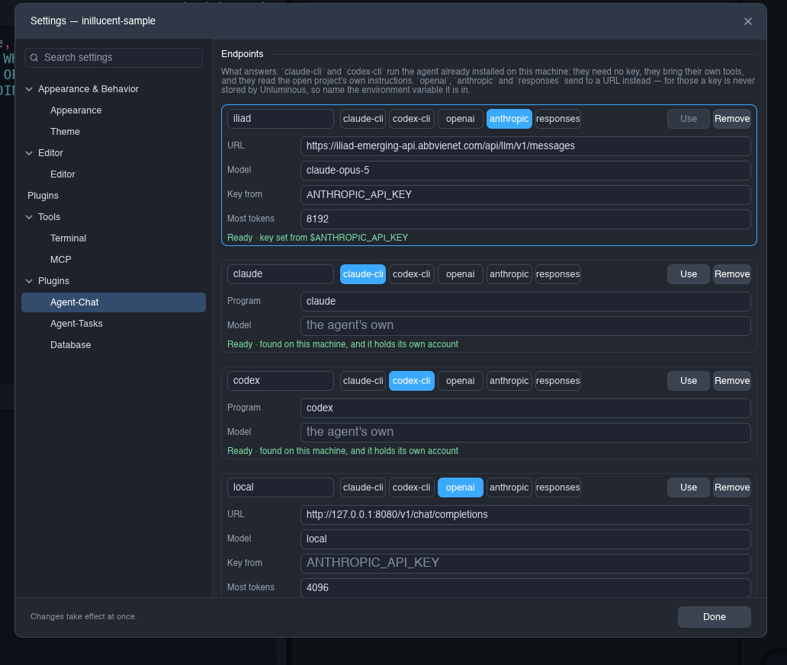
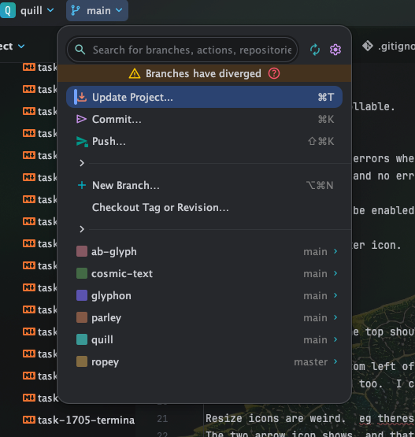

# task-1848 — the reported issues: what each one is, and what changes

`tasks/unluminous-issues.md` reports eleven things across the Agent-Chat plugin, the window's own
furniture, the Markdown preview and git. This document is the specification for all of them, written
before the code because six of them are faults whose cause has to be named rather than gaps to fill —
and two of those are not what the report thinks they are.

Every section says the same four things: what was reported, what is actually happening, what changes,
and what proves it. `CLAUDE.md`'s rule applies to each: a control a person uses, the same code reached
by an agent, and tests over both.

## 0. What was measured first

The report is read against 0.38.6, installed and running. Four of the eleven were reproduced by driving
the real window through `unluminous-cli`, and the measurements are quoted in the sections that follow
rather than summarised here. Two of the eleven turned out to be **correct behaviour reported as a
fault**, and saying so is part of the work: §2 and §5.

`cargo test --workspace` passes before any of this — 977 app tests and nineteen other crates — so a
failure afterwards belongs to this change. The 148 screenshot images that already differ on this machine
are a separate matter recorded in §12.

---

## 1. A message sent from the pane does nothing, and no error is shown

> I'm also not seeing any errors when I try to chat with my agent. Nothing happens. The send button
> turns into a stop button, then back. My message isn't shown, and no error. Figure out the error, fix
> it, and also ensure errors are displayed as a well designed toast message that can be dismissed.

### 1.1 What is actually happening

**The client works.** Driven from the command line against the same endpoint the pane is pointed at,
the whole turn succeeds:

```
plugins run agent-chat send Say the single word ACKNOWLEDGED and nothing else.
plugins run agent-chat messages
  -> user: "Say the single word ACKNOWLEDGED and nothing else."
  -> assistant: "ACKNOWLEDGED"   finish: end_turn   usage: 22846 in, 13 out
```

So `AgentChat::send`, the request builder, the transport and the decoder are all sound, and both
messages are in the conversation the pane holds. Whatever the pane is failing at is between the button
and that function, or between that function's error and the person's eyes.

There is one `send`, called from both paths, and it returns `Result<u64, String>`. Six things in it
return `Err` before anything reaches the wire — nothing to send, no endpoint configured, and four
`why_not` refusals about a missing program or a missing key. `components::agent_chat::apply` does this
with the answer:

```rust
Act::Send => {
    if let Err(problem) = chat.send() {
        requests.push(Request::Message(problem));
    }
}
```

`Request::Message` is **the status bar**, whose own documentation says it is "where every honest miss in
Unluminous is reported". For a refusal about a file that could not be opened that is right. For the one
control on a pane somebody is looking at, it is a sentence at the far bottom edge of a window, in the
smallest text on the screen, replaced by whatever is reported next — which is why the report says there
is no error at all. The send button flicking to Stop and back is the turn starting and failing inside
one frame, which is exactly what a `why_not` refusal does.

### 1.2 What changes

**A toast, owned by the window rather than by the plugin.** `components::toast` is new: a stack of
dismissible notices drawn over the bottom right of the window, above every pane and below a modal. Three
reasons it belongs to the window and not to Agent-Chat:

- Every plugin reports through `Request::Message` and every one of them has the same problem. A toast in
  one plugin would be a second answer to a question the window already owns, which is the rule
  `components::modal` and `components::controls` are both built on.
- A notice has to outlive the pane. A refusal about a chat send is worth reading after the pane has been
  put away, and a plugin cannot draw anything once it is not showing.
- It is drawn after the pane loop, from the window's own state, which is where
  `components::completion` and the value tooltip already are and for the same reason: egui gives a
  pointer to the last widget that asked for it.

`Request::Message` keeps its meaning and gains a sibling. `Request::Notice { text, kind }` is what a
provider sends when somebody has to see it, where `kind` is `Problem` or `Done`; `Request::Message`
stays for the running commentary a status bar is for. The distinction is the one IntelliJ draws between
its status bar and its balloons, and it is what stops every routine message becoming a toast nobody
reads.

**What a toast is.** One rounded card a notice, 320 points wide, the palette's `FIELD` ground with a
`Problem` one carrying a red left edge and a `Done` one a green edge — no new colours: `DANGER` and
`SUCCESS` are already in `theme::color`. A cross dismisses it, `Escape` dismisses the newest, and a
`Done` notice fades after `TOAST_LIFE` while a `Problem` one **stays until it is dismissed**, because a
failure nobody read is the thing this whole section is about. At most `TOAST_LIMIT` are drawn and the
oldest goes first, so a loop that fails every round cannot fill the window.

**`Act::Send`'s failure becomes a notice**, and so does every other `Err` the chat pane produces.
`plugins run agent-chat send` is unchanged: it already returns the failure as a failed reply, which is
the command line's own way of showing one.

### 1.3 What proves it

- `a_refused_send_is_shown_as_a_notice_rather_than_only_in_the_status_bar` — drives the pane with no
  endpoint configured and asserts a `Notice` came back and the status bar was not the only route.
- `a_problem_notice_stays_until_it_is_dismissed_and_a_done_one_does_not` — pure, over `Toasts`, with no
  window.
- `the_oldest_notice_goes_when_there_are_more_than_the_limit`.
- `dismissing_the_newest_notice_is_escape` — through the harness, because it is a key press.
- A screenshot, `chat_notice`, of a pane with a refusal showing.

---

## 2. The Agent-Chat settings are not scrollable

> The settings aren't scrollable. 

The picture shows the Endpoints list cut off mid-row at the bottom of the page with four endpoints
configured and no way to reach the fifth.

**This is a real fault and it is one line, but the line is not where it looks.** `settings_page.rs` for
Agent-Tasks already wraps its rows in an `egui::ScrollArea` — `task-28` §8 added it for exactly this
report — and the Agent-Chat page does not. So the answer is the same wrapper, and the same two things
that made it work there rather than only appear to:

- The rectangle the rows are laid out from must come from the `Ui` **inside** the scrolling area, not
  from the caller. Every row is painted at an absolute position measured from it, so a page that reads
  the outer rectangle scrolls its bar and leaves its contents where they were. That is the fault
  `task-28` §8 records by name.
- The page has to say how tall it really drew, with `allocate_space`, or the bar describes whichever
  widget happened to allocate the lowest rectangle rather than the page.

**And the Settings window's own size is not changed.** It is one size for every page and the tallest
page is what it has to hold, which `CLAUDE.md` states and which is why a page that scrolls is the right
answer here rather than a taller window.

### What proves it

- `the_agent_chat_settings_page_scrolls_to_its_last_row` — through the harness, with five endpoints
  configured, asserting the last row's control is reachable after a scroll.
- A screenshot, `agent_chat_settings_scrolled`.

---

## 3. Unluminous tools should be enabled by default

> Unluminous tools should be enabled by default.

`chat.tools` is off unless somebody says so, and `tasks/task-1767-agent-chat-tdd.md` gives the reason:
the other end of a URL is a server, and Unluminous's catalogue includes commands that run a program.

**The default changes and the reasoning is narrowed rather than abandoned.** What made `off` right was
the *address* case — a hosted endpoint, somebody else's server, a key. What ships as the chosen provider
on this machine is `claude` and `codex`, which run a program the person already trusts, hold their own
credentials, and are offered **no** Unluminous tools at all. So the switch was defending against a case
that is not the common one.

`chat.tools` therefore defaults to **on**, and `chat.shell` — the second switch, over the commands that
run a program of the model's choosing — **stays off**. That is the line worth keeping: reading the
project, opening a tab, running a query are things a chat pane in an editor should be able to do; running
an arbitrary command line is not, and it is one setting away for somebody who wants it.

A configuration written by an earlier version has no `tools` line, so it takes the new default. That is
the intent: `task-1767`'s own rule is that a key present and empty is not the same as absent, and here
absent means "never chosen", which is what a default is for.

### What proves it

- `tools_are_offered_unless_somebody_turned_them_off` — over `Configuration::read`, with a file that has
  no line, a file that says `off`, and a file that says `on`.
- `the_shell_switch_is_still_off_by_default`, which is the half that must not move.

---

## 4. The file picker icon goes; drag and drop and paste stay

> Get rid of the file picker icon. Just allow drag and drop or paste.

The composer draws a button that opens a native file dialog. Dropping a file on the pane and pasting a
picture both already work and are documented.

**It goes, and the two that remain are made discoverable instead**, because a control that is removed
without saying what replaced it is a feature nobody finds: the composer's placeholder says
`drop or paste a picture` when there is nothing attached. That is one string and no new mechanism.

`plugins run agent-chat attach <path>` is untouched — an agent has no pointer to drag with, so the
command line is its route and removing it would break the parity rule.

### What proves it

- `the_composer_has_no_file_dialog_button` — asserts no control by that name is drawn.
- `a_dropped_file_and_a_pasted_picture_still_attach`, which is the existing coverage kept.
- `attach_from_the_command_line_is_unchanged`.

---

## 5. The Database rail button "doesn't seem to do anything"

> Database tab at the bottom left of the left side menu items doesn't seem to do anything. We have a db
> tab that does work to show/hide.

The Database plugin contributes **both** a pane and a tab, and since the rail gained buttons for
contributed tabs there are two Database buttons in it: one for the pane, one for the tab. The report is
about the two of them being indistinguishable, and it is right — they are both drawn with
`icon::database` and `icon::table`, and neither says which is which.

Two separate things are wrong and only one of them is the button:

- **The tab button is named for the plugin, not for what it opens.** `<label> tab` was chosen when the
  button was added, which makes `Database tab` and `Database` — a distinction nobody can act on. It
  becomes the *tab's own label*, so the manifest decides: `tab.label = Query Console` for the database
  workspace, which is what it actually is.
- **§6 makes it moot for this plugin**, because the query console stops being a separate tab.

### What changes

The rail's tab buttons take their name from `tab.label` with no suffix, and the two manifests that
contribute a tab are given labels that say what the tab is rather than repeating the plugin's name.

### What proves it

- `a_contributed_tabs_rail_button_is_named_for_the_tab_rather_than_the_plugin`.
- `no_two_controls_in_the_rail_share_a_name` — a new test over the whole rail, which is the rule
  `design/style-guide.md` states and which this broke.

---

## 6. The Agent-Tasks button cannot untoggle, and two panes move

> Agent tasks tab is weird too. I can't untoggle it to hide it. It should always open/close.
> Agent tasks should be its own pane, rather than a tab.
> Database query view should be part of the database pane, rather than a separate tab.

### 6.1 The button that only opens

`open_the_plugin_tab` shows the tab when it is already open and opens it when it is not. There is no path
that closes one, so a rail button for a tab is a button that can only ever be pressed once —
measured, and it is the report exactly.

**A rail button toggles, whatever it opens.** `Action::PluginTab` becomes "show this tab, or close it if
it is the one showing", which is what every other button in the rail does and what the report asks for
in the words "it should always open/close". A tab that is open but not showing is *shown* rather than
closed, because pressing the button for something you cannot see means "bring it here".

### 6.2 The two that change shape

These two asks are the same ask twice, and both are a manifest change rather than code:

- **Agent-Tasks becomes a pane.** It was a pane until `task-28` took it away, on the grounds that a board
  in a 420 point column shows one lane at a time. That reasoning holds for a *narrow* pane and not for
  the ask: `task-1697`'s docking means a pane can be dragged to the bottom or given half the window, and
  `pane.width` decides what it starts at. So `pane.*` comes back with a width of 900, the tab goes, and
  the board is a pane that can be moved and put away like everything else. The machinery for this is
  entirely in place — `task-28` left it there deliberately — so this is `plugin.conf` and the provider's
  `pane` method, which already draws the board.
- **The database query console joins its pane.** Same change: the workspace stops being a tab and is
  drawn in the pane under the tree, which is where the report wants it.

**What this costs, said plainly.** A pane is narrower than the editing area, and a query result with
twelve columns will need scrolling sideways where a tab did not. That is the trade the report is asking
for and it is reversible — a pane dragged to the bottom edge is as wide as the window.

### What proves it

- `a_rail_button_for_a_tab_closes_it_when_it_is_the_one_showing`.
- `a_rail_button_shows_a_tab_that_is_open_behind_another`.
- `the_board_contributes_a_pane_and_no_tab` — the inverse of the test `task-28` added, which is deleted
  rather than left asserting the old shape.
- Screenshots of both panes: `agent_tasks_pane`, `database_pane_with_console`.

---

## 7. The one-arrow resize cursors go

> Resize icons are weird. eg theres one on the left edge that points left with a bar, that doesn't do
> anything when I drag and click once its shown. The two arrow icon shows, and that allows me to resize.
> Get rid of the one arrow with bar options on the edges.

Two different controls, and the report has identified which is which precisely.

`components::splitter` — the divider between panes — uses `ResizeHorizontal` and `ResizeVertical`, the
double-headed arrows, and it works. `components::resize_edges` — the window's own eight grips — uses
`ResizeWest`, `ResizeEast`, `ResizeNorth` and the four corners, which macOS draws as an arrow against a
bar. Those are the ones that show and do nothing.

**Why they do nothing is worth naming, because it decides the fix.** A window edge grip sends
`ViewportCommand::BeginResize`, which hands the drag to the window manager. `resize_edges.rs` already
records that on Windows a refused resize latches a flag inside winit and wedges the window — which is why
the grips are absent while maximised. On macOS the operating system draws its own resize region at the
window's edge, and an undecorated window still gets it; so Unluminous's own grips are a second answer to
a question the platform has already answered, and the cursor they set is what the report sees.

**The grips stay on Windows and go on macOS**, and the cursor is the reason rather than the mechanism:
- On macOS the window is resized by dragging its edge, by the platform, and Unluminous draws nothing.
- On Windows there is no such region on an undecorated window, so the grips are what makes the window
  resizable at all and they stay exactly as they are.

That is `CLAUDE.md`'s absent-control rule applied to a control whose job the platform is already doing.

### What proves it

- `the_window_draws_no_resize_grips_on_macos` and `the_window_draws_its_own_grips_on_windows` — one
  test, two `cfg`s, so neither platform's answer can be changed without the other being considered.
- The existing `typing_a_space_after_a_tab_or_an_arrow_key_cannot_close_or_minimise_the_window` must
  still pass, because the grips are part of what it walks.

---

## 8. The plugins each take a top-level menu

> Plugins menu items at the top should be moved to a Plugins menu item, which lists each plugin, and has
> sub menus for their options.

`actions::menus` appends one `Menu` per plugin that contributes one, so three plugins put `Agent-Chat`,
`Agent-Tasks` and `Database` in the bar beside Unluminous's own six. A fourth plugin makes it ten menus.

**One `Plugins` menu, with a submenu a plugin.** The entries a plugin's manifest names become that
plugin's submenu, in the order the manifest lists them, and the plugins are in the order they load.

Two things this must not break, both of which are already tests:

- **`action list` is built by walking the real menus**, so every plugin command stays reachable from the
  command line with no change — the names gain a level, and `app/action_names.rs` fails if any entry has
  no name.
- **A submenu is drawn inline**, which `task-1686` records as the reason the Edit menu grew taller than
  the window. Three plugins with five entries each is fifteen rows plus three headings, which fits; a
  plugin with twenty entries would not, and the honest answer is that this is a menu of menus and the
  depth is what keeps it short.

### What proves it

- `every_plugins_menu_is_a_submenu_of_one_plugins_menu`.
- `the_menu_bar_has_the_same_number_of_menus_however_many_plugins_load`.
- `every_plugin_command_is_still_reachable_from_action_list` — the existing guarantee, asserted over the
  new shape.

---

## 9. Command-clicking a Markdown link opens it

> Links in markdown should allow me to CMD/Ctrl+Click to open them in a new browser window.

The preview draws a link's text and nothing knows it is a link. `quill_core::markdown` already parses
one — it has to, to draw the text — so what is missing is that the *range* is not reported and the click
is not read.

**`Preview` gains a fourth structure**, beside `panels`, `code_spans` and `source_lines`: `links`, a byte
range and its target. That is the shape the other three already have, and it is what lets the window read
a click without knowing anything about Markdown.

**The modifier is Go to Definition's**, which is the rule `task-1696` set: `Ctrl/Cmd` held means "take me
to the thing this names". A plain click keeps its meaning, which in the preview is placing a selection.

**Where it opens.** Unluminous has a browser — `services::browser`, WebView2 and WKWebView through Wry —
so a link opens in a browser tab in this window. An `http` or `https` link only: a `file://` or a
`javascript:` link is refused with a sentence, because a document must not be able to reach the machine
through a click, which is the rule `preview_images` already keeps about fetching.

### What proves it

- `a_link_in_a_preview_reports_its_range_and_its_target` — pure, in `unluminous-core`.
- `command_clicking_a_link_opens_a_browser_tab` — through the harness.
- `a_plain_click_on_a_link_only_moves_the_selection`.
- `a_javascript_link_is_refused_rather_than_opened`.

---

## 10. A branch selector in the title bar

> Add a branch selector/indicator at the top bar, similar to Intellij's 

The status bar already shows the branch and how many files have changed. The picture is IntelliJ's branch
popup: the current branch as a button at the top, and a list to switch, create and check out from.

**What is built is the indicator and the switch, and not the rest of that picture.** `components::branch_widget`
is a button in the title bar showing `icon::branch` and the branch name, whose popup lists the local
branches with the current one marked, and a `New Branch…` row. Every row goes through
`unluminous_git::Worker`, which is the one path a git operation takes, so a switch from here and a switch
from the Git menu are the same code.

**What is deliberately not in it**, each with its reason:
- **The remote branches and the other repositories** in that picture are IntelliJ's multi-repository
  project model, which Unluminous does not have: one window is one project.
- **`Update Project`, `Commit` and `Push`** are already on the Git menu with their own chords, and a
  second place to press them would be a second thing to keep in step.
- **The search field** is for a list of hundreds; the popup filters when there are more than
  `BRANCHES_BEFORE_A_FILTER` and draws no field below that.
- **"Branches have diverged"** needs an ahead-and-behind count against the upstream, which is a fetch —
  and Unluminous does not fetch without being asked. The popup says what the last status knew.

**Where it goes.** The title bar's right hand end already holds the run widget and the text tools, and
`task-1693` records the ordering rule: the widget that does not change width is measured from the edge
first. The branch name changes width, so it goes to the **left** of both, next to the project name, which
is also where the picture has it.

**It is absent outside a repository**, which is the same rule that hides the whole Git menu there.

### What proves it

- `the_branch_widget_names_the_branch_the_repository_is_on`.
- `the_branch_widget_is_absent_outside_a_repository`.
- `choosing_a_branch_asks_the_worker_to_check_it_out` — against a real repository built in a temporary
  folder, which is how every `unluminous-git` test works.
- `the_popup_filters_when_there_are_more_branches_than_it_can_show`.
- A screenshot, `branch_widget_popup`.

---

## 11. The order this is built in

The two that unblock everything else come first, then the shape changes, then the additions:

1. **§1 the toast**, because it is the mechanism every other section's failures are reported through.
2. **§2 the settings scroll**, one wrapper, and it makes the endpoint rows reachable for testing §3.
3. **§3 the tools default** and **§4 the picker**, both small and both in Agent-Chat.
4. **§6.1 the rail toggle** and **§5 the naming**, which are the same file.
5. **§6.2 the two panes**, which are manifests plus the tests that pinned the old shape.
6. **§7 the grips**, **§8 the menu**, which touch the window's furniture.
7. **§9 the links** and **§10 the branch widget**, which are the two new features.

## 12. What is deliberately not in this

- **The 148 screenshot images that differ on this machine.** They differ on the unmodified tree, so they
  are not this change's, and accepting them here would bury whatever really moved. They need their own
  pass with somebody looking at the pictures, which is what `UPDATE_SNAPSHOTS=1` is for.
- **The idle-window hang.** It is real, it is recorded in `services::wake`, and it blocked several
  measurements while this was written. It is not in the report and it needs its own ticket rather than a
  guess folded into this one.
- **`window screenshot` on a live window.** It answers "did not paint a frame to capture" although the
  frame trace shows frames being drawn, and the same failure happens on 0.29.2 — so it is not a
  regression and not something this change caused. Most likely a macOS screen-recording permission.
- **The 22,846 input tokens** one short chat message cost. That is `CLAUDE.md` at 231 KB being sent as
  the system prompt, which is worth its own look and is not what the report asks about.
