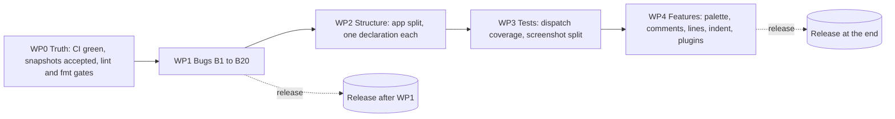
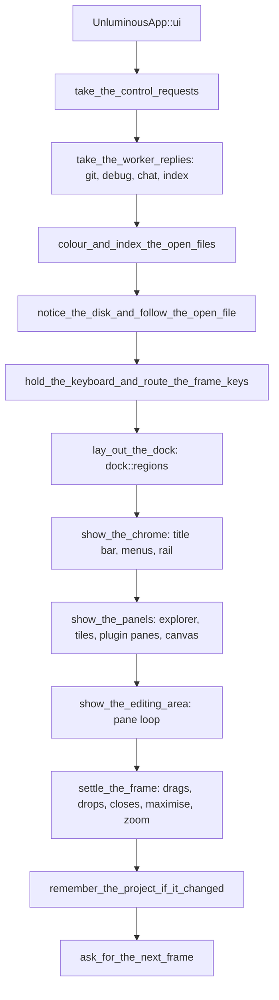
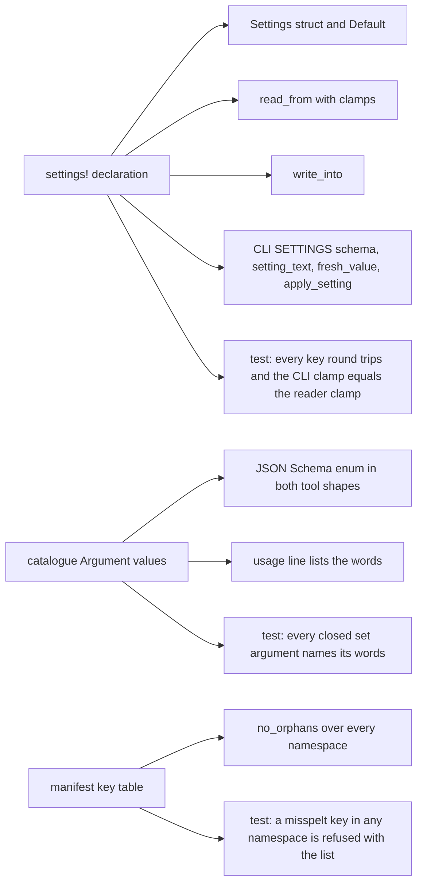
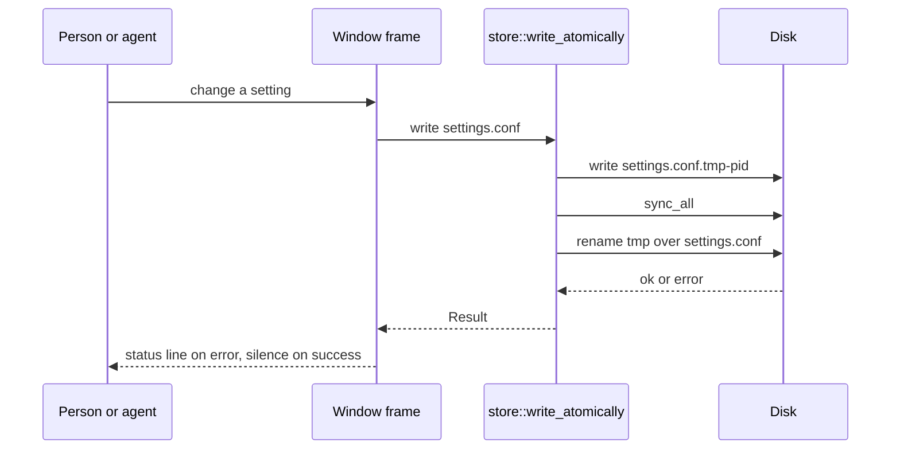

# task-1922: a code review of Unluminous, and the plan that acts on it

## 1. Introduction

`task-1922` asks for a deep review of the Unluminous codebase: architectural improvements, code that
should be cleaned up, better testing, functionality that is missing, and a design for addressing
what is found. This document is that design. The review was done against commit `e858335`
(Unluminous 0.44.1) on 2026-09-13, over every crate in the workspace, and the evidence for every
claim in it is in `_agent_output/task-1922-code-review/` as nine reports with file and line
references. Every high severity finding below was checked against the source by hand before it
was written down here.

The workspace is about 213,000 lines of Rust across eight crates, with roughly 3,100 tests. It is
in better shape than most codebases of its size: the crate boundaries hold, the protocol crates
refuse malformed input rather than panicking, the palette is single sourced, and the
"documentation is a test" and "the catalogue generates the tools" rules are real and enforced. The
findings are therefore concentrated rather than spread out, and they fall into five groups:

1. **Nothing checks the build.** GitHub Actions has run 56 times on this repository and has never
   passed once. Since 9 September every run has failed before starting a single job. The Windows
   screenshot baseline has been stale since the menu bar changed on 11 September: 202 of 203
   accepted images mismatch on this machine. `cargo clippy --workspace --all-targets` does not
   finish, and `cargo fmt --check` reports 295 files. Neither release script runs a test.
2. **A short list of real bugs**, each small: a chat path that drops signed reasoning blocks, git
   revisions passed without `--`, five thread spawns that panic instead of degrading, every
   persisted file written without a temporary and a rename, a canvas pan that is never saved, a
   hover cache with no path in its key, and a client timeout shorter than the window's own wait.
3. **Two catch all files.** `app/mod.rs` is 11,477 lines with a 1,285 line frame function and a
   124 field struct; `app/cli.rs` is 8,674 lines. Eleven concerns already have their own file in
   `app/`, and the pattern that works there was not applied to the rest.
4. **Declarations kept as several hand written lists.** A setting is written in nine or ten places
   across two files. An action is written in five or six. A plugin manifest namespace is validated
   in four namespaces and not the other four. The catalogue cannot say that an argument is one of
   a closed set of words.
5. **Missing functionality a person notices on day one**: no command palette, no comment toggle,
   no line editing commands, no indentation setting, no `Go to Line`, and no colouring for Python,
   JSON, TOML, YAML or shell.

The plan is ordered so that the first thing built is the ability to know whether anything else
worked.

## 2. Goals and non goals

### Goals

| # | Goal | How it is measured |
|---|---|---|
| G1 | CI is green on `main`, on both platforms, and stays green. | The `checks`, `suite` and `screenshots` jobs pass on the release commit; the macOS screenshot job either passes or is marked as not required with the reason written down. |
| G2 | The local screenshot suite is green on this machine with the accepted images looked at. | `cargo test -p unluminous-app --test screenshots` passes with no `.diff.png` left behind. |
| G3 | Every bug listed in §4.2 is fixed with a test that fails on the code as it is. | Each fix names its test in the commit. |
| G4 | `app/mod.rs` is under 4,000 lines, `UnluminousApp::ui` is under 150 lines, and no function in `app/` is over 200 lines. | `wc -l` and the function table in `_agent_output/task-1922-code-review/metrics.md` re-run. |
| G5 | A setting, an action and a manifest key are each declared once. | Adding a setting touches one declaration and one dialog row; a test walks the declaration and checks the CLI schema, the reader and the writer agree. |
| G6 | Every catalogue command has a dispatch test. | A test in `unluminous-cli` or `unluminous-app` fails while a catalogue command has no test that drives `run_cli_for_test` with it. |
| G7 | The editor features in §5.5 exist, each with a menu entry, a CLI command and tests. | `unluminous-cli action list` and `docs/commands.md` show them. |
| G8 | Five more languages colour. | Python, JSON, TOML, YAML and shell plugins ship and a file of each colours in a screenshot test. |

### Non goals

- A language server client, multiple carets, column selection, a light theme, screen reader
  support, remote development, an extensions marketplace, and the rest of §10. Each is a ticket of
  its own and is listed there with a recommendation.
- Rewriting the five protocol crates' worker threads into one shared crate. §7 explains why the
  shared *shape* is adopted and the shared *code* is not.
- Changing any product default. Where this design adds a setting the current behaviour stays the
  default.
- Formatting changes on their own. The one `cargo fmt` pass in §5.1 is a single commit that
  changes nothing else, so the history stays readable.

## 3. Problem statement

### 3.1 The build is not checked anywhere

- `.github/workflows/ci.yml` and `nightly.yml` exist and are well designed. Measured through the
  GitHub API on 2026-09-13: the `ci.yml` workflow has 56 runs and zero successes. Runs up to
  4 September had five jobs, all failing. Every run from 9 September onward has **zero jobs**, which
  is a workflow that fails before it starts. The workflow file was last edited on 7 September
  (`9529cf9`, "Let CI reach the private Inillucent repository"), so that edit is the first suspect;
  a billing hold on Actions is the second.
- `ci.yml` runs `cargo clippy` over seven crates and leaves out `unluminous-app`, and passes no
  `--all-targets`. `unluminous-app` carries 73 library warnings, 107 test warnings and one deny by
  default error: `tests/screenshots.rs:18769` reads `assert!(x || true, ...)`, which asserts
  nothing and stops `cargo clippy --workspace --all-targets` from finishing at all, so the main
  binary and 17 of 18 examples are never linted.
- `cargo fmt --all -- --check` fails on 295 files with 6,745 hunks of real line wrapping, and there
  is no `rust-toolchain.toml`, so the check is against whatever rustfmt is installed that day.
- The Windows snapshot folder holds 202 `.diff.png` and 213 `.new.png` files from a run on
  12 September at 22:56. Looking at one pair shows the cause: the accepted image has three plugin
  menus in the menu bar and the new image has one `Plugins` menu. That change landed in `5a090dd`
  (task-1905, 11 September) and the Windows images were last accepted in `d19f6b0` (10 September).
  Twelve macOS images have no Windows counterpart, and two images (`agent_tasks_pane.png`,
  `agent_tasks_detail.png`) are referenced by no test on either platform.
- Three tests that need a real debugger skip with `eprintln!` and `return` and report a pass.
- `tools/release.ps1` and `tools/release.sh` run no tests. A release is tagged, installed and
  published before CI on the same push has answered.

### 3.2 Bugs

Each of these was confirmed by reading the code. Line numbers are from `e858335`.

| # | Where | What | Effect on a person |
|---|---|---|---|
| B1 | `crates/unluminous-chat/src/wire.rs:1052-1083`, `whole()` | The non streamed path turns a `thinking` block into text only, has no arm for `redacted_thinking`, and turns a Responses `reasoning` item into its summary. Neither produces `Reply::Reasoning`, which the streamed path does at lines 763 and 900. | A provider row with streaming off, against a thinking model, loses the signed block on its first tool turn and the next request is refused by the API. |
| B2 | `crates/unluminous-chat/src/agent.rs:81-107`, `Running` | One `Mutex<Option<Child>>` with no generation tag. `Client::ask` calls `stop()` then spawns the new turn; the old turn's thread, unblocked by the kill, calls `take()` and can reap the new child. | A second question sent while the first is running can silently kill the second. |
| B3 | `crates/unluminous-chat/src/client.rs` | `Client` has no `Drop`. Only `stop()` kills the agent child. | Closing a conversation mid turn leaves `claude` or `codex` running until it next prints a line. |
| B4 | `crates/unluminous-git/src/ops.rs:96-97,113-114,168-169`, `branch.rs:85-122`, `diff.rs:41,50` | Paths get `--`; revisions, branch names, tags, remote names and URLs do not. | A revision typed into `Compare with Revision` or `Reset` that starts with `-` is read by git as an option. |
| B5 | `crates/unluminous-git/src/worker.rs:147-176` | No `Drop`, the `JoinHandle` is discarded, and `command::run` uses `Command::output()` with no child handle to kill. | Dropping the worker mid fetch orphans the git process. This is the fault task-1769 fixed for terminals. |
| B6 | `services/symbol_index.rs:278`, `services/text_search.rs:148`, `unluminous-git/src/worker.rs:174`, `unluminous-chat/src/client.rs:176,223` | Five `Builder::spawn(...).expect(...)`. | Under thread pressure the window dies instead of one feature saying it is unavailable. |
| B7 | `services/store.rs:369-372`, `services/project_state.rs:432`, `services/control.rs:377`, `services/space/store.rs:81,776` | Every persisted file is one `std::fs::write`. | A crash or a full disk mid write truncates `settings.conf`, `recent.txt`, `session.txt`, `workspace.conf`, `space.conf` or the instance file. |
| B8 | `app/space.rs:249,274` | Dragging the empty canvas and zooming it with the plain wheel write the camera and never call `Space::touch()`. `write_the_space_if_it_changed` only writes when dirty. | A canvas panned and left is reopened somewhere else. Every other camera mutation in the file calls `touch()`. |
| B9 | `app/symbols.rs:91-101`, `Hover` | Keyed on revision and byte range with no path, unlike `CompletionState`, which keys on the path. | Switching tabs with the modifier held can show file A's definition for file B. This is the third staleness bug in this feature; the other two are recorded in `CLAUDE.md`. |
| B10 | `app/action_names.rs:255-269`, `wants_a_path` | The list omits `new-folder` and `delete-path`. | `unluminous-cli action run new-folder` with no `--path` runs with an empty path instead of refusing. |
| B11 | `unluminous-cli/src/main.rs:604-622`, `mcp/driver.rs:229-241` | With no explicit `--timeout`, the client uses `DEFAULT_TIMEOUT` of 15 seconds, while the window's `DEBUG_WAIT` is 30 seconds and `BUILD_WAIT` is 600 seconds (`app/cli.rs:4825,4831`). | `debug start --wait-for-pause` on a cargo project reports a timeout while the build is still running and the window is still correctly waiting. |
| B12 | `unluminous-cli/src/mcp/install.rs:574-591` | `attempt.status()` with no deadline. | `unluminous-cli mcp install claude` hangs for ever if the agent's own CLI prompts. |
| B13 | `services/plugins.rs:1246-1249` | `no_orphans` covers `pane.`, `tab.`, `settings.` and `menu.` only. `language.*`, `run.*`, `debug.*` and `plugin.*` are read with `word()`/`list()`, which return empty for a name that is not there. | `language.keywrods = ...` loads as a language with no keywords and no message. |
| B14 | `app/cli.rs:6868` | `let _ = self.reload_the_plugins();` after a plugin setting is written. | `plugins settings set` replies `ok` when the reload failed. |
| B15 | `services/browser.rs:555,560,565` | `.lock().expect(...)` where `resolve()` at line 586 and `control.rs:752` recover from poisoning. | One unrelated panic makes every later browser tab open or close panic too. |
| B16 | `crates/unluminous-core/src/symbols.rs:643-656`, `applied` | No char boundary filter, unlike `replacements` at 611-634. `app/symbols.rs:611` reaches it from Find in Files Replace All on a closed file. | A non ASCII edit before a match can panic instead of skipping the file. |
| B17 | `app/symbols.rs:695-728`, `app/hover_value.rs:361-363` | Two more slices of a stale range with a length check but no boundary check. | Same shape as B16. |
| B18 | `crates/unluminous-core/src/document.rs:322`, `layout.rs:66-90` | Offsets are `u32` in a `PlacedCluster` with an `expect` on overflow, and `Document::open` has no size guard. | A file past 4 GiB panics in layout rather than being refused when opened. |
| B19 | `unluminous-chat/src/client.rs:457-465`, `redacted()` | Exact string match only. | A gateway that echoes the key back re cased or percent encoded leaks it into the transcript. |
| B20 | `unluminous-dap/src/client.rs:35-51` | `UNLUMINOUS_DAP_TRACE` writes every frame with no redaction. | A launch request's environment, which can carry a token, goes to standard error in full. Opt in, but the one dump in the tree with no redaction. |

### 3.3 Architecture

- `app/mod.rs` (11,477 lines) holds `UnluminousApp` with 124 fields, 54 of them `Option` and 17
  `bool`, and 290 methods in one `impl`. `ui` is one function of 1,285 lines with sixteen phases
  named only by `frame_trace::phase("...")` strings and about a dozen ordering rules that live in
  comments. `run_action` is 494 lines and `show_editor` is 454. Five groups of fields form
  implicit state machines kept in step by convention: maximise (3 fields), zoom claim (3), the four
  drag `Option`s, the symbol index (3) and rename (3).
- `app/cli.rs` (8,674 lines) is well structured internally: a two level match with all argument
  reads through `Request::text/number/whole/switch/has`, no bare `unwrap`, and refusals before
  every index. Its problem is only that it is the catch all for 23 areas when `space.rs` already
  shows the alternative, holding its own `cli_space*` handlers beside its state.
- `crates/unluminous-core/src/document.rs:1049-1273`: the byte shift of `text`, `chars`,
  `highlights`, `folds` and `breakpoints` is written out by hand in `insert`, `replace_many`,
  `indent` and `dedent`, while the crate's own comments say only `insert` and `remove_range` know
  a range moved. A sixth per document structure has four places to forget.
- `services/plugins.rs` (2,936 lines) is registries, data model, store and lifecycle, manifest
  parsing, grammar building, theme parsing and 1,182 lines of tests in one file, with nine copies
  of "is this name in the registry".
- `settings.rs` has no declaration table. `appearance.font.size` is written in nine places across
  `settings.rs`, `settings_dialog.rs` and `cli.rs`, and `cli.rs::apply_setting` (193 lines)
  re-implements the clamps `settings.rs::read_from` already has. `mcp.areas`, `debug.lldb` and
  `debug.node` have no dialog field at all.
- `actions.rs` and `action_names.rs`: an ordinary action is written in five places (variant, menu
  entry, `name`, `from_name`, `run_action` arm) and a git action in six (`GitAction::ALL`). B10 is
  the symptom.
- The three plugin providers duplicate the "unknown command" refusal (agent chat's does not even
  list the verbs), the configuration read and write, and positional argument parsing.
  `agent_tasks/mod.rs::command` is a 670 line match with no test that calls it; the other two
  providers have a consistency test.
- `components/`: `settings_dialog.rs` and `mcp_page.rs` write into `&mut Settings` from a drawing
  function, while `plugins_page.rs` beside them returns an outcome. The selected row pill is drawn
  eighteen times with four corner radii; ellipsis truncation four ways; `mix()` twice;
  `prompt_dialog.rs:187-201` keeps the header a comment above it says was removed. Seven
  controls have no `widget_info` name and `Replace` names two controls at once.
- The five protocol crates do not share one worker shape. `unluminous-db::Worker` stops in flight
  work, sends close and joins on `Drop`; `unluminous-dap` kills the child on `Drop` and lets the
  reader exit; terminal delegates to `alacritty_terminal` plus a job object; git has no `Drop` at
  all; chat has no `Drop` and a per turn thread. db's is the right shape.
- `unluminous-cli`: `Argument` has no way to say its value is one of a closed set, so fourteen
  arguments (`debug breakpoint` action, `space add` kind, `panel dock` side, ...) reach the MCP
  schema as free strings; the grouped schema marks only `command` as required; `Command::waits`
  is written twice; `examples/reference.rs` repeats the `## editor` and `## space` headings
  because `update.check` and the `input` area sit in the middle of those runs in `COMMANDS`;
  `docs/protocol.md` says four commands wait when thirteen call sites do.

### 3.4 Tests

- `tests/screenshots.rs` is 19,993 lines, 591 tests, ~230 helpers, 24 feature sections marked by
  ticket banners. About 410 tests take no screenshot. Fifteen feature areas re-derive their own
  `<feature>_folder` and `<feature>_harness` pair. The command line driving trio `did`, `run` and
  `refused` is defined twice.
- Direct dispatch coverage of the 208 command catalogue is close to zero: `run_cli_for_test` is
  called twice in 19,993 lines; `cli.rs`'s own tests cover four helpers.
- `run_action`, the one place an action becomes a change, has no test that calls it.
- `mermaid_check` and `markdown_check` compute a pass or fail per input and are examples nobody
  runs. `mermaid::check`, the oracle behind twenty diagram test suites, has no test of its own.
- `relayout`'s differential test is fourteen fixed cases where `rope.rs` and `incremental.rs`
  use a seeded random generator. No test checks that `cursor.rs`'s grapheme walker and
  `layout.rs`'s cluster walker agree.
- No test spawns `unluminous-cli` against a real window over the real socket, and none drives a
  `tools/call` through `mcp serve` into a window. Each half is tested alone.
- `components/agent_tasks/` and `components/database/` (8,648 lines) have no unit test;
  `app/space.rs` (4,369 lines) and `app/plugin_panes.rs` have none.

### 3.5 Missing functionality

The full table is in `_agent_output/task-1922-code-review/missed-functionality.md` §3. The rows
that matter most, judged by how often a person reaches for them in a day:

| Feature | State | Cost to build |
|---|---|---|
| Command palette | Absent. `action list` and `Go to File`'s ranking modal exist. | Small: the modal over `actions::menus` names. |
| Toggle line comment, comment block | Absent. Every language manifest already carries `language.line_comment` and `language.block_comment`; nothing reads them for editing. | Small. |
| Duplicate line, move line up and down, join lines, sort lines | Absent. | Small, each a `Command` in core. |
| Go to Line | Absent. | Small. |
| Indentation setting (tabs or spaces, width) and auto indent on Enter | Absent. `IndentUnit` exists in core. | Small. |
| Bracket matching (highlight the pair, jump to it) | Absent. `folding.rs` already tracks nesting. | Small. |
| Reopen closed tab | Absent. | Small. |
| Trailing whitespace trim on save | Absent. | Small, off by default. |
| Python, JSON, TOML, YAML, shell colouring | No plugin. Plugins are data. | Small, five manifests. |
| Settings dialog rows for `mcp.areas`, `debug.lldb`, `debug.node` | CLI only. | Small. |
| Multiple selection in the explorer | Absent. | Medium. §10. |
| Terminal scrollback search | Absent. | Medium. §10. |
| Git cherry pick, conflict resolution view | Detected, not drivable. | Medium. §10. |
| Multiple carets, column selection | Absent. | Large. §10. |
| Light theme | Refused by design. | Large. §10. |

## 4. Architectural overview

The design has five work packages. WP0 makes the build observable. WP1 fixes the bugs. WP2
restructures the two catch all files and the hand kept lists. WP3 adds the missing tests and
splits the screenshot file. WP4 adds the functionality. They are in that order because a
refactor without a green suite behind it cannot be shown to have preserved behaviour.

The frame function after WP2. Each phase is a named method and the order is the body of `ui`,
so the ordering rules that are comments today become call order a reader sees in forty lines.

Declarations after WP2. One table per kind generates the readers, the writers and the schema, in
the same way `palette!` in `theme/mod.rs` already generates forty accessors from one list.

## 5. Detailed design

### 5.1 WP0: the truth

**CI.**

1. Open the GitHub Actions page for run `34739418760` and read why it produced no jobs. If it is a
   billing or spending limit hold, that is Jason's to clear and the ticket says so in a comment and
   carries on with the local gates. If it is the workflow file (`9529cf9` changed how CI reaches
   the private Inillucent repository), fix the file. Both `ci.yml` and `nightly.yml` are affected.
2. Add `rust-toolchain.toml` pinning the stable version this machine builds with, so `cargo fmt
   --check` means the same thing on CI and here. Run `cargo fmt --all` once as its own commit
   titled `task-1922: rustfmt over the workspace, no other change`.
3. Change the `checks` job's clippy step to `cargo clippy --workspace --all-targets -- -D
   warnings`. Fix the warnings this reveals in `unluminous-app` and the library test warnings in
   the other crates. Where a `too_many_arguments` is legitimate for a drawing function, prefer a
   parameter struct over a fresh `#[allow]`; 23 of the 31 existing `#[allow]` are that lint.
4. Fix `tests/screenshots.rs:18769`: the assertion is `preview_holds_the_selection() || true`.
   Work out what the test meant (the click was the preview's, so the preview holds the selection)
   and assert it, or delete the assertion with a comment saying why it cannot be asserted.
5. Mark the three real adapter tests `#[ignore = "needs codelldb or lldb-dap on PATH"]` and
   `#[ignore = "needs node and js-debug"]`, the way `agent_board.rs` does, and run them in
   `nightly.yml` with `--ignored` where the adapter is installed.
6. The macOS `screenshots` job: accept the macOS baseline once on a Mac if one is available. If
   not, set `continue-on-error: true` on that job with a comment naming this ticket and the reason,
   so red on this workflow means something again. The workflow's own comment argues against
   `continue-on-error`; the answer is that a job that has been red for every one of 56 runs is
   already a job nobody reads.
7. Add a `cargo test` gate to both release scripts: `cargo test --workspace --exclude
   unluminous-app` and `cargo test -p unluminous-app --lib --bins`, which is the `suite` job, before
   the version bump. The screenshot suite stays out of the release path because it needs a GPU and
   a person to look at any change; the script prints a line saying so.

**Snapshots.**

1. Run `cargo test -p unluminous-app --test screenshots` on this machine. For every failing
   image, open the `.diff.png`. The expected cause for most is the `Plugins` menu; anything else
   is a regression and is fixed rather than accepted.
2. Accept with `UPDATE_SNAPSHOTS=1` only after looking, in one commit titled `task-1922: re-accept
   the Windows screenshots after the plugin menus became one menu`.
3. Accept a Windows baseline for the eleven live tests that have only a macOS image (listed in
   `_agent_output/task-1922-code-review/tests.md` §3).
4. Delete `agent_tasks_pane.png` and `agent_tasks_detail.png` from both platform folders; no test
   names them. Delete the leftover `.diff.png` and `.new.png` files by literal path list after the
   run is green (they are gitignored scratch of a test run, so this is the one delete the ticket
   makes of files it did not create, and it is the suite's own output).
5. Add a test in `tests/screenshots.rs` (after the split, in `tests/common`) that every accepted
   image on each platform is named by some test, so a dead image fails the day it dies.

### 5.2 WP1: the bugs

Each row of §3.2 becomes one commit with a test that fails first. Specific designs where the fix
is not obvious from the row:

- **B1.** `wire::whole()` gains the same three arms the streamed decoder has: an Anthropic
  `thinking` block produces `Reply::Thinking(text)` and `Reply::Reasoning(block)`; a
  `redacted_thinking` block produces `Reply::Reasoning(block)` alone; a Responses `reasoning`
  item produces `Reply::Reasoning(item)` beside its summary text. Test: a non streamed answer
  holding a signed thinking block round trips through `anthropic_content` byte for byte, mirroring
  `an_anthropic_thinking_block_goes_back_up_exactly_as_it_arrived` in `tests/wire_shapes.rs`.
- **B2.** `Running` holds `Option<(u64, Child)>` where the number is the turn's generation from
  `Client`'s `newest` counter. `hold`, `take` and `stop` take the generation and touch only a child
  with that generation. Test: two overlapping `ask` calls against a stand in process; the second
  child is still alive after the first turn's cleanup runs.
- **B3.** `impl Drop for Client { fn drop(&mut self) { self.stop(); } }`. Test: drop a `Client`
  mid turn and the stand in process exits within the read timeout.
- **B4.** In every function in `ops.rs`, `branch.rs` and `diff.rs` that puts a caller supplied
  revision, branch name, tag, remote name or URL after the subcommand, insert `"--"` where git
  accepts it (revisions and paths after `--` for `reset`, `show`, `diff`; `switch`, `merge`,
  `rebase`, `tag` and the remote subcommands take `--` before the ref). Where a subcommand does not
  accept `--` before a ref, refuse a value starting with `-` in `unluminous-git` with git's own
  wording. Test in `tests/repository.rs`: a branch named `-x` cannot be created and a revision
  `-1` is refused rather than becoming an option.
- **B5.** `command::run` uses `Command::spawn` and keeps the `Child` in a slot the worker owns;
  `Worker` stores its `JoinHandle` and its `Drop` kills any in flight child, closes the request
  channel and joins, which is `unluminous-db::Worker::drop` (`worker.rs:285-313`) copied. Test:
  drop a `Worker` while `git` is sleeping in a hook and the process is gone.
- **B6.** Each `spawn` returns its `io::Error` up: `SymbolIndex::new` and the search starter
  answer `Result`, and the window shows one status line saying the feature is unavailable this
  session; `unluminous-git::Worker::start` returns `io::Result<Self>`; `unluminous-chat`'s
  `send`/`ask` produce `Reply::Failed` with the error's own words.
- **B7.** One function, `services::store::write_atomically(path, bytes)`: write to
  `<path>.tmp-<pid>` in the same folder, `sync_all`, then `rename` over the target. Every caller in
  the row uses it. Test: a write whose rename is refused leaves the old file intact byte for byte;
  the temporary is removed on failure.
- **B8.** Add `Space::pan_by(by)` and `Space::zoom_at(wanted, origin, at)` that mutate the camera
  and call `touch()`; `take_the_canvas_input` calls those. Test in `services/space`: a pan makes
  the space dirty, and in `app/space.rs`'s new test module a drag on the empty canvas followed by
  `write_the_space_if_it_changed` writes the file.
- **B9.** `Hover` gains `path: PathBuf` in its key, matching `CompletionState`. Test: two tabs
  with the same revision and the same byte range answer differently.
- **B10.** `wants_a_path` is derived: `from_name(name, Path::new(""))` builds the action, and the
  answer is whether the built action carries a path field, which is one `matches!` over the enum
  in the same file as the enum rather than a list of strings. Test: every name that `from_name`
  accepts with a path is refused without one through `run_cli_for_test`.
- **B11.** `catalogue::Command` gains `waits_for: Option<u64>` naming the window's own default
  wait for a command whose switch (`wait-for-pause`, `wait-for`, `wait`) was given without
  `--timeout`; `client_timeout` and `driver::timeout_for` both read `Command::waits()` from the
  catalogue, which replaces the two copies of the flag check. The debug family says 30,000 and,
  when the configuration will build first, 600,000; the window's `DEBUG_WAIT` and `BUILD_WAIT`
  move into the catalogue crate so there is one number. Test: for every command with a wait
  switch, the client's deadline with no explicit timeout is at least the window's default wait.
- **B12.** The install runs the child through a watchdog thread that kills it after 60 seconds
  and reports the command that hung. Test with a stand in program that sleeps.
- **B13.** A table of every manifest key Unluminous reads, by namespace, in `services/plugins/`
  (see §5.3), and `no_orphans` over every namespace. Test: `language.keywrods` is refused naming
  `language.keywords`.
- **B14.** `set_plugin_setting` puts the first reload problem in the reply's `message` and
  answers `no(...)`.
- **B15.** The three locks use `.lock().unwrap_or_else(|p| p.into_inner())`.
- **B16, B17.** `symbols::applied` filters the way `replacements` does; `candidate_row` and
  `the_value_tooltip_has_stopped_being_an_answer` use `.get(range)`.
- **B18.** `Document::open` refuses a file whose length is over `u32::MAX` with an `io::Error`
  naming the limit, beside the 16 MB refusal `file_kind` already makes for opening in a tab.
- **B19.** `redacted()` also tries a case insensitive match and a percent decoded match.
- **B20.** The trace redacts the values of any `env` object inside a `launch` request the way
  `SessionSettings`'s `Debug` prints names only.

Also in WP1, because each is a two line change found by the review: `core::rope::insert` and
`remove` assert the char boundary the way `for_each_slice` does; `push_undo` calls `snapshot()`;
`Document::clear_breakpoints`, `Document::syntax_is_wholly_dirty` and `folding::region_headed_by`
are either wired to a command or deleted (`clear_breakpoints` should become `debug breakpoint
clear` if that command does not already reach it); `git.rs::refresh_file` is deleted; the
`database/config.rs:133` dead `map_err` is deleted; `theme/icon.rs:690` calls `color::menu()`;
`Gesture::Panning` and `Wiring` are cleared when the canvas panel is hidden; the doc comment at
`app/mod.rs:621-626` moves to the field it describes; `files.rs:451` says `OpenFile::home`.

### 5.3 WP2: structure

**Splitting `app/mod.rs`.** The rule is the one `space.rs` already follows: a concern's fields and
its methods leave together. The method groups and their counts are in
`_agent_output/task-1922-code-review/app-mod-and-cli.md` §2. Target files, each holding an
`impl UnluminousApp` and, where the fields are only that concern's, a sub struct on the app:

| New file | Methods that move | Fields that move into a sub struct |
|---|---|---|
| `app/preview.rs` | the 33 Markdown preview, diagram and scroll sync methods | `preview_images`, `mermaid_scenes`, `reading_preview`, `link_to_open` |
| `app/panels.rs` | the 18 dock, divider and panel drag methods and the 22 maximise and zoom methods | `Maximise { state }` replacing `maximised`, `settling_the_maximise`, `maximise_wanted`; `ZoomClaim` replacing `zoom_pending`, `zoom_taken`, `zoom_offered_to_the_keyboard` |
| `app/plugin_host.rs` (beside `plugin_panes.rs`) | the 28 plugin pane and plugin lifecycle methods | `plugin_wants_a_repaint`, `plugin_wants_copied`, `plugins_ticked_at`, `told_the_plugins` |
| `app/browser.rs` | the 8 browser tab methods | `browser`, `browser_placements` |
| `app/explorer.rs` | the 11 explorer methods | `filter`, `revealed`, `reveal_in_explorer`, `explorer_scroll`, `explorer_scroll_to`, `selected`, `reveal_selection`, `last_watched`, `dragging_a_row`, `explorer_menu`, `clipboard` |
| `app/file_ops.rs` | the 24 open, save, move and delete methods | none |
| `app/debug.rs` (exists) | the 44 debug orchestration methods now in `mod.rs` | `debug_adapters`, `debug_output`, `evaluate`, `breakpoint_dialog`, `inline_cache`, `run_to`, `followed_stop`, `hover_rest`, `caret_tooltip` into `DebugPanel` or a `DebugFields` struct |
| `app/git.rs` (exists) | the 9 git orchestration methods | `git_looked` |
| `app/frame.rs` | `ui` split into the twelve phase methods of the diagram in §4, each under 150 lines, and `ui` itself as the list of calls | none |

`run_action` becomes a match whose arms call `run_file_action`, `run_edit_action`,
`run_view_action`, `run_git_action(GitAction)`, `run_debug_action(DebugAction)`,
`run_space_action(SpaceAction)` and so on, one per top menu, each in the file that owns the
concern. The match stays exhaustive with no wildcard arm. `show_editor` splits along its own
comments: gutter, caret and selection painting, completion anchor, inline values, hover routing.

The four drag `Option`s become `enum Drag { None, Tab(TabDrag), Panel(PanelDrag), File(FileDrag),
Row }` on the app, settled in one place; the symbol index trio becomes `enum SymbolIndexState`;
the rename trio becomes `Option<RenameInProgress>`.

**Splitting `app/cli.rs`.** Each `cli_<area>` function moves beside the state it drives, the way
`cli_space*` already lives in `space.rs`: `cli_debug*` into `debug.rs`, `cli_git*` into `git.rs`,
`cli_explorer*` into `explorer.rs`, `cli_panel*` into `panels.rs`, `cli_plugins*` into
`plugin_host.rs`, `cli_editor_preview*` into `preview.rs`, `cli_browser*` into `browser.rs`.
`run_cli` and the shared helpers (`ok`, `no`, `ready`, `until`, `cli_path_argument`) stay in
`cli.rs`. The five copies of the "not a document / is a picture" guard become
`not_editable_text(&self, request) -> Option<Outcome>`.

**`core::Document`.** One private `splice(&mut self, range: Range<usize>, text: &str)` that
shifts `text`, `chars`, `highlights`, `folds`, `breakpoints` and `paragraphs` once; `insert`,
`remove_range`, `replace_many`, `indent` and `dedent` call it. The existing differential tests
over every `Command` are what prove nothing changed.

**`services/plugins.rs`** becomes a folder: `types.rs`, `registries.rs` (with one
`checked_against(value, registry, what)` replacing nine copies), `manifest.rs` (the key table
from B13 and `no_orphans`), `grammar.rs`, `theme.rs`, `store.rs`, `bundled.rs`, with the tests
split alongside. `run_project` and `debug_adapter`, near duplicates, share the registry helper;
`definers`, `path_roots` and `raw_text` share one `pairs(list)` reader.

**Settings.** A `settings!` macro in `settings.rs` declaring, per setting: key, field, type,
default, and a reader (`clamp(min, max)`, `parse::<Enum>`, `text`, `port`). It generates the
struct, `Default`, `read_from`, `write_into`, the `SETTINGS` schema array, `setting_text`,
`fresh_value` and `apply_setting` in `cli.rs`, so `cli.rs` stops holding a second copy of the
clamps. `settings_dialog.rs` and `mcp_page.rs` return a `SettingsOutcome` of field changes that
`app/mod.rs` applies, matching `plugins_page.rs`. Three rows are added to the dialog: `mcp.areas`
on the MCP page, `debug.lldb` and `debug.node` on the Editor page's Debugger section, each a text
field beside the existing `Install` button. Test: for every declared key, `settings set` through
the CLI and `read_from` from a file produce the same clamped value, and `settings reset` produces
the declared default.

**Actions.** `name()` and `from_name()` stay hand written (they are the only place a name is
spelt) but gain a test that walks every `Action` variant through `name` then `from_name` and back,
and `GitAction::ALL` is replaced by a derived list checked by the same test. `wants_a_path` is
B10's derived form.

**Providers.** `UiProvider` gains default methods `refuse(&self, name) -> String` built from
`commands()`, and `services::plugin_ui` gains `argument(args, i)`, `rest(args, i)`,
`read_numbered_rows(values, prefix, cap, parse)` and `write_values(folder, file, values,
header)`. All three providers use them; the three copies of the configuration read and write go.
`agent_tasks/mod.rs::command` is split by verb group the way `database/commands.rs::run` is, and
gains `every_command_it_lists_is_a_command_it_answers`.

**Components.** `controls::pill(painter, rect, radius)`, `controls::chip`,
`controls::empty_state`, `controls::elide(text, width)` and `controls::mix(from, to, amount)`
are added and the copies listed in `_agent_output/task-1922-code-review/components-services.md`
§1 call them. `prompt_dialog::header` calls `modal::header`. `agent_tasks/lanes.rs` uses
`components::scrollbar`. The seven unnamed controls get names; the find bar's disclosure becomes
`Show Replace` so `Replace` names one control. The `no_component_writes_a_colour_of_its_own` test
extends its scan to `app/` and `services/`, and the five `from_white_alpha` hover washes in
`agent_tasks` become one `color::hover_wash()` role. Drawing in `app/space.rs` (the three
placeholders) moves to `components/space/placeholder`.

**Workers.** `unluminous-git::Worker` and `unluminous-chat::Client` adopt `unluminous-db::Worker`'s
`Drop`: stop in flight work, signal close, join (B3, B5). No shared crate; the shape is the same
and the code is twenty lines each, and the three wire framers (Postgres length prefix, DAP
`Content-Length`, SSE blank line) stay separate for the reason `protocol-crates.md` §4 gives.

**Catalogue.** `Argument` gains `values: &'static [&'static str]` (empty means free text). The
fourteen closed set arguments name their words; `command_schema` and `grouped_schema` emit a
JSON Schema `enum` for them; `usage()` prints the words. `grouped_schema` emits `oneOf` branches
keyed on `command`, each with that verb's `required` list, and `mcp tools --count` is re-run and
the number recorded in `mcp::tools`'s module doc, replacing the stale table there. `COMMANDS` is
reordered so every area is contiguous, `update` gets an `area_title` and `area_note`, and
`documentation.rs` gains a test that every `##` heading appears once. `docs/protocol.md`'s list
of waiting commands is generated from the catalogue's `waits_for` rather than typed.

**`app/space.rs` state.** The five values mirrored between `Node` and `Live` (folder scroll,
browser URL, chat conversation, terminal foreground program, editor caret and scroll) get one
`note_the_live_state_into_the_nodes()` called from one place in the frame, replacing five
`note_*` calls at five sites. `View::chosen` is the one source of which node has the keyboard;
`Focus::Space` and `Home::Node` are derived from it in one function.

### 5.4 WP3: tests

- **Split `tests/screenshots.rs`** into the twelve files proposed in
  `_agent_output/task-1922-code-review/tests.md` §1 with `tests/common/mod.rs` holding
  `builder`, `shared_render_state`, `harness`, `harness_in`, `shot`, `report`, `pump`,
  `select_and`, `select_phrase`, one `drove` in place of the two command trios, and
  `fixture(&[(&str, &str)]) -> PathBuf` in place of the fifteen `*_folder` functions. The wgpu
  device pool stays one pool through `common::builder()`. The module doc of each file says what
  it covers and whether its tests take pictures.
- **Dispatch coverage as a rule.** `tests/command_line.rs` drives `run_cli_for_test` with at
  least one success and one refusal per catalogue command, and a test walks
  `catalogue::COMMANDS` and fails naming any command no test in that file has driven, recorded by
  a `drove(command)` helper that logs the wire name into a set the test reads. This is the same
  mechanism as `documentation.rs`: a command that exists and is not tested is a failing test.
- **`run_action` coverage.** A test walks every `Action` variant and asserts `run_action` on a
  fresh window either changes the state it names or refuses in the status bar; no variant may be
  a silent no op.
- **Cross crate timeout invariant** (B11) and the overlapping `ask` test (B2) as above.
- **Socket end to end.** One test starts the control channel on `127.0.0.1:0`, spawns the built
  `unluminous-cli` binary with `--instance`, runs `status --section keyboard`, and checks the
  reply. **MCP end to end.** One test spawns `unluminous-cli mcp serve` against the same window,
  sends `tools/list` then one `tools/call` over stdio, and reads the state change back.
- **`unluminous-core`.** `mermaid::check` gets four direct tests (two overlapping rectangles fail,
  a NaN fails, a missing label fails, a good scene passes). `relayout` gets a seeded random edit
  test in the shape of `incremental.rs:464`. A differential test runs a string of combining
  marks and emoji through `cursor::next_grapheme` and `Layout`'s clusters and asserts the same
  boundaries. `mermaid_check` and `markdown_check` become tests in `unluminous-app` that call the
  same functions over `sample-diagrams/` and the repository's `.md` files and assert zero
  failures, with the examples kept for their printed output.
- **Components.** The pure functions in `components/agent_tasks/` and `components/database/`
  (row heights, truncation, empty state choice, `clipped_in`) get unit tests with no window, as
  `agent_chat`'s already have. `app/space.rs` and `app/plugin_panes.rs` get test modules over
  their state machines (gesture, in hand, visibility slots).
- **Atomic writes** (B7) and the **git worker drop** (B5) as above.

### 5.5 WP4: functionality

Each feature is the three things `CLAUDE.md` names: the control a person uses, the same code
reached through the catalogue, and tests over both. Every editing command is a `Command` variant
in `unluminous-core` applied through `Document::apply`, so it is one undo step and is covered by
`every_command()`'s existing walk. The key chords below are IntelliJ's; before binding one, check
`actions.rs` for a clash, because two menu items on one chord is a fault on macOS and there is a
test for it.

| Feature | Core | Action and key | CLI | Notes |
|---|---|---|---|---|
| Command palette | none | `Edit -> Find Action...`, `Ctrl/Cmd+Shift+A` | `action find <text>` returning the ranked names | A modal built from `components::go_to_file` over `actions::menus` names, ranked by `services::file_search`'s subsequence scorer. Enter runs the row through `run_action`. Dimmed entries are shown dimmed and refused. |
| Toggle line comment | `Command::ToggleLineComment { marker }` | `Edit -> Comment with Line Comment`, `Ctrl/Cmd+/` | `editor comment --toggle` | Marker from `Grammar::line_comment`. Over a selection, every line; with no selection the caret's line. Uncomment when every non blank line is commented. Absent for a language with no marker (the absent control rule). |
| Comment block | `Command::ToggleBlockComment { open, close }` | `Edit -> Comment with Block Comment`, `Ctrl/Cmd+Shift+/` | `editor comment --block` | From `Grammar::block_comment`. |
| Duplicate line | `Command::DuplicateLines` | `Edit -> Duplicate Line`, `Ctrl/Cmd+D` | `editor lines duplicate` | The caret's line or the selection's lines. |
| Move line up, down | `Command::MoveLines { by: -1 or 1 }` | `Alt+Up`, `Alt+Down` | `editor lines move --by` | Selection and folds move with the text; marks shift through the existing `splice`. |
| Join lines | `Command::JoinLines` | `Edit -> Join Lines`, `Ctrl/Cmd+Shift+J` | `editor lines join` | One space between, leading whitespace of the joined line removed. |
| Sort lines | `Command::SortLines` | `Edit -> Sort Lines` | `editor lines sort` | The selection's lines, stable, byte order. Absent with no selection. |
| Go to Line | none | `Edit -> Go to Line...`, `Ctrl/Cmd+G` (`Ctrl+G` is free; check `actions.rs` before choosing) | `editor caret --line N` already exists; the modal is the person's half | The text prompt modal, accepting `line` or `line:column`. |
| Indentation | `IndentUnit` from a setting | `Settings -> Editor -> Indentation`: tabs or spaces, width 2 to 8 | `settings set editor.indent tabs` or `spaces:4` | Default `spaces:4`, which is what `IndentUnit` does today, so nothing changes until set. Auto indent on Enter copies the previous line's leading whitespace; a setting `editor.auto_indent`, on by default, is refused by the user's own choice only. |
| Bracket matching | `Document::matching_bracket(offset)` using `folding::Tokens` so a bracket in a string or comment is not matched | `Edit -> Go to Matching Bracket`, `Ctrl/Cmd+Shift+\` | `editor bracket` returning both offsets | The pair is painted with a `bracket_match` role added to the palette (derived from `find_match`, so no theme has to name it). |
| Reopen closed tab | none | `File -> Reopen Closed Tab`, `Ctrl/Cmd+Shift+T` | `tab reopen` | `OpenFiles` keeps the last ten closed paths with their pane. A tab closed without saving reopens from disk. |
| Trim trailing whitespace | `Command::TrimTrailingWhitespace` | `Settings -> Editor -> Trim trailing whitespace on save`, off | `editor trim` | Never runs on a file whose language is Markdown, where two trailing spaces are a line break. |
| Language plugins | none | none | none | `plugins/python`, `plugins/json`, `plugins/toml`, `plugins/yaml`, `plugins/shell` manifests with keywords, builtins, comments, strings, numbers and `line_comment`. Python names `definers` (`def=function`, `class=type`) and `import_keywords`; `debug.adapter` is left unset because no `python` registry entry exists. Each icon follows `plugins/css/icon.md`'s recipe or the programmatic mark `plugins/html/icon.md` records. |

### 5.6 What a person sees

- After WP1: no visible change except that a canvas comes back where it was left, a debug start
  on a cargo project waits for the build, and a git dialog refuses a revision beginning with `-`.
- After WP2: `Settings -> MCP` has an `Areas` field and `Settings -> Editor` has the two adapter
  path fields. Nothing else moves on the screen; the screenshot suite proves it.
- After WP4: an `Edit` menu with the new entries, a palette on `Ctrl/Cmd+Shift+A`, and five
  more file types coloured.

## 6. Data flows and security

- **git arguments (B4).** Every value that reaches a `git` command line from a text field goes
  after `--`, or is refused when the subcommand has no `--`. `unluminous-git` never invents an error
  message, so the refusal quotes git's own `unknown option` line where one exists.
- **Persisted files (B7).** Write to a temporary in the same folder, `sync_all`, rename. On
  Windows `rename` over an existing file is `MoveFileExW` with replace, which `std::fs::rename`
  already does. The read side stays tolerant of a missing or empty file, as today.
- **Secrets.** The DAP trace redacts `env` values. `redacted()` in chat widens its match. No new
  place writes a key. The settings macro keeps the rule that a secret is the *name* of a place, not
  a value: the new `mcp.areas`, `debug.lldb` and `debug.node` rows hold a list and two paths.
- **The MCP schema.** Emitting `enum` and per verb `required` only narrows what a model can send;
  a call that names a word outside the set is refused by the schema before it reaches the window,
  and the window's own `usage` refusal is unchanged behind it.
- **Threads.** After WP1 no thread spawn panics and every worker's `Drop` stops its child. The
  window keeps its rule that a request reaches the window only at the top of a frame.

## 7. Alternatives considered

| Decision | Alternative | Why not |
|---|---|---|
| Split `app/mod.rs` by concern into files that hold `impl UnluminousApp` | A trait per concern, or a struct per concern with the app composing them | The window's methods genuinely cross concerns (a file open touches the explorer, the git state and the tabs). `space.rs`, `debug.rs` and `files.rs` show the per file `impl` works and needs no trait. |
| `settings!` macro | A `serde` derive with a schema crate | `settings.rs` deliberately uses the project's own `key = value` store and the `palette!` precedent exists in the same crate. A new dependency for one file is the wrong trade. |
| Derive `wants_a_path` from the built action | A `#[path]` attribute macro over the enum | A proc macro crate for one predicate. The derived function is ten lines. |
| Adopt db's worker shape in git and chat by hand | A shared `unluminous-worker` crate | The three loops differ in what they read (git's `Command::output`, dap's framed pipe, chat's lines). A shared crate would be a trait with three unrelated implementations, which is more code than three `Drop` impls. |
| `Argument::values` on the catalogue | Parse the words out of the summary prose | The prose is for a person; the schema needs a list the compiler can see, and a test can then check every closed set argument names its words. |
| `continue-on-error` on the macOS screenshot job when no Mac is available | Leave it red | 56 red runs have already taught everyone to ignore the workflow. A job that is allowed to fail with a named reason is read; one that always fails is not. |
| Language plugins as data | A tree sitter grammar per language | `CLAUDE.md`'s rule: plugins are data and nothing in one runs. The five manifests cost an afternoon and colour the files people open most. |
| Command palette over `actions::menus` | A palette over the catalogue's 208 commands | The menus are what a person already knows the names of, and `run_action` is the one place an action becomes a change. The catalogue is the agent's list; `action find` gives the agent the same ranking. |
| Keep the screenshot suite out of the release gate | Gate the release on the whole suite | The screenshot suite needs a GPU and a person to look at any changed image; a script that accepted images would defeat the rule that nothing is accepted without being opened. The suite runs on CI on the same push and the release script says so. |

## 8. Testing strategy

Functional tests over unit tests, in the layers the project already has.

1. **The gate itself.** CI green on the release commit of this ticket, both platforms' `suite`
   and `screenshots` jobs. This is the acceptance test for WP0 and the regression test for
   everything after it.
2. **A test per bug** (§5.2), each written first and failing on `e858335`. The commit message
   names the test.
3. **A test per rule.** `every_command_has_a_dispatch_test`, `every_action_round_trips_its_name`,
   `every_setting_round_trips_and_clamps_the_same_way_from_the_cli_and_the_file`,
   `every_closed_set_argument_names_its_words`, `every_area_heading_appears_once`,
   `every_accepted_image_is_named_by_a_test`, `a_misspelt_manifest_key_in_any_namespace_is_refused`.
   These are the same shape as `documentation.rs` and `action_names.rs`: a thing that exists and
   is not declared, tested or documented is a failing test rather than a review comment.
4. **Refactor proof.** WP2 is behaviour preserving. The proof is the screenshot suite unchanged
   (no image re-accepted in a WP2 commit), `every_command()`'s differential walk over `Document`
   unchanged, and the new dispatch tests passing before and after each move. Each move is its own
   commit so a bisect lands on one file.
5. **Feature tests** (WP4). Per feature: a screenshot test of the menu entry and the result, a
   `run_cli_for_test` test of the command, a core unit test of the `Command` including undo, and
   a line in `docs/commands.md` (which `documentation.rs` enforces). The agent study in
   `tools/agent-study` gains one scenario each for the palette and the comment toggle, per
   `CLAUDE.md`'s "add a scenario when you add a feature".
6. **Real runs.** After WP1 and at the end: `cargo build --release`, install, start a window with
   `tools/drive-a-window.ps1`, and drive it with `unluminous-cli`: pan the canvas and reopen the
   project, run `debug start --wait-for-pause` on a cargo project, and, at the end, open a `.py`
   and a `.toml` file and press `Ctrl+/`.

## 9. Implementation order, commits and release

One ticket on `opus[1m]` implements WP0 to WP4 in order. Commits are per change with the ticket
key, in the repository's style: `task-1922: <what changed, in a sentence>`. The `cargo fmt` pass
and the snapshot re-acceptance are commits of their own with nothing else in them.

Release twice with `pwsh tools/release.ps1 -Part minor`: once after WP1, because the fixes there
change what a person sees and the desktop copy should have them, and once at the end. A release
is not made while CI is red on the release commit unless the red is the account level hold in
§5.1 step 1, which the comment on the ticket then says.

Rough sizes, so the implementer can plan check ins: WP0 half a day plus whatever the CI startup
failure turns out to be; WP1 a day; WP2 two to three days; WP3 one to two days; WP4 two days.
Progress comments on the ticket at every work package boundary, and the todo list on the ticket
is the five work packages plus the two releases.

## 10. Recommended follow ups, not in this build

Each is real and each is a ticket of its own. They are listed in the order a person would miss
them.

| Follow up | Why not here | Recommendation |
|---|---|---|
| Multiple selection in the explorer (move, delete several files) | Touches the explorer's drag, the move refactor and the delete confirmation together. | Own ticket; the move planner already takes a list. |
| Terminal scrollback search | Needs a find bar over `Screen` plus scrollback and a highlight in the grid. | Own ticket; reuse `services::find`. |
| Git cherry pick, and a conflict resolution view | The first is small; the second is a three way merge component. | One ticket for cherry pick (`Request::CherryPick`, continue and abort already exist); one for conflicts. |
| Safe delete (find usages first) | Reuses the reference search; is a different question from delete. | Own ticket after the explorer multi select. |
| Auto import on completion, bare package specifiers, `tsconfig` aliases | Deferred by task-1680 with reasons that still hold. | One ticket for auto import; alias and bare specifiers wait for a manifest key. |
| Multiple carets and column selection | Every offset in the editor is one caret today. | Design ticket first. |
| Light theme | Refused for the reasons task-1776 records; the transparent ground and the depth recipe assume dark. | Design ticket; it is a product decision. |
| Screen reader support | `design/accessibility.md` lists the order of work. | Follow that list, one ticket per item. |
| Problem matchers in run output (clickable `file:line`) | Deferred by task-1683. | Own ticket; a regex per detector in the run configuration. |
| Attach debugging, Python adapter | Attach is its own protocol path; Python needs the plugin from WP4 first. | After WP4, one ticket adds `debugpy` to `DEBUGGERS` and `debug.adapter = python` to the manifest. |
| Snippets | A different interaction model. | Design ticket. |
| A per node MCP server, canvas undo, a minimap | Deliberately refused in the canvas design. | Leave. |

## 11. Evidence

All under `_agent_output/task-1922-code-review/`:

| File | Covers |
|---|---|
| `metrics.md` | warnings, clippy, `#[allow]`, unwrap counts, function tables, dependencies, CI and toolchain, test counts; raw outputs beside it |
| `core.md` | `unluminous-core` |
| `app-mod-and-cli.md` | `app/mod.rs`, `app/cli.rs`, with the method and length tables in sibling `.txt` files |
| `app-rest.md` | the other twelve files in `app/` |
| `components-services.md` | `components/`, `services/`, `settings.rs`, `theme/` |
| `cli-mcp.md` | `unluminous-cli`, the MCP server, the two written references |
| `protocol-crates.md` | terminal, git, dap, db, chat |
| `tests.md` | the four test layers, the snapshot inventory, CI |
| `missed-functionality.md` | every deferred feature with where it was deferred, every refusal in the code, the feature table, platform gaps, plugin coverage |

The CI figures came from the GitHub API on 2026-09-13 through the repository's own credential:
56 `ci.yml` runs, zero successes, runs with five failing jobs through 4 September and with zero
jobs from 9 September. The snapshot diff was read from
`crates/unluminous-app/tests/snapshots/windows/code_no_toolbar.diff.png` and its `.new.png`
against the accepted image.
