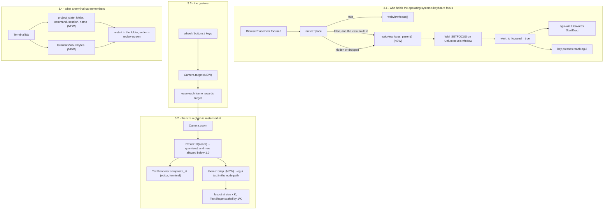
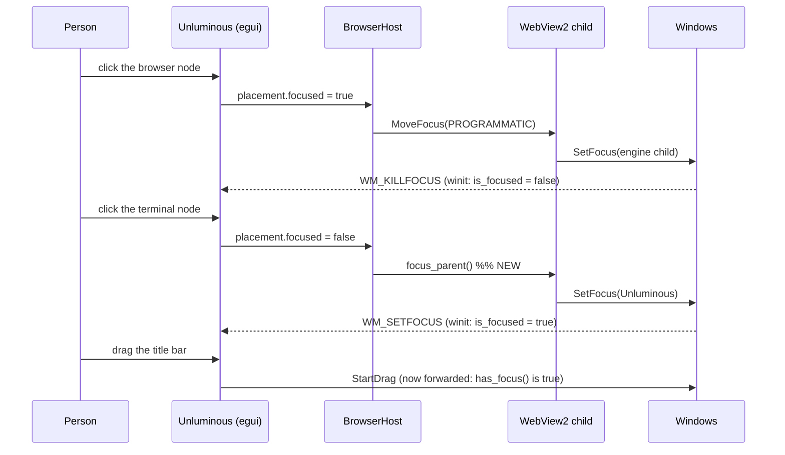

# task-1945: the window that cannot be moved, the page that keeps the keyboard, the zoom that is a magnified bitmap, and the terminals that come back empty

Four reports, measured on the installed 0.46.0 build before anything was designed. Two of them turn
out to be one fault; the other two are separate.

> I still cannot resize from the top when Base of Infinite Space is at the top, nor can I drag the
> window around. If I close Base of Infinite space, I'm able to. It seems to be limited to certain
> projects, as others work fine. I still cannot type in nodes at times, seems to be related.
>
> Zooming in and out of Base of Infinite space is chunky/not smooth. it needs to be perfectly smooth
> and have perfect resolution.
>
> When the web brower node is added, it's hard to give focus to other nodes so I can type. if I click
> a terminal node, etc, the node should be given focus. This is probably the issue with typing.
>
> I'm still not getting terminal state restored when I quit then re-open a project. both nodes and
> normal terminals should be restored to exactly where they were.

## 1. Introduction

Three faults, one of which produces two of the four reports.

**A browser node takes the operating system's keyboard focus and never gives it back.** Everything
about "I cannot type in that node", "I cannot drag the window", and "only some projects" follows from
that one line of code, and the measurements in §3.1 show each step of the chain.

**A node's `egui`-drawn text is a magnified or shrunk bitmap.** `task-1907` fixed this for the text
Unluminous rasterises itself — an editor node and a terminal node — and it fixed it only for zooming
**in**. Everything drawn through `egui`'s own font atlas, which is the node's title, the folder rows,
the browser toolbar, the chat pane and the whole Agent Tasks board, is still rasterised at the layout
size and then scaled by the camera. At the 0.61 zoom this ticket was reported from, the board's cards
are unreadable.

**A terminal in a panel remembers a number and a name and nothing else.** A terminal *node* comes back
showing what was on it, which `task-1912` built; a terminal *tab* comes back as a fresh shell in the
project's root with an empty screen, because `ProjectState` has only ever held `terminal.tabs` and a
list of names.

## 2. Goals and non-goals

### Goals

| # | What has to be true afterwards | How it is measured |
|---|---|---|
| G1 | With a browser node showing and focused, clicking any other node moves the **operating system's** keyboard focus back to Unluminous's own window | `GetGUIThreadInfo(thread).hwndFocus` is the window's own `HWND`, not `Chrome_WidgetWin_1` |
| G2 | The window can be dragged by its title bar and resized from every edge while a browser node is on the canvas | `Window::has_focus()` is true, so `egui-winit` forwards `StartDrag`; driven and reported on the real build |
| G3 | Typing after clicking a terminal, chat, editor or folder node reaches that node | `status --section keyboard` names the node, and the real window's focus is the window's own |
| G4 | `BeginResize` is never sent to a window that cannot act on it | a test asserts no `BeginResize` is emitted while `viewport().focused` is `Some(false)` |
| G5 | Canvas text is rasterised at the size it is seen at, zoomed **in and out** | a rendered frame at 0.61 and at 1.75 differs from the 1.0 frame scaled, and the glyph raster size is asserted directly |
| G6 | A wheel notch reads as a glide rather than a 10% jump | the camera eases to a target over `ZOOM_GLIDE`, asserted frame by frame |
| G7 | A terminal **tab** comes back in the folder it was in, running the program it was running, showing the screen it was showing | quit, reopen, `terminal read` contains the marker line and the prompt shows the folder |
| G8 | A terminal **node** keeps doing what it already does | the existing `task-1912` tests still pass |

### Non-goals

- **Changing how a node is laid out.** The camera goes on being a matrix over a layout done in world
  points. Nothing here reflows a terminal's cells or an editor's line breaks while the canvas is
  scaled, which is `task-1904`'s rule and is what makes a zoom cheap.
- **A second native view, or a view per node.** `task-1756`'s measurement stands.
- **Restoring what a program was doing.** A shell comes back in its folder showing its last screen. A
  half-finished `git rebase` does not come back mid-rebase, and nothing here pretends otherwise.
- **Touching the panes.** Every component changed here is also drawn in a pane at a scale of 1, where
  every change in this document is the identity, so the 483 accepted screenshots stay accepted.

## 3. Problem statement, with the measurements

### 3.1 The browser node takes the keyboard focus and nothing gives it back

`services/browser.rs`, in `native::place`:

```rust
if placement.focused {
    let _ = view.webview.focus();
}
```

`WebView::focus()` on Windows is `ICoreWebView2Controller::MoveFocus(PROGRAMMATIC)`, which calls
`SetFocus` on the engine's own child window. **There is no branch for `placement.focused == false`**,
so once the page has the focus it keeps it until something else takes it.

Measured on the running 0.46.0 build with `GetGUIThreadInfo` on the window's own thread:

| Step | `hwndFocus` |
|---|---|
| window started, no node chosen | `none` |
| `space focus 4` — the browser node | `0x190E1A (Chrome_WidgetWin_1, pid 85928)` |
| `space focus 7` — a terminal node | `0x190E1A (Chrome_WidgetWin_1, pid 85928)` |

The focus does not come back. Three of the four reports follow from that row:

**"I cannot type in nodes."** Every key press goes to the page.

**"I cannot drag the window around."** `egui-winit` refuses to forward the command:

```rust
ViewportCommand::StartDrag => {
    // If `.has_focus()` is not checked on x11 the input will be permanently taken until the app is killed!
    if window.has_focus() && let Err(err) = window.drag_window() { … }
}
```

and `winit`'s `Window::has_focus()` is `is_active && is_focused`, where `is_focused` is set to false by
the `WM_KILLFOCUS` the main window receives the moment `SetFocus` moves to the engine's child. So the
title bar's drag is dropped in silence, in `egui-winit`, before `winit` is reached.

**"Limited to certain projects."** A project whose canvas has no browser node never creates the native
view, so its window drags normally. **"If I close Base of Infinite space, I'm able to"** is the same
fact from the other side: the placement stops being pushed, `set_visible(view, false)` runs, and
Windows hands the focus of a hidden window back to its parent.

**And the resize.** `BeginResize` is *not* behind that check, so it reaches `winit`'s
`handle_os_dragging`, which latches a `dragging` flag, posts `WM_NCLBUTTONDOWN` and **returns early
from every later call until the flag is cleared** — and the one place `winit` clears it is
`WM_EXITSIZEMOVE`. A posted non-client click on a window whose focus is somewhere else is exactly the
case where no modal size loop runs to produce that message. `components/resize_edges.rs` already
records what one such refusal costs, from `task-1693`: after it, the window can be neither resized nor
moved for the life of the process.

**What was ruled out, so nobody re-checks it.** Both were measured rather than reasoned about:

- *`egui`'s own hit testing.* With the canvas docked top and a node of each of the six kinds panned so
  that it reaches above the pane, a drag on the window's top edge still reaches `Resize window: top`
  and emits `BeginResize(North)`, and a drag on the title bar still reaches `Move window` and emits
  `StartDrag`. Six kinds, both gestures, all correct. `clip_for_nodes` is doing its job.
- *The native child covering the title bar.* `WindowFromPoint` swept across the whole top of the real
  window at seven depths and answered with Unluminous's own window at every point. The `WRY_WEBVIEW`
  child sits at 76,116-976,672 — ten pixels above the window's own top — and `SetWindowRgn` has
  cropped it to 0,107-900,321, which is inside the pane.

### 3.2 A node's `egui` text is rasterised at the wrong size

`epaint` applies a layer's `TSTransform` to the finished shape. `TextShape::transform` multiplies the
glyph quads and leaves the texture coordinates alone, so a glyph rasterised for a 12.5 point layout and
composited at 1.75 is a bitmap magnified by 1.75, and at 0.61 it is the same bitmap resampled down with
bilinear filtering and no mipmap.

`task-1907` answered this for Unluminous's own atlas — `services::text_renderer::Crispness`, which asks
for the glyph at the size it will be composited at and divides the quad back. Two things are left:

1. **`Crispness::at` refuses to go below 1.0.** `snapped.max(1.0)`. So the editor and terminal nodes
   are exact zoomed **in** and are still resampled bitmaps zoomed **out** — and 0.61 is the zoom this
   ticket was reported from.
2. **`egui`'s own text was never covered.** The node's header and title, the folder node's rows, the
   browser node's toolbar, the chat node and the Agent Tasks node all draw through `egui`'s font atlas.

Measured by photographing the real window at three camera zooms with the same canvas
(`_agent_output/task-1945/zoom-061.png`, `zoom-100.png`, `zoom-175.png`): at 1.0 the board's headings
are sharp, at 1.75 they are visibly soft, and at 0.61 the cards are a grey mush.

### 3.3 The zoom itself steps by 10%

`take_the_canvas_input` turns the wheel into `notches = smooth_scroll_delta.y / 50` and applies
`1.1^notches` in the same frame. One notch of a mouse wheel is 50 units, so the camera jumps 10% and
stays there. There is nothing between the two zooms.

### 3.4 A terminal tab remembers a number and a name

`services/project_state.rs` holds `terminal_visible`, `terminal_tabs` and `terminal_tab_names`, and its
own comment says the rest is deliberately not kept. Measured: a tab moved to `crates`, which printed a
marker, was quit and reopened.

```
before quit   PS C:\jason\dev\unluminous\crates> echo MARKER-FOR-TASK-1945
              MARKER-FOR-TASK-1945
after reopen  PowerShell 7.6.6
              PS C:\jason\dev\unluminous>
```

The folder, the screen and the program are gone. A terminal **node** in the same project came back
showing its previous screen, so the mechanism exists and the tabs are simply not using it: the node's
screen was written to `.unluminous/terminals/7.bytes` on exit and printed back by
`unluminous-cli --replay-screen` on the next start.

## 4. Architectural overview



## 5. Components and interfaces

### 5.1 Giving the keyboard focus back — `services/browser.rs`

`NativeView` gains one field, `has_the_focus: bool`, so the focus is handed over once rather than on
every frame, and `native::place` gains the branch it never had:

```rust
match placement.focused {
    true if !view.has_the_focus => { let _ = view.webview.focus(); view.has_the_focus = true; }
    false if view.has_the_focus => { let _ = view.webview.focus_parent(); view.has_the_focus = false; }
    _ => {}
}
```

`wry::WebView::focus_parent` is `SetFocus(parent)` on Windows and `makeFirstResponder` on macOS, and
the parent `wry` was built with is Unluminous's own window. `set_visible(view, false)` and
`NativeHost::hide`/`forget` clear the flag the same way, because Windows hands a hidden window's focus
back to its parent and the flag would otherwise say the view still had it.

**Why not `SetFocus` from Unluminous's own code.** `wry` owns the handles; asking it is what keeps the
one place that knows the parent the one place that uses it, and `focus_parent` is already the
documented way out of a `WebView2`. The known `WebView2Feedback` issue where a host cannot get the
focus back is about hosts that call `SetFocus` on themselves without going through the controller,
which is what this avoids.

### 5.2 The window asks before it requests a resize — `app/frame.rs`

`resize_edges::show` is left alone; the caller gains the same question `egui-winit` asks about
`StartDrag`:

```rust
let focused = ui.ctx().input(|input| input.viewport().focused.unwrap_or(true));
if focused && let Some(direction) = resize_edges::show(ui, full, maximized) { … }
```

This is the same rule the file already keeps for a maximised window, applied to the other case where
the window manager will throw the request away: **never ask for something that will be refused**,
because a refusal here is not a failure, it is a latch that kills every later move and resize.

`unwrap_or(true)` because `focused` is `Option<bool>` and a platform that never reports it must not
lose its grips.

### 5.3 `status --section window` says whether the window has the focus

One field, `focused`, read from `viewport().focused`. It is what makes G1 and G2 answerable from
outside the window instead of by watching somebody try to drag it — the same reason
`status --section keyboard` exists, and `task-1914`'s note about that applies word for word here.

### 5.4 Crisp text — `theme::crisp` and `Raster`

**One quantised scale, used by both text engines.** `text_renderer::Crispness` becomes
`theme::crisp::Raster`, keeps its rounding-up rule for zooming in, and **loses `max(1.0)`** so that a
canvas at 0.61 rasterises its glyphs at 0.61 rather than resampling 1.0 ones. The quantisation stays
quarter-steps upward and gains quarter-steps downward, so the whole camera range from 0.25 to 2.5 asks
for thirteen raster sizes rather than an unbounded number.

**`theme::crisp` is the same trick for `egui`'s atlas**, as five functions and a trait so that a call
site keeps the shape it had — `painter.text(…)` becomes `painter.crisp_text(…)` and nothing else about
the line moves:

```rust
pub fn composite_at(scale: f32) -> f32;   // and `restore(was)`, the pair `TextRenderer` already has
pub struct Text { /* a galley laid out at size x scale */ }
impl Text { pub fn size(&self) -> Vec2; } // divided back, so a caller measures in its own points
pub trait CrispPainter {                  // implemented for `egui::Painter`
    fn crisp_text(&self, at: Pos2, anchor: Align2, text: impl ToString, font: FontId, colour: Color32) -> Rect;
    fn crisp_layout_no_wrap(&self, text: String, font: FontId, colour: Color32) -> Text;
    fn crisp_layout(&self, text: String, font: FontId, colour: Color32, wrap_width: f32) -> Text;
    fn crisp_layout_job(&self, job: LayoutJob) -> Text;
    fn crisp_galley(&self, at: Pos2, text: Text, colour: Color32);
}
```

**The scale is ambient, the way the active theme is** — a thread local, set once around a node and read
by every one of the hundred-odd places that draw words. The alternative is a parameter on every function
in `components/` a node can reach, including the ones a modal and a settings page share with it. It is
safe to hold that way because **nothing here ever moves anything**: a caller measures through `Text::size`
and draws through `crisp_galley`, both of which divide back, so a scale left on by mistake makes something
sharper than it needs to be and cannot make it the wrong size.

It is the identity at a scale of one, so every pane, every modal and every accepted screenshot outside a
zoomed canvas is byte for byte what it was.

The components changed are the ones a node draws: `components/space`, `components/browser_view`,
`components/explorer`, `components/controls`, `components/file_tabs`, `components/gutter`,
`components/terminal_panel`, `components/editor_view`, `components/picture_view`,
`components/diagram_view`, `components/agent_chat` and the files of `components/agent_tasks` that draw
the board. The editor's and the terminal's own glyphs already go through `TextRenderer` and need only the
`max(1.0)` removal.

**Where it stops, and why.** Text inside an `egui::TextEdit` — a folder node's filter box, a browser
node's address bar, the board's search box — is left composited. A `TextEdit`'s galley is what positions
its caret and settles its selection, so laying it out at a size other than the one the box is drawn at
would move the caret away from the letters. Sharpening placeholder text is not worth risking the one
thing about a node that has been reported broken more often than anything else, which is typing into it.

### 5.5 The zoom glides — `services/space/node.rs` and `app/space.rs`

`SpaceState` gains `glide: Option<(f32, Pos2)>` — where the zoom is going and the screen point it is
about. Every gesture aims it rather than setting the camera, and one function eases the camera towards it
each frame:

```rust
pub const ZOOM_GLIDE: f32 = 0.12;                              // seconds to cover the distance
impl Camera { pub fn glide(now: f32, wanted: f32, seconds: f32) -> f32 }
impl UnluminousApp { fn settle_the_zoom(&mut self, ui: &egui::Ui, body: Rect) }
```

**On `SpaceState` rather than on `Camera`**, because `Camera` is what `space.conf` holds and what a test
compares: a canvas reopened tomorrow is at a zoom, not on its way to one. **The point it is about is
remembered with it**, because the pointer moves during a glide and `zoom_to`'s rule has to hold against
where the gesture started rather than wherever the pointer has got to. **A frame with no time in it
finishes the glide**, so a context whose `stable_dt` is zero cannot ask for another frame for ever.

The ease is geometric in the zoom so a glide from 1.0 to 1.1 and one from 2.0 to 2.2 take the same
time, and the point under the pointer stays under the pointer on every frame of it, which is the rule
`zoom_to` already keeps. While it is moving the window asks for the next frame, which is the one thing
that makes it a glide rather than a jump on the next unrelated repaint. `space camera --zoom` sets both
at once, so nothing that drives the canvas from the command line has to wait for an animation.

### 5.6 A terminal tab remembers what a node does

`ProjectState` gains a list beside the count and the names:

```rust
pub struct RememberedTerminal {
    pub name: String,     // what a person typed, as today
    pub folder: String,   // where the shell had got to, relative to the project when inside it
}
pub terminals: Vec<RememberedTerminal>,
```

written to `terminal-tabs.txt` as `terminal.N.<key> = value` rather than one name a line. A file with no
`=` in it is the old one, so a project written by 0.46.0 opens without losing its names.

**What is not in it, and why.** The program that was running is deliberately not restarted. A node
restarts the command it was **created with**, which is a declared thing; what a tab has is whatever
happened to be running in it, and `foreground` answers with a bare program name — its own note says what
is done with that is to *offer* the program rather than to run it. Restarting a build or a dev server
because somebody closed the window is the surprise `project_state` already refuses for the run tile.

The screen is written by the same function the canvas uses, with the tab's index where a node's id goes:
`store::save_a_screen(root, Screen::Tab(index), bytes)` and
`store::a_screen_to_print(root, Screen::Tab(index))`, files `terminals/tab-N.bytes`. `save_a_screen`'s
signature gains that enum and `screen_path` is the one place a file name is decided, so a node and a tab
cannot disagree about where a screen lives. A strip that is shorter than it was forgets the screens
behind it, so a tab opened into that slot tomorrow does not replay a conversation that was never its own.

`start_the_restored_terminals` then opens each tab through `open_a_terminal_tab_in(folder, restoring)`,
which is `new_terminal_tab` with those two things added: the remembered folder, and
`print_a_remembered_screen_first` in front of the shell. `print_a_remembered_screen_first` takes a
`Screen` instead of a `NodeId` and both callers use it.

**Reading where the shell had got to.** `Session::folder` reads the current directory off the shell
process rather than answering with the one it was spawned in: `/proc/<pid>/cwd` on Linux, and on Windows
the `CurrentDirectory` in the process's own parameter block, reached through `NtQueryInformationProcess`
and two `ReadProcessMemory` calls. The offset of that field is written down in `foreground::folder_of`
with a compile time assertion tying it to `RTL_USER_PROCESS_PARAMETERS`, because `windows-sys` declares
the run it sits in as reserved. Every failure is `None` and the tab opens in the project's root.

**⚠️ PowerShell is the case this cannot answer for**, and it was measured rather than assumed:
`Set-Location` does not move the process's own current directory, and on this machine it still does not
after a native command has run. So a `pwsh` tab comes back in the folder it was started in whatever was
typed into it, while `cmd.exe`, `bash` and `zsh` come back where they were — and the screen replay shows
where the person was in either case. The only thing that answers for PowerShell is shell integration, the
prompt reporting its own directory with `OSC 7` or `OSC 9;9`, and turning that on means wrapping
somebody's own `prompt` function. That is a change to their shell rather than to this editor, so it is a
decision to put to them rather than one to make for them. §9 says so.

## 6. Data flows and risks



| Risk | What it would look like | What is done about it |
|---|---|---|
| `focus_parent` does not restore the focus on Windows, as `WebView2Feedback` #2487 reports for hosts that call `SetFocus` on themselves | typing still goes to the page after clicking another node | the check is a real measurement on the built window with `GetGUIThreadInfo`, not a test double; if `focus_parent` is not enough the fallback is `SetFocus` on the window's own `HWND` after it, and the measurement says which |
| Taking the focus back while the person is typing **into the page** | a keystroke lands in the wrong place | the focus only moves when `placement.focused` goes false, which is Unluminous's own `Focus` leaving that node — a person typing into the page has not clicked anywhere else |
| The glyph atlas grows for every zoom | a stutter and then a cleared atlas mid-pinch | `Raster` quantises to quarter steps, so 0.25 to 2.5 is thirteen sizes, and the note in `text_renderer` explaining why that number matters is kept and extended |
| The crisp helper changes a pane | 483 accepted screenshots start failing | the helper is the identity at `Raster::EXACT`, and a test asserts that for every call shape |
| A remembered terminal folder no longer exists | a tab that will not open | the folder is checked and the project's root is used instead, which is what a tab does today |
| Replaying a screen into a tab corrupts it | the `task-1912` fault, in a tab | the same mechanism, unchanged: the screen is printed *inside* the tab's own console by `unluminous-cli --replay-screen`, never drawn into the emulator from outside |

## 7. Alternatives considered

| Option | Why not |
|---|---|
| **Focus**: hide the native view whenever a node other than the browser is chosen | a page that stops rendering when you look away is a worse browser, and the view's memory target already drops when it is hidden. Handing the focus over costs one call. |
| **Focus**: call `SetFocus` on the window's own `HWND` from Unluminous | reaches around `wry`, which owns the handles, and is the exact shape the `WebView2` documentation says does not reliably work. Kept as the measured fallback, not the design. |
| **Crispness**: lay every node out at the screen scale, so nothing is transformed at all | this is what Figma does and it would be exact, but it means multiplying every constant in six components by the camera and it reflows a terminal's cells and an editor's line breaks while the canvas is scaled. `task-1904` settled that, and the layout is not what is wrong. |
| **Crispness**: raise the context's `pixels_per_point` while the canvas is drawn | `pixels_per_point` is one number for the whole context and the whole frame; the window's own furniture would change size with the canvas's zoom. |
| **Crispness**: wait for `egui` to fix it | `emilk/egui#4813` and discussion #4859 both report exactly this and neither has an answer. `epaint` has no per-layer raster density and no hook between a layer's shapes and the tessellator. |
| **Terminals**: remember the shell's *process* and re-attach | a pseudoterminal does not outlive the window that owns it, and a program's own state is not ours to keep. What comes back is the folder, the program and the screen, which is what "where they were" means. |
| **Terminals**: keep the screen in `workspace.conf` | a screen is kilobytes of escape sequences and that file is one a person reads. `task-1908` settled this for nodes; tabs use the same folder. |

## 8. Testing strategy

Functional first, and every one of these fails before the change.

### The focus (§5.1, §5.2, §5.3)

| Test | Where | What it asserts |
|---|---|---|
| `a_browser_that_loses_the_focus_hands_it_back` | `services/browser.rs` unit | the decision, not the platform: a placement that goes from focused to not focused produces `FocusAction::GiveItBack`, once, and not again on the next frame |
| `a_hidden_view_is_not_still_holding_the_focus` | same | hiding or dropping the view clears the flag |
| `the_window_asks_for_no_resize_while_something_else_holds_the_focus` | `tests/window_and_chrome.rs` | with `viewport().focused = Some(false)`, dragging the top edge emits no `BeginResize`; with `Some(true)` it emits one |
| `the_window_says_whether_it_has_the_keyboard` | `tests/command_line.rs` | `status --section window --json` carries `focused` |
| the real window | reported in the task comment | `GetGUIThreadInfo(thread).hwndFocus` is Unluminous's own `HWND` after clicking a terminal node, against the browser node's child before the change |

### The text (§5.4)

| Test | Where | What it asserts |
|---|---|---|
| `a_glyph_is_rasterised_at_the_size_it_is_seen_at_zoomed_out` | `services/text_renderer.rs` unit | `Raster::at(0.61).scale() < 1.0`, which `Crispness` refused |
| `the_raster_ladder_is_thirteen_sizes_across_the_whole_camera_range` | same | the atlas bound is a property of the code |
| `crisp_text_is_the_identity_at_a_scale_of_one` | `theme::crisp` unit | the galley and the rectangle are what `Painter::layout` and `Painter::text` give today |
| `a_node_drawn_at_a_zoom_asks_for_the_zoomed_font` | `tests/canvas_space.rs` | the `FontId` sizes recorded in a frame at 1.75 are 1.75 times the ones at 1.0 |
| the accepted images | the screenshot suite | unchanged, because the scale is 1 everywhere but a zoomed canvas |

### The glide (§5.5)

| Test | Where | What it asserts |
|---|---|---|
| `a_wheel_notch_glides_rather_than_jumping` | `services/space/geometry.rs` unit | after one notch `zoom` is between the old and the target, and reaches the target within `ZOOM_GLIDE` |
| `the_point_under_the_pointer_stays_there_on_every_frame_of_a_glide` | same | `task-1672`'s rule, asserted per frame rather than only at the end |
| `the_command_line_sets_the_zoom_at_once` | `tests/canvas_space.rs` | `space camera --zoom 2` answers 2.00 on the same frame |

### The terminals (§5.6)

| Test | Where | What it asserts |
|---|---|---|
| `a_terminal_tab_comes_back_in_the_folder_it_was_in` | `tests/terminal.rs` | write the state, read it back, the settings carry the folder |
| `a_terminal_tab_comes_back_showing_what_was_on_it` | same | `save_a_screen(Screen::Tab(1))` then `a_screen_to_print(Screen::Tab(1))` is the file, and the shim's command line is the one a node gets |
| `a_project_written_by_an_older_build_keeps_its_terminal_names` | `services/project_state.rs` unit | the old one-name-a-line file still reads |
| `a_terminal_node_still_comes_back_showing_what_was_on_it` | `tests/canvas_space.rs` | the `task-1912` behaviour, unchanged by the shared `Screen` enum |
| the real window | reported in the task comment | a tab moved to `crates`, a marker printed, quit, reopened: the prompt says `crates` and the marker is on the screen |

## 9. What is deliberately left

- **macOS** gets the same `focus_parent` call and it is the right one there, but the measurement in §3.1
  is Windows only and the macOS half is not claimed to be measured.
- **The Agent Tasks modals and settings pages** keep `egui`'s ordinary text. They are drawn over the
  window rather than inside a node, so the camera never scales them.
- **`Crispness` below 1.0 changes the editor and terminal nodes when zoomed out**, which is the point, and
  it is the one place a person will see a difference at a zoom other than 1.0 that is not a bug fix.
- **Text inside an `egui::TextEdit` is still composited rather than rasterised at the zoom.** §5.4 says
  what would have to change and why it is not worth it.
- **A `pwsh` tab comes back in the folder it was started in.** §5.6 has the measurement. Shell integration
  would answer it and is a decision about somebody's own shell, so it is offered as a follow-up rather
  than switched on here.
- **A terminal tab does not restart the program that was in it.** §5.6 says why, and it is the one part of
  "restored to exactly where they were" that is a deliberate no.
