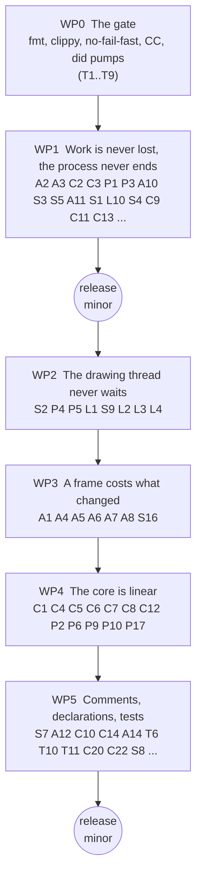
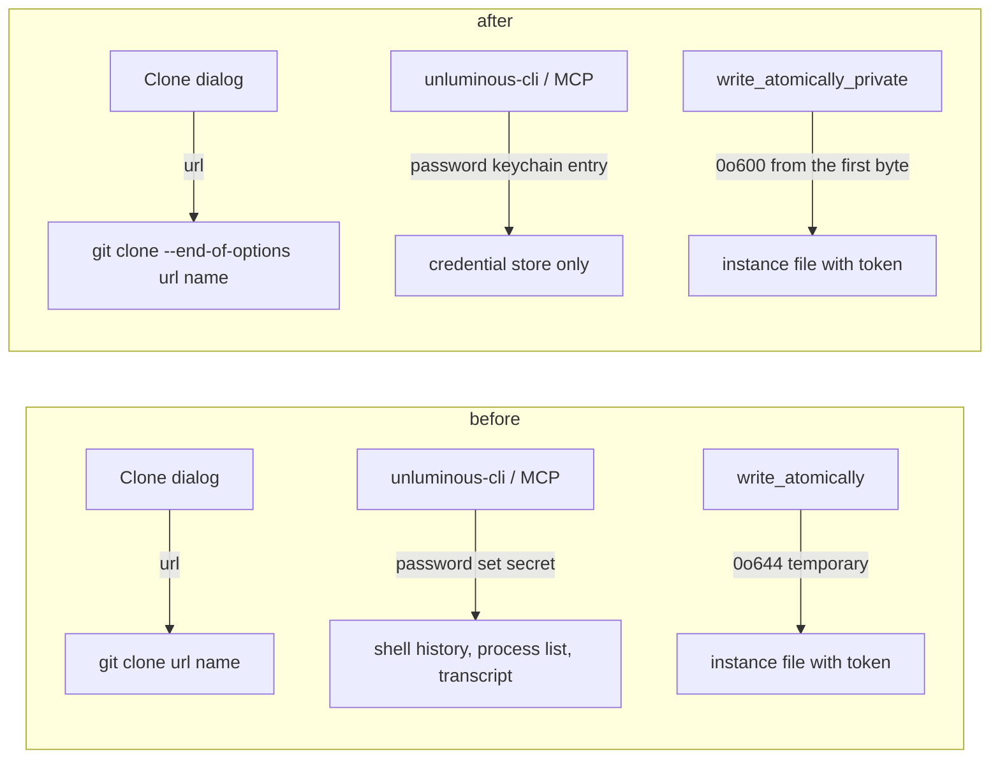

# task-1984: a second review of Unluminous, and the plan that acts on it

## 1. Introduction

`task-1922` reviewed Unluminous at 0.44.1 and its implementation split `app/mod.rs` and `app/cli.rs`,
fixed twenty bugs, gave settings and actions one declaration each, added the dispatch coverage
tests, and added eleven editing features and five languages. `task-1984` asks for another review in
the same depth, against the code as it is now, on four questions: is it well organised, well
commented, performant, and well tested. This document is the answer and the plan that acts on it.

The review was done against commit `3c0d017` (Unluminous 0.49.1) on 2026-09-18, over every crate in
the workspace. Seven reviewers each took one area and wrote a report with file and line references
under `_agent_output/task-1984-code-review/`; every High finding below was then checked against the
source by hand before it was written down here. The full suite was run, including the window and
screenshot suite, and the numbers in §3.1 are from that run.

The workspace is 234,591 lines of Rust across eight crates: 204,603 in `src`, 26,802 in integration
tests, 3,003 in examples. There are 3,379 tests. It is in better shape than at the last review: the
two catch all files are gone, every catalogue command has a dispatch test, every `Action` has one,
the protocol crates are green and none of their tests skips, and eight of the previous review's ten
testing findings are fixed. The findings this time are of a different kind. Almost nothing is a
structural problem now. What is left is:

1. **The gate is not green and nothing says so.** The window suite has one test that fails three
   runs in five, cargo stops at the first failing binary so 199 tests did not run, `cargo fmt
   --check` fails on seven files and `cargo clippy -D warnings` fails with one error, and none of
   the three is run by the release script that `task-1928` made the only gate. On this machine the
   gate cannot even build from a fresh shell.
2. **A handful of real bugs, three of which lose a person's work or end the process.** Closing the
   window discards every unsaved tab without a word. A tab whose save failed is closed anyway. A
   Markdown document or a chat answer with 1,300 `>` characters or 6,000 `*` characters ends the
   process with a stack overflow, which `crash.log` never sees. A `ReadProcessMemory` writes one byte
   past its buffer. `git clone` is the one subcommand the last review's `--end-of-options` fix
   missed.
3. **Five places block the drawing thread**, each for seconds: a database Test Connection, a data
   source being opened, an adapter being dialled, `update check`, and a keychain write, all from a
   draw function or a command answered inside a frame.
4. **The idle frame has grown back.** `task-1805` measured it at 0.65 ms. The Settings window's whole
   setup now runs every frame with the window closed, the project state is rebuilt every frame and
   asks the operating system about every terminal tab, the explorer copies every plugin icon's PNG
   per row per frame, and the menu tree is built two or three times a frame and reads
   `package.json` each time.
5. **The editor core has four quadratic paths on ordinary input**: a one line file after an
   `export`, every edit that is not typing snapshotting the whole coloured span list, caret movement
   on a one line file, and `relayout` fingerprinting every paragraph on every keystroke.
6. **Comments that are now false.** Nine of them say the opposite of what the code beside them does,
   and each one is in a place where the next change would follow the comment.

The plan is in six work packages, ordered so that the first thing built is the ability to know
whether anything else worked, and the second is the bugs that lose work.

## 2. Goals and non goals

### Goals

| # | Goal | How it is measured |
|---|---|---|
| G1 | The release gate is green on this machine and checks what CI used to check. | `pwsh tools/release.ps1 -WhatIf` runs `cargo fmt --check`, `cargo clippy --workspace --all-targets -- -D warnings`, the workspace suite and the app lib suite from a fresh shell and passes. The window suite passes with `--no-fail-fast` and no `.diff.png` left behind, five runs in a row. |
| G2 | No path loses a person's text or ends the process on ordinary input. | Each bug in §3.2 marked "loses work" or "ends the process" has a test that fails on the code as it is and passes after. |
| G3 | The drawing thread never waits on a network, a database, a process or a keychain. | Every call site in §3.3 goes through a worker or answers `Outcome::Hold`; `UNLUMINOUS_FRAME_TRACE` over a Test Connection against a down host shows frames continuing. |
| G4 | The idle frame is back under 1 ms and a drawing frame does no allocation for the things in §3.4. | `UNLUMINOUS_FRAME_TRACE` and `--features diagnostic-allocations` on the fixed corpus, before and after, recorded in `_agent_output/task-1984-code-review/after/`. |
| G5 | The four core paths in §3.5 are linear. | The measurements in `core.md` re-run with the same inputs: C1 under 10 ms at 458 KB, C4 under 1 MB per undo step on the 2 MB file, C5 under 0.1 ms, C7 proportional to the paragraphs touched. `completion_cost` prints a number under its budget or the budget is revised in `CLAUDE.md` with the reason. |
| G6 | Every comment named in §3.6 says what the code does. | Each is rewritten or the code is changed to match, and the commit says which. |
| G7 | The tests in §5.6 exist. | Named in the commits; the coverage tests fail when the rule they guard is broken. |

### Non goals

- New functionality. `task-1922` WP4 covered the day one features; nothing in this review is a
  missing feature and none is added.
- A rewrite of the undo model. `Document::snapshot` restoring a state rather than replaying an
  inverse is the design and its argument holds. What changes is what a snapshot costs.
- Changing any product default.
- Formatting changes mixed into other commits. The one `cargo fmt` pass is a commit of its own.
- Rewriting the five worker threads into one crate. Each worker gets the one property it lacks and
  keeps its shape.

## 3. Problem statement

### 3.1 The gate

The numbers, from one run on this machine on 2026-09-18:

| Suite | Result |
|---|---|
| `cargo test --workspace --exclude unluminous-app` | 1,512 passed, 0 failed, 0 ignored, 17.5 s |
| `cargo test -p unluminous-app --lib` | 1,238 passed, 0 failed, 6.7 s |
| `cargo test -p unluminous-app --test '*'` | stopped at `plugins_database`: 1 failed, and `syntax_and_plugins_basic`, `terminal` and `window_and_chrome` (199 tests) never ran |
| the same with `--no-fail-fast` | 629 passed, 1 failed, 9 ignored, 402 s |
| `cargo fmt --all -- --check` | 7 files differ: `app/terminals.rs`, `services/plugins/manifest.rs`, `services/shell_integration.rs`, `theme/icon.rs`, `tests/icons.rs`, `unluminous-terminal/src/lib.rs`, `unluminous-terminal/src/reported.rs` |
| `cargo clippy --workspace --all-targets -- -D warnings` | 1 error: `reported.rs:154`, an `if` with identical blocks |

- **T1.** `plugins_database.rs:386`, `an_edit_is_pending_until_it_is_submitted_and_the_file_changes`,
  fails three runs in five in isolation with `Harness::run exceeded max_steps (4)`. It calls plain
  `did` for `set`, `pending` and `submit` while the database worker is still answering, and `did`
  ends in `Harness::run`, which `CLAUDE.md` says a waiting loop must not call. `did_while_waiting`
  exists in the same file and is used ten times elsewhere in it. `canvas_space.rs` makes 287 `did`
  calls and no `did_while_waiting` calls, so the same shape is latent there. A second run of the
  window suite by a different reviewer passed this test and failed
  `canvas_space.rs:916`, `a_chat_node_holds_its_own_conversation_and_comes_back_on_it`, for the
  reason M1 in §3.2 gives: two conversations made in one second share an id.
- **T2.** Nothing passes `--no-fail-fast`. The sentence the release scripts print for the window
  suite has no such flag and neither does the command in `CLAUDE.md`, so a red run says one test is
  red when 200 are untested.
- **T3.** `task-1928` removed the continuous integration and moved the tests into the release
  scripts. `cargo fmt --check`, `cargo clippy` and `node tools/changelog.mjs --check` did not move
  with them. Every one of the seven files and the one error arrived in `task-1949` and `task-1950`,
  after the gate went away.
- **T4.** This machine has a user environment variable `CC` set to `cl.exe` with no `INCLUDE` or
  `LIB` beside it, so `cc-rs` skips its Visual Studio lookup and `libsqlite3-sys` fails to compile
  from any ordinary shell. `tools/release.ps1` runs `cargo test` in whatever environment it was
  started in, so the only gate fails at step 0 here. Every number above came from `env -u CC`.
- **T5.** `window_and_chrome.rs:2978` walks the repository for Markdown files and does not skip
  `_agent_output`, so it reads 646 files of which 536 are this machine's agent scratch. The test's
  own comment says it reads only what is checked in. An agent report with unusual Markdown fails a
  test about the editor, and the test takes 11 s.
- **T7.** `tools/nightly.ps1` calls itself the one scheduled run of the six ignored agent tests. No
  scheduled task exists and its output folder has never been created. Those six tests have run zero
  times.
- **T8.** Two tests in `window_and_chrome.rs` (`:1248`, `:1289`) set and remove `UNLUMINOUS_HOME`
  process wide with no mutex, and one takes an accepted screenshot that depends on it.
  `command_line.rs:2384` already has the mutex to copy.
- **T9.** The release gate is turned off by one flag and never runs the 639 window tests. The
  reasoning for the second is sound. What is missing is any record of when the window suite last
  passed, so a release can be made from a commit it has never seen.

### 3.2 Bugs

Line numbers are from `3c0d017`. The last column says what a person loses.

| # | Where | What | Effect |
|---|---|---|---|
| A2 | `app/frame.rs:390`, `app/menus.rs:375`, `app/mod.rs:2034` | The window's close button, `Action::CloseWindow`, `Action::Quit` and `on_exit` write the settings and the project state and never look at `Document::is_modified`. `close_tab` writes a modified tab first; the window does not. | **Loses work.** Type into a file, press the X, and the edits are gone with no message. The project state written a line earlier records the file as open, so it comes back tomorrow showing the disk. |
| A3 | `app/opening.rs:444`, `:456` | `save_before_closing` puts a failed write in the status bar and returns; `close_tab` closes the tab on the next line. | **Loses work.** A read only file, a full disk, or a file read in an encoding Unluminous only reads: the tab closes and the typing goes with it. |
| C2 | `unluminous-core/src/markdown/blocks.rs:173` | Blockquote nesting recurses with no depth limit. Measured: 1,300 `>` on one line overflows the stack. | **Ends the process.** A stack overflow is not a panic, so `crash.log` is empty. Reached from the preview on every text revision and from every message drawn in the chat pane. |
| C3 | `unluminous-core/src/markdown/inline.rs:171` | `flatten` recurses once per emphasis level. Measured: 6,000 `*` before and after one letter overflows the stack. A block depth limit does not reach it. | **Ends the process.** A banner of asterisks in a pasted file or a model's answer. |
| P1 | `unluminous-terminal/src/foreground.rs:270` | `vec![0u16; length / 2]` then `ReadProcessMemory` for `length` bytes. An odd `UNICODE_STRING.Length` writes one byte past the allocation. The guard checks zero and too large, not odd. | Heap write out of bounds in `unsafe` code, from a value read out of another process. Rare, one line to close. |
| P3 | `unluminous-git/src/ops.rs:281` | `run(parent, &["clone", url, &name])`. `task-1922` B4 put `END_OF_OPTIONS` before every other caller typed value and missed this one. `url` is whatever was typed into the Clone dialog. | A pasted value beginning with `--upload-pack=` or `--config` runs a program. |
| A9 | `app/cli/cli_explorer.rs:10`, `:106`, `:309` | `explorer show`, `hide` and `toggle` write `explorer_visible` directly. `Action::ToggleExplorer` calls `leave_the_maximised_pane` and keeps something showing; the command does neither. `terminal` and `space` go through `show_the_terminal_tile` and `show_a_panel`. | `unluminous-cli explorer show` while a pane is maximised leaves a state no pointer can produce, and `explorer hide` with the editor hidden leaves an empty body. The rule `run_cli` exists for is broken in one area. |
| A10, S3 | `app/mod.rs:1882`, `app/symbols.rs:669`, `:702`, `services/run_configurations.rs:484`, `plugin_settings.rs:133`, `plugin_ui.rs:762`, `agent_chat/store.rs:119`, `agent_tasks/mod.rs:245`, `unluminous-core/src/document.rs:502` | `task-1922` B7 made Unluminous's own files atomic through `store::write_atomically`. The files that hold a person's code (a rename, Replace All, a file move, and `Document::save_as` itself) and five persisted files (run configurations, every plugin's configuration through the shared `write_values`, a conversation, the Agent-Tasks settings) still use one `std::fs::write`. | A crash or full disk in the middle of a rename across forty files truncates one of them, and the buffer is already gone. |
| S5 | `services/control.rs:372` | The instance file with the control token is written at the umask mode and tightened to `0o600` afterwards. The temporary's name is predictable. | On macOS and Linux, a window during which another local user can read a token that drives the editor. |
| A11 | `src/arguments.rs:105` | `--opacity`, `--view`, `--menu-bar` and `--control` consume the next argument whatever it is, and a value that does not parse becomes `None` in silence. | `unluminous --opacity <path>` eats the project path and opens the current folder with no message. The module's own comment says a value nobody can read is refused. |
| S1, L9 | `services/input.rs:96`, `:232`, `app/cli/cli_window.rs:93` | `input key --times` is a saturating float cast into an unbounded loop, `input text` has no length cap, and `Queue::push` has no limit. `dragged` clamps its `--steps` to 200. | `--times 1e18` allocates until the process dies; `--times 100000` is 55 minutes of a window that answers nothing, with no cancel. |
| L10 | `unluminous-cli/src/catalogue.rs:374` | `wrong_numbers` accepts anything `f64::parse` accepts, which includes `nan` and `inf`. | `input move nan nan` feeds a NaN pointer to egui; nothing is hovered and nothing says why. |
| S4 | `services/database/commands.rs:724` | `plugins run database password <source> set <secret>` takes the secret on the command line, three lines under a doc comment saying there is deliberately no way to do that. It is also offered as an MCP tool, so a model puts the plaintext in its transcript. | Three copies of a secret: shell history, process list, agent transcript. Agent-Tasks answers the same question the other way and offers no command at all. |
| L1 | `app/cli/cli_settings.rs:95` | `cli_update` calls the blocking `update::ask` inside `run_cli`, which runs at the top of a frame. `Check::start` in the same file already does it on a thread for the About box. The catalogue declares `--timeout` for this command and nothing reads it; the documented default is 15000 and the real fixed wait is 10000. | One `unluminous-cli update check` stops the window drawing for up to ten seconds. |
| L2 | `services/control.rs:76`, `:647` | `BACKSTOP` is 120 seconds and its comment says it is longer than any command's wait. `BUILD_WAIT` is 600 seconds. Once the window has picked a request up the connection thread caps its wait at `BACKSTOP` whatever the caller asked. | `debug start --wait-for-pause` on a cold cargo build over two minutes answers `timed-out` while the window is still correctly waiting, and the answer goes to a closed connection. `terminal read --wait-for ... --timeout 300000` is cut at 120. |
| L3 | `unluminous-cli/src/mcp/tools.rs:651`, `:657` | The grouped tool's own top level `timeout` is copied into the arguments and then `sibling_keys` strips it as a key of another verb in eight of the 28 areas (65 commands). The agent is told it was ignored. | The `timeout` an agent set is not used, and the sentence it reads is about a key it took from the tool's own schema. The existing test uses the one area where it happens to work. |
| L4 | `unluminous-cli/src/mcp/driver.rs:126`, `app/cli/cli_settings.rs:232` | `mcp tools`, `mcp config` and `mcp install` are `local: true`, offered as tools, not answered by `driver::locally`, and refused by the window with `unknown-command`. | Three tools that resolve and can never succeed. |
| L5 | `unluminous-cli/src/mcp/server.rs:206` | The "Ignored" sentence is built with `"\\n\\n"` and a `\\` line continuation, so an agent reads a literal `\n\n` and a stray backslash followed by seventeen spaces. | |
| L6 | `unluminous-cli/docs/protocol.md:148`, `src/documentation.rs:29` | The list of commands answered on a later frame names two that are not (`launch`, `update check`) and omits eight that are (`status`, `git status`, the five `input` commands, `space browser <node> shot`). The test compares against "has a timeout or wait flag", which is a different property. | |
| C9 | `unluminous-core/src/scroll_sync.rs:70` | `at_fraction` answers `page.height` when a paragraph has no band, and the comment says it answers the top. A folded paragraph has no band. | Scrolling the preview into a collapsed heading sends the source pane to the end of the file. |
| C11 | `unluminous-core/src/markdown/table.rs:212` | Columns are padded by grapheme count. A CJK character or an emoji is two columns wide. | A table with `你好世界` in a cell is misaligned by four columns, in the preview and in the chat pane. |
| C13 | `unluminous-core/src/document.rs:1085` | `EditKind::Deleting` is recorded and the only comparison against it is `kind == EditKind::Typing`, so it behaves as `Other`. | Holding Backspace is one full document snapshot per character, and one undo step per character. |
| S6, P7 | `services/symbol_index.rs:278`, `services/text_search.rs:148`, `unluminous-chat/src/client.rs:194`, `:242` | `task-1922` B6 named five thread spawns that `expect`. Git and dap were fixed. These four were not. | Under thread pressure the window dies instead of one feature saying it cannot answer. |
| S8 | six files, `Close {name}` | Editor tabs, run tabs, terminal tabs, canvas nodes, board and database tabs all name their close button `Close <name>` with no prefix, and an editor tab and a File Editor node on the same file are on screen together. | Two controls with one name, which the style guide forbids and the screenshot tests rely on. A test closing a file by name closes whichever egui walked first. |
| A15 | `app/mod.rs:344`, `app/panels.rs:222` | A maximise remembers a plugin pane's visibility by slot number. | Switching a plugin on or off while a pane is maximised restores the wrong pane. |
| M1 | `services/agent_chat/store.rs:55` | `new_id` is the current second, made unique only against files already on disk. A conversation that has not been written yet is not on disk, so two conversations made in one second get the same id. | The second chat node made in a second shares the first one's conversation, and whichever is written second overwrites the other. It is also why `canvas_space.rs:916` is flaky. |
| S12 | `services/browser.rs:665`, `:687`, `:693` | `task-1922` B15 recovered from lock poisoning at three of six sites in one file. | |
| P11 | `unluminous-db/src/postgres/scram.rs:156` | `finish` accepts `v=` with an empty value when `respond` has not run, because an empty signature equals an empty signature. | Not reachable through `Session::connect`, which always calls `respond` first. Close it anyway. |
| P15 | `unluminous-dap/src/session.rs:265` | `awaiting` shrinks only on a matching response. | One request an adapter never answers leaves `is_waiting()` true for the session. |
| L12, L13, L14, L21 | `unluminous-cli/src/restore.rs:82`, `parse.rs:400`, `mcp/tools.rs:690`, `mcp/http.rs:359` | `--replay-screen` is recognised anywhere on the line; `---permanent` is accepted while `--LINE` is refused; a grouped call carrying both `command` and `verb` is refused for the schema's own key; the loopback origin check compares scheme and host case sensitively. | Small, each one line. |

### 3.3 The drawing thread waits

`unluminous_git::Worker`'s comment is the rule: a command on the window thread stops it drawing, which
on anything slow looks exactly like a crash, and the control channel is read at the top of a frame so
`unluminous-cli status` stops answering too. Five places break it.

| # | Where | What waits | For how long |
|---|---|---|---|
| S2 | `components/database/modal.rs:247`, `test_it` at `:513` | Test Connection calls `unluminous_db::Database::connect` synchronously inside the modal's draw function. Every other connection in the plugin goes through `Worker::open`. | The TCP connect timeout against a host that is down, about 21 seconds on Windows. |
| P4 | `unluminous-db/src/worker.rs:229`, called from `services/database/mod.rs:504` | `Worker::open` waits on `was_opened.recv()` with no deadline. The connect is fifteen seconds per address; the TLS handshake and SCRAM run under `READ_TIMEOUT`, which is thirty minutes. | Fifteen seconds per address the name resolves to, and a server that accepts and stalls in the handshake has no bound under thirty minutes. |
| P5 | `unluminous-dap/src/adapter.rs:186`, `client.rs:164`, `:218` | `start_server` dials the adapter's port in a loop for `CONNECT_GRACE` on the calling thread, and `Client::start` and `adopt_child` are called from the debug action and from a reverse request handled inside a frame. The module comment says the window never blocks on an adapter. | Five seconds when `debug.node` points at a file that is not there. |
| L1 | `app/cli/cli_settings.rs:95` | `update::ask` on the network inside `run_cli`. | Ten seconds. |
| S9 | `components/database/modal.rs:497` | `keychain::write` from the draw function, which on macOS and Linux spawns `security` or `secret-tool` and can put up an unlock prompt behind a frozen window. It is the only side effect on the world in `components/`. | Until the prompt is answered. |

### 3.4 The frame

`task-1805` measured the idle frame at 0.65 ms and set the rules: nothing drawn on the screen is a
reason to ask the disk, anything derived from the plugins is worked out when the plugins change, and
nothing that runs once a frame may allocate. Each of these breaks one of them, and none of them shows
in any state the window reports. `UNLUMINOUS_FRAME_TRACE` is how each was found and is how each is
measured again.

| # | Where | Every frame | Rule broken |
|---|---|---|---|
| A1 | `app/frame.rs:1444` | `show_the_settings_window` runs its whole setup before `settings_dialog::show` returns on its second line for a closed window: a clone of `Settings`, a copy of every installed font family name, a clone of every plugin's icon PNG (eleven, 1.5 to 2.8 KB each) into two vectors, and `unluminous_cli_program()`, which calls `current_exe` and `is_file`. | The disk, and allocation. |
| A4 | `app/mod.rs:1576`, `:1689`, `unluminous-terminal/src/session.rs:622` | `remember_the_project` builds a whole `ProjectState` to compare against the last one written: five vectors of cloned paths, the expanded folders, and for every terminal tab `Session::folder`. That function's comment says no question is asked of the disk. With shell integration off, which is the default, it falls through to `foreground::folder_of`: `OpenProcess`, `NtQueryInformationProcess`, two `ReadProcessMemory` calls, and then `path.is_dir()`. | The disk and the kernel, per tab, per frame. |
| A5 | `app/frame.rs:627`, `app/plugin_panes.rs:1083` | The explorer builds a `Vec` of every visible row's path, then a `HashMap` keyed on a clone of each, and for each row `plugin_icon` clones the plugin's whole PNG before `Icons::texture` looks the id up in its cache and returns without reading the bytes. | Allocation, a few hundred kilobytes of memcpy per frame on this checkout. |
| A6 | `app/actions.rs:1190`, `:2572`, `app/menus.rs:28`, `app/frame.rs:370`, `:575` | `menu_state()` is built at least twice a frame and `menus()` once, plus once more per key press inside `action_for_key`. `menu_state` clones the recent list and every plugin's menu tree and calls `run_rows()`, which calls `run_configurations::detect`, which stats `Cargo.toml` and reads and parses `package.json`. `run_widget_state` calls `run_rows()` a second time and `suggestions()` a third. | The disk, and the `task-1805` rule about things derived from the plugins. |
| A7 | `app/plugin_panes.rs:387` | Each visible plugin pane is asked for its entire JSON `view()` so the header can print `total`. For Agent-Tasks that is every card on the board as JSON, twice a second at idle. | Allocation. |
| A8 | `app/space.rs:252`, `:261` | `views().to_vec()` and `current().clone()` deep copy every canvas the project has, with every node's strings, to escape a borrow. | Allocation. |
| S16 | `components/database/tree.rs:86`, `services/file_tree.rs:246` | Row models are built whole every frame and only the drawing is virtualised. | Allocation. |

### 3.5 The editor core

Every number here was measured with the crate's own cost examples or a throwaway program linking
`unluminous-core`, and the inputs are in `core.md`.

| # | Where | What | Measured |
|---|---|---|---|
| C1 | `unluminous-core/src/symbols.rs:249` | After `export` or `pub`, every token re-reads the slice from the keyword to itself looking for a line break and counting braces. `exported` is never advanced. On a file with no line break the slice is the file. | 8.6 ms at 24 KB, 161 ms at 102 KB, **2,954 ms at 458 KB**; the same text with line breaks is 6.6 ms. Runs on every text revision of the open tab and over every file in the project when the index builds, with no size guard, and `dist/` is not excluded from the walk. |
| C4 | `unluminous-core/src/document.rs:1099`, `style.rs:40` | Every edit that is not typing calls `snapshot()`, which clones the text, the paragraphs and the whole `StyleSpans`. `CharStyle::family` is a `String`, so the span clone is one heap allocation per span. `task-1804` fixed this same cost in `set_many` and it lives on in the snapshot. | 9.7 ms and 15.5 MB per Backspace on a 2 MB file; 256 steps of history is 4 GB. The span list is 95% of it. `layout_memory` does not count the history. |
| C5 | `unluminous-core/src/document.rs:921`, `cursor.rs:76` | `line_window` copies the caret's whole line into a `String`, eight callers, and the grapheme walks start from the beginning of it. `MoveLineStart` copies the line to keep a number the rope already had. | **15.9 ms for one arrow key** on a 1 MB one line file; 0.002 ms on `app/mod.rs`. |
| C6 | `unluminous-core/src/document.rs:1277` | `replace_many` colours each replacement with `StyleSpans::set`, a whole pass over the span list, where `insert` uses `set_in` and says why. | 27.5 ms for 210 replacements in a coloured 117 KB file; 0.24 ms uncoloured. This is `Find in Files` Replace All, `editor rename` and every completion. |
| C7 | `unluminous-core/src/layout.rs:353` | `relayout` slices and hashes every paragraph before comparing any. The comment says a keystroke costs the paragraph it was typed into. | 17.2 ms of the 21.7 ms keystroke on the 2 MB file with nothing changed. The largest remaining per keystroke cost in the crate. |
| C8 | `unluminous-core/src/incremental.rs:158`, `:236` | `Tokens::update` allocates the whole token vector fresh and copies the untouched prefix and tail into it; `safe_start` walks every token before the edit to find the one that could straddle it. | 5.25 ms per keystroke on the 2 MB file while reading fourteen tokens. |
| C12 | `examples/completion_cost.rs` | The example prints `One whole keystroke, worst case: 10.510 ms (budget: under 5 ms). Over budget.` `CLAUDE.md` says 5.06. The two letter case, which opens the popup, is 9.1 ms. | |
| P2, P10 | `unluminous-dap/src/codec.rs:110`, `unluminous-chat/src/sse.rs:82`, `unluminous-db/src/postgres/wire.rs:146` | Three framing buffers rescan from byte zero on every read, and the DAP one has no size bound until a separator is found, so an adapter printing a crash dump grows it without limit. | |
| P6 | `unluminous-terminal/src/replay.rs:101` | `bytes_within` clones and re-encodes the whole screen once per dropped row, at window close, per terminal. | Quadratic in rows, on the one path a delay cannot be hidden behind a frame. |
| P9, P17 | `unluminous-terminal/src/screen.rs:20`, `unluminous-chat/src/agent.rs:796` | `ScreenCell` holds a `Vec<char>` so the grid is cloned rather than copied once a frame; the Codex decoder clones the whole already sent text per item update. | |

### 3.6 Organisation and comments

The structure the last review asked for is there. What is left is a list of comments that say the
opposite of the code, a handful of long functions, and three files that mix concerns.

**Comments that are false**, each in a place where a later change would follow the comment:

| Where | The comment says | The code does |
|---|---|---|
| `components/mod.rs:3` | No component changes the window's state. | `settings_dialog.rs` (fifteen sites) and `mcp_page.rs` (three) take `&mut Settings` and write it. The three provider pages return outcomes. |
| `unluminous-terminal/src/session.rs:626` | No question is asked of the disk here. | The fallback ends in `path.is_dir()`, per tab, per frame. |
| `services/control.rs:73` | `BACKSTOP` is longer than any command's own wait. | `BUILD_WAIT` is five times longer. |
| `services/database/commands.rs:707` | There is deliberately no way to give a password on the command line. | `password <source> set <secret>` is that way, three lines down. |
| `unluminous-dap/src/client.rs:3` | The window never blocks on an adapter. | `start_server` blocks it for five seconds. |
| `unluminous-core/src/mermaid/mod.rs:26`, `check.rs:11` | The no overlap property is asserted for every diagram type. | `properties` runs three checks; overlap is opted into by six of twenty types, and neither `state` nor `requirement` opts in though both use the shared layered layout. |
| `unluminous-core/src/scroll_sync.rs:70` | Nothing to say gives the top of the page. | It gives the bottom. |
| `unluminous-core/src/markdown/table.rs:6` | Columns line up by construction. | By grapheme count, which is not a column count. |
| `unluminous-core/src/layout.rs:325`, `:514` | A keystroke costs the paragraph it was typed into; the fingerprint covers everything `lay_out_paragraph` reads. | Every paragraph is fingerprinted; the fingerprint omits `FontMetrics`. |
| `unluminous-cli/src/mcp/mod.rs:19`, `tools.rs:11`, `:18`, `:45` | Fourteen tools by default, not ninety seven; 208 commands; 207 every shape tools; 26,381 tokens. | 28 by default, 214 commands, 213 tools, 27,011 tokens. Stale for the second time since `task-1922`. |
| `unluminous-db/src/postgres/wire.rs:114` | `Frames::held` has a size guard. | It has none, and no caller. |
| `app/frame.rs:53`, `src/lib.rs:186`, `components/mod.rs:7`, `:55`, `agent_tasks/lanes.rs:334`, `unluminous-cli/src/mcp/tools.rs:99`, `:114`, `:414`, `parse.rs:12` | Assorted: a paragraph printed twice, a doc comment on the wrong item, a scroll bar said to be `components::scrollbar` that is hand painted and has no name. | |

**Declared three times**: `apply_setting` in `app/cli/cli_settings.rs:461` restates the clamp the
`settings!` table already holds, and `SETTINGS` at `:977` restates it as prose. `terminal.font.size`
has its range as two bare literals in two files with no shared constant. `task-1922` §3.3 named this;
`settings.rs` got its half and the command line side did not.

**Long functions.** 23 in `app/` over 120 lines and six over the 200 that `task-1922` G4 set as the
bar: `show_editor` 365 (`app/editing.rs:805`, the one that review named for splitting, down from
454), `cli_plugins` 328, `cli_panel` 230, `absorb` 212, `cli_space` 207, `apply_setting` 204; five in
`unluminous-core` over 100, the longest `lay_out_paragraph` at 197, whose own comments already name
four phases. The three core functions where the quadratic paths and the stack overflows live
(`FileSymbols::read`, `inline::scan`, `parse_blocks`) are three of the five.

**Files that mix concerns.** `services/agent_tasks/mod.rs` is 2,958 lines of provider,
configuration, a pseudoterminal driver and the JSON view. `app/space.rs` is 4,727 lines and is now
the largest source file in the app crate, bigger than `app/mod.rs` was cut to. `unluminous-cli`
implements the commands answered without a window twice (`main.rs:153`, `mcp/driver.rs:126`) and the
two already differ.

**Duplicated helpers**: `claim_the_field` makes a focusable widget with no `widget_info` at nineteen
sites; the three providers still each carry a copy of positional argument parsing; two hand painted
scroll bars in the board that cannot be dragged.

**What remains from `task-1922`.** B4 at `git clone` (P3); B6 at four of five sites (S6, P7); B7 at
nine files (A10, S3); B15 at three of six sites (S12); the `apply_setting` clamps (A12); the
components module comment (S7); the icon sheets with no macOS baseline (T10); the release gate that
never runs the window (T9); G4's six functions over 200 lines; and of the components consolidation,
the ellipsis truncation that is still three or four implementations and the
`no_component_writes_a_colour_of_its_own` test that scans `components/` and not `app/` or
`services/`. Everything else in that review's §3 is fixed and was verified in the code;
`task-1922-status.md` has the row for each.

### 3.7 Tests

3,379 tests: 1,512 in the protocol crates and `unluminous-cli`, 1,238 in the app crate's library,
629 in its fourteen window binaries. The coverage tests `task-1922` asked for exist and are enforced:
`every_catalogue_command_is_driven_both_ways` walks the catalogue with a fifteen entry exclusion list
that fails if an excluded command is driven, `every_action_changes_the_window_or_says_why_it_cannot`
walks `EVERY_VARIANT`, and two tests drive the real `unluminous-cli` binary over the real socket.
`markdown_check` and `mermaid_check` are tests now rather than examples.

What is still missing, ranked by what it would have caught:

| # | Missing | What it would have caught |
|---|---|---|
| T6 | `unluminous-db/src/postgres/introspect.rs`, 217 lines, six functions, the whole PostgreSQL tree, columns and DDL. No test anywhere; only `examples/connect` against a live server. | `task-1814` found two faults of this exact shape by driving the released build. |
| P3's test | A table asserting `END_OF_OPTIONS` precedes every caller supplied argument in every `unluminous-git` call. | P3, and the next one. |
| S8's test | Every `widget_info` name in one frame is unique. | S8. |
| A2's test | Type, close the window, reopen: the text is on disk. | A2. |
| A10's test | A write to a path that cannot be written leaves the file at its old length. | A10, S3. |
| L2's test | `BACKSTOP` against every `Command::waits_for` in the catalogue. | L2. |
| C2's, C3's tests | A document of 10,000 `>` and one of 10,000 `*` render. | C2, C3. |
| C20, C22 | Differential tests cover `chars`, the folds and the layout and not the three structures `splice` shifts on every edit; the incremental fuzz never compounds two `Dirt::note` calls and never uses a multi byte character; nothing decodes a mixed ending file and compares the written bytes. | The next fault in `splice`. |
| T10, T11 | `icons_classic` and `icons_material` have no macOS baseline; `every_accepted_image_is_named_by_a_test` checks one direction on one platform. | `task-1949` redrew ten marks and no picture failed; on a Mac the sheet test cannot pass at all. |
| S18 | `services/agent_tasks/commands.rs` and `components/database/modal.rs`, 1,704 lines, no test of their own. | |
| T14 | The agent study has not run in fourteen days and has no scenario for the board, the themes or the canvas nodes. | The findings only that harness produces. |

47 window tests take a picture and assert nothing else (Appendix B of `tests.md`); that is the
design for a picture test and is recorded rather than counted against.

## 4. Architectural overview

Nothing in this plan adds a component. Every change is inside an existing seam, and most of them
are the existing seam being used where it was skipped: `write_atomically` where `fs::write` is,
`show_a_panel` where a flag is written, `Worker::open` where `connect` is, `did_while_waiting` where
`did` is, `set_in` where `set` is.

The order is: know whether it worked; stop losing work; stop freezing; stop wasting frames; stop
wasting keystrokes; then everything that is about reading the code rather than running it. WP0 goes
first because every later work package is verified by the gate WP0 repairs, and WP1 is released on
its own because a person with unsaved edits should have the fix on their desktop before anything
else is touched.

## 5. Detailed design

### 5.1 WP0: the gate

1. **`common::did` learns to wait.** `crates/unluminous-app/tests/common/mod.rs:736`: `did` ends in
   `Harness::run`. Make it pump the way `did_while_waiting` does, with a bounded number of attempts
   and a message naming the command when they run out. Then `did_while_waiting` becomes an alias or
   is removed. This fixes T1 in one place rather than in the 668 `did` calls across fourteen files,
   and closes the latent form in `canvas_space.rs`. Run `plugins_database` ten times in a row.
2. **`--no-fail-fast`** in the sentence both release scripts print and in the `CLAUDE.md` line for
   the window suite.
3. **`cargo fmt --all -- --check` and `cargo clippy --workspace --all-targets -- -D warnings`** in the
   same `if (-not $SkipTests)` block of both release scripts, before the tests. Fix
   `reported.rs:154` (the two identical `if` arms collapse to one condition with `||`). Then one
   `cargo fmt --all` commit with nothing else in it.
4. **`CC`.** The release scripts clear `CC` from the environment they hand cargo, with a comment
   saying why (T4), and `installer/README.md` says the same in a sentence. The user variable itself
   is Jason's to remove; the comment on the ticket says so.
5. **The Markdown corpus walk** skips `_agent_output` and the floor rises from 50 to 100.
6. **One mutex** over the two `UNLUMINOUS_HOME` tests, copied from `command_line.rs:2384`. The
   `PATH` write in `plugins_board_and_chat.rs:2625` goes under the same shape.
7. **The window suite writes a receipt.** `tests/common` writes
   `_agent_output/window-suite-passed.txt` holding the commit and the time when every binary in a
   run passed. Both release scripts read it and refuse to publish when it is missing or names a
   commit that is not an ancestor of HEAD, with `-SkipTests` printing a warning a person will see in
   a scrollback. This keeps the screenshot suite manual, which is the right decision, and stops a
   release from being made from a commit it never saw (T9).
8. **`tools/nightly.ps1`** either registers itself (`-Register` run once, recorded in the ticket
   comment) or stops calling itself scheduled. Recommendation: register it; the six agent tests are
   the deepest tests in the repository and have run zero times.
9. **`node tools/changelog.mjs --check` and `node tools/contrast.mjs --check`** join the same block.

### 5.2 WP1: work is never lost, the process never ends

**The window's close (A2, A3).** One function, `save_every_modified_tab(&mut self) -> Vec<String>`,
walks `self.files.iter()`, saves each modified tab through the path `save_before_closing` uses, and
answers with the names it could not write. It is called before the `ViewportCommand::Close` in all
three places (`frame.rs:390`, `menus.rs:375`, and `on_exit` as a last resort with the result
logged). When the answer is not empty the close is not sent and a `Kind::Problem` toast names the
files, which is a notice a person has to dismiss. `save_before_closing` answers `Result<(), String>`
and `close_tab` keeps the tab on `Err` and raises the same toast; `close_tab_without_saving` and
`tab close --discard` are already the explicit discard. A picture tab and a browser tab are skipped
as now; a tab with no path is written to nothing and reported, as now. Tests: type, close the
window, reopen, read the disk; make a file read only, type, close the tab, the tab is still there
and the toast names it.

**The two stack overflows (C2, C3).** Thread a `depth: usize` through `parse_blocks`,
`gather_quote`, `gather_list` and `gather_footnote`; past `MOST_NESTED` (64 is far more than any
document needs) stop opening containers and keep the rest of the line as text. Rewrite
`inline::flatten` with an explicit work stack of `(node, state)` so its depth is a `Vec` rather
than the machine stack. Tests: a line of 10,000 `>` and a line of 10,000 `*` each render, and the
four preview invariants hold on both. Both are also fed to `components::markdown_text` in a window
test, because the chat pane is the reachable path.

**`ReadProcessMemory` (P1).** `if length == 0 || length % 2 != 0 || length > longest { return None; }`,
and a test beside the others in `foreground.rs` for an odd length.

**`git clone` (P3).** `run(parent, &["clone", END_OF_OPTIONS, url, &name])`. Then the table test in
§5.6 that asserts the constant precedes every caller supplied argument in every function of
`ops.rs`, `branch.rs` and `diff.rs`, which is the test that would have caught this and will catch
the next one.

**Atomic writes for a person's files (A10, S3, S5).** `write_atomically` gains a second form that
opens the temporary with `mode(0o600)` under `#[cfg(unix)]`, used by `control.rs` for the instance
file, and the `set_permissions` after the rename goes. `write_the_edits`, `replace_in_a_closed_file`,
`rewrite_closed_file` and the five persisted writes in S3 call `write_atomically`.
`Document::save_as` in `unluminous-core` gets the same shape in its own function, because that crate
cannot depend on `services::store`; write the temporary beside the file and rename, keeping the
encoding and line ending code exactly as it is. A source test (§5.6) greps `src/` for
`std::fs::write(` and fails on any site not on a short allow list with a reason.

**`arguments.rs` (A11).** One helper `value(rest, switch) -> Result<String, String>` refuses a
missing value and a value that begins with a dash, and a value that will not parse becomes
`Start::Refuse` with the range or the word list, the way an unknown switch already is. Four new
cases in the file's own tests.

**Input caps (S1, L9, L10).** `input::REPEATS = 200` clamps `pressed`, a character cap clamps
`typed`, `Queue::LIMIT` makes `push` refuse past it, and `cli_window` refuses rather than truncates
so the caller is told, which is what every other over large argument does. `wrong_numbers` requires
`is_finite()` as well as `is_ok()`. The catalogue's `--times` help says the limit.

**The password command (S4).** Drop `password <source> set <secret>`. `keychain <entry>`, `env
<name>` and `none` remain, which makes the doc comment true and matches Agent-Tasks. The command's
section in `docs/commands.md` and the documentation test follow.

**The explorer commands (A9).** `show` and `hide` become `self.show_a_panel(dock::Panel::Explorer,
wanted)`; `toggle` becomes `run_action(Action::ToggleExplorer)`. The "something is always showing"
rule moves from `ToggleExplorer` into `show_a_panel`, where the fourth caller cannot forget it. Test:
maximise a pane, `explorer show`, `panel list` reports one panel and `maximised` is `No`.

**Small core corrections (C9, C11, C13).** `at_fraction` walks to the nearest paragraph with a band
and answers that, which is the head line of a folded heading. `table::width_of` measures display
columns with `unicode-width` (already a transitive dependency through `alacritty_terminal`; check
`cargo tree` before adding it). `push_undo` groups `Deleting` as it groups `Typing`, with a test that
a run of Backspaces is one undo step.

**Conversation ids (M1).** `new_id` takes a counter the store holds in memory beside the folder, or
appends a random suffix, so two ids made in one second differ whether or not the first has been
written. Test: two `new_id` calls with nothing written give two ids.

**Thread spawns (S6, P7).** `Indexer::start` and `Searcher::start` return `Result`, `SymbolIndex`
and the search holder keep `Option`, and a `None` answers empty; the chat client pushes
`Reply::Failed` on a spawn error and returns the generation, which is what it does for an agent that
could not be started.

**Names (S8).** `Close tab <name>`, `Close run <name>`, `Close terminal <name>`, `Close node
<name>`, `Close board <label>`, `Close source <title>`. Then the uniqueness test in §5.6.

**The rest of §3.2** (A15, S12, P11, P15, L12, L13, L14, L21, L5, L6) are each one to five lines and
are done in this package with a test each where the report names one.

### 5.3 WP2: the drawing thread never waits

**Test Connection (S2, S9).** The modal returns `Act::Test` and `Act::SaveSource { typed }`;
`components/database/mod.rs::apply` is already "the one place an act becomes a change". `Test` starts
a `Worker::open` with `read_only` set on a thread that answers through the waker, the modal shows
`Testing…` until the answer arrives, and the keychain write happens in `apply`. That makes the
components module comment true of this file and puts the one blocking call somewhere a later change
can move it off the thread.

**`Worker::open` (P4).** `connect_to` sets `CONNECT_TIMEOUT` for reads until `Session::connect`
has finished the handshake and only then raises it to `READ_TIMEOUT`; `was_opened.recv()` becomes
`recv_timeout` a little over the connect budget, reported in the same `Failure` shape. Both keep
the promise that a failure to connect is answered before `open` returns. Then `Database::connect`
in `services/database/mod.rs:504` is called from a thread the plugin already owns, so even the
bounded wait is off the window.

**The adapter dial (P5).** `Client::start` starts the reader thread first and the thread dials;
failure arrives as `Reply::Broken` on a later frame and the status bar says what happened. Failing
that, `TcpStream::connect_timeout` in the loop and a shorter `CONNECT_GRACE`. Either way the module
comment at `client.rs:3` is made true.

**`update check` (L1).** `cli_update` uses `Check::start` and answers `Outcome::Hold`, finished on
the frame the answer arrives, the way every other slow command in `app/cli/` does. It reads
`--timeout` and passes it to the check; the catalogue's documented default becomes the real one.
`update.check` comes off `CANNOT_BE_MADE_TO_SUCCEED` if a scripted server can stand in for GitHub,
or stays with the reason reworded.

**The backstop (L2, L3, L4).** `BACKSTOP` becomes `catalogue::LONGEST_WAIT_MS + SLACK_MS`, derived
rather than written, and a test asserts it exceeds every `Command::waits_for`. `resolve_in` takes the
tool's own three property names out of the arguments before `sibling_keys` runs and puts `timeout`
back afterwards, with the existing test widened to the eight areas it missed. `mcp tools`, `mcp
config` and `mcp install` are answered by `driver::locally`, or held back beside `mcp serve` with the
reason written down; recommendation: hold `install` back, because a tool call rewriting the calling
agent's own configuration file is not something a tool should offer, and answer the other two.

### 5.4 WP3: a frame costs what changed

Each change is measured with `UNLUMINOUS_FRAME_TRACE` before and after on the same project, and the
two traces go in `_agent_output/task-1984-code-review/after/`.

- **A1.** `show_the_settings_window` returns on its first line when `settings_window` is not open.
  `unluminous_cli_program()` goes in a `OnceLock`. The icon vector hands `Icons::texture` a borrow.
- **A4.** `Session::folder` caches its answer and re-asks on `WATCH_INTERVAL`, the way the adapter
  search and the folder watch already do; the comment then becomes true. `remember_the_project`
  becomes keyed: a `project_dirty` flag set by the functions that change what a project remembers
  (open, close, move, scroll, caret, expand, pane, panel, terminal tab), and the build runs only when
  it is set. If that list turns out longer than expected, the fallback is to hoist the terminal
  folders out of `project_state` and read them on the same clock.
- **A5.** `plugin_icon` looks the id up in `Icons` first and reaches for the bytes only on a miss,
  which is one line. The decorations map lives on `UnluminousApp` beside `icons`, keyed on `(tree
  revision, filter, git revision)`, which is the shape `symbols::Hover` uses. `FileTree` gains a
  revision counter bumped on reload.
- **A6.** `action_for_key` takes the `&[Menu]` the title bar already built, passed through
  `FramePlaces`. `menu_state` is built once a frame and handed on. `suggestions()` is cached against
  the project root and `WATCH_INTERVAL`, and dropped when `notice_what_changed_on_disk` reports the
  root moved.
- **A7.** `UiProvider` gains `fn badge(&self) -> Option<String> { None }`; Agent-Tasks answers its
  total; the pane header asks that. `view()` stays the answer to `plugins view`.
- **A8.** `view_bar` takes `&[(ViewId, &str)]`; `wires` takes `&View`; the borrow of `self` is split
  the way `split_the_debug` splits the debug tile.
- **S16.** Row models are built once per tree revision and per filter, on the same key as A5.

### 5.5 WP4: the core is linear

Each change is measured with the input from `core.md` before and after, and the numbers go in the
same folder.

- **C1.** `FileSymbols::read` carries a running brace depth and a "line break since the export
  keyword" flag, updated from the gap between the previous token and this one, which is short. One
  pass instead of one pass per token, the same answers. `symbol_index` gains a size guard per file at
  `COLOUR_LIMIT`, which is the guard the tab already has.
- **C4.** `CharStyle::family` becomes `Arc<str>`. Nearly every span in a coloured file shares one
  family, so the span clone becomes a reference count bump; `retained_style` and `fingerprint` keep
  working. `layout_memory` gains a line for the undo history so the number is visible. `UNDO_LIMIT`
  stays 256; a byte budget is recorded in §10 as the next step if the number is still large.
- **C5.** `MoveLineStart` asks the rope for the line start and builds no window. `prev_grapheme`,
  `next_grapheme`, `prev_word` and `next_word` take a bounded window of a few hundred bytes either
  side of the caret, snapped to character boundaries, or use `GraphemeCursor`, which answers from an
  offset. `imports::string_around` gets the same bound.
- **C6.** `replace_many` uses `set_in`. `StyleSpans::insert` and `remove` find their span by
  `partition_point`, which needs the list to carry absolute starts; that is the same change
  `task-1804` made for `spans()` and it removes the last two whole list walks.
- **C7.** `Document::splice` records which paragraphs it touched, `Dirt` already carries the byte
  range, and `relayout` fingerprints only those plus the ones a style change covered. The
  differential test against a full layout stays and is what makes this safe.
- **C8.** `Tokens::update` mutates `self.tokens` in place with `Vec::splice` over the changed run;
  `safe_start` uses `partition_point` plus one check on the token before `at`.
- **C12.** After C1 and C5 are in, `completion_cost` is run again. If it is still over, the candidate
  pool is capped the way `task-1677` §7 says; if it is under, `CLAUDE.md`'s sentence is corrected to
  the new number and the file it measures against.
- **P2, P10.** Each decoder remembers how far the separator search got (`searched_to`) and starts
  there; the DAP one refuses when the unframed buffer passes `LIMIT`, with a `FrameError` the client
  already turns into `Reply::Broken`; the postgres one reads into a ring rather than memmoving the
  remainder.
- **P6.** `bytes_within` encodes each row once, walks from the last row back adding lengths until
  the limit, and joins what fits. One pass.
- **P9, P17.** `ScreenCell` holds its text as a small inline array with a `Vec` only for the rare
  wide cluster; the Codex decoder keeps the sent length per item and slices rather than cloning.

### 5.6 WP5: comments, declarations, tests

**Comments.** Every row of the table in §3.6 is either made true by the code change in an earlier
package (session folder, backstop, password, adapter, scroll sync, table, layout) or rewritten to say
what the code does: `components/mod.rs` names the two exceptions and why, `mermaid/mod.rs` and
`check.rs` say the shared battery is three properties and the fourth is per type, `mcp/mod.rs` and
`tools.rs` drop the numbers or a test reads them from `mcp tools --count`, and the small ones are
fixed in place.

**Declarations (A12).** The `settings!` macro generates `Settings::clamp_number(key, value)`,
`Settings::accepts(key)` and `Settings::parse_coded(key, value)`, and `apply_setting` keeps only
the arms the table cannot describe: the family against the machine, the theme against the plugins,
the accent against a colour parser, and the four `panes.*` rows. `SETTINGS` drops `accepts`. A test
walks the declaration and checks the three agree.

**Functions.** `lay_out_paragraph` is split along the four phases its comments name. The 23 in
`app/` over 120 lines are split where a phase has a name in a comment already, and left where the
function is a dispatch loop; the appendix in `app.md` is the list, and the six over 200 are split
first because G4 already asked for it. `services/agent_tasks/mod.rs` is
split into the provider, its configuration, the pseudoterminal driver and the view, which is the
split `task-1922` gave `plugins.rs`. `app/space.rs` is split along the lines its own section headers
draw: the canvas state, the node kinds, the wiring, the camera, and the `cli_space*` handlers into
`app/cli/cli_space.rs` beside the other thirteen. `unluminous-cli`'s two copies of the commands
answered without a window become one function both call.

**Small duplications.** `claim_the_field` takes a name and passes it to `widget_info`; the three
providers share one positional argument reader; the board's two scroll bars become
`components::scrollbar`.

**Tests to add**, each named in the commit that adds it:

| Test | Where | Guards |
|---|---|---|
| `end_of_options_precedes_every_caller_supplied_argument` | `unluminous-git/src/ops.rs` | P3 and the next one: a table of every function and the index of its first caller supplied argument. |
| `no_two_controls_share_a_name` | `tests/window_and_chrome.rs` | S8: walks the accessibility tree of a window with the editing area, a canvas node on the same file, the terminal tile and the board showing, and asserts every `widget_info` label is unique. |
| `closing_the_window_writes_every_modified_tab` and `a_tab_whose_save_failed_stays_open` | `tests/navigation.rs` | A2, A3. |
| `a_source_file_write_that_fails_leaves_the_file_as_it_was` | `tests/navigation.rs` | A10. |
| `every_persisted_write_goes_through_write_atomically` | `crates/unluminous-app/src/services/store.rs` | S3: greps `src/` for `std::fs::write(` against an allow list with reasons. |
| `the_backstop_outlasts_every_command_that_waits` | `services/control.rs` | L2. |
| `a_document_of_ten_thousand_quotes_renders` and `..._asterisks_renders` | `unluminous-core/src/markdown` | C2, C3. |
| `a_run_of_backspaces_is_one_undo_step` | `unluminous-core/src/document.rs` | C13. |
| `two_conversations_made_in_one_second_have_two_ids` | `services/agent_chat/store.rs` | M1, and the flaky `canvas_space.rs:916`. |
| six introspection tests | `unluminous-db/tests/scripted_server.rs` | T6: the scripted server replays a recorded answer for each of `databases`, `schemas`, `items`, `routines`, `table`, `ddl`. |
| `splice_shifts_every_structure_the_same_way` | `unluminous-core/src/document.rs` | C20: a seeded random edit sequence checked against a rebuild from scratch for the highlights, the folds and the breakpoints. |
| the incremental fuzz compounds `Dirt::note` and uses multi byte text; an encoding test writes a mixed ending file back and compares bytes | `incremental.rs`, `encoding.rs` | C22. |
| `icons_classic`, `icons_material` accepted on a Mac; `every_accepted_image_is_named_by_a_test` checks both folders both ways | `tests/icons.rs`, `tests/window_and_chrome.rs:51` | T10, T11. |
| a test for `commands.rs` and one for `modal.rs` | `services/agent_tasks`, `components/database` | S18. |
| three agent study scenarios (the board, a theme switch, a canvas chat node) and a run | `tools/agent-study/scenarios.json` | T14. |

## 6. Data flows and security

Three of the findings are about a secret or about an untrusted value reaching a place it should not.

- **P3** closes the one `git` subcommand where a typed value could still be read as an option. The
  test in §5.6 makes the property hold for every function rather than for the twelve the last review
  fixed.
- **S4** removes the one path by which a database password could reach a shell history or an agent
  transcript. Nothing else in the tree accepts a secret on the command line after it.
- **S5** gives the instance file its mode from the first byte. It is a small window on two platforms
  and the fix is smaller than the window.
- **S1, L9, L10** bound what a caller on the control channel can make the window allocate or feed
  to egui. The channel is loopback and token checked, so the caller is already trusted; the bound is
  against a mistake, not an attacker.
- **P1** is memory safety in `unsafe` code reading another process. The process is a child of the
  person's own shell, so nothing is gained by it, and it is fixed because it is one line.
- **P2** bounds a buffer an adapter can grow.

Nothing here changes what is written to a settings file, what is fetched, or what a plugin may do.

## 7. Alternatives considered

| Decision | Alternative | Why not |
|---|---|---|
| Make `did` pump (WP0) | Change the one failing test to `did_while_waiting` | One line fixes today's failure and leaves 668 calls with the same latent shape; the helper deciding it means no test author has to know which commands start a thread. |
| A receipt file for the window suite (WP0) | Run the window suite inside the release script | A graphics card and a person looking at a changed image are both needed, and a script cannot satisfy the second. The receipt keeps the suite manual and stops a release from a commit it never saw. |
| Refuse to close the window when a save fails (WP1) | A three answer dialog | Unluminous saves plain text, so writing is exactly what was typed; the only question is what to do when writing fails, and a toast that stays plus the existing `--discard` answers it without a dialog. |
| Save every tab on close (WP1) | Save only the tab with the keyboard | A person with three edited tabs pressing X means all three. |
| `Arc<str>` for the family (WP4) | A byte budget on `UNDO_LIMIT`, or an inverse based undo | The family is 95% of the snapshot and the change is local. The budget is recorded as the next step; the inverse model was weighed and refused when undo was written and nothing has changed. |
| Cap candidates if `completion_cost` is still over after C1 and C5 (WP4) | Revise the budget | `task-1677` §7 already names the cap as the answer. The budget is revised only if the measurement says the cap is not needed. |
| Hold `mcp install` back from the tool list (WP2) | Answer it locally | A tool rewriting the calling agent's own configuration file is a side effect the agent cannot see; `serve` is held back for a reason of the same shape. |
| Drop `password set` (WP1) | Keep it and hold it back from MCP | Keeping it leaves the shell history copy; Agent-Tasks already answers the question the other way. |
| Split `app/space.rs` (WP5) | Leave it | It is 4,727 lines, larger than `app/mod.rs` was cut to, and its `cli_space*` handlers are the one area not in `app/cli/`. |
| `remember_the_project` keyed by a dirty flag (WP3) | Compare cheaper | A comparison still builds the state; the flag is the shape `Space::is_dirty` already uses for the canvas. |

## 8. Testing strategy

Every fix in WP1 and WP2 carries a test that fails on the code as it is, and the commit names it.
The performance packages are measured rather than asserted, as `task-1666` established: the before
and after traces and the cost example outputs go in `_agent_output/task-1984-code-review/after/`,
and the numbers in G4 and G5 are the bar.

The gate itself is the first thing verified: after WP0, `pwsh tools/release.ps1 -WhatIf` from a fresh
PowerShell with the user `CC` still set must reach the tests and pass them, and
`cargo test -p unluminous-app --test '*' --no-fail-fast` must pass five runs in a row with no
`.diff.png` left behind.

The four preview invariants and the mermaid properties already run in the suite. The two stack
overflow tests are added to the same battery so the next parser change inherits them.

The agent study is run once at the end (T14) with the three new scenarios, because the changes to
the catalogue in WP1 and WP2 (`--times` limit, `password set` gone, `update check` on a thread,
`timeout` reaching every area) are the kind of thing only that harness measures.

## 9. Implementation order, commits and release

One ticket on `opus[1m]` implements WP0 to WP5 in order. Commits are per change with the ticket key,
in the repository's style: `task-1984: <what changed, in a sentence>`. The `cargo fmt` pass is a
commit with nothing else in it.

Release twice with `pwsh tools/release.ps1 -Part minor`: once after WP1, because a person with
unsaved edits should have that fix on the desktop before anything else is touched, and once at the
end. The first release is what proves WP0: it is the first release made through the repaired gate.

Rough sizes: WP0 half a day; WP1 a day and a half; WP2 a day; WP3 a day; WP4 two days; WP5 two days.
Progress comments on the ticket at every work package boundary, and the todo list on the ticket is
the six work packages plus the two releases.

## 10. Recommended follow ups, not in this build

| Follow up | Why not here | Recommendation |
|---|---|---|
| A byte budget on the undo history | C4's `Arc<str>` is measured first; if the 2 MB file is still over a few MB per step, the budget is the next change. | Measure after WP4, then one ticket. |
| `app/space.rs` after the split | The split in WP5 is by section; whether the canvas wants the `Act`/`apply` shape the database plugin has is a design question. | Design note first. |
| The `Act` shape for the Settings window and the MCP page (S7) | Rewriting fifteen write sites is a day; the comment fix is honest and small. | After A12 lands, one ticket, because the generated `clamp_number` makes the acts small. |
| `symbol_index` over `dist/` | `task-1659` chose not to exclude `dist`, `build` and `out` from the walk for a good reason. C1's size guard covers the cost; whether a bundle should be indexed at all is a product question. | Leave, with the guard. |
| `Session::folder` on macOS | The Windows and Linux fallbacks are read; macOS has none and a `pwsh` there reports nothing. | Own ticket. |
| The remaining `.expect` on locks in `browser.rs` beyond the three in S12 | Each is on a Windows only path. | Done in WP1 if under an hour, else this row. |

## 11. Evidence

All under `_agent_output/task-1984-code-review/`:

| File | Covers |
|---|---|
| `metrics.md` | lines per crate, the 25 largest files, function lengths, test counts, warnings, clippy, unsafe and unwrap counts, dependencies, snapshot inventory; raw outputs beside it |
| `core.md` | `unluminous-core`, C1 to C22, with the measured inputs |
| `app.md` | `app/`, `lib.rs`, `main.rs`, `arguments.rs`, `settings.rs`, A1 to A15, function length appendix |
| `components-services.md` | `components/`, `services/`, `theme/`, S1 to S18, the widget name table, `set_clip_rect` checked at all 43 sites |
| `protocol-crates.md` | terminal, git, dap, db, chat, P1 to P18, the worker comparison table |
| `cli-mcp.md` | `unluminous-cli`, the MCP server, the control channel, L1 to L22, the catalogue against dispatch script and its output |
| `tests.md` | the full run with numbers, T1 to T14, the 47 picture only tests, the files with no test, the slowest tests; `run-*.txt` beside it |
| `task-1922-status.md` | every finding of the previous review against the current source |

The suite numbers in §3.1 came from `env -u CC cargo test` on this machine on 2026-09-18, and the
window suite from the same with `--no-fail-fast` after the first run stopped. The performance
numbers in §3.5 came from the crate's own examples and from two programs in the session's scratch
folder that link `unluminous-core` by path, whose inputs are described beside each number in
`core.md`.
