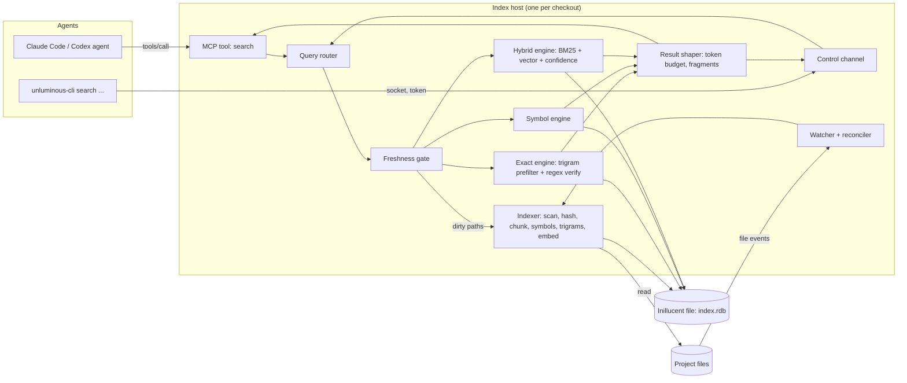
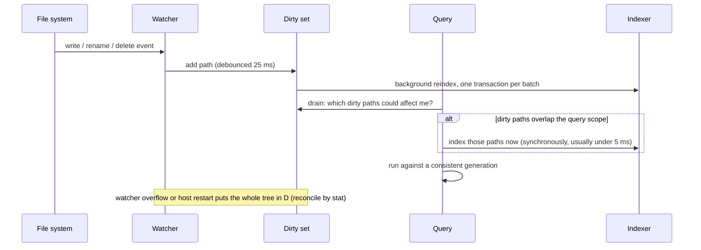
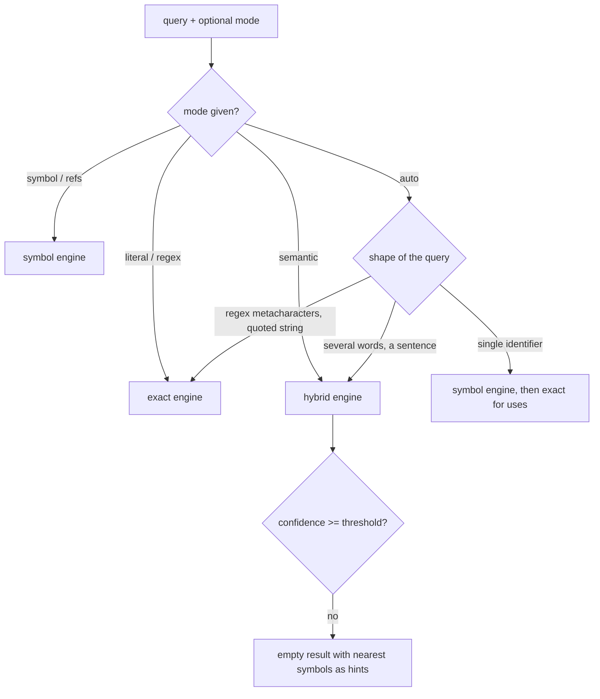
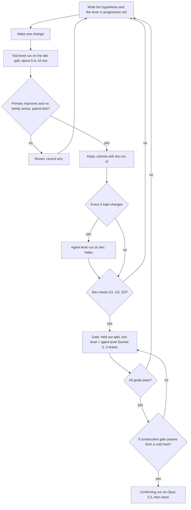

# task-2138: Unluminous code index on Inillucent

A local code index that agents query instead of ripgrep. It lives in Unluminous, stores everything in
one Inillucent file per checkout, and is reached through `unluminous-cli search`, one MCP tool, and an
agent skill. The work is driven by an evaluation harness and a measured improvement loop, in the same
way the LoRA work was, until three goals are met on a held out query set.

| | |
|---|---|
| Ticket | task-2138 (this design). The implementation ticket is linked in the task comments. |
| Code goes in | `C:/jason/dev/unluminous` (new crate `unluminous-index`, CLI area `search`, eval harness `tools/search-eval/`) |
| Database | Inillucent 2.0.2, through `inillucent-driver = "2.0.2"` from crates.io with the `embed` feature (R1) |
| Written | 2026-09-25, revised 2026-10-01 for Inillucent 2.0.2 (section 0) |

---

## 0. Revision of 2026-10-01: Inillucent 2.0.2 and the Labs page

The design above section 1 was written against `inillucent-driver` at git rev 6eaa12d, which had no
`embed()`, no facets and no blend weights. Inillucent 2.0.2 is released and installed on this machine,
so the design was checked against its docs (`C:/jason/dev/inillucent/docs`, tag `v2.0.2`) and against
how Claude Code really calls ripgrep. These are the changes. Each is also written into the section it
affects.

| # | What changed | Where | Effect on the design |
|---|---|---|---|
| R1 | The driver is on crates.io as `inillucent-driver = "2.0.2"`, with one feature, `embed`, that loads ONNX Runtime at run time (`load-dynamic`), so nothing is linked at build time | §6.1 | Unluminous moves from the git pin to the crates.io release, with `embed` on. The Database plugin moves with it, and its tests are the check that nothing it uses changed. |
| R2 | `inillucent_search` now takes `FACET` columns, `fusion = adaptive\|rrf\|weighted`, `vector_weight`, `rerank_depth`, a hidden `vector` column, `confidence()`, `score()` and `origin()` | §6.2 | The `passage` table is written in the 2.0.2 syntax. Facets are filters inside the search, so `lang`, `kind` and `path_prefix` filters do not cut results after ranking. |
| R3 | The `porter` tokenizer splits and keeps `snake_case` words, but does not split `camelCase` and has no prefix queries | §6.6 | The index still writes the split identifier words itself, into a `words` column. Only `camelCase`, `PascalCase`, digits and kebab names need splitting, because the engine splits snake case. |
| R4 | There is still no trigram tokenizer and no substring index; `LIKE '%x%'` is a full scan | §6.7 | Unchanged: the trigram posting lists are the index's own table and its own memory. |
| R5 | `snippet()` and `highlight()` do not exist on `inillucent_search` | §6.9 | Lines and fragments are cut in Rust from the stored blobs, which the design already did. |
| R6 | `embed()` serves `nomic-embed-text-v1.5` only (768 dims). A code model would need vectors made outside SQL. The model, the reranker `gte-reranker-modernbert-base` and the ONNX Runtime GPU build are all installed on this machine | §8.3 levers 8 to 10 | Lever 9 becomes "nomic against no vectors". Code models are recorded as out of reach for this ticket, because Unluminous would need its own ONNX runner. The reranker (lever 10) is measured with its latency beside it. On the CPU it costs 3 to 11 s a query, which no interactive search can spend, so it can only be kept if it runs on a GPU the person has, and only as an option that is off by default. |
| R7 | Embedding on the CPU through SQL runs at about 11 rows a second (`docs/embeddings.md`) | §6.4, §2.2 | Embedding is a background job after the exact, symbol and word indexes are ready, keyed by chunk hash so it is paid once per chunk across edits and worktrees. The 60 second cold build budget is for the index without vectors, as it always was. The host answers with `"vectors":"partial"` until embedding finishes. |
| R8 | `confidence()` does not separate answerable from unanswerable questions on keyword hits alone. It does at `vector_weight = 0.5` (answerable at or above 0.332, others at or below 0.235, rag-agent corpus) | §6.8, F8 | The F8 abstention rule is a loop lever measured with and without vectors. Without vectors, abstention falls back to "no chunk holds most of the query words". |
| R9 | A reader in another process waits for a writer, and there are no snapshot reads (roadmap item 3) | §4 | The one host per checkout design stands. The host does all reads and writes on one thread. Reindex batches are kept short so a query waits for at most one batch. |
| R10 | Claude Code's Grep tool does not use ripgrep's defaults. It runs the `rg` built into `claude.exe` (14.1.1, started with program name `rg` and `--no-config`) with `--hidden`, `--glob !.git` (and `.svn`, `.hg`, `.bzr`, `.jj`, `.sl`), `--max-columns 500`, and in content mode `--json -n`. Its default mode lists matching files, newest first, capped at 250 by `head_limit` | §6.3, §7.4 | The index's file set is Claude Code's: hidden files included, those six folders excluded, `.gitignore` honoured. The rg arm runs exactly that command. The F2 gold is that command's output. |
| R11 | `claude --bare` cannot use the OAuth login this machine has | §7.5 | Agent level runs use `--setting-sources ""`, `--strict-mcp-config` with an explicit `--mcp-config`, and `--tools` to fix the tool list. Measured: a session started this way inside the unluminous snapshot read 447 input tokens, so no `CLAUDE.md` is loaded. Both arms keep Claude Code's default system prompt, because that is what an agent really runs with; the harness records each arm's first turn input tokens, which differ only by the tool definitions. |
| R12 | The research is to be published as a Labs page in ai-service | §7.7 | `tools/search-eval/publish.mjs` writes `page.json` and `findings.json` into `ai-service/_supervised-learning/unluminous-code-index-study/published/`, served by the existing research media route. The page is a study in `ui/src/app/labs/page.tsx`, built like the RAG Techniques study (task-2157). Once deployed, each new run shows on prod without another deploy. |

## 1. Introduction

Agents on this machine find code with text search and then read whole files. The local transcripts
record 11,332 recursive `grep` calls, 18,294 more `grep` calls in pipes, 1,909 calls to Claude Code's
Grep tool (which is ripgrep), and 27,026 `cat` / `sed -n` / `head` / `tail` reads, across 1,071
sessions (counted from `~/.claude/projects/**/*.jsonl` on 2026-09-25). Every one of those searches walks
the tree again, prints every matching line with no ranking, and is usually followed by a read of a
whole file to find the one function that mattered.

This design builds an index that already knows the files, their symbols and their chunks, keeps itself
current as files change, and answers four kinds of question: exact text and regex (with results
identical to ripgrep), symbol definitions and references, questions written in plain English, and "show
me just this function". It is judged by an evaluation harness that runs ripgrep and the index on the
same questions, and by agents doing real tasks with one tool or the other.

## 2. Goals and non goals

### 2.1 The three goals, as written and as they will be measured

The ticket asks for "500% than ripgrep", "50% tokens" and "10% more accurate". Each needs a precise
definition before any number is taken, because the loop will optimise whatever the definition says.

| Goal | Measured as | Pass when |
|---|---|---|
| **G1 Speed: 500% faster than ripgrep** | Per query, the time from issuing the call to having the full result, for the exact and symbol families (§7.2, F1 to F4), where both tools answer the same question. Ripgrep arm: the `rg` binary Claude Code runs, spawned with the flags Claude Code's Grep tool uses. Index arm: an MCP `tools/call` to the running index host. | The geometric mean of the paired per query speed ratios is **at least 6.0x** (500% faster), and the lower end of its 95% bootstrap interval is at least 6.0x, on the medium and the large corpus, warm cache, both arms pinned to the performance cores. |
| **G2 Tokens: half of ripgrep's** | Agent level (§7.5): total tokens an agent processes to finish a task (input tokens including cache reads and cache writes, plus output tokens), from the usage block of each session, same model, same task, same instructions. | The index arm uses **at most 0.50x** the ripgrep arm's tokens (geometric mean of paired per task ratios), with the upper end of the 95% interval at or below 0.50x. Tasks either arm failed are reported separately and do not count toward the ratio. |
| **G3 Accuracy: 10% more accurate** | Agent level: task success rate, graded against gold (§7.3). Tool level: each family's declared primary metric (§7.4). | Agent task success is at least `min(1.10 x baseline, baseline + 0.5 x (1 - baseline))`, AND the weighted tool level primary metric clears the same bar, AND **no family is worse than ripgrep** (the exact family must match ripgrep on every query). |

Why the accuracy bar has a second term: if ripgrep's arm already solves 93% of tasks, a 10% relative
improvement would need 102%. In that case the bar becomes "fix half of the tasks ripgrep's arm got
wrong". The task set is fixed before the first run and never edited to move a number (§8.5).

Why speed is measured on F1 to F4 only: for a question written in English, ripgrep has no single call
that answers it, so there is no paired query to time. Agent wall clock time on those families is still
recorded and reported beside G1, but it is dominated by the model and does not count toward G1.

Why the index arm is timed through MCP: that is how an agent calls it. The ripgrep arm is timed as a
spawned process because that is how Claude Code calls it. The CLI arm (`unluminous-cli search`, which
also spawns a process) is reported beside both, so nobody mistakes the MCP number for the CLI number.

### 2.2 Other success criteria

- **Freshness: zero stale results.** After any sequence of file writes, renames, deletes, branch
  switches or generated file storms, a query issued immediately afterwards returns what ripgrep would
  return at that moment (§6.4, family F7).
- **Exact parity:** `search find --mode literal|regex` returns the same `(path, line)` set as `rg` on
  every F2 query, including encodings, binary files and ignore rules.
- **Cost of the index:** a cold build of ai-service in under 60 seconds without embeddings; an
  incremental update of one saved file visible to queries within 50 ms; the index host idles below 1%
  of one core and below 500 MB resident without the embedding model loaded. These are budgets the loop
  must stay inside, not targets to optimise.
- Every command reachable from the CLI and from MCP, documented in `unluminous-cli/docs/commands.md`,
  as Unluminous's own tests already enforce (§6.10).

### 2.3 Non goals

- Replacing Find in Files or Go to Definition inside the editor window. They can move onto the index
  later; this ticket does not change them.
- Type aware semantics (a compiler or language server). Unluminous chose a syntactic symbol tier in
  task-1675 and this design keeps that choice. Gold for symbol queries does come from compilers (§7.3),
  so the gap is measured.
- Indexing anything outside a project folder, remote repositories, or sharing an index between
  machines.
- Fetching anything from the network at runtime. Unluminous's rule "nothing is ever fetched" stands: the
  embedding model is used only if the person already installed it with `inillucent setup-embeddings`.

## 3. Problem statement

**Measured on this box, 2026-09-25**, `rg` 14.1.1 (the copy bundled in Claude Code), warm file cache,
10 timed runs after 2 warm ups, unpinned (indicative only, the harness in §7 does this properly):

| Repo | Searchable files | Bytes | `rg -n <identifier>` median | `rg -n -i watchdog` output |
|---|---|---|---|---|
| unluminous | 1,208 | 89.8 MB | 51.0 ms | 28,359 chars, about 8,100 tokens |
| inillucent | 3,713 | 63.7 MB | 80.3 ms | 0 |
| ai-service | 6,381 | 219.9 MB | 111.1 ms | 156,352 chars, about 44,700 tokens |

A call that fails immediately still costs 17 ms, which is the cost of starting the process on Windows.
So G1 asks for 8 to 18 ms end to end on these repos, which is only reachable by a process that is
already running and already holds the answer's inputs in memory.

The problems, without solutions:

1. **Every search is a full scan.** ripgrep walks the directory tree and reads every candidate file on
   every call. Nothing is kept between calls.
2. **Output is unranked and unbounded.** One case insensitive search on ai-service printed about 44,700
   tokens. The agent pays for every line, including matches in comments, tests, lock files and
   generated code, before it can decide which one matters.
3. **Text search cannot answer a question about meaning.** "Where do we retry a failed board write" has
   no literal string in common with the code that does it. The agent guesses words, searches several
   times, and reads files to check.
4. **Finding is followed by reading.** After a search, agents read whole files (27,026 reads recorded)
   to see one function. That read is usually the largest token cost of the search.
5. **A definition is not distinguished from a use.** `grep -rn resolveSkipToken` returns the definition,
   every call, every comment and every string with the same weight.

## 4. Architectural overview



- **One host process per checkout owns the Inillucent file.** Inillucent allows several processes on a
  file but a reader currently blocks behind a writer, so reads and writes go through the one process that
  also runs the watcher. The host is the Unluminous window when that window has the project open, and a
  headless `unluminous-cli search serve` process otherwise. A lock file makes sure there is only one.
- **CLI calls reach the host over a local socket**, the same way `unluminous-cli` already reaches a
  window (`<settings>/instances/<pid>.conf` holds a port and a token). If no host is running, the CLI
  starts one and waits for it. If the host cannot start, the CLI answers by scanning the files itself
  and says so in the result (`"index":"none"`), so a query never fails because the index is missing.
- **Every query passes the freshness gate** before it reads the index (§6.4).

## 5. What other tools do, and what this design takes from them

Condensed from the research notes in §13.

| System | How it indexes | Taken here |
|---|---|---|
| IntelliJ | A virtual file system snapshot refreshed by a native watcher (`fsnotifier`); file based indexes (including a trigram index behind Find in Path) and stub indexes of declarations; "dumb mode" while indexes rebuild, when index backed features are unavailable; each index has a version that forces a rebuild when it changes. | Index versioning per table; a reduced mode that answers from a direct scan instead of refusing; trigram index for text search. |
| VS Code | No persistent text index: search spawns ripgrep. File watching through `@parcel/watcher`. Symbols come from language servers. Copilot keeps a separate codebase index (remote or local embeddings). | Confirms ripgrep is the baseline agents get today. |
| Google Code Search, Zoekt, GitHub Blackbird | Trigram (Zoekt, Code Search) or ngram (Blackbird) posting lists; a regex is turned into a boolean trigram query that selects candidate files, which are then checked with the real regex. Zoekt ranks symbol definitions and whole word matches first. | The exact engine (§6.7), and ranking definitions above uses. |
| Cursor | Merkle tree of file hashes to find what changed; chunks at syntax boundaries; embeddings keyed by chunk hash so unchanged chunks are never embedded again. | Content hash keys for chunks and embeddings, shared across worktrees (§6.3). |
| Continue, Aider | Continue: chunks at syntax boundaries, SQLite full text search plus vectors, a cache keyed by content hash. Aider: a "repo map" of symbol signatures ranked by references. | Chunk headers that carry the enclosing signature; `outline` verb; reference counts as a ranking prior. |
| Claude Code | Uses agentic search (Grep, Glob, Read) and no vector index. Its authors say agentic search beat the vector retrieval they tried. | The index keeps exact search as a main path and treats semantic search as one engine among three. The goals are measured against exactly this baseline. |

## 6. Detailed design

### 6.1 Crates and where things go

| Location | What goes there |
|---|---|
| `crates/unluminous-index` (new, no window) | Scanner, hasher, chunker, symbol extraction adapter, trigram builder, storage schema, query engines, shaper, freshness gate, watcher, host loop. Depends on `unluminous-core` (tokeniser, `symbols`, plugin manifests) and `inillucent-driver`. |
| `unluminous-cli/src/catalogue.rs` | New area `search` with its verbs (§6.10). The MCP tool is generated from these rows. |
| `unluminous-cli` | `search serve` (headless host), client side of each verb, and the direct scan fallback. |
| `crates/unluminous-app` | The window starts a host for its open project and answers the `search` area through `app/cli.rs::run_cli`. |
| `tools/search-eval/` | The evaluation harness (§7) and the loop's records (§8). Its outputs go to the gitignored `_search-eval/` root. |
| `claude-settings` repo, skill `code-search` | The instructions that tell agents to use the index (§6.11). |

The `inillucent-driver` git pin is replaced by `inillucent-driver = { version = "2.0.2", features =
["embed"] }` (R1). New dependencies: `ignore` and `grep-searcher` / `grep-regex` (the crates ripgrep itself is built from,
which is what makes exact parity achievable), `regex-syntax` (to turn a regex into a trigram query),
`notify` (file events: `ReadDirectoryChangesW` on Windows, FSEvents on macOS), `blake3`.

### 6.2 Storage schema (Inillucent)

One file per checkout: `<cache dir>/unluminous/index/<blake3 of canonical root>/index.rdb`, outside the
repository so it never shows up in `git status` and never lands in a commit. `PRAGMA locking_mode =
exclusive`, because only the host opens it.

```sql
CREATE TABLE meta      (key TEXT PRIMARY KEY, value TEXT);          -- schema_version, versions of each engine, root, git common dir
CREATE TABLE file      (id INTEGER PRIMARY KEY, path TEXT UNIQUE, lang TEXT, size INTEGER,
                        mtime_ns INTEGER, content_hash BLOB, generation INTEGER, is_binary INTEGER,
                        is_generated INTEGER, line_count INTEGER);
CREATE TABLE blob      (content_hash BLOB PRIMARY KEY, bytes BLOB);  -- compressed text, shared by identical files
CREATE TABLE chunk     (id INTEGER PRIMARY KEY, file_id INTEGER, start_line INTEGER, end_line INTEGER,
                        kind TEXT, symbol TEXT, header TEXT, chunk_hash BLOB);
CREATE TABLE symbol    (id INTEGER PRIMARY KEY, name TEXT, name_lower TEXT, kind TEXT, file_id INTEGER,
                        line INTEGER, chunk_id INTEGER, is_definition INTEGER);
CREATE INDEX symbol_name ON symbol(name_lower);
CREATE TABLE trigram   (tri INTEGER PRIMARY KEY, postings BLOB);     -- delta+varint file ids, base segment
CREATE TABLE trigram_delta (file_id INTEGER PRIMARY KEY, tris BLOB, tombstone INTEGER); -- changed since last merge
CREATE VIRTUAL TABLE passage USING inillucent_search(header, body, words, lang FACET, kind FACET, path_prefix FACET,
                        dims = 768, fusion = 'adaptive', tokenize = 'porter');   -- 2.0.2 syntax (R2); vector is the hidden column
CREATE TABLE embedding_cache (chunk_hash BLOB PRIMARY KEY, model TEXT, vector BLOB);  -- reused across edits and worktrees
```

- **Trigrams are a normal table, because Inillucent has no trigram tokenizer** (it refuses
  `tokenize='trigram'`) and no substring index. A key lookup is Inillucent's fastest path (29.85x SQLite
  on point reads). Posting lists are kept as one base blob per trigram plus a per file delta table, which
  is merged into the base in the background. The host keeps the posting lists it has used in memory.
- **The `passage` table uses `inillucent_search`**, which gives BM25 and vector ranking in one query, a
  weighted blend of the two, filtering by facet inside the search, and `confidence()`, an absolute 0 to 1
  score that lets a search return nothing when nothing matches (1 confident answer out of 200
  unanswerable questions, against 200 of 200 for pgvector, per Inillucent's retrieval quality page).
- **`body` is stored already split into search words** (§6.6), because Inillucent's tokenizers do not
  split identifiers.
- **Blob content is stored in the index** so a query never has to read a file from disk to verify a
  match or return a fragment, except for files the freshness gate marks dirty.

### 6.3 Discovering files and detecting change

1. **The file set is exactly the one Claude Code's Grep tool searches** (R10): the `ignore` crate with
   ripgrep's ignore rules (`.gitignore`, `.git/info/exclude`, `.ignore`, `.rgignore`, binary detection
   by NUL byte), hidden files **included**, and `.git`, `.svn`, `.hg`, `.bzr`, `.jj` and `.sl` excluded,
   which is what `rg --hidden --glob !.git ...` gives.
   Nested git worktrees under a project are excluded by `.git/info/exclude` on this machine already, and
   the ripgrep arm in the harness searches the same set.
2. **Change detection is by stat, then content.** `(size, mtime)` unchanged means unchanged. Otherwise
   hash with blake3. In a git checkout, the index tree's blob ids from `git ls-files -s` let a new
   worktree reuse every chunk and embedding another checkout of the same repository already made
   (`embedding_cache` is keyed by chunk hash and lives in a shared file per git common dir).
3. **Generated and huge files** (lock files, minified bundles, files over 1 MB or with lines over 4 KB)
   are indexed for exact search, so parity holds, and excluded from `passage` and `symbol`, so they
   never outrank source.

### 6.4 Freshness: watcher, reconciler, and the gate every query passes



- **Events are hints, not truth.** The watcher adds paths to a dirty set. Rename and delete events,
  events for directories, and a watcher buffer overflow (which `ReadDirectoryChangesW` reports) mark a
  whole directory for reconciliation by stat.
- **The gate:** before a query runs, any dirty path inside the query's scope is reindexed first. So an
  agent that writes a file and searches straight away sees its own write. This is the rule that makes F7
  (§7.2) pass with zero stale results; the background indexer only makes the gate cheap.
- **Branch switches and mass changes** (a `git checkout`, a build that writes 5,000 files): when the
  dirty set is larger than a threshold (start at 500 paths), queries in the affected scope are answered
  by the direct scan engine over those paths plus the index for the rest, and the result carries
  `"freshness":"partial-scan"`. This is IntelliJ's dumb mode, except that the query is answered
  correctly instead of refused.
- **On host start**, reconcile the whole tree by stat before serving index answers, and answer from a
  direct scan until that finishes.
- **Versioning:** `meta.schema_version` and one version per engine (chunker, tokenizer, trigram,
  embedding model id). A changed version rebuilds that engine's tables only.

### 6.5 Chunking

Unluminous has no parser and task-1675 rejected tree-sitter, so chunking uses what `unluminous-core`
already has: the tokeniser (which knows strings and comments, so bracket matching inside it is reliable)
and each language plugin's `language.definers`.

1. Find definition starts with `unluminous_core::symbols`.
2. Extend each definition to its end by matching brackets in the token stream, or by indentation for
   Python and YAML.
3. Chunks follow the cAST method: walk definitions from the outside in, merge neighbouring small
   definitions into one chunk up to the budget, and split a definition that is over the budget at the
   definitions or blank lines inside it. Each piece carries its enclosing signatures as its `header`. The
   budget is counted in non whitespace characters so it means the same thing in every language. Start
   at 2,000 characters: a 2026 study found one chunk per function scored 3.6 to 5.6 points lower than
   merged chunks, and chunk size between 1,000 and 3,000 characters moved results by under 2 points.
4. Code between definitions (imports, module comments) becomes its own chunk.
5. Files with no plugin (Markdown, plain text) are chunked by heading, then by paragraph, then by a line
   window.
6. `header` = relative path + enclosing definition signatures. It is indexed with the body, because
   "which file and which function" is often the most useful word match.

Chunk budget, overlap and header content are loop levers (§8.3), not fixed decisions.

### 6.6 Search words for code

Each chunk's `body` is written with every identifier kept whole **and** split into parts:
`resolveSkipToken` gives `resolveskiptoken resolve skip token`; `MAX_RETRY_COUNT` gives
`max_retry_count max retry count`; `unluminous-cli` gives `unluminous-cli unluminous cli`. Queries are
split the same way. Whole identifiers are matched first. Numbers and paths stay as written.

At 2.0.2 (R3) the `porter` tokenizer already splits `snake_case` and keeps the whole word, but leaves
`camelCase` whole and has no prefix queries. So the split words go into their own `words` column, and
only the splits the engine does not make are written there: case changes, digits and hyphens.

### 6.7 The exact engine (literal and regex, same results as ripgrep)

1. Parse the pattern with `regex-syntax`, the parser ripgrep's regex engine uses.
2. Turn the parse tree into a boolean trigram query (the method from Russ Cox's Code Search): a literal
   gives an AND of its trigrams, an alternation gives an OR, a part that cannot be bounded gives "any".
3. Look up posting lists (from memory, falling back to the `trigram` table), intersect, subtract
   tombstoned files, add dirty files.
4. Verify every candidate against the stored content with `grep-searcher` and `grep-regex`, with
   ripgrep's defaults for encoding, line terminators and binary handling, in parallel across cores.
5. A pattern with no usable trigram (for example `\w+`) skips step 3 and verifies every file from the
   content held in memory. That is still faster than ripgrep because nothing is walked or spawned.

Results are ranked when the caller asks for ranked output: definitions before uses, source before tests
and generated files, whole word before substring. The exact set is never trimmed silently. When a
budget cuts the output, the reply says how many hits in how many files were left out.

### 6.8 The query router and the other engines



- **Symbol engine:** `symbol` table lookup by exact name, then case insensitive, then by parts of the
  name. References are the exact engine run as a whole word search, ranked by the symbol's file and
  import graph (`unluminous_core::imports`).
- **Hybrid engine:** `inillucent_search` over `passage` with the split words and, when the embedding model
  is installed, `embed(query)`. The vector weight, the confidence threshold and the reranking priors
  (definition, path depth, reference count, recency in git) are loop levers.
- **The router's rules are a loop lever too**, with one constraint enforced by the harness: a rule may
  not contain a literal string taken from any query set (§8.5).

### 6.9 Result shaping and the token budget

Most of G2 comes from here and from `fragment`, because reading whole files is the largest cost today.

- Default output groups hits by file: the path once, then `line: text` rows with each line trimmed to 160
  characters around the match. There is no JSON punctuation in the text form, which costs tokens.
- Every call takes `budget` (tokens, default 1,500). The shaper fills it best first and ends with one
  line such as `+214 hits in 37 files not shown; narrow with path= or kind=`.
- `fragment` returns one chunk with line numbers and its header, so the agent gets the function without
  reading the file. `outline` returns a file's definitions, one line each.
- `--json` gives the structured form for programs, as every Unluminous command does.
- The token cost of the MCP tool's own description is counted by `unluminous-cli mcp tools --count` and
  budgeted at 600 tokens, because it is paid on every agent turn.

### 6.10 Interfaces

One area, `search`, in the catalogue. The grouped MCP shape makes it one tool with a `verb` field.

| Verb | Arguments | Returns |
|---|---|---|
| `search find <query>` | `--mode auto\|literal\|regex\|symbol\|semantic`, `--path <glob>`, `--lang`, `--kind code\|test\|docs`, `--case`, `--budget`, `--limit` | ranked hits grouped by file |
| `search def <name>` | `--lang`, `--path` | definition locations with signature lines |
| `search refs <name>` | `--path`, `--budget` | uses, grouped by file, definitions excluded |
| `search fragment <path:line \| chunk id>` | `--context <lines>` | the enclosing chunk with line numbers |
| `search outline <path>` | | the file's definitions |
| `search files <query>` | `--limit` | file paths ranked by fuzzy path match (replaces Glob) |
| `search status` | | host, generation, dirty count, freshness mode, index size, versions |
| `search serve` / `search build` / `search forget` | `--root` | run the headless host / rebuild / delete this checkout's index |

Each verb needs a catalogue row, a `run_cli` arm, a section in `unluminous-cli/docs/commands.md`, and
an agent study scenario, as `CONTRIBUTING.md` and Unluminous's tests require.

### 6.11 Getting agents to use it

A tool agents do not call has no effect, and the transcripts show agents mostly use `grep` in Bash even
when a Grep tool exists. Three things ship with the feature:

- A `code-search` skill in `claude-settings` (shared with Codex through the existing junctions) that
  says when to use each verb and to prefer `fragment` over reading a whole file.
- The MCP server registered at user scope, as the `firefox` one is.
- A short section in the global `CLAUDE.md` naming the tool.

The agent level evaluation (§7.5) gives both arms the same instructions apart from the tool names, so
the skill's wording is measured and is itself a loop lever.

### 6.12 Security and data handling

- The index holds plain text copies of source files. It lives under the user's local cache directory,
  never inside the repository, with user only permissions. `search forget` deletes it.
- Nothing leaves the machine. Embedding runs in process with a model the person installed.
- The index host listens on localhost only and requires the same per instance token as the existing
  control channel.
- The file set is ripgrep's, so the index never contains a file that ripgrep would not search. Files
  that ripgrep would search but that look like secrets (`.env*`, `*.pem`, `id_*`) are kept for exact
  search, so parity holds, and excluded from `passage` and embeddings.

## 7. Evaluation framework

`tools/search-eval/` in Unluminous. It follows the methods Inillucent's `inillucent-bench` already uses
(declared primary metric per family, paired bootstrap, fixed seed, answers compared before timing) and
the LoRA eval rules (frozen instruments, a held out set, never edit a rubric to move a score).

### 7.1 Corpora (pinned commits)

| Tier | Corpus | Why |
|---|---|---|
| small | `unluminous` at a pinned commit | Rust, the product's own code |
| medium | `ai-service` at a pinned commit | TypeScript and Node, the largest local repo, many tickets |
| medium | `inillucent` at a pinned commit | Rust, deep module tree |
| large | `torvalds/linux` at a pinned tag (timing, F1, F2, F7 only) | about 80,000 files, where a full scan costs the most |

Each corpus is checked out into `_search-eval/corpora/<name>@<sha>` by the harness. Queries are always
run against that snapshot, never against a live checkout another agent is editing.

### 7.2 Query families

| Family | Question | Source of queries | Gold | Declared primary metric |
|---|---|---|---|---|
| F1 identifier | "where is `X`" for a real identifier | symbol table of each corpus, stratified by how many times the name occurs | compiler indexes: `scip-rust` / `rust-analyzer scip` for Rust, `scip-typescript` for TypeScript | definition found at rank 1 (accuracy@1) |
| F2 exact | literal and regex patterns | **replayed from real agent calls**: every `grep -r` / `rg` / Grep pattern in the local transcripts that targeted one of these repos, deduplicated | ripgrep's own output on the snapshot | exact `(path,line)` set equality; must be 100% |
| F3 references | "all uses of `X`" | same names as F1 | compiler index references | recall of reference locations, then precision |
| F4 files | "the file that ..." by name fragment | Glob calls and `find -name` calls in transcripts | the path that the agent then read | file found in top 3 |
| F5 localisation | a ticket description, "where would this change go" | Tasks board tickets whose commits reference `task-N` in these repos; the corpus is indexed at the parent commit | files (and functions) the commit changed, excluding docs and lock files; commits touching more than 25 files are dropped | file recall@5 |
| F6 concept | a question in plain English about behaviour | written by a model from a chunk, told not to reuse its identifiers, then checked by a second model that the chunk answers it | the source chunk (and any chunk the checker names as equally correct) | nDCG@10 at chunk level |
| F7 freshness | a scripted edit sequence (write, rename, delete, branch switch, 5,000 generated files), then a query at once | scripted | ripgrep run at that same moment | stale or missing results: must be 0 |
| F8 unanswerable | a question about something not in the repo | written, then confirmed absent by ripgrep over its key words | an empty result | correct abstention rate |

Weak labels are available for F2 and F4 for free: the file the agent read straight after a search is
evidence of which hit mattered. They are used to rank, never as the exactness gold.

Family weights for the "weighted" figures are the share of each kind of search in the real transcripts,
computed once and frozen in the manifest.

### 7.3 Building the gold, and what can bias it

- F1 and F3 gold comes from a compiler index, so the syntactic symbol engine is measured against
  something stronger than itself.
- F2 and F7 gold is ripgrep's output, because the claim for those families is parity.
- F5 comes from history, so neither arm wrote it. Leakage is prevented by indexing the parent commit.
- F6 is the one family a model writes. Its bias is that a question written from a chunk shares words
  with it, which favours word search. Two counters: the writer is told not to use identifiers from the
  chunk, and F6 is never more than 20% of the weighted figure.

### 7.4 Tool level arms and metrics (the inner loop, minutes per run)

Arms, all against the same snapshot and the same file set:

| Arm | How it is called |
|---|---|
| `rg` | the ripgrep inside `claude.exe`, started with program name `rg` and `--no-config`, with Claude Code's Grep flags (R10): `--hidden`, the six version control folder exclusions, `--max-columns 500`, and `--json -n` in content mode. F2 timings use content mode, because that is the mode that returns the lines the index returns. For F5, F6 and F8, the rg arm is the **replay of the Grep calls a baseline agent actually made** for that question in the agent level runs, so it is the real behaviour and not an invented keyword strategy. |
| `index-mcp` | `tools/call` over stdio to a running host (primary) |
| `index-cli` | `unluminous-cli search ...` spawned per call (reported, not gated) |
| `index-noembed` | the MCP arm with embeddings off, so the value of the model is known |

Recorded per query: the result, a digest of the result, wall time, the result's token count (counted
with Anthropic's token counting endpoint on a cached, sampled basis, and a fixed local approximation
calibrated against it for the rest), and the family metric.

### 7.5 Agent level (the real test of G2 and G3)

- Runner: `claude -p --output-format stream-json`, fresh session per task, working directory = the
  corpus snapshot.
- Baseline arm tools: Claude Code's Grep, Glob and Read. Index arm tools: the `search` MCP tool and
  Read. Bash is off in both, so neither can go around its tools. The instructions differ only in the tool
  names.
- Tasks: F5 tickets ("name the files and functions that must change") and F6 questions ("answer, and
  cite `path:line`"), from the held out split at the gate, from the dev split in the loop.
- The agent must end with a JSON block `{files, locations, answer}`. Files and locations are graded
  automatically against gold. Free text answers are graded by a separate grader agent with a hashed
  rubric that never sees which arm produced the answer.
- Tokens and wall time are read from each session's usage. Every session transcript is kept.
- Models: Claude Haiku 4.5 in the inner loop (cheap enough to run often), Claude Sonnet 5 at the gate,
  and one confirming gate run on Claude Opus 5.5 before the ticket is closed.
- Draws: 3 per task per arm at the gate, because one draw of an agent is noise (the LoRA acting
  baseline moved 84.5 to 94.6 between draws).
- Usage: the runner stops scheduling sessions when the Claude usage (read only through
  `backend/claudeUsageCache.cjs`, never directly) passes 80% of the weekly limit, and resumes when it
  drops.

### 7.6 Statistics and measurement rules

These come from mistakes already made on this machine. Each is enforced by the harness, not by memory.

| Rule | How the harness enforces it |
|---|---|
| Compare answers before reading a clock | a timing counts only if the arm's result digest matches the expected one for exact families; a mismatch is a failure row, never a missing row |
| Pin both arms to the same core class | both the rg child and the index host are started with the performance core affinity mask (logical 0, 1, 10 to 13, 22, 23 on this Core Ultra 9 285) |
| A busy box inflates ratios | the harness records a quiet reference and refuses to grade (exit 4, "NOT GRADED") when the rg arm's reference queries run more than 3% slower than it; long runs ask for a quiet window through the task comment protocol |
| One run clearing a bar is not a result | every gate figure is printed with its 95% interval and the spread across 3 runs |
| Ratios travel with absolutes | every table prints both arms' milliseconds and tokens beside the ratio |
| No family may regress | the per family table is printed before the weighted figure, and the gate reads it first |
| Paired statistics | paired bootstrap, 10,000 resamples, seed `20260925`; verdicts better / worse / equivalent / inconclusive, as in `inillucent-bench` |
| "Did not run" is not "could not complete" | a query that errors, times out or crashes the host is scored as a failure and listed |

### 7.7 Output

Each run writes `_search-eval/runs/<unix time>-<unluminous sha>/`: `manifest.json` (corpora shas,
query set hashes, config hash, machine, quiet reference), `per-query.jsonl`, `scorecard.md` (the three
goals with intervals, the per family table, absolutes) and the agent transcripts for agent level runs.
`scorecard.md` of the latest gate run is copied to `tools/search-eval/SCORECARD.md` and committed, so the
repository always shows the current state of the three goals.

**The Labs page (R12).** `tools/search-eval/publish.mjs` writes two files into
`C:/jason/dev/ai-service/_supervised-learning/unluminous-code-index-study/published/`:

- `page.json` holds the numbers, all of them read out of run folders: the ripgrep baseline per family and
  corpus, the three goals with both arms' absolutes and intervals, the per family table, and every row of
  `progression.md`.
- `findings.json` holds the written conclusions, kept apart so the words can change without a new run.

The ai-service backend serves both through `GET /research/unluminous-code-index/media?path=...`, after one
entry is added to the `STUDIES` map in `backend/src/services/research.service.ts`. The UI study is
`ui/src/components/research/CodeIndexGallery.tsx`, registered in `ui/src/app/labs/page.tsx`, and it holds
no literal numbers. Publishing runs after every kept change and every gate run, so the page shows the loop
as it goes.

## 8. The improvement loop

The same shape as the supervised learning and LoRA work: one change at a time, measured against the
incumbent, kept only if it wins, written down either way.



### 8.1 Splits

Every family is split 70% dev and 30% held out, by ticket for F5 and by file for the rest, so a file's
questions never sit on both sides. The held out query files are hashed into the manifest. In the loop
the harness shows only aggregate numbers for the held out split, never per query rows, so a change cannot
be fitted to it.

### 8.2 Records

`_search-eval/progression.md` is appended on every iteration: number, hypothesis, lever, the change
(commit sha), dev results beside the incumbent's, verdict, and what was learnt. `results.json` holds the
incumbent's config and the history. This is what the next agent reads if the ticket is resumed.

### 8.3 Levers, in the order to try them

| # | Lever | Mostly moves |
|---|---|---|
| 1 | Host holds posting lists and content in memory; parallel verification | G1 |
| 2 | Output format: grouping, line trimming, default budget, the "more" line | G2 |
| 3 | `fragment` and `outline` wording in the skill and tool description, so agents use them instead of Read | G2 |
| 4 | Ranking priors: definition first, source above tests and generated files, reference counts | G3 |
| 5 | Identifier splitting details and whole identifier boost | G3 |
| 6 | Chunk budget, split rule, header contents | G3, G2 |
| 7 | Router rules for `auto` | G3 |
| 8 | Hybrid vector weight and confidence threshold | G3 |
| 9 | Embedding model: `nomic-embed-text-v1.5` (what Inillucent ships) against code models small enough for a CPU, loaded through Inillucent's model manifest: `CodeRankEmbed` (137M, 8,192 tokens, 60.1 nDCG@10 on CoIR) and `jina-embeddings-v2-base-code` (161M, 8,192 tokens). Only if the person has installed the model; Unluminous never downloads one. | G3 |
| 10 | A small cross encoder reranker over the top 30 hybrid hits (Anthropic's Contextual Retrieval measured a reranker taking top 20 failures from 49% fewer to 67% fewer) | G3 |
| 11 | Freshness gate thresholds | cost budgets |

### 8.4 Stop condition

The ticket is done when the held out gate passes G1, G2 and G3 on three consecutive gate runs, each from
a cold host, and the confirming Opus run agrees. If a goal cannot be reached by construction (for
example, on the small corpus the process start cost of the rg arm is most of its time), the scorecard
says so with the numbers, and the gate is still run on the corpora where it can be met. A goal is never
redefined after the first gate run.

### 8.5 Rules that keep the loop from fitting the test

- The query sets, gold and rubrics are frozen and hashed before the first run. A changed hash fails the
  run.
- No rule, weight or synonym in the product may contain a string that appears in a query set. The
  harness greps the product source for every query string and fails the run on a hit.
- A change that improves the dev split and worsens the held out split at the next gate is reverted.
- A number that got better while the box got busier is not believed (§7.6).

## 9. Alternatives considered

| Option | For | Against | Decision |
|---|---|---|---|
| Keep using ripgrep, only add result shaping | no index to keep fresh | cannot reach G1 (every call walks the tree and pays process start); cannot answer F5, F6 or F8 | rejected; shaping is kept as part of this design |
| Vector search only (Cursor style) | good at F6 | loses exact parity; the Claude Code team reports agentic grep beat vector retrieval | rejected; vectors are one engine of three and optional |
| Tree-sitter for chunks and symbols | better spans for every language | task-1675 rejected it for Unluminous: grammars are code, need compiling or shipping per language, and plugins are data only | rejected for this ticket; the chunker is behind an interface so it can be revisited with evidence from F1 and F6 |
| Language server (LSP) or SCIP at runtime | type correct references | needs a language server per language running, slow start, not every project builds | rejected at runtime; SCIP is used for the eval gold only |
| Add a trigram tokenizer to Inillucent itself | FTS5 could answer substrings | changes a separately released database, its conformance suite and its release; ties this ticket to that release | not in this ticket; recommended as a follow up if the trigram table becomes a bottleneck |
| Zoekt or another external engine | mature | a separate server, another language runtime, not Inillucent, against the ticket's request | rejected |
| Index inside `.unluminous/` in the project | easy to find | appears in the working tree, is copied by worktrees, may be committed | rejected; stored in the cache directory |
| Every process opens the `.rdb` directly | no host process | Inillucent readers block behind a writer today; watchers in several processes would fight | rejected; one host per checkout |

## 10. Testing strategy

Functional tests that run the real host against a real folder. No mocks of Inillucent or the file
system.

- **Exact parity test:** for a fixed set of patterns (literals, regexes, case flags, Unicode, CRLF files,
  UTF-16 files, binary files, files over 1 MB, nested `.gitignore`), the index result equals `rg` output on
  a fixture tree. Runs in `cargo test -p unluminous-index`.
- **Freshness test:** write a file, query at once, expect the new line. Rename, delete, create 5,000 files
  in one burst, simulate a watcher overflow, switch a git branch in a fixture repo; after each, compare
  with a direct scan. Zero differences allowed.
- **Crash test:** kill the host during a write transaction; restart; the index reconciles and answers
  match a direct scan.
- **CLI and MCP test:** each verb through `unluminous-cli` against a running host, and the same through
  the generated MCP tool, with `--json` output checked field by field.
- **Fallback test:** no host and a locked index: the CLI still answers from a direct scan and says
  `"index":"none"`.
- **Agent study scenarios** in `tools/agent-study/scenarios.json` for each verb, graded by reading state
  back, as every other Unluminous area does.
- **The eval harness has tests of its own:** a corrupted gold file, a changed query hash, a busy box
  reference and a crashed arm must each produce the documented failure, not a score.

Per Unluminous's `CONTRIBUTING.md`, speed is asserted in tests as work done (files verified, postings
read), never as milliseconds. Milliseconds are the harness's job.

## 11. Implementation order (one ticket)

1. Harness first: corpora, query mining from transcripts and tickets, SCIP gold, the rg arm, the
   scorecard. Record the rg baseline on every family before any index code exists.
2. `unluminous-index`: scanner, schema, trigram exact engine with parity tests.
3. Host, watcher, freshness gate, `search serve`, CLI and MCP verbs, fallback.
4. Symbols, chunker, split words, `passage` table, hybrid engine, `fragment`, `outline`, shaping.
5. The skill, MCP registration, docs.
6. The loop (§8) until the stop condition.
7. Release Unluminous with `pwsh tools/release.ps1 -Part minor` and confirm the installed build answers
   `search status`.

## 12. Risks and open questions

- **G1 on the small corpus** may be limited by what is left of the rg arm once process start is removed.
  The scorecard reports each tier, and §8.4 covers a goal that cannot be met by construction.
- **Inillucent readers block behind a writer.** The single host design avoids it; a large reindex must
  be done in short transactions so queries interleave.
- **Embedding model size (about 1.9 GB resident).** The host loads it on demand and unloads it when
  idle (`INILLUCENT_EMBED_RESIDENCY=idle:300s`). If `index-noembed` meets G3, embeddings stay optional.
- **Agent level runs cost usage.** Inner loop runs are tool level only; agent runs are scheduled with the
  usage guard in §7.5.
- **Interpretation of the goals.** §2.1 states the definitions used. If a different reading was intended
  (for example, 500% measured on agent wall time), it should be changed before the first gate run, never
  after.

## 13. Research notes

Sources for §5 and the numbers used elsewhere. Items marked "vendor" are self reported and were not
reproduced.

**IntelliJ.** The VFS keeps a persistent snapshot and reconciles with disk on refresh; `fsnotifier` is a
native child process that reports changed paths so a refresh rescans only those
([VFS](https://plugins.jetbrains.com/docs/intellij/virtual-file-system.html)). File based indexes are
map/reduce over files; each declares `getVersion()` and a mismatch forces a rebuild
([file based indexes](https://plugins.jetbrains.com/docs/intellij/file-based-indexes.html)). Stub
indexes hold declarations only; during indexing ("dumb mode") index queries throw
`IndexNotReadyException` ([stubs](https://plugins.jetbrains.com/docs/intellij/indexing-and-psi-stubs.html)).
`TrigramIndex` stores sorted, delta compressed file lists per trigram, and Find in Path intersects them
before running the real match
([source](https://github.com/JetBrains/intellij-community/blob/master/platform/indexing-impl/src/com/intellij/find/ngrams/TrigramIndex.java)).

**VS Code and Copilot.** Search runs a bundled `rg` ([vscode-ripgrep](https://github.com/microsoft/vscode-ripgrep)).
File watching is `@parcel/watcher` in a separate process
([watcher internals](https://github.com/microsoft/vscode/wiki/File-Watcher-Internals)). Copilot uses a
remote index for GitHub hosted repositories and a local semantic index otherwise
([workspace context](https://code.visualstudio.com/docs/agents/reference/workspace-context)).

**Trigram and ngram engines.** Russ Cox turns a regex into an AND/OR trigram query and runs the regex on
the survivors; his example narrows 36,972 files to 25 ([regexp4](https://swtch.com/~rsc/regexp/regexp4.html)).
Zoekt stores positional trigram postings at about 1.2x the corpus size
([design](https://github.com/sourcegraph/zoekt/blob/main/doc/design.md)). GitHub's Blackbird is a Rust
engine on sharded ngram indexes, because plain trigrams are not selective enough for short tokens
([GitHub blog](https://github.blog/engineering/architecture-optimization/the-technology-behind-githubs-new-code-search/)).
livegrep uses a suffix array over all source
([Nelson Elhage](https://blog.nelhage.com/2015/02/regular-expression-search-with-suffix-arrays/)).

**Cursor, Aider, Serena, claude-context.** Cursor keeps a Merkle tree of file hashes, chunks by syntax
and embeds only changed chunks ([Cursor](https://cursor.com/blog/secure-codebase-indexing)); it reports
semantic search plus grep raised its internal accuracy metric by 12.5 points
([Cursor](https://cursor.com/blog/fast-regex-search), vendor). Aider ranks tree-sitter tags with PageRank
into a token budget ([repo map](https://aider.chat/2023/10/22/repomap.html)). Serena exposes language
server symbol tools over MCP ([Serena](https://github.com/oraios/serena)). zilliz claude-context (BM25
plus vectors, Merkle tree sync) reports **39.4% fewer tokens and 36.1% fewer tool calls** than grep only,
on 30 SWE-bench Verified instances
([blog](https://zilliz.com/blog/why-im-against-claude-codes-grep-only-retrieval-it-just-burns-too-many-tokens),
[eval code](https://github.com/zilliztech/claude-context/tree/master/evaluation), vendor). That is the
only published token figure found, and it is short of G2's 50%, which is why §6.9 treats `fragment` and
output shaping as the main token levers rather than retrieval alone.

**Claude Code.** "Early versions of Claude Code used RAG + a local vector db, but we found pretty quickly
that agentic search generally works better" ([Boris Cherny](https://x.com/bcherny/status/2017824286489383315)).

**Chunking.** cAST merges sibling AST nodes up to a size limit counted in non whitespace characters:
RepoEval Recall@5 up 1.8 to 4.3 points ([arXiv 2506.15655](https://arxiv.org/abs/2506.15655)). A 2026
study found function level chunks 3.57 to 5.64 points below declaration, sliding window or cAST chunks;
size from 1k to 3k characters moved results at most 1.9 points; more retrieved context (2,048 to 8,192
tokens) added up to 4.2 points ([arXiv 2605.04763](https://arxiv.org/abs/2605.04763)). Anthropic's
Contextual Retrieval: embeddings cut top 20 failures by 35%, plus contextual BM25 49%, plus a reranker 67%
([Anthropic](https://www.anthropic.com/news/contextual-retrieval)).

**Local code embedding models.** CodeRankEmbed, 137M, 8,192 context, 77.9 MRR on CodeSearchNet and 60.1
nDCG@10 on CoIR, needs a query prefix ([model card](https://huggingface.co/nomic-ai/CodeRankEmbed)).
jina-embeddings-v2-base-code, 161M, 8,192 context
([model card](https://huggingface.co/jinaai/jina-embeddings-v2-base-code)). nomic-embed-code is 7B and
needs a GPU ([model card](https://huggingface.co/nomic-ai/nomic-embed-code)). voyage-code models are API
only, so they are out of scope.

**Localisation benchmarks.** LocAgent: 94.16% file level Acc@5 on SWE-bench Lite with Claude 3.5
([arXiv 2503.09089](https://arxiv.org/abs/2503.09089)). SweRank: 82.12% Acc@10 retrieval alone
([arXiv 2505.07849](https://arxiv.org/abs/2505.07849)). CoIR ([arXiv 2407.02883](https://arxiv.org/abs/2407.02883)),
CodeSearchNet ([arXiv 1909.09436](https://arxiv.org/abs/1909.09436)), RepoQA
([arXiv 2406.06025](https://arxiv.org/abs/2406.06025)) and CodeRAG-Bench
([arXiv 2406.14497](https://arxiv.org/abs/2406.14497)) measure retrieval quality, not agent token cost.
F5 in §7.2 follows the SWE-bench localisation method on this machine's own ticket history.

**ripgrep.** Finite automata regex with no backtracking, literal extraction with SIMD matching, parallel
traversal through the `ignore` crate ([burntsushi](https://burntsushi.net/ripgrep/)). Its published
numbers are all warm cache; none compare it against a prebuilt index.
