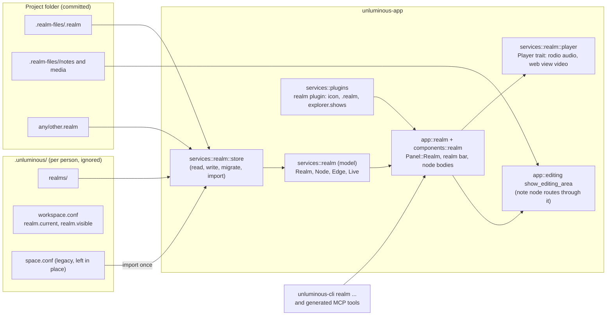
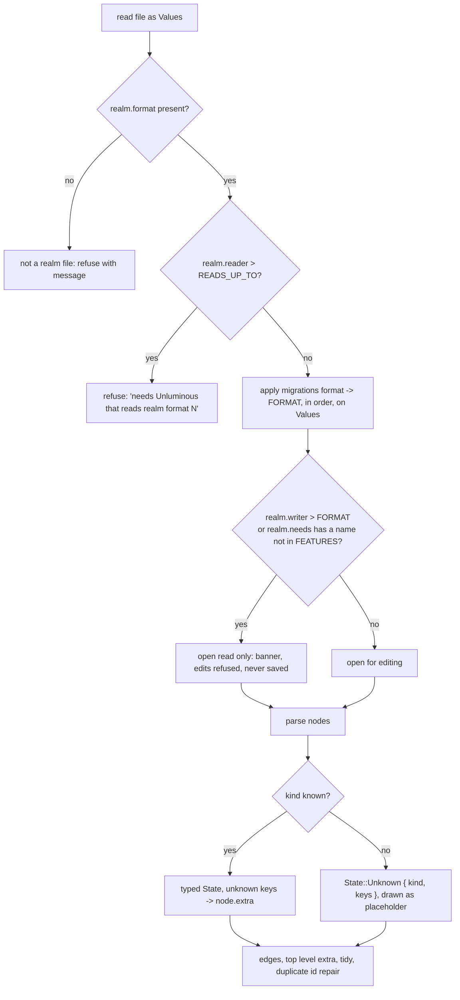
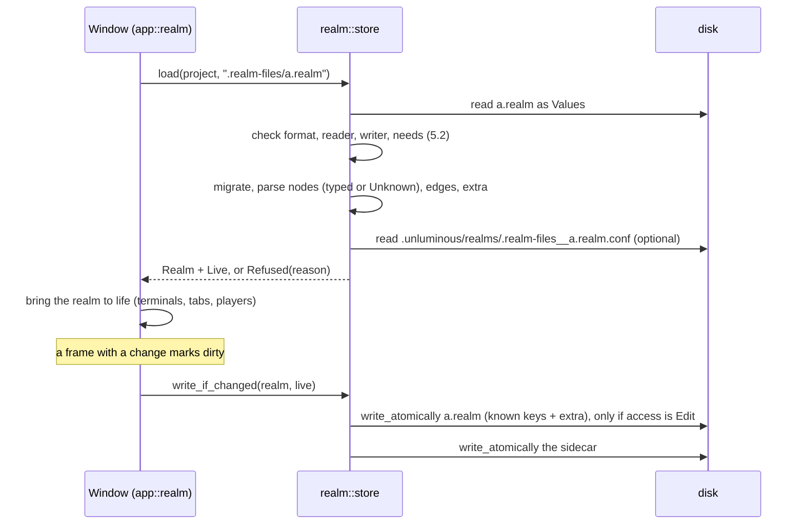

# task-2199: Realm, the Base of Infinite Space as files in the project

Status: design. Implementation is **task-2202** on Opus 5.5. This document is also in the notebook at
`/notebook?noteId=5f87ed33-31ed-48b9-906b-5a651a5bc6ec`.
Research behind this design: `C:\jason\dev\ai-service\_agent_output\task-2199-realm\` holds the
codebase survey (`codebase-survey.md`), the online format research with a URL for every claim
(`format-research.md`), and the icon work (`icon\ICON-REPORT.md`).

## 1. Introduction

The Base of Infinite Space (task-1904) is one canvas per project, stored as `.unluminous/space.conf`,
a personal file that git ignores. It cannot hold a picture, a sound, a video or a markdown note, it
has no version, and an older build that opens a file written by a newer build silently deletes every
node it does not recognise on its next save.

This design renames the feature to **Realm**, turns the one canvas into any number of `.realm` files
inside the project (by default under `.realm-files/`), adds image, audio, video and note nodes, ships
the file type as a bundled plugin with its own icon, and defines the compatibility rules that let old
and new builds share a realm file without losing anything. The on disk format stays the `name = value`
text that every Unluminous state file already uses, because the ticket asks for "basically the same
type of format we have now" and the repository's rule is that formats are plain text written by hand.

## 2. Goals and non goals

Goals, each testable:

1. Every user visible "Base of Infinite Space" becomes "Realm": menu, rail tooltip, dock label, CLI
   area, documentation, pictures. Code identifiers follow (`Panel::Realm`, `services::realm`).
2. A project can hold many realm files. New ones go to `<project>/.realm-files/<name>.realm`. A
   `.realm` file anywhere in the project opens in the Realm panel. The panel's view bar lists the
   project's realm files instead of the views inside one file.
3. Four new node kinds: `image`, `audio` (with play, pause, seek, volume), `video` (with the same
   controls) and `note` (the file editor on a markdown file, nameable, with the raw, side by side
   and preview icons at the top right of the node).
4. A bundled plugin `realm` claims `.realm`, supplies the icon the explorer and tabs draw, gates the
   panel the way the Agent Tasks plugin gates its pane, and makes the explorer show `.realm-files/`.
5. Compatibility, in both directions:
   - a new build opens every file an older build wrote, including today's `space.conf` (imported
     once into realm files);
   - an old build opens a file a newer build wrote, shows nodes of a kind it does not know as
     placeholders, keeps every key it does not understand, and writes all of it back unchanged;
   - a file can declare that an old build must open it read only, or must not open it at all.
6. Everything is reachable from `unluminous-cli realm ...` and therefore from the MCP tools, with
   kittest coverage, per the repository's AI first rule.
7. A no change save writes a byte identical file, and a change to one node changes the lines of that
   node only, so realm files diff well in git.

Non goals:

- Live collaboration, per node version counters, tombstones. Git merges realm files.
- Embedding media bytes inside the realm file. Media is referenced by path.
- Exporting or importing JSON Canvas, Excalidraw or tldraw. The field names are chosen so a JSON
  Canvas export is a later field copy, but it is not built here.
- A text node with inline markdown. A note node points at a `.md` file; that is the one form.
- Decoding video in process. Video plays in the native web view child the browser node already uses.
  The player is behind a trait so a decoder can replace it later without touching the file format.
- Changing `plugin.kind`. The plugin is `kind = ui`, which the manifest already allows.

## 3. Problem statement

Today's canvas (`crates/unluminous-app/src/services/space/`, `app/space.rs`, `components/space/`):

- **One file, one project, personal.** `.unluminous/space.conf` holds every view of the canvas, and
  `.unluminous/` is per person state that git ignores. There is no way to commit a diagram with the
  project, and no way to have more than one file.
- **No version, no preservation.** The file has no version key. `store::read_a_node` drops a node
  whose `kind` it does not know, and `store::write` rebuilds the file from the model, so an older
  build loses that node, and any unknown key, on its first save. The only compatibility that exists
  is "a newer reader accepts older keys".
- **Index keyed records.** Nodes are written as `space.view.N.node.M.*`, where `M` is the draw
  order. Raising a node renumbers every node above it, so one click changes dozens of lines.
- **Counter ids.** `Space.next` is one counter for nodes, edges and views. Two branches that each add
  a node both get the same id, so a git merge of two realm files would produce duplicate ids.
- **Six node kinds, none of them media.** Terminal, Browser, Folder, Editor, Chat and Tasks. The
  editor node calls `show_editor` directly, so it never shows a markdown preview. The app decodes
  images (`image 0.25`, `services/picture.rs`) but has no audio crate, no video crate, and the only
  thing that can play media is the `wry` web view child.
- **Dot directories are invisible.** `file_tree::read_directory` skips every entry starting with `.`
  with no setting and no plugin hook, so `.realm-files/` would never show in the explorer.

The user impact: diagrams that describe a project cannot live in the project, and the moment a
second node kind ships, every older install on a shared project becomes a hazard to the file.

## 4. Architectural overview



Who owns what:

| Concern | Lives in | Why |
|---|---|---|
| What the realm contains: nodes, edges, titles, files, sizes, z order | `<name>.realm` | It is the diagram. It is meant to be committed. |
| What you were doing: camera, chosen node, terminal session ids, carets, scroll, playback position | `.unluminous/realms/<path>.conf` | Machine and person specific. Would make every pan a git diff. |
| Which realm is showing and whether the panel is visible | `.unluminous/workspace.conf` | Same place `space.visible` is today. |
| The icon, the extension claim, the pane and menu entries | `crates/unluminous-app/plugins/realm/` | Plugins are data. |
| The panel, node bodies, drawing, input | core code in `unluminous-app` | A note node needs `OpenFiles` and a video node needs the window's one native child, the reason the canvas is core today (`dock.rs:64`). |

## 5. Components and interfaces

### 5.1 The `.realm` file format

A `.realm` file is a `Values` text file (`crates/unluminous-core/src/manifest.rs`): one `name = value`
per line, `#` comments, keys sorted on write, written with `services::store::write_atomically`. The
first line is the usual header. Everything the reader needs is in the keys below; the header is prose.

```text
Unluminous realm: an infinite canvas in this project.
realm.format = 1
realm.reader = 1
realm.writer = 1
realm.needs =
realm.name = Architecture
node.3f9a1c2d.kind = note
node.3f9a1c2d.x = 120.0
node.3f9a1c2d.y = -40.0
node.3f9a1c2d.width = 420.0
node.3f9a1c2d.height = 300.0
node.3f9a1c2d.z = 4
node.3f9a1c2d.title = Plan
node.3f9a1c2d.file = .realm-files/architecture/plan.md
node.3f9a1c2d.view = preview
node.8d2b7e1c.kind = image
node.8d2b7e1c.x = 600.0
node.8d2b7e1c.y = -40.0
node.8d2b7e1c.width = 320.0
node.8d2b7e1c.height = 200.0
node.8d2b7e1c.z = 5
node.8d2b7e1c.file = design/cover.png
node.8d2b7e1c.fit = contain
node.c0ffee01.kind = audio
node.c0ffee01.file = .realm-files/architecture/intro.mp3
node.c0ffee01.volume = 0.8
node.c0ffee01.loop = false
edge.e9a8b7c6.from = 3f9a1c2d
edge.e9a8b7c6.to = 8d2b7e1c
edge.e9a8b7c6.pipe = off
```

Rules of the format:

- **`realm.format`** is the integer format version. It is bumped only when a reader of the previous
  version could misread a file (a key changes meaning). Adding a kind or a key never bumps it.
- **`realm.reader`** is the smallest format version a build must understand to open the file at all.
  **`realm.writer`** is the smallest it must understand to save the file. **`realm.needs`** is a
  comma separated list of feature names a build must implement to save the file. All three default
  to `1`, `1` and empty, and most files will carry those values forever. The build's own constants
  are `FORMAT = 1`, `READS_UP_TO = 1`, and `FEATURES: &[&str] = &[]`.
- **Records are keyed by id, not by position.** `node.<id>.*` and `edge.<id>.*`. An id is 8 lowercase
  hex characters, random at creation (a random `u32`, stored in the existing `NodeId = u64`), never
  changed. Random ids are what make a merge of two branches that each added a node come out clean.
  Edge ids are stored (today they are regenerated on load).
- **Draw order is `node.<id>.z`**, a sparse integer. Raising a node sets its `z` to the maximum plus
  one and changes one line. On load, nodes sort by `z`, ties by id. A missing `z` is `0`.
- **Keys every node has:** `kind`, `x`, `y`, `width`, `height`, `z`, `title`. The app owns these.
- **Keys per kind** are the table in 5.3. Any other key under a node, under an edge, or at the top
  level is an unknown key, and unknown keys are kept (5.2).
- **Paths** are relative to the project root with `/` separators, exactly as `project_state::relative`
  writes them today. A path with a `..` segment, an absolute path, or a path that resolves outside
  the project is refused on read: the node loads with its file marked missing, the key is kept, and
  the reason is logged. Paths are the same for every kind (`file` on image, audio, video and note,
  `root` on a folder, `paths.N` on an editor).
- **Numbers** are written with the formatter the store uses today (`-741.2`, `0.777`). Booleans are
  `true` and `false`. Lists are `<key>.count` plus `<key>.N`, the convention store.rs already uses
  because `|` is legal in a file name.
- **Limits:** `NODE_LIMIT = 256` and `EDGE_LIMIT = 512` per file, as today. Nodes past the limit are
  dropped on read with a log line.

The sidecar `.unluminous/realms/<path>.conf`, where `<path>` is the realm's project relative path
with every `/` replaced by `__` (`.realm-files__architecture.realm.conf`), holds:

```text
Unluminous realm state: what you were doing in .realm-files/architecture.realm on this machine.
camera.x = -750.0
camera.y = -741.2
camera.zoom = 0.777
chosen = 3f9a1c2d
node.3f9a1c2d.caret = 1210
node.3f9a1c2d.scroll = 320.0
node.7a7a7a7a.session = 4f1c...
node.7a7a7a7a.running = cargo
node.c0ffee01.position = 42.5
```

A missing sidecar means the camera fits everything and nothing is chosen. The sidecar is never
required to open a realm. The split rule for a key is: if two people on two machines would want
different values, it is sidecar.

`workspace.conf` gains `realm.current = .realm-files/architecture.realm` and `realm.visible`
(read falls back to `space.visible`; write uses the new key). `settings.conf` gains `panes.realm.height`
and `panes.realm.width` with the same fallback from `panes.space.*`.

### 5.2 Compatibility rules



The rules, each of which is a unit test in `services/realm/store.rs`:

1. **Backward:** a key the reader expects but the file lacks takes its default. A file from format
   `k < FORMAT` is passed through `migrate(k)` functions in order before parsing. Each migration is a
   pure `fn(Values) -> Values` and is tested against a fixture file stored in
   `crates/unluminous-app/tests/fixtures/realm/format-<k>.realm`. Format 1 is the first, so the only
   migration at launch is the import of `space.conf` (5.7), which is a conversion, not a migration.
2. **Forward, unknown kind:** `node.<id>.kind` names a kind this build does not have. The node loads
   as `State::Unknown { kind: String, keys: BTreeMap<String, String> }` holding every key under the
   node except the seven the app owns. It draws as a dashed frame with the kind name and the title,
   the kind mark is a question mark, it can be moved, resized, raised, connected and deleted, it
   cannot be opened, and it is written back with every key intact. It is not in `Kind::ALL`, so the
   add modal never offers it.
3. **Forward, unknown key:** any key under a known node, under an edge, or at the top level that the
   kind's reader does not consume goes to an `extra: BTreeMap<String, String>` on that record and is
   written back after the known keys. Because `Values` is already a flat map, this costs one field
   per struct and one `retain` on write.
4. **Forward, unsafe to edit:** `realm.writer` above `FORMAT`, or a name in `realm.needs` that is not
   in `FEATURES`, opens the realm read only. The panel shows a banner ("Written by a newer Unluminous.
   Open for reading only.") and every mutation returns without marking the realm dirty. The sidecar
   is still written, so you can pan and choose.
5. **Forward, unreadable:** `realm.reader` above `READS_UP_TO` refuses to open with a message that
   names the version, and the realm bar shows the file dimmed. Nothing is written.
6. **Duplicate ids** (the result of a bad merge): the second node with an id gets a fresh random id,
   edges that named the old id keep pointing at the first node, and a log line says so. The file is
   not rewritten until the user changes something.
7. **Nothing is sorted on save except what `Values` sorts**, which is the keys, and the key layout
   groups a node's lines together. A save with no model change produces byte identical output.
8. **Writing never starts from the model alone.** `write` begins from the known keys of the model and
   appends every `extra` map. There is no merge over the file on disk (the way `settings::save_with`
   merges), because a node deleted in the app must disappear from the file.

What bumps what, so the next person does not guess:

| Change | `realm.format` | `realm.reader` | `realm.writer` | `realm.needs` |
|---|---|---|---|---|
| New node kind | no | no | no | no |
| New key on a kind, old readers can ignore it | no | no | no | no |
| New key whose absence an old writer would corrupt (for example a group that moves its children) | no | no | no | add a name |
| A key changes meaning or layout | yes | yes | yes | no |

### 5.3 Node kinds and their keys

| Kind | Keys in `.realm` | Keys in sidecar | Body |
|---|---|---|---|
| `terminal` | `command`, `folder`, `font` | `session`, `running` | unchanged |
| `browser` | `url` | none | unchanged |
| `folder` | `root`, `zoom` | `expanded.count`, `expanded.N`, `scroll` | unchanged |
| `editor` | `paths.count`, `paths.N`, `font` | `showing`, `caret`, `scroll` | unchanged |
| `chat` | `conversation`, `zoom` | none | unchanged |
| `tasks` | `zoom` | none | unchanged |
| `image` (new) | `file`, `fit` (`contain` default, `cover`, `actual`) | `zoom`, `scroll.x`, `scroll.y` | the picture, decoded by `services/picture.rs`, drawn fitted to the body; double click toggles `actual` |
| `audio` (new) | `file`, `volume` (0 to 1, default 1), `loop` | `position` (seconds) | a transport bar: play or pause button, elapsed and total time, a seek slider, a volume slider, the file name; drawn in egui so every audio node is live and every control has an accessible name |
| `video` (new) | `file`, `volume`, `loop`, `muted` | `position` | when chosen: the native web view child showing `unluminous://realm/video/<id>` with `<video controls>`; otherwise a placeholder with a film mark, the file name and "Click to play" |
| `note` (new) | `file`, `view` (`raw` default, `side`, `preview`), `font` | `caret`, `scroll` | the file editor on that `.md`, routed through the same dispatch as a tab (5.5) |
| unknown | every key kept | none | dashed placeholder |

`Kind` gains `Image, Audio, Video, Note` (so `ALL: [Kind; 10]`), each with `name()`, `label()`
("Image", "Audio", "Video", "Note"), `summary()`, `opens_at()` and `smallest()`. The compiler flags
every `match` on `Kind` (`cli_space.rs`, `app/space.rs`, `components/space/mod.rs`, `node.rs`,
`store.rs`, `tests/canvas_space.rs`) and each gets an arm. New kind marks go in `theme/icon.rs`.

In memory, after the rename:

```rust
pub type NodeId = u64;                       // random u32 at creation, written as 8 hex chars
pub enum Kind { Terminal, Browser, Folder, Editor, Chat, Tasks, Image, Audio, Video, Note }
pub enum State { Terminal(Terminal), Browser(Browser), Folder(Folder), Editor(Editor), Chat(Chat),
                 Tasks(Tasks), Image(Image), Audio(Audio), Video(Video), Note(Note), Unknown(Unknown) }
pub struct Unknown { pub kind: String, pub keys: BTreeMap<String, String> }
pub struct Node { pub id: NodeId, pub at: Pos2, pub size: Vec2, pub z: u32, pub title: String,
                  pub state: State, pub extra: BTreeMap<String, String> }
pub struct Edge { pub id: EdgeId, pub from: NodeId, pub to: NodeId, pub pipe: Pipe,
                  pub extra: BTreeMap<String, String> }
pub struct Format { pub format: u32, pub reader: u32, pub writer: u32, pub needs: Vec<String> }
pub enum Access { Edit, ReadOnly(String) }
pub struct Realm { pub path: PathBuf /* project relative */, pub name: String, pub nodes: Vec<Node>,
                   pub edges: Vec<Edge>, pub format: Format, pub extra: BTreeMap<String, String>,
                   pub access: Access, dirty: bool }
pub struct Live { pub camera: Camera, pub chosen: Option<NodeId>, pub nodes: HashMap<NodeId, NodeLive> }
```

`Space { views, current, next }` goes away. A `Realm` is one canvas; the set of realms is the set of
files. `Live` is the sidecar, loaded and saved beside the realm by the same store.

### 5.4 Media playback: the `Player` trait

```rust
pub trait Player: Send {
    fn load(&mut self, path: &Path) -> Result<Duration, String>;
    fn play(&mut self); fn pause(&mut self); fn playing(&self) -> bool;
    fn seek(&mut self, to: Duration); fn position(&self) -> Duration; fn duration(&self) -> Duration;
    fn set_volume(&mut self, volume: f32); fn set_loop(&mut self, looping: bool);
}
```

- **Audio: `rodio`** (pure Rust: `cpal` output, `symphonia` decoders; features `mp3`, `flac`,
  `vorbis`, `wav`, plus `symphonia-aac` and `symphonia-isomp4` for `.m4a`). It builds on Windows and
  macOS with no SDK and fetches nothing at run time, which is the repository's rule. One
  `OutputStream` per window, one `Sink` per audio node, owned by `Live`. The egui controls call the
  trait. `Audio.position` is written to the sidecar on pause and every five seconds while playing.
- **Video: the native web view child.** The window has one (`wry`, WebView2 on Windows, WKWebView
  on macOS), composited above egui, and browser nodes already share it under the rule "the chosen
  browser node owns the child". Video nodes join that rule. The child navigates to
  `unluminous://realm/video/<node id>`, a page the existing `unluminous://` protocol handler serves:
  `<video controls autoplay=false src="unluminous://realm/media/<node id>">` with `volume`, `loop`
  and `muted` set from the node. The media handler **must honour the `Range` header and answer 206**;
  without it WebView2 and WKWebView cannot seek and WKWebView will not play at all. Play, pause and
  seek from the CLI go through `evaluate_script` on the child; position comes back the same way.
  Every other video node draws a placeholder in egui, so the kittest pictures are deterministic.
  The web view is not captured by `window screenshot`, which is already true for browser nodes.
- **Tests use `SilentPlayer`**, a `Player` that advances `position` from a clock and never opens a
  device, selected by the same test only switch that keeps tests out of the person's settings.

Replacing the video backend with an in process decoder later is a new `Player` and a new node body.
The file keys do not change.

### 5.5 The note node

A note node is a `.md` file open in the editor, inside a node.

- **Creating one:** "Add Note" asks for a name (the prompt dialog) and writes
  `.realm-files/<realm name>/<name>.md` (empty, created through `write_a_source_file`), then opens it
  into the node at `Home::Node(id)` the way `open_in_a_space_node` does. Dropping an existing `.md`
  from the explorer onto the canvas, or `realm add note <path>`, makes a note node for that file.
- **Naming:** the node header shows the file name. Renaming in the header (the existing rename
  prompt) renames the file through `move_path(from, to, refactor)` so references elsewhere follow,
  and updates `file`. `title` stays the node title and is empty by default, as it is for editor nodes.
- **The three icons:** `text_tools::view_mode_button` is reused, drawn at the right end of the node
  header, after the zoom buttons, when `file_kind::preview_applies(path)`. They read and set
  `OpenFile.view_mode` of the node's tab, which is also what the title bar buttons act on when the
  node has the keyboard, so the two never disagree. Their accessible names are the existing labels
  ("Raw Markdown", "Side by side", "Markdown preview") so tests find them by label scoped to the
  node. The chosen mode is persisted as `view` in the realm file, since it is part of how the note is
  meant to be read.
- **The body:** `show_a_note_node` does what `show_an_editor_node` does to borrow focus, then calls
  the view mode dispatch that `show_editing_area` uses for a tab (raw: `show_editor`; preview:
  `show_preview`; side by side: the splitter with `scroll_the_two_halves_together`). Factor that
  dispatch out of `show_editing_area` into `show_a_document_in(ui, rect, index, focused)` so the tab
  path and the node path call one function; the editor node gets the same call and so gains preview
  for free, which is fine. Preview images resolve relative to the `.md` as they do in a tab.
- **Saving** is the normal tab save. A dirty note shows the same dot the tab shows.

### 5.6 The plugin

`crates/unluminous-app/plugins/realm/`:

```text
plugin.id          = realm
plugin.name        = Realm
plugin.version     = 1.0.0
plugin.vendor      = Unluminous
plugin.kind        = ui
plugin.description = Infinite canvases saved as .realm files in the project.
ui.provider        = realm
ui.extensions      = .realm
explorer.shows     = .realm-files
pane.id            = realm
pane.label         = Realm
pane.icon          = realm
menu.label         = Realm
```

- `ui.provider = realm` is a new value in `registries.rs`. `ui.extensions` is a new manifest key:
  files with these extensions open in the provider's pane instead of a text tab, and the plugin's
  `icon.png` is their explorer and tab icon through the unchanged `Plugins::for_path`. The manifest
  reader fills the same `Plugin.extensions` field `language.extensions` fills.
- `explorer.shows` is a new manifest key listing dot directories the explorer lists for this project.
  `file_tree::read_directory` consults the enabled plugins' `explorer.shows` set instead of skipping
  every dot entry unconditionally. Only the named directory is shown; `.git` and `.unluminous` stay
  hidden. Keys are off unless a manifest names them, so no other plugin changes by a pixel.
- Disabling the plugin hides the rail button, the View menu entry and the panel, and the explorer
  shows `.realm` files as plain files again, the same switch `set_plugin_enabled` already throws for
  Agent Tasks.
- The icon is already made. It was generated with Ideogram 4 through the ai service (projects 332
  and 333 there; prompt id `3c9f33ba-e0dc-4704-bfbc-4fa45393fec5`): a magenta ring with a cyan hub
  and four cyan nodes on spokes, flat, transparent background, the same cyan and magenta palette the
  mermaid, json and database icons use. The files are in
  `C:\jason\dev\ai-service\_agent_output\task-2199-realm\icon\`: copy `realm-icon-32.png` to
  `plugins/realm/icon.png` and `realm-icon-128.png` to `plugins/realm/icon-128.png`, and write
  `icon.md` from `ICON-REPORT.md` there (the prompt, the grades, the endpoint), as the other plugins
  do. `realm-icon-1024.png` is the source if the sizes need regenerating with
  `cargo run --example plugin_icon -- <source> <plugin folder>`. `realm-icon.svg` (616 bytes, two
  colours) is the shape to copy for the drawn pane and rail icon in `theme/icon.rs`, which replaces
  the current space glyph at `icon.rs:1688`: a ring, a hub, four nodes, single colour, following
  window colours.
- Registered in `bundled.rs::ALL`.

### 5.7 Many realms, the realm bar, and the import of `space.conf`

- **The realm bar** replaces the view bar at the top of the panel. It lists every `.realm` file in
  the project (the file tree walk, including `.realm-files/`, filtered to the extension), named by
  file stem, with the current one highlighted. Buttons: New Realm (prompt for a name, writes
  `.realm-files/<name>.realm` with an empty node set), and the current realm's menu: Rename (file
  rename through `move_path`, sidecar renamed with it), Duplicate (copies the file to `<name> copy`,
  no sidecar), Delete (the app's existing delete confirmation; the file goes where deleted files go
  today; the sidecar is deleted with it). "Spaces..." becomes "Realms..." and lists files with paths.
- **One realm is open at a time** in the panel. Switching writes the current realm if dirty, writes
  its sidecar, stops its players, releases the native child, then loads the next. This keeps the one
  native child rule and the live state simple.
- **Opening from the explorer** (double click, Enter, `tab open`) on a `.realm` shows the panel and
  switches to that file instead of opening a text tab. `open_path_in_tab` checks `Plugins::for_path`
  for a `ui.extensions` claim before its picture and text branches.
- **Import, once per project.** On project open, if `.unluminous/space.conf` exists and
  `workspace.conf` has no `realm.imported = true`: each view becomes `.realm-files/<slug of view
  name>.realm` (deduplicated with ` 2`, ` 3`), the view's camera, chosen, sessions, carets and scroll
  go to that realm's sidecar, the view that was current becomes `realm.current`, ids are kept (they
  are small integers, valid 8 hex ids after formatting), and `realm.imported = true` is written.
  `space.conf` is **left in place**; nothing deletes it. `unluminous-cli realm import` runs the same
  conversion by hand and overwrites nothing that exists. A project with no `space.conf` and no realm
  files gets `.realm-files/main.realm` created the first time the panel shows, so there is always a
  current realm.
- **Should `.realm-files/` be committed?** That is the project's choice; the app does not touch
  `.gitignore`. The sidecar split (5.1) is what makes committing it sensible.

### 5.8 The rename

Every user visible string and every code identifier. The survey lists the sites
(`codebase-survey.md`, section 1, "Occurrence scope"); in summary:

- Strings: `View -> Realm` toggle and submenu (`actions.rs`), `Panel::Realm` label (`dock.rs`), the
  rail tooltip (`activity_bar.rs`), `app/space.rs:203`, `theme/crisp.rs` drawn label, the file
  headers in the store, the CLI catalogue area and `unluminous-cli/docs/commands.md` section
  (`realm`), `cli_space.rs` messages, `tests/panel_docking.rs` labels, `tools/agent-study/scenarios.json`,
  `tools/documentation/capture.ps1` and the picture `documentation/images/27-realm.jpg`.
- Identifiers: `Panel::Space` to `Panel::Realm`; modules `services::space`, `components::space`,
  `app::space`, `app::cli::cli_space` to `realm`; `SpaceAction` to `RealmAction`; `Space` to `Realm`;
  `tests/canvas_space.rs` to `tests/canvas_realm.rs`; `UNLUMINOUS_SPACE_NODE` to
  `UNLUMINOUS_REALM_NODE` (the old name still read for one release); CLI area `space` to `realm`
  (no alias: the catalogue, the docs test and the generated MCP tools all move together).
- Persisted keys with read fallbacks (write new, read new then old): `space.visible` to
  `realm.visible`, `panes.space.height` and `panes.space.width` to `panes.realm.*`.
- Documents: `documentation/the-canvas.md` (retitle "The Realm"), `overview.md`, `the-window.md`,
  `README.md`, `documentation/README.md`, `testing.md`, `taking-the-pictures.md`, `CLAUDE.md`
  sections at lines 897 to 1294 and 5446, `CHANGELOG.md`. Past task documents under `tasks/` are
  history and stay as they are.

### 5.9 The command line

The 24 `space` commands move to the `realm` area unchanged in meaning. New rows in
`unluminous-cli/src/catalogue.rs`, each with an arm in `app/cli.rs` and a section in `commands.md`:

| Command | Does |
|---|---|
| `realm list` | the project's realm files, current marked |
| `realm open <path>` | switch the panel to that file (shows the panel) |
| `realm new <name>` | create `.realm-files/<name>.realm` and open it |
| `realm import` | convert `.unluminous/space.conf` into realm files, skipping ones that exist |
| `realm add image <path>` / `audio` / `video` | a node for an existing project file |
| `realm add note [name]` | a new `.md` under `.realm-files/<realm>/` in a note node |
| `realm note view <node> raw|side|preview` | the note's view mode |
| `realm play <node>` / `pause` / `seek <node> <seconds>` / `volume <node> <0..1>` | the player |
| `realm info` | format, reader, writer, needs, access (edit or read only), node count, unknown kinds |

`realm info` is how an agent finds out that a file is read only and why.

## 6. Data flows and risks

Load and save of one realm:



Risks and how the design meets them:

- **Data loss by an old build.** Covered by 5.2 rules 2 to 5 and their tests. The worst an old build
  can do to a file it can edit is move a placeholder; it cannot drop it.
- **A path in a realm file escaping the project.** Paths are validated on read (5.1); a node with a
  refused path shows "file is outside the project" and never reads it. The `unluminous://realm/media`
  handler serves only a file that a loaded node names, by node id, never a path from the URL.
- **A realm file pointing at a file that is gone.** The node shows the file name and "missing"; the
  key is kept; nothing is deleted.
- **Two realms, one native child.** One realm is open at a time and the chosen video or browser node
  owns the child, the rule that exists today.
- **Audio device absent or in use.** `rodio` returns an error on `OutputStream::try_default`; the
  node shows "no audio output" and the controls are disabled. The app never panics on it.
- **Large media.** The image node uses `services/picture.rs` and its existing size limit
  (`file_kind::SIZE_LIMIT = 16 MiB` for opening; pictures beyond it show a message). Audio and video
  are streamed by their players and never read whole into memory by the app.
- **The import running twice.** Guarded by `realm.imported` and by never overwriting an existing
  realm file.
- **Git merge of two realm files.** Random ids avoid collisions; id keyed records keep a node's
  lines together; duplicate ids are repaired on load (5.2 rule 6). A merge that produces a syntax
  error on a line loses that line only, which is how `Values::parse` already behaves.
- **Secrets.** A realm file never holds a session token or a credential; the terminal's `session`
  is a local session id and lives in the sidecar.

## 7. Alternatives considered

| Decision | Chosen | Rejected | Why |
|---|---|---|---|
| Container | `Values` text, as today | JSON (JSON Canvas style) with serde | The ticket asks for the same type of format; the repository writes formats by hand and uses `serde_json` for the protocol only; a flat map already preserves unknown keys with one `retain`; a JSON Canvas export is a later mapping. The serde pattern that would be needed (tagged enum plus untagged `Unknown(Map)`, `extra` inside each variant, `preserve_order`) is recorded in the research if the choice is ever revisited. |
| Record keys | by id, `z` per node | by position, as `space.conf` | A raise or an insert rewrote every later node; merges renumbered. |
| Ids | random 32 bit, 8 hex | counter (`next`), UUID, ULID | A counter collides across branches; UUID and ULID are long and their ordering buys nothing when nodes are stored by `z`. |
| Views | one canvas per file | views inside one file | Files are the unit the ticket asks for; one canvas per file is what Obsidian, Excalidraw and tldraw do; the realm bar replaces the view bar one for one. |
| Personal state | sidecar in `.unluminous/realms/` | everything in the file | Camera and sessions would make every pan a commit and would leak machine state into the project. |
| Unknown kinds | placeholder, kept | drop (Excalidraw), refuse the file (tldraw) | The requirement is to keep working with the file and lose nothing. |
| Unsafe edits | `writer` plus `needs`, read only | refuse | Reading a newer file is almost always fine and useful; only writing is dangerous. SQLite's read and write version bytes and Delta's `minReaderVersion` and `minWriterVersion` are the precedent. |
| Media | referenced by project relative path | embedded base64 (Excalidraw, tldraw export) | Diffs and file size; the rest of the app already references files this way. |
| Note | a `.md` file in a node | inline markdown in the file | Search, grep, links and line based diffs all work on a file; Obsidian's inline cards need converting to get those. |
| Audio | `rodio` in process, egui controls | web view audio | Many nodes can play at once, controls have accessible names, tests see them. |
| Video | web view child, native controls | `ffmpeg-next` (native build dependency on two platforms), `openh264` (downloads a binary at build), platform decoders through `windows` and `objc2` (the right long term answer, and weeks of work) | Ships now on code that already exists; the `Player` trait keeps the format independent of the backend. |
| `.realm-files/` visibility | `explorer.shows` manifest key | a hard coded exception in `read_directory` | A plugin that claims a file type and a directory keeps its knowledge in its manifest. |
| Plugin kind | `ui` with `ui.provider = realm` | a new `plugin.kind = file` | CLAUDE.md says not to widen `plugin.kind`; Agent Tasks shows a `ui` plugin can gate core code. |

## 8. Testing strategy

Unit tests, no window, in `services/realm/store.rs` and `services/realm/mod.rs`:

1. Round trip of a realm with every kind: write, read, equal; the second write is byte identical.
2. A node of kind `hologram` with keys `beam`, `x`, `y` loads as `Unknown`, moves, and writes back
   with `beam` intact and the new `x`.
3. An unknown key on an image node, an unknown key on an edge and an unknown top level key all
   survive a load and save.
4. `realm.reader = 2` refuses with a message naming version 2. `realm.writer = 2` opens read only;
   a mutation does not mark it dirty and `write_if_changed` writes nothing. `realm.needs = groups`
   opens read only.
5. A missing `realm.format` refuses as "not a realm file". A missing `z` is 0. Missing kind keys
   take defaults.
6. Duplicate node ids: the second gets a new id, the edge still points at the first.
7. Paths: `../x.png`, `C:/x.png`, `/x.png` are refused and kept; `a/../b.png` is refused.
8. Import of a `space.conf` fixture with three views produces three files with the right names,
   cameras in the sidecars, `realm.current` set, `space.conf` untouched, and a second import changes
   nothing.
9. Every fixture in `tests/fixtures/realm/format-<k>.realm` loads and, written back by the current
   build, equals `format-<k>.expected.realm`. There is one fixture now; the test is the contract for
   the next format bump.
10. Random ids: one million draws, no collision within a 256 node file (statistical sanity), ids are
    8 lowercase hex characters.

Kittest, in `crates/unluminous-app/tests/canvas_realm.rs` (the renamed suite plus new cases), one
picture per test, shared `builder()`, temp store, controls found by label:

11. `View -> Realm` shows the panel; the rail tooltip and dock label say "Realm"; "Move Realm" exists
    in the docking menu.
12. The realm bar lists `main` and `architecture` from a fixture project; clicking one switches;
    New Realm creates `.realm-files/<name>.realm` on disk and opens it; Rename moves the file.
13. Double clicking `a.realm` in the explorer shows the panel on it, and the explorer row carries the
    plugin icon; `.realm-files` is listed in the explorer and `.unluminous` is not; disabling the
    plugin hides the panel and the row's icon.
14. Add Image on a 64 by 64 fixture PNG draws it fitted; the file key is project relative.
15. Add Note named "Plan" creates `.realm-files/main/Plan.md`, the node header shows "Plan.md", the
    three buttons "Raw Markdown", "Side by side" and "Markdown preview" are in the node header, typing
    `# Hi` and pressing "Markdown preview" draws the heading, and `view = preview` is in the file.
16. Audio node on a generated one second WAV with `SilentPlayer`: "Play" toggles to "Pause", the
    slider moves after pumping, "Pause" writes `position` to the sidecar.
17. Video node draws the placeholder, and when chosen the browser child is requested with the
    `unluminous://realm/video/<id>` location (asserted on the `BrowserLocation`, since the child is
    not captured).
18. A file with kind `hologram` draws the dashed placeholder with the kind name; dragging it and
    saving keeps `beam`.
19. A read only realm shows the banner; typing a title does nothing; the file's mtime is unchanged.
20. Opening a project with `space.conf` and no realms produces the imported files and shows the one
    that was current.
21. CLI: `realm list`, `realm new`, `realm open`, `realm add image`, `realm add note`,
    `realm note view`, `realm play`, `realm pause`, `realm info` each through `command_line.rs`, and
    the `commands.md` section test passes for the new area.

Layer 4: install with `tools/release.ps1` and open this repository, which has a `space.conf` with
several views, and check the import produced the realm files and that a note, an image, an MP3 and
an MP4 work in it. The release is the last step of the implementation ticket.

## 9. Implementation order for the Opus ticket

Each phase is a commit that builds and passes the suite on its own.

1. **Rename.** Strings, identifiers, modules, settings keys with fallbacks, docs, `commands.md`,
   pictures, snapshot baselines re-accepted where a label changed. No behaviour change.
2. **Store.** The `.realm` format, `Format`, `Access`, `Unknown`, `extra`, random ids, `z`, the
   sidecar, the import from `space.conf`, `realm.current`, fixtures and the unit tests of section 8.
3. **Many realms.** The realm bar, New, Rename, Duplicate, Delete, switching, explorer opening,
   `realm list|open|new|import|info`.
4. **Plugin.** `plugins/realm/` with the icon from `_agent_output/task-2199-realm/icon/`,
   `ui.provider = realm`, `ui.extensions`, `explorer.shows`, registry entries, gating, `icon.md`.
5. **Image node.** 6. **Note node** (with the `show_a_document_in` refactor). 7. **Audio node**
   (`rodio`, `Player`, `SilentPlayer`). 8. **Video node** (`unluminous://realm/...` pages, `Range`).
9. **Documents, CHANGELOG, pictures, `pwsh tools/release.ps1 -Part minor`.**

## 10. What is deliberately left out

Groups, colours on nodes and edges, edge labels and arrow ends, a text node, JSON Canvas export,
in process video decoding, multiple realms open at once, and a realm open in a tab rather than the
panel. Each of these is a new kind or a new key, and section 5.2 says what that costs: nothing.
