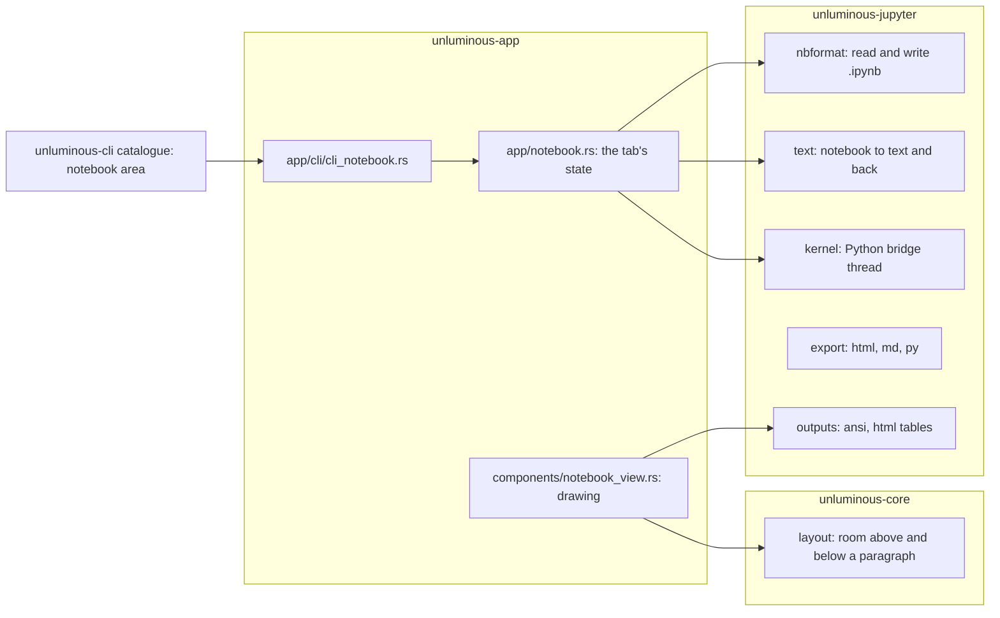

# task-2220: Jupyter notebooks in Unluminous (TDD)

The PRD is `tasks/task-2220-jupyter-notebooks-prd.md`. This document says how it is built.

## 1. The decision everything else follows from: one document per notebook

A notebook tab edits **one `Document`** holding every cell. Each cell starts with a marker line:

```
# %% id=4f2a9c01
import pandas as pd
df = pd.read_csv("x.csv")
# %% [markdown] id=77ab0c12
# Results
The table below ...
# %% id=0be1d2aa
df.describe()
```

Outputs, execution counts and the cell toolbar are **not text**. They are drawn in room the layout
leaves above and below particular lines, which is how IntelliJ builds its own notebook editor: one
editor, with the outputs as block inlays between its lines.

Three other shapes were considered and turned down.

| Shape | Why not |
|---|---|
| One `Document` per cell, each drawn by its own editor | Every editor feature in Unluminous reads `files.active()`, one document per tab. Find, Replace All, undo across a cell operation, `editor text`, rename and the code index would each have to learn about a list of documents, and each would be a new place to get it wrong. |
| Show the `.ipynb` JSON and draw the outputs beside it | Nobody edits a notebook as JSON, and a cell's source is a list of escaped strings in it. |
| A read only rendered view with an editor that opens per cell | That is classic Jupyter's model in the browser. It is not what IntelliJ does, and it loses multi cell selection and search. |

What the single document buys:

- **Every editor command works on a notebook unchanged**: undo and redo (a cell operation is one
  `Command::ReplaceMany`, so it is one undo step), find and replace across cells, multiple carets,
  bracket matching, completion, go to definition across cells (they are one file, which is how
  Jupyter itself treats them), the code index, and every `unluminous-cli editor` command. An agent
  reads a notebook with `editor text` and edits a cell with `editor replace`.
- **Moving between cells is moving the caret.** Up on a cell's first line reaches the cell above
  because that is the line above.
- The markers are what the jupytext "percent" format and VS Code's Python interactive window already
  use, so a notebook's text means something to a reader and an export to `.py` is the text itself.

The cost is two things the editor has to learn, both in `unluminous-core`, and a set of edits a
notebook tab must refuse. §3 and §6.

## 2. Crates and modules



`unluminous-jupyter` is a new crate with no user interface dependency, the rule `unluminous-dap` keeps.
Its only dependency is `serde_json`.

### 2.1 `nbformat`: the file

`parse(&str) -> Result<Notebook, String>` and `serialize(&Notebook) -> String`. The requirement that
decides the design: **a notebook opened and saved with no change is written back byte for byte.**
Jupyter's writer is `json.dumps(sort_keys=True, indent=1, ensure_ascii=False)` with every multi line
string split into a list of lines, and serde_json's default sorted map matches the key order. Each
cell keeps the JSON object it was read from and only the fields that changed are encoded again, so a
notebook written by another tool with its own spacing is also written back as it was, cell by cell.
The indent is read from the file. nbformat 4.0 to 4.5 is read; a cell with no `id` (before 4.5) is
given one in memory and the writer does not add it.

### 2.2 `text`: the notebook as text

`to_text`, `spans` (where each cell's marker and body are, by line and by byte), `merge(text,
previous) -> Notebook` (the cells the text now describes, keeping each cell's outputs, metadata and
execution count by its id), and `repairs(text)` (the edits that give every marker an id and make ids
unique). The id is in the marker so that outputs follow a cell through any edit: a cell cut and pasted
elsewhere, moved by `MoveLines`, or brought back by undo keeps its outputs, because the text says
which cell it is.

`merge` is called on each text revision of a notebook tab. It is linear in the size of the text and a
notebook is small, so it is not cached beyond the revision.

### 2.3 `kernel`: running code

A Jupyter kernel speaks ZeroMQ. Linking a ZeroMQ library is a C dependency the macOS cross build
(`installer/macos/build-on-windows.ps1`, zig) would have to compile for two architectures, and the
machine already has what speaks it: the Python that will run the kernel, with `jupyter_client`, which
`pip install ipykernel` brings with it. So Unluminous runs a small Python script, embedded with
`include_str!`, that starts the kernel through `jupyter_client.KernelManager` and relays: commands
arrive on its standard input as JSON lines and events leave on its standard output as JSON lines.
This is IntelliJ's own choice since 2025.3, which talks to IPyKernel directly instead of starting a
Jupyter server.

`Kernel` is arranged as `unluminous_dap::Client` is: a child process, a reader thread, a channel, and
a waker the window passes in so a message from the kernel paints a frame. No async runtime.

Events are relayed nearly verbatim (`stream`, `display_data`, `update_display_data`,
`execute_result`, `error`, `clear_output`, `status`, `execute_input`, `execute_reply`,
`input_request`, `complete_reply`, `inspect_reply`), each stamped with the id of the request it
answers. `variables` runs one silent expression in a Python kernel and returns name, type, value,
shape and length rows. The bridge exits, shutting the kernel down, when its standard input closes, so
an Unluminous that dies leaves no kernel running.

Finding a Python is `find_pythons(project)`: the project's `.venv`, `venv`, `env`; `VIRTUAL_ENV`;
`CONDA_PREFIX`; `python3` and `python` on `PATH` (not the Windows Store stub); the `py` launcher;
conda's base. Each candidate is asked in one short run whether `ipykernel` and `jupyter_client`
import. A Python without them is still listed, with an offer to install `ipykernel` that runs
`python -m pip install ipykernel` in a terminal tab.

### 2.4 `outputs`: what the drawing needs and a test can check

Pure functions, so the hard part of drawing an output is testable with no window: ANSI escape codes
to coloured runs (tracebacks), an HTML `<table>` to a grid of cells with header rows (every pandas
DataFrame), HTML to plain text, and a choice of which MIME type of a bundle to draw. The order is
Jupyter's own: `text/markdown`, `text/html` (table or text), `image/png`, `image/jpeg`, `image/svg+xml`
(its text alternative inline), `text/latex`, `application/json`, `text/plain`.

### 2.5 `export`

HTML (styled, outputs included, pictures as data URIs), Markdown (outputs as fenced text, pictures
written beside the file), and Python (the percent text, with Markdown cells as comments).

## 3. Two things the layout engine learns

### 3.1 Room above and below a paragraph

`ParagraphStyle` gains `space_above` and `space_below`, in points, defaulting to zero. The first line
of a paragraph is placed `space_above` lower and is that much taller; the last line is `space_below`
taller. `PlacedLine` records both, as `above` and `below`, so everything that draws a line can find
the band the letters are in:

- the caret already uses `baseline - ascent`, and `baseline` is moved down by `above`;
- `selection_rects_in` centres a rectangle on the letters with the line's height, and now uses the
  height **without** the two spaces, so a selection does not paint over an output;
- the current line band in `editor_view` and the line numbers in `gutter` use the same text band.

A notebook tab does not write these into its document's paragraph styles, which would make them part
of the undo history. `refresh_layout` lays a notebook out against a **copy** of the document's
paragraph styles with the notebook's spaces applied, and a counter on the notebook (`bands_revision`,
bumped when an output arrives or changes height, or when a Markdown cell is rendered or opened) is a
third key beside `text_revision` and `fold_revision`. A change of bands lays the document out again
the way a fold does.

Where the room goes:

| Paragraph | Gets |
|---|---|
| A marker line | `space_above` = the gap between cells. Its own letters are drawn transparent and the cell header is drawn over the line: execution count, run button, kind, status, the toolbar. |
| The last body line of a code cell | `space_below` = the height of the cell's outputs, plus the footer with the run's duration. |
| A Markdown cell's marker, when the cell is rendered | `space_below` = the height of the rendered Markdown. |

### 3.2 Hidden paragraphs that are not folds

A rendered Markdown cell's body lines are hidden through the same `hidden` list `refresh_layout`
already hands the layout for folds. They are the notebook's, not the document's `Folds`, so they are
not saved and do not show a fold badge. Clicking the rendered Markdown, pressing Enter on it in
command mode, or the caret arriving in it, opens it for editing; Shift+Enter or Ctrl+Enter renders it
again.

## 4. The notebook tab in the app

`OpenFile` gains `notebook: Option<Box<NotebookTab>>`, the precedent `picture`, `browser` and
`plugin` set. `is_a_document()` stays true: a notebook is text being edited.

```rust
struct NotebookTab {
    model: Notebook,              // as of `merged_at`; outputs live here, by cell id
    merged_at: u64,               // the text revision `model` was merged at
    spans: Vec<CellSpan>,         // where each cell is in the text, same revision
    mode: Mode,                   // Edit, or Command { anchor, head } over cell indices
    runs: HashMap<String, Run>,   // per cell id: Queued, Running { since }, Done { ok, took, at }
    queue: VecDeque<String>,      // cell ids waiting to run, in order
    kernel: KernelSlot,           // NotStarted, Starting(Kernel), Ready(Kernel), Failed(reason, missing)
    python: Option<Python>,       // chosen interpreter; remembered in the project's state
    kernel_name: Option<String>,  // chosen kernelspec; written to the notebook's metadata
    rendered: HashSet<String>,    // Markdown cells shown rendered
    collapsed: HashSet<String>,   // cells whose source is collapsed; outputs likewise
    drawn: HashMap<String, DrawnCell>, // laid out outputs and rendered Markdown, keyed on width and revision
    bands_revision: u64,
    variables: Vec<Variable>, variables_showing: bool,
    pending_input: Option<(String, String, bool)>, // the cell, the prompt, a password
    deleted: Vec<Cell>,           // for Z, undo cell deletion, beside Ctrl+Z
}
```

`app/notebook.rs` holds this and the operations on it, all of which go through the document:
inserting a cell is a `ReplaceMany` adding marker and body; deleting, moving, merging, splitting and
changing kind are the same. Every operation is a method on `UnluminousApp` used by the menu action, the
key, the button and the command line alike, which is the repository's rule.

### 4.1 Opening and saving

- `services::file_kind` names `.ipynb` a notebook. Opening reads the JSON, builds the text with
  `to_text`, and opens a document holding it. A file that is not a notebook Unluminous can read opens as
  plain text with a status message saying why, so nothing is lost.
- `Save` on a notebook tab merges and serializes, writes through a new `Document::save_bytes_as`
  (the temporary and rename `save_as` already does) and marks the document saved.
- An output arriving marks the document modified through `Document::mark_changed_outside_the_text`,
  the step `set_line_ending` already takes, so the tab shows the dot and closing asks about it.
- An outside change reloads the tab the way every tab reloads, and keeps outputs by id.

### 4.2 Running

`Run` puts cell ids on the queue. When the kernel is not busy with one of ours, the next id is taken,
its source is read from the text as it is now, and `kernel.execute` is called. Running one at a time
on our side, rather than sending everything to the kernel, is what makes "queued" true on the screen
and what lets a failure stop the rest: after an `error` the queue is emptied, which is what Jupyter's
Run All does. Interrupt empties the queue too.

Events update the cell by request id: `execute_input` sets the count, `stream` appends to the last
output of the same stream or adds one, `display_data` adds one (remembering `display_id`),
`update_display_data` replaces every output with that id in every cell, `clear_output(wait)` clears
now or on the next output. Consecutive `\r` progress lines in a stream are collapsed as a terminal
would.

The kernel starts on the first run. Before it, the toolbar names the Python and kernelspec it will use.

### 4.3 Drawing

`components/notebook_view.rs` draws, in the editing area of a notebook tab:

1. A toolbar across the top: Run All, Run Cell, Interrupt, Restart, Restart and Run All, Clear All
   Outputs, Add Cell, the cell type selector, the kernel selector (Python and kernelspec), the kernel's
   state, and Variables.
2. The document, through the ordinary `show_editor`, laid out with the notebook's spaces. Before the
   text is painted the notebook paints each visible cell's frame and background; after it, each
   cell's header over its marker line, its outputs in the room under its last line, the rendered
   Markdown, and the add buttons between cells on hover.
3. Optionally the variables panel down the right, dragged by its edge through `components::splitter`.

The gutter shows line numbers counted within each cell, nothing beside a marker, and the run button
and `[n]` beside the cell's header.

### 4.4 Keys

A notebook tab reads the keyboard before the editor does.

| Mode | Key | Does |
|---|---|---|
| both | Ctrl+Enter | run the cell (render a Markdown cell) |
| both | Shift+Enter | run and select the cell below, adding one after the last |
| both | Alt+Enter | run and insert a cell below |
| both | Ctrl+Alt+Shift+Enter | run all |
| edit | Escape | command mode, this cell selected |
| edit | Alt+Shift+A, Alt+Shift+B | add a code cell above, below |
| edit | Ctrl+Shift+Minus | split the cell at the caret |
| edit | Backspace at a cell's first character, Delete at its last | nothing, so a key can never join a cell to a marker |
| command | Enter | edit mode, caret in the cell |
| command | Up, Down, K, J | select the cell above or below; Shift extends |
| command | Ctrl+Home, Ctrl+End | the first or last cell |
| command | A, B | add a code cell above, below |
| command | M, Y, R | make the cell Markdown, code, raw |
| command | C, X, V, Shift+V | copy, cut, paste below, paste above |
| command | D D, Delete | delete; Z brings the last deleted cell back |
| command | Shift+M | merge the selected cells, or with the cell below |
| command | Ctrl+Shift+Up, Ctrl+Shift+Down | move the selected cells |
| command | O | collapse or expand the cell's output |
| command | L | line numbers in cells on or off |
| command | I I, 0 0 | interrupt, restart |
| command | Ctrl+/ | comment out the selected cells |
| command | Ctrl+Alt+Up, Ctrl+Alt+Down | the previous or next Markdown section |

In command mode the editor does not take typing, so a letter is a command and never lands in a cell.
Edits that would put text before the first marker or remove a marker by accident are applied, then
`repairs` makes the text whole in the same frame, so a person pasting half a cell gets a cell.

### 4.5 Menus

A `Notebook` menu, shown only while a notebook tab is showing (`A control is absent when it cannot
apply`). Every entry is an `Action`, so `unluminous-cli action list` offers it with nothing added.
`File -> New Jupyter Notebook` is always there. The explorer's menu on a `.py` file offers `Convert to
Jupyter Notebook`, and on an `.ipynb` file `Convert to Python File`.

### 4.6 Variables, outline, completion

- Variables: after each run that changed something, `kernel.variables()`. The panel sorts by name or
  type, with DataFrames first as IntelliJ does.
- Outline: `Navigate -> Notebook Outline` opens a list of the Markdown headings and the cells, filtered
  as it is typed, the way `Go to File` works.
- Completion: Ctrl+Space in a code cell asks the kernel as well as the editor's own sources, and the
  kernel's answers are added to the same list.

### 4.7 Debugging a cell

ipykernel has a debugger that speaks the Debug Adapter Protocol inside Jupyter messages:
`debug_request` on the control channel, `debug_reply` and `debug_event` on iopub. Unluminous already
has a DAP client (`unluminous-dap`) and a debugger tile. The bridge relays the three, and
`unluminous-dap` gains a transport over the kernel rather than over a pipe. `Debug Cell` asks the kernel
for the file name it will run the cell under (`dumpCell`), sets the cell's breakpoints against that
file, and runs the cell. The window maps that file back to the cell's lines, so the execution point and
the breakpoints are drawn in the notebook's own text.

## 5. The command line

A `notebook` area in `unluminous-cli/src/catalogue.rs`, an arm in `app/cli.rs`, and the handler in
`app/cli/cli_notebook.rs`. Every command acts on the notebook tab that is showing, or the one named by
`--path`. Cells are named by index (from 1, as Jupyter shows them) or by `--id`. The table is in the
PRD. `notebook run --wait` waits for the run to finish and answers with the outputs, so an agent does
not have to poll; the wait has a `--timeout` like `debug`'s.

`unluminous-cli/docs/commands.md` has a section for every command, which `documentation.rs` checks.

## 6. Tests

| Layer | What |
|---|---|
| `unluminous-jupyter` unit | nbformat round trip byte for byte against notebooks the real `nbformat` wrote; text round trip and merge keeping outputs by id; repairs; ANSI and HTML table parsing; export. |
| `unluminous-jupyter` integration | A real kernel through the venv named by `UNLUMINOUS_TEST_PYTHON` (the first Python with ipykernel otherwise; the test says so and passes when there is none): run, every output type, input, interrupt, restart, completion, variables, no process left behind. |
| `unluminous-core` | A paragraph with room above and below: where the caret, the selection and the next line go. |
| `unluminous-app` unit | Cell operations as document edits and their undo; the key table in both modes; queueing and stopping on an error with a scripted kernel. |
| Window tests | A notebook drawn with outputs of each kind (a scripted kernel, so the picture is the same every run), command mode, a rendered Markdown cell. |
| Command line | `notebook status`, `run --wait`, `cell`, `add`, `delete`, `export` against a real window. |

## 7. Order of work

1. `unluminous-jupyter`: nbformat, text, kernel (done first and in parallel, they have no dependency).
2. `unluminous-core` layout spaces.
3. The tab: open, show, save, the bands, the header and outputs.
4. Running and the kernel toolbar.
5. Command mode, keys, cell operations, menus.
6. Variables, outline, completion, export, conversion.
7. The command line and its documentation.
8. Debugging a cell.
9. Window tests, install, a real window driven through the command line, release.
