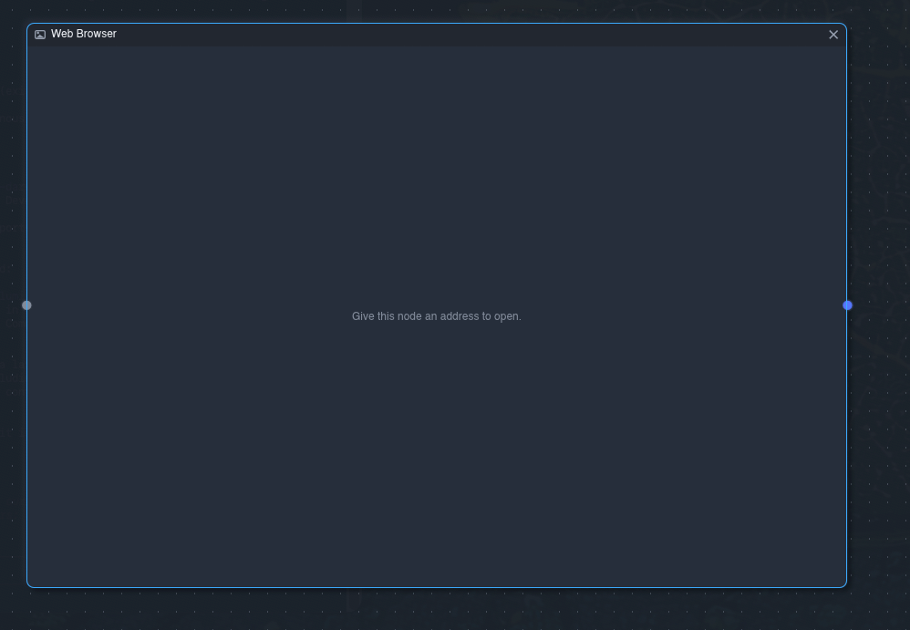
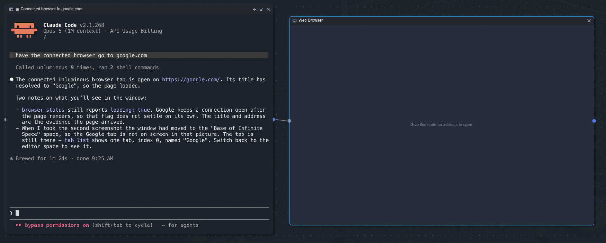
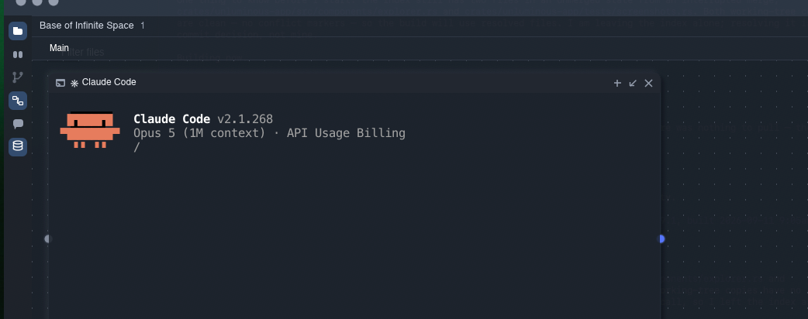

Create a technical design document for these, then fully implement. 
Once done, have Codex Sol review, and address any issues it brings up. then commit and push.

# Base of Infinite Space
## Web Browser
I need a url address bar and back/forward and reload buttons at the top.

When I connect a terminal then launch claude, and then ask it to go to a url, it doesn't seem to know that a web node is connected to it.

We need a good architecture for how this tool calling should be wired up, so claude understands the context its operating in as a node.
## Folder View
I can't scroll the node.
I need to be able to click the top bar and see an option to pick the source/base folder, so i can have multiple nodes with different root folders.
If I double click a file, it should open a file view node and connect it, if one isn't already open, or open a new tab in the connected file view node.
Folder view node is going over the top of the left bar with icons, but terminal node isn't.  all should be behind the left bar and not cover it.

## File View Node
This should be just like our editing area, where I can see and edit files in mutliple tabs, have line breaks, expand code, etc.
I think we already have this, but it's just not showing in the add node modal?

## Zoom 
If I CMD/CTRL mouse wheel while hovering over a node, that node should zoom in/out, rather than the entire canvas.
The icons for zoom in/out at the top right are not good. should be classic - + buttons with cirlces around them.

# Editing Area
The panels for database explorer, agent tasks, and agent chat, don't show when editing area is toggled off.
We need each toggle to be independent so I can view any arrangement I want.

# Agent Chat
I get `illiad` reads its key from $ANTHROPIC_API_KEY and this window has no such variable.

